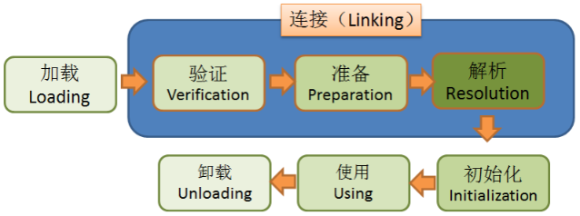

jps  查看java进程ID

jconsole

arthas 

jstack


# klass模型

oop-klass模型---java对象在jvm层面的具体映射，它叫做oop-klass模型。

下面是klass层级部分----java中的类与jvm中的映射klass

2020-08-02 42:00

Java的每个类，在JVM中，都有一个对应的Klass类实例与之对应，存储类的元信息如：常量池、属性信息、方法信息……


如图可知：从继承关系上也能看出来，类的元信息是存储在原空间的


## InstanceKlass

普通的Java类（非数组）在JVM中对应的是instanceKlass类的实例--存储了普通类的元信息

**存储在方法区**

例：堆区引用方法区：对象的 内存结构中有个 klass pointer会一直指向方法区的类的元信息地址

`openjdk8\openjdk\hotspot\src\share\vm\oops\instanceKlass.hpp`

### InstanceMirrorKlass

用于表示java.lang.Class，Java代码中获取到的**Class对象**，实际上就是这个C++类的实例，**存储在堆区**，学名镜像类


### InstanceRefKlass

用于表示java/lang/ref/Reference类的子类  **表示引用**-在垃圾回收的时候有特殊处理

### InstanceClassLoaderKlass

用于遍历某个加载器加载的类

## ArrayKlass

Java中的数组不是静态数据类型，是动态数据类型，即是运行期生成的，Java**数组的元信息**用ArrayKlass的子类来表示

静态数据类型：是jvm内置的，八大数据类型：byte、 short、 int、 long、 char、 float 、double 、boolean

动态数据类型（引用数据类型）：是jvm运行时动态生成的

证明数组是动态数据类型：通过编译后的内容可以看出

​			基础类型的数组编译后是           newarray int     

​						创建一个指定原始类型（如int, float, char…）的数组，并将其引用值压入栈顶

​						这里是在运行的时候会解析字节码创建数据类型   TypeArrayKlass

​			引用类型 的数组编译后是          anewarray #5 [Class bat.ke.qq.com.bean.Simple]       

​						创建一个引用型（如类，接口，数组）的数组，并将其引用值压入栈顶 

​						这里是在运行的时候会解析字节码创建数据类型   ObjArrayKlass

证明数据存储的结构

### TypeArrayKlass

用于表示**基本类型的数组**

### ObjArrayKlass

用于表示**引用类型的数组**


# 类的加载过程

类的生命周期是由7个阶段组成，但是类的加载说的是前5个阶段



## 第一步加载

通过类的全限定名获取存储该类的class文件（class文件在**硬盘**上，没有指明必须从哪获取，类的加载器来指定）

解析成运行时数据（加载到**内存**中），即**instanceKlass实例（类的元信息）**，存放在**方法区**（方法区在堆上-也叫非堆）

在**堆区生成该类的Class对象**，即**instanceMirrorKlass实例（类的class信息）**


### 何时加载-主动使用时-懒加载

1、new、getstatic、putstatic、invokestatic

2、反射

3、初始化一个类的子类会去加载其父类

4、启动类（main函数所在类）

5、当使用jdk1.7动态语言支持时，如果一个java.lang.invoke.MethodHandle实例最后的解析结果REF_getstatic,REF_putstatic,REF_invokeStatic的方法句柄，并且这个方法句柄所对应的类没有进行初始化，则需要先出触发其初始化


### 从哪里加载

因为没有指明必须从哪获取class文件，脑洞大开的工程师们开发了这些

1、从压缩包中读取，如jar、war

2、从网络中获取，如Web Applet

3、动态生成，如动态代理、CGLIB

4、由其他文件生成，如JSP

5、从数据库读取

6、从加密文件中读取


## 第二步验证

1、文件格式验证

2、元数据验证

3、字节码验证

4、符号引用验证

看 《深入理解Java虚拟机》周志明


## 第三步准备

为静态变量分配内存， 赋初值

实例变量是在创建对象的时候完成的赋值，没有 赋初值一说

如果被final修饰，在编译的时候会给属性添加ConstantValue属性，准备阶段直接完成赋值，即没有赋初值这一步


## 第四步解析

将常量池中的符号引用转为直接引用

解析后的信息存储在ConstantPoolCache类实例中

1、类或接口的解析

2、字段解析

3、方法解析

4、接口方法解析


何时解析

思路：

1、加载阶段解析常量池时

2、用的时候


openjdk是第二种思路，在执行特定的字节码指令之前进行解析：

anewarray、checkcast、getfield、getstatic、instanceof、invokedynamic、invokeinterface、invokespecial、invokestatic、invokevirtual、ldc、ldc_w、ldc2_w、multianewarray、new、putfield


## 第五步初始化

执行静态代码块，完成静态变量的赋值

静态字段、静态代码段，字节码层面会生成clinit方法

方法中语句的先后顺序与代码的编写顺序相关


## static

静态字段如何存储

instanceKlass

instanceMirrorKlass

静态变量str的值存放在StringTable中，镜像类中存放的是字符串的指针


# 工具HSDB

source Insight 开发编译C/C++程序

windows下怎么使用

HSDB（Hotspot Debugger），JDK自带的工具，用于查看JVM运行时的状态。

## 1、启动HSDB

HSDB位于\jdk1.8.0_212\lib里面，接下来启动HSDB：java -cp  .\sa-jdi.jar sun.jvm.hotspot.HSDB

D:\Program Files\Java\jdk1.8.0_121\lib>java -cp  .\sa-jdi.jar sun.jvm.hotspot.HSDB

## 2、查看jvm进程  jps 

jps -l


## 3、在HSDB界面打开


输入进程ID  出现


## 4、classinfo查询


## 5、inspector


复制之前的Simple类的地址


## 6、每次结束都要Detach


三层类加载器及其父子关系

BootstrapClassLoader

ExtClassLoader

AppClassLoader

父子关系链


详解启动类加载器

没有实体，只是那一段逻辑叫做启动类加载器

什么是双亲委派

打破双亲委派

SPI

为什么SPI打破了双亲委派？

==双亲委派也是java程序控制的，打破双亲委派也是换了一种实现逻辑==

SPI在数据库驱动中有应用

在JDBC4.0之后支持SPI方式加载java.sql.Driver的实现类。SPI实现方式为，通过ServiceLoader.load(Driver.class)方法，去各自实现Driver接口的lib的META-INF/services/java.sql.Driver文件里找到实现类的名字，通过Thread.currentThread().getContextClassLoader()类加载器加载实现类并返回实例。

# 驱动加载的过程大致如上，那么是在什么地方打破了双亲委派模型呢？

先看下如果不用Thread.currentThread().getContextClassLoader()加载器加载，整个流程会怎么样。

1. 从META-INF/services/java.sql.Driver文件得到实现类名字DriverA
2. Class.forName("xx.xx.DriverA")来加载实现类
3. Class.forName()方法默认使用当前类的ClassLoader，JDBC是在DriverManager类里调用Driver的，当前类也就是DriverManager，它的加载器是BootstrapClassLoader。
4. 用BootstrapClassLoader去加载非rt.jar包里的类xx.xx.DriverA，就会找不到
5. 要加载xx.xx.DriverA需要用到AppClassLoader或其他自定义ClassLoader
6. 最终矛盾出现在，要在BootstrapClassLoader加载的类里，调用AppClassLoader去加载实现类

#### 这样就出现了一个问题：如何在父加载器加载的类中，去调用子加载器去加载类？

1. jdk提供了两种方式，Thread.currentThread().getContextClassLoader()和ClassLoader.getSystemClassLoader()一般都指向AppClassLoader，他们能加载classpath中的类
2. SPI则用Thread.currentThread().getContextClassLoader()来加载实现类，实现在核心包里的基础类调用用户代码

[SPI底层原理](https://zhuanlan.zhihu.com/p/257122662)

自定义类加载器

jvm中的沙箱安全机制


# 字节码

查看字节码结构 jclasslib   [IDEA安装插件](https://blog.csdn.net/xiaodujava/article/details/89413460)

在classpath目录下 ： javap -verbose 全限定类名

learn-ioc\out\production\classes>javap -verbose bat.ke.qq.com.bean.Simple

## [字节码表](https://blog.csdn.net/qq_28827039/article/details/81127273)

## 字节码文件组成

### u4 magic  魔数

 用来判断是否是一个合格的class文件   CA FE BA BE

### u2 minor version 次版本

### u2 major version 主版本  

00 34  jdk 1.8


### u2 constant pool count 常量池大小

​    实际的常量池大小是 =  class文件计算出来的大小 - 1  

### ！ constant pool 常量池

  **常量池下标从1开始，没有0 所以  实际大小减一了**

为什么要有符号引用转直接引用？  

因为字节码不知道真实的内容，先使用的 是符号引用

```
  间接引用
  class中的常量池 静态的      
  运行时常量池（HSDB） 动态的
  字符串常量池 StringTable
```


解析常量池

```java
public class Simple {

   static int a = 10;

   public static void main(String[] args) {

   }
}
```


```
第一个元素
  tag：0a  method
  class_index: 00 04    4  只能放符号引用
  name_and_type: 00 15  21

  method的信息在常量池中是如何存储的

第二个元素：
  tag：09  field
  class_index: 00 03    3  这里表示用的就是第三个元素
  name_and_type: 00 16  22

第三个元素
  tag：07  class  是个类
  name_index：00 17   全限定类名  也是符号引用，不知道这个名的真实地址
  
  第5个
  tag：01
  length：00 01
  bytes：61  97 a
```

### u2 access flags 类的访问控制权限


如 ： 00 21  表示的是  ACC_SUPER 和 ACC_PUBLIC


