# 一、Mybatis核心流程与源码分析


## 传统的JDBC


### jdbc操作数据库的步骤

#### ①jar 包的引入

```xml
<dependency>
    <groupId>mysql</groupId>
    <artifactId>mysql-connector-java</artifactId>
    <version>5.1.18</version>
    <scope>test</scope>
</dependency>
```

#### ②加载JDBC驱动程序 

​	Class.forName(driver);

#### ③建立连接（Connection）

​	(Connection) DriverManager.getConnection(url,username, password);

#### ④创建执行SQL语句的（Statement）

​	pstmt.executeUpdate();

#### ⑤处理执行结果（ResultSet）

#### ⑥释放资源

```java
public class Jdbc01 {

  public static void main(String[] args) {

    insert("Monkey",18);
  }

  static void insert(String name,int age)
  {
    String sql="insert into user(username,age) value(?,?)";
    Connection conn= DbUtil.open();//获取连接
    try {
      //预处理SQL
      PreparedStatement pstmt=(PreparedStatement) conn.prepareStatement(sql);
      pstmt.setString(1,name);
      pstmt.setInt(2,age);
      //执行SQL
      pstmt.executeUpdate();
    } catch (SQLException e) {
      e.printStackTrace();
    }
    finally {
      //关闭连接
      DbUtil.close(conn);
    }
  }
}

public class DbUtil {
    /*
     * 打开数据库
     */
    private static String driver;//连接数据库的驱动
    private static String url;
    private static String username;
    private static String password;

    static {
      driver="com.mysql.jdbc.Driver";//需要的数据库驱动
      url="jdbc:mysql://localhost:3306/mybatis";//数据库名路径
      username="root";
      password="123456";
    }
    public static Connection open()
    {
      try {
        Class.forName(driver);
        return (Connection) DriverManager.getConnection(url,username, password);
      } catch (Exception e) {
        System.out.println("数据库连接失败！");
        e.printStackTrace();
      }//加载驱动
      return null;
    }
    /*
     * 关闭数据库
     */
    public static void close(Connection conn)
    {
      if(conn!=null)
      {
        try {
          conn.close();
        } catch (SQLException e) {
          e.printStackTrace();
        }
      }
    }
  }
```


### 弊端

#### 1、消耗资源

jdbc底层没有用**连接池**、操作数据库需要频繁的创建和关联链接。消耗很大的**资源**

#### 2、侵入性

写原生的jdbc代码在java中，一旦我们要修改sql的话，java需要整体编译，不利于系统维护

#### 3、扩展性差

使用PreparedStatement预编译的话对变量进行设置123数字，这样的序号不利于维护

#### 4、存在硬编码

返回result结果集也需要硬编码。


## 引入ORM框架Mybatis

[官网](https://mybatis.org/mybatis-3/zh/getting-started.html)

MyBatis 是一款优秀的持久层框架，它支持自定义 SQL、存储过程以及高级映射。MyBatis 免除了几乎所有的 JDBC 代码以及设置参数和获取结果集的工作。MyBatis 可以通过简单的 XML 或注解来配置和映射原始类型、接口和 Java POJO（Plain Old Java Objects，普通老式 Java 对象）为数据库中的记录。


### mybatis做了什么？

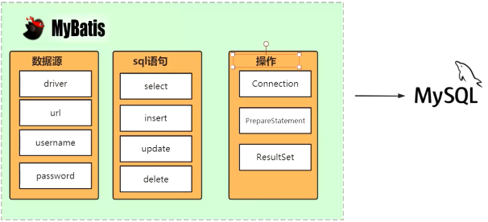

mybatis要整合jdbc需要拥有数据源、SQL语句、操作

宏观上来说：就是替换jdbc来连接数据库的，并操作数据的，将内存的数据写入到磁盘中

微观上来说：mybatis底层怎么封装jdbc的？

​         获取连接、执行SQL、处理结果集


从源码的分析来看    ORM框架的核心：解决java中的对象和数据库中的字段的映射关系

### 源码分析

两种编程风格XML&Annotation

*预习资料里有源码的下载和编译过程 【视频-源码三期-Mybatis源码分析（1）-29:55】*

[源码](https://github.com/jianglil/mybatis3.5.4.git)

#### xml

mybatis-config.xml

BlogMapper.xml

```xml
<?xml version="1.0" encoding="UTF-8" ?>

<!DOCTYPE mapper
  PUBLIC "-//mybatis.org//DTD Mapper 3.0//EN"
  "http://mybatis.org/dtd/mybatis-3-mapper.dtd">
<mapper namespace="org.mybatis.example.BlogMapper">
    
  <select  id="selectBlog"   resultType="org.apache.ibatis.demo.pojo.Blog">
  	select * from Blog where id = ${id}
  </select>
    
  <insert id="insertBlog" parameterType="org.apache.ibatis.demo.pojo.Blog">
  	insert into Blog (id,username,context)
      	values (#{id}, #{username}, #{context})
  </insert>

</mapper>
```


```java
public static void main(String[] args) throws IOException {
    String resource = "mybatis-config.xml";//全局配置
    InputStream inputStream = Resources.getResourceAsStream(resource);
    SqlSessionFactory sqlSessionFactory = new 		
        SqlSessionFactoryBuilder().build(inputStream);
    SqlSession session = sqlSessionFactory.openSession();
    Blog blog = session.selectOne("org.mybatis.example.BlogMapper.selectBlog", 101);
    log.info("blog:{}",blog);

}
```

##### 怎么获取数据源？

加载资源（xml可以），读取配置文件中的连接信息。通过反射创建DataSource对象

```xml
一、mybatis是如何获取数据库源的
org.apache.ibatis.session.SqlSessionFactoryBuilder.build(java.io.InputStream)
》org.apache.ibatis.builder.xml.XMLConfigBuilder.parse
   》org.apache.ibatis.builder.xml.XMLConfigBuilder.parseConfiguration 
    》org.apache.ibatis.builder.xml.XMLConfigBuilder.environmentsElement
      》org.apache.ibatis.builder.xml.XMLConfigBuilder.dataSourceElement
       》org.apache.ibatis.session.Configuration.setEnvironment#######
```

###### 详细和关键流程

org.apache.ibatis.builder.xml.XMLConfigBuilder.parseConfiguration  这里解析mybatis-config.xml

```java
private void parseConfiguration(XNode root) {
  try {
    //issue #117 read properties first
    propertiesElement(root.evalNode("properties"));
    Properties settings = settingsAsProperties(root.evalNode("settings"));
    loadCustomVfs(settings);
    loadCustomLogImpl(settings);
    typeAliasesElement(root.evalNode("typeAliases"));
    pluginElement(root.evalNode("plugins"));
    objectFactoryElement(root.evalNode("objectFactory"));
    objectWrapperFactoryElement(root.evalNode("objectWrapperFactory"));
    reflectorFactoryElement(root.evalNode("reflectorFactory"));
    settingsElement(settings);
    // read it after objectFactory and objectWrapperFactory issue #631
    environmentsElement(root.evalNode("environments"));
    databaseIdProviderElement(root.evalNode("databaseIdProvider"));
    typeHandlerElement(root.evalNode("typeHandlers"));
    mapperElement(root.evalNode("mappers"));
  } catch (Exception e) {
    throw new BuilderException("Error parsing SQL Mapper Configuration. Cause: " + e, e);
  }
}
```

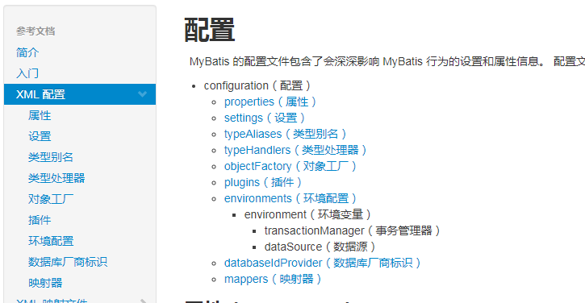


循环获取配置的数据源，反射获取对象

```java
private void environmentsElement(XNode context) throws Exception {
  if (context != null) {
    if (environment == null) {
      environment = context.getStringAttribute("default");
    }
    for (XNode child : context.getChildren()) {
      String id = child.getStringAttribute("id");
      if (isSpecifiedEnvironment(id)) {
        TransactionFactory txFactory = 
            transactionManagerElement(child.evalNode("transactionManager"));
        //反射创建DataSource对象
        DataSourceFactory dsFactory = dataSourceElement(child.evalNode("dataSource"));
        DataSource dataSource = dsFactory.getDataSource();
        Environment.Builder environmentBuilder = new Environment.Builder(id)
            .transactionFactory(txFactory)
            .dataSource(dataSource);
          //创建的DataSource放入容器 configuration
        configuration.setEnvironment(environmentBuilder.build());
      }
    }
  }
}
```

```java
private DataSourceFactory dataSourceElement(XNode context) throws Exception {
  if (context != null) {
    String type = context.getStringAttribute("type");
    Properties props = context.getChildrenAsProperties();
      //这里通过工厂反射获取
    DataSourceFactory factory = (DataSourceFactory) 
        resolveClass(type).getDeclaredConstructor().newInstance();
    factory.setProperties(props);
    return factory;
  }
  throw new BuilderException("Environment declaration requires a DataSourceFactory.");
}
```

DataSourceFactory 其中一个实现类

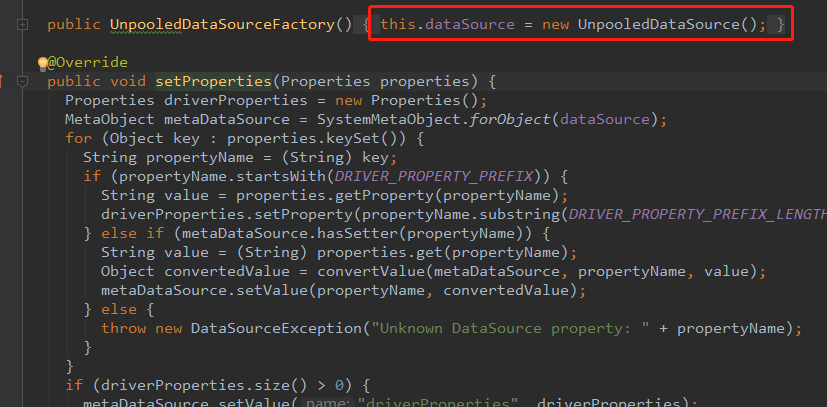


##### 怎么获取SQL语句？

同样是加载资源，读取SQL语句

```
二、mybatis是如何获取SQL语句

org.apache.ibatis.session.SqlSessionFactoryBuilder.build(java.io.InputStream)
》org.apache.ibatis.builder.xml.XMLConfigBuilder.parse
   》org.apache.ibatis.builder.xml.XMLConfigBuilder.parseConfiguration
     》org.apache.ibatis.builder.xml.XMLConfigBuilder.mapperElement
       》org.apache.ibatis.builder.xml.XMLMapperBuilder.configurationElement
         》org.apache.ibatis.builder.xml.XMLStatementBuilder.parseStatementNode
           >org.apache.ibatis.session.Configuration.addMappedStatement######
```

###### 详细和关键流程

加载mappers的三种方式   注意注解和xml的区别

org.apache.ibatis.builder.xml.XMLConfigBuilder.mapperElement

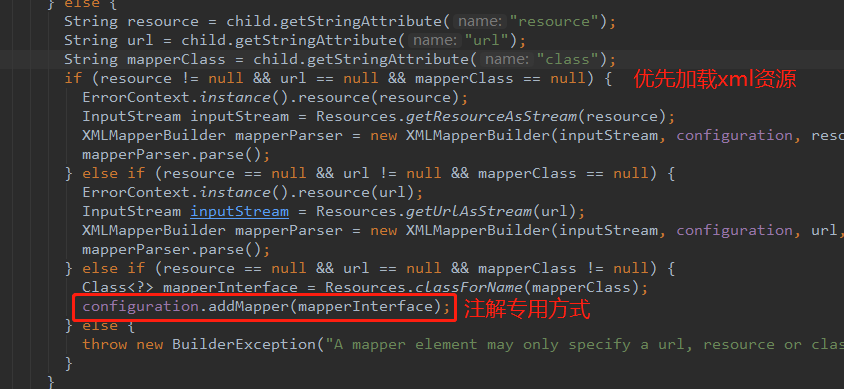

mybatis-config.xml

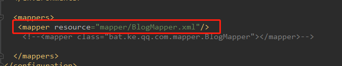

加载了mapper资源后，解析   org.apache.ibatis.builder.xml.XMLMapperBuilder#parse

然后进入      org.apache.ibatis.builder.xml.XMLMapperBuilder#configurationElement   解析SQL

```java
private void configurationElement(XNode context) {
  try {
    String namespace = context.getStringAttribute("namespace");
    if (namespace == null || namespace.equals("")) {
      throw new BuilderException("Mapper's namespace cannot be empty");
    }
    builderAssistant.setCurrentNamespace(namespace);
    cacheRefElement(context.evalNode("cache-ref"));
    cacheElement(context.evalNode("cache"));
    parameterMapElement(context.evalNodes("/mapper/parameterMap"));
    resultMapElements(context.evalNodes("/mapper/resultMap"));
    sqlElement(context.evalNodes("/mapper/sql"));
      //这里开始解析SQL
    buildStatementFromContext(context.evalNodes("select|insert|update|delete"));
  } catch (Exception e) {
    throw new BuilderException("Error parsing Mapper XML. The XML location is '" + resource + "'. Cause: " + e, e);
  }
}
```

SqlSessionFactory sqlSessionFactory = new   SqlSessionFactoryBuilder().build(inputStream);

前面两步是在sessionFactory的构建过程中完成的，接下来是在创建session中

SqlSession session = sqlSessionFactory.openSession();

##### 怎么操作数据库？

```
三、mybatis是如何操作的

org.apache.ibatis.session.defaults.DefaultSqlSessionFactory#openSession()
org.apache.ibatis.session.Configuration#newExecutor(t)  SimpleExecutor
org.apache.ibatis.session.defaults.DefaultSqlSession#selectOne(o)
org.apache.ibatis.session.defaults.DefaultSqlSession#selectList(o)
org.apache.ibatis.executor.CachingExecutor#query(ms,o,r,r)
org.apache.ibatis.executor.CachingExecutor#query(m,o,r,r,c,b)
org.apache.ibatis.executor.BaseExecutor#queryFromDatabase(m,o,r,r,c,b)
org.apache.ibatis.executor.SimpleExecutor#doQuery(m,o,r,r,b)
org.apache.ibatis.executor.statement.PreparedStatementHandler.query(s,r)
org.apache.ibatis.executor.resultset.DefaultResultSetHandler.handleResultSets(s,r)
```

###### 详细和关键流程

org.apache.ibatis.session.defaults.DefaultSqlSessionFactory#openSessionFromDataSource

```java
private SqlSession openSessionFromDataSource(ExecutorType execType, TransactionIsolationLevel level, boolean autoCommit) {
  Transaction tx = null;
  try {
    final Environment environment = configuration.getEnvironment();
    final TransactionFactory transactionFactory = getTransactionFactoryFromEnvironment(environment);
    tx = transactionFactory.newTransaction(environment.getDataSource(), level, autoCommit);
    //这里创建了执行器，内部有plugin的扩展点
    final Executor executor = configuration.newExecutor(tx, execType);
    return new DefaultSqlSession(configuration, executor, autoCommit);
  } catch (Exception e) {
    closeTransaction(tx); // may have fetched a connection so lets call close()
    throw ExceptionFactory.wrapException("Error opening session.  Cause: " + e, e);
  } finally {
    ErrorContext.instance().reset();
  }
}
```


```java
@Override
public <E> List<E> selectList(String statement, Object parameter, RowBounds rowBounds) {
  try {
    MappedStatement ms = configuration.getMappedStatement(statement);
      //通过执行器执行语句
    return executor.query(ms, wrapCollection(parameter), rowBounds, Executor.NO_RESULT_HANDLER);
  } catch (Exception e) {
    throw ExceptionFactory.wrapException("Error querying database.  Cause: " + e, e);
  } finally {
    ErrorContext.instance().reset();
  }
}
```

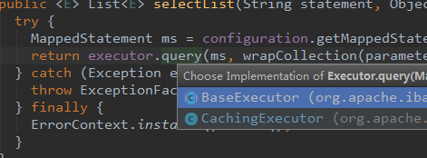

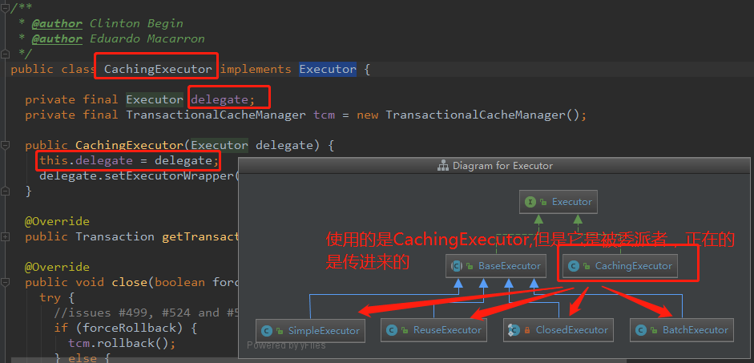

进入到执行器的内部

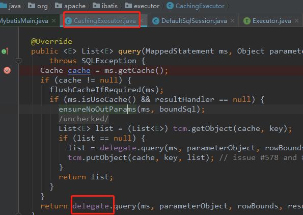

真正的执行器

org.apache.ibatis.executor.BaseExecutor#query

```java
@SuppressWarnings("unchecked")
@Override
public <E> List<E> query(MappedStatement ms, Object parameter, RowBounds rowBounds, ResultHandler resultHandler, CacheKey key, BoundSql boundSql) throws SQLException {
  ErrorContext.instance().resource(ms.getResource()).activity("executing a query").object(ms.getId());
  if (closed) {
    throw new ExecutorException("Executor was closed.");
  }
  if (queryStack == 0 && ms.isFlushCacheRequired()) {
    clearLocalCache();
  }
  List<E> list;
  try {
    queryStack++;
    list = resultHandler == null ? (List<E>) localCache.getObject(key) : null;
      //首先从缓存中获取，若获取到了就直接取 缓存中的结果集返回，否则进入核心
    if (list != null) {
      handleLocallyCachedOutputParameters(ms, key, parameter, boundSql);
    } else {
        //进入核心查询方法
      list = queryFromDatabase(ms, parameter, rowBounds, resultHandler, key, boundSql);
    }
  } finally {
    queryStack--;
  }
  if (queryStack == 0) {
    for (DeferredLoad deferredLoad : deferredLoads) {
      deferredLoad.load();
    }
    // issue #601
    deferredLoads.clear();
    if (configuration.getLocalCacheScope() == LocalCacheScope.STATEMENT) {
      // issue #482
      clearLocalCache();
    }
  }
  return list;
}
```

org.apache.ibatis.executor.BaseExecutor#queryFromDatabase

```java
private <E> List<E> queryFromDatabase(MappedStatement ms, Object parameter, RowBounds rowBounds, ResultHandler resultHandler, CacheKey key, BoundSql boundSql) throws SQLException {
  List<E> list;
  localCache.putObject(key, EXECUTION_PLACEHOLDER);
  try {
    //进入子类执行SQL方法
    //BatchExecutor
    //ReuseExecutor
    //SimpleExecutor
    list = doQuery(ms, parameter, rowBounds, resultHandler, boundSql);
  } finally {
    localCache.removeObject(key);
  }
  //放缓存
  localCache.putObject(key, list);
  if (ms.getStatementType() == StatementType.CALLABLE) {
    localOutputParameterCache.putObject(key, parameter);
  }
  return list;
}
```

org.apache.ibatis.executor.SimpleExecutor#doQuery

然后进入真正的执行和处理结果的handler：org.apache.ibatis.executor.statement.StatementHandler#query

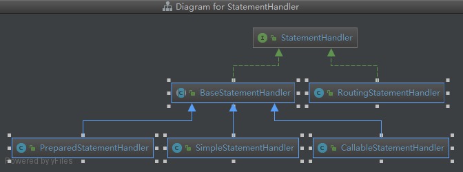

通过对应的子类进行处理org.apache.ibatis.executor.statement.SimpleStatementHandler#query

这里的步骤就是原生态的jdbc，只是对jdbc进行了封装

```java
@Override
public <E> List<E> query(Statement statement, ResultHandler resultHandler) throws SQLException {
    //获取完整的SQL
  String sql = boundSql.getSql();
    //通过预处理器执行
  statement.execute(sql);
    //处理结果集
  return resultSetHandler.handleResultSets(statement);
}
```


#### annotation

```xml
<mappers>
 <!--<mapper resource="mapper/BlogMapper.xml"/>-->
  <mapper class="bat.ke.qq.com.mapper.BlogMapper"></mapper>

</mappers>
```

```java
public interface BlogMapper {

  @Select("SELECT * FROM blog WHERE id = #{id}")
  Blog selectBlog(int id);

}
```

```java
/***
 * 注解
 * @param args
 * @throws IOException
 */
public static void main(String[] args) throws IOException {
  String resource = "mybatis-config.xml";//全局配置
  InputStream inputStream = Resources.getResourceAsStream(resource);
  SqlSessionFactory sqlSessionFactory = new 
      SqlSessionFactoryBuilder().build(inputStream);
  SqlSession session = sqlSessionFactory.openSession();
    //获取**Mapper接口
  BlogMapper blogMapper = session.getMapper(BlogMapper.class);
    //底层通过代理获取代理对象
  Blog blog = blogMapper.selectBlog(1);
  log.info("blog:{}",blog);

}
```

##### 怎么获取数据源？

获取数据源和xml一样解析mybatis-config

##### 怎么获取SQL语句？

```
org.apache.ibatis.session.SqlSessionFactoryBuilder#build(i)
org.apache.ibatis.session.SqlSessionFactoryBuilder#build(i, s, p)
org.apache.ibatis.builder.xml.XMLConfigBuilder#parse
org.apache.ibatis.builder.xml.XMLConfigBuilder#parseConfiguration
org.apache.ibatis.builder.xml.XMLConfigBuilder#mapperElement
前面都是和xml一样的
注解方式Mapper只能使用class的配置方式
org.apache.ibatis.session.Configuration#addMapper
org.apache.ibatis.binding.MapperRegistry#addMapper
org.apache.ibatis.builder.annotation.MapperAnnotationBuilder#parse
org.apache.ibatis.builder.annotation.MapperAnnotationBuilder#parseStatement
org.apache.ibatis.builder.annotation.MapperAnnotationBuilder#getSqlSourceFromAnnotations
org.apache.ibatis.builder.annotation.MapperAnnotationBuilder#buildSqlSourceFromStrings


```

org.apache.ibatis.builder.annotation.MapperAnnotationBuilder#parse   这里解析注解的关键

```java
public void parse() {
  String resource = type.toString();
  if (!configuration.isResourceLoaded(resource)) {
    loadXmlResource();
    configuration.addLoadedResource(resource);
    assistant.setCurrentNamespace(type.getName());
    parseCache();
    parseCacheRef();
    Method[] methods = type.getMethods();
      //拿到了mapper中的所有方法，遍历去加载所有方法上的SQL注解
    for (Method method : methods) {
      try {
        // issue #237
        if (!method.isBridge()) {
            //SQL注解的关键入口
          parseStatement(method);
        }
      } catch (IncompleteElementException e) {
        configuration.addIncompleteMethod(new MethodResolver(this, method));
      }
    }
  }
  parsePendingMethods();
}
```

解析注解，获取SQL

org.apache.ibatis.builder.annotation.MapperAnnotationBuilder#getSqlSourceFromAnnotations

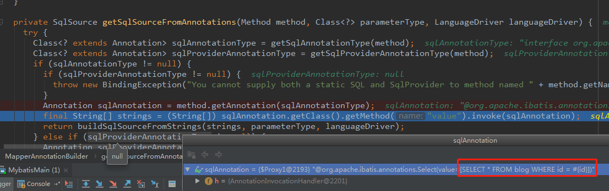


##### 怎么操作数据库？

//获取Mapper的代理对象流程

```
org.apache.ibatis.session.defaults.DefaultSqlSession.getMapper
org.apache.ibatis.session.Configuration.getMapper
org.apache.ibatis.binding.MapperRegistry.getMapper
org.apache.ibatis.binding.MapperProxyFactory.newInstance(s)
Proxy.newProxyInstance(classLoader, new Class[] { mapperInterface }, mapperProxy)
 
Blog blog = blogMapper.selectBlog(1);
实际调用到接口上的方法中
//invoke
org.apache.ibatis.binding.MapperProxy.invoke
开始代理逻辑了
org.apache.ibatis.binding.MapperProxy.PlainMethodInvoker#invoke
org.apache.ibatis.binding.MapperMethod#execute
result = sqlSession.selectOne(command.getName(), param);//走回到xml方式中的方法了
```


接口代理对象，调自定义方法

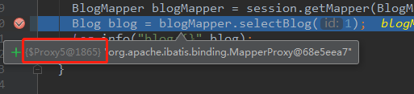

注解方式的执行器的关键方法：org.apache.ibatis.binding.MapperMethod#execute

```java
public Object execute(SqlSession sqlSession, Object[] args) {
  Object result;
  switch (command.getType()) {
    case INSERT: {
      Object param = method.convertArgsToSqlCommandParam(args);
      result = rowCountResult(sqlSession.insert(command.getName(), param));
      break;
    }
    case UPDATE: {
      Object param = method.convertArgsToSqlCommandParam(args);
      result = rowCountResult(sqlSession.update(command.getName(), param));
      break;
    }
    case DELETE: {
      Object param = method.convertArgsToSqlCommandParam(args);
      result = rowCountResult(sqlSession.delete(command.getName(), param));
      break;
    }
    case SELECT:
      if (method.returnsVoid() && method.hasResultHandler()) {
        executeWithResultHandler(sqlSession, args);
        result = null;
      } else if (method.returnsMany()) {
        result = executeForMany(sqlSession, args);
      } else if (method.returnsMap()) {
        result = executeForMap(sqlSession, args);
      } else if (method.returnsCursor()) {
        result = executeForCursor(sqlSession, args);
      } else {
        Object param = method.convertArgsToSqlCommandParam(args);
          //调xml方式中的  mybatis内部的selectOne方法
        result = sqlSession.selectOne(command.getName(), param);
        if (method.returnsOptional()
            && (result == null || !method.getReturnType().equals(result.getClass()))) {
          result = Optional.ofNullable(result);
        }
      }
      break;
    case FLUSH:
      result = sqlSession.flushStatements();
      break;
    default:
      throw new BindingException("Unknown execution method for: " + command.getName());
  }
  if (result == null && method.getReturnType().isPrimitive() && !method.returnsVoid()) {
    throw new BindingException("Mapper method '" + command.getName()
        + " attempted to return null from a method with a primitive return type (" + method.getReturnType() + ").");
  }
  return result;
}
```


整体来说，mysql将 

硬盘资源（xml）  转换到  内存（SQLSession） 再转换到硬盘（mysql）

mysql 结果    返回到 内存SQLSession中

**动态代理是mybatis的核心**


### 执行器Executor

执行器到底是什么？

创建执行器的地方是在创建了SqlSessionFactory后，openSession的时候

org.apache.ibatis.session.defaults.DefaultSqlSessionFactory#openSessionFromDataSource

#### 分类

**ExecutorType.SIMPLE**：这个执行器类型不做特殊的事情。它为每个语句的每次执行创建一个新的预处理语句。

**ExecutorType.REUSE**：这个执行器类型会复用预处理语句。

**ExecutorType.BATCH**：这个执行器会批量执行所有更新语句，也就是jdbc addBatch API的facade模式。

切换执行器可以使用全**局配置settings**


三种比较

simple的每次执行都会closeStatement   reuse和batch不会


#### 源码分析

通过数据源来打开链接

org.apache.ibatis.session.Configuration#newExecutor(t, e)

```java
public Executor newExecutor(Transaction transaction, ExecutorType executorType) {
  executorType = executorType == null ? defaultExecutorType : executorType;
  executorType = executorType == null ? ExecutorType.SIMPLE : executorType;
  Executor executor;
    //三种执行器的创建方式
  if (ExecutorType.BATCH == executorType) {
    executor = new BatchExecutor(this, transaction);
  } else if (ExecutorType.REUSE == executorType) {
    executor = new ReuseExecutor(this, transaction);
  } else {
    executor = new SimpleExecutor(this, transaction);
  }
  if (cacheEnabled) {
    executor = new CachingExecutor(executor);
  }
  //TODO 扩展点  在执行器基础上，获取其代理  此处返回的executor是个代理类
  executor = (Executor) interceptorChain.pluginAll(executor);
  return executor;
}
```

代理对象的组成

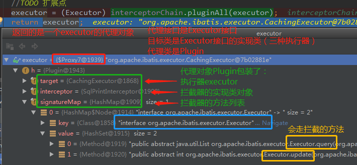

详细分析

org.apache.ibatis.plugin.InterceptorChain#pluginAll

```java
private final List<Interceptor> interceptors = new ArrayList<>();

public Object pluginAll(Object target) {
  // 责任链模式：配置按照顺序来执行plugin中的Interceptor
  for (Interceptor interceptor : interceptors) {
    target = interceptor.plugin(target);
  }
  return target;
}
```

org.apache.ibatis.plugin.Interceptor

```java
public interface Interceptor {

  Object intercept(Invocation invocation) throws Throwable;

  default Object plugin(Object target) {
      //接口的默认实现
    return Plugin.wrap(target, this);
  }

  default void setProperties(Properties properties) {
    // NOP
  }

}
```

代理方法

org.apache.ibatis.plugin.Plugin#wrap

```java
public static Object wrap(Object target, Interceptor interceptor) {
  Map<Class<?>, Set<Method>> signatureMap = getSignatureMap(interceptor);
  Class<?> type = target.getClass();
  Class<?>[] interfaces = getAllInterfaces(type, signatureMap);
  if (interfaces.length > 0) {
    //返回代理对象
    return Proxy.newProxyInstance(
        type.getClassLoader(),
        interfaces,
        //这个Plugin封装了target（在这里就是executor），Interceptor这里就是目标类的接口
        new Plugin(target, interceptor, signatureMap));
  }
  return target;
}
```


signatureMap 

key是 代理接口的class  

value是存放的是自定义Interceptor接口实现类的拦截方法  

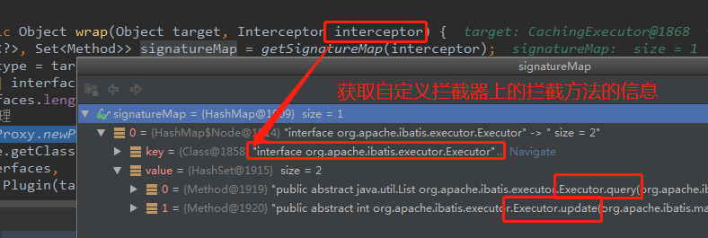

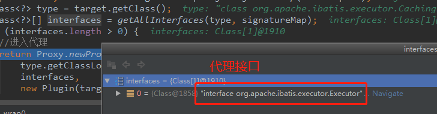


当后续调executor的query和update方法时，就会对其进行拦截

org.apache.ibatis.plugin.Plugin#invoke

```java
@Override
public Object invoke(Object proxy, Method method, Object[] args) throws Throwable {
  try {
    Set<Method> methods = signatureMap.get(method.getDeclaringClass());
    if (methods != null && methods.contains(method)) {
        //满足拦截条件就进入拦截方法
      return interceptor.intercept(new Invocation(target, method, args));
    }
      //executor的所有方法调用都是走这里
    return method.invoke(target, args);
  } catch (Exception e) {
    throw ExceptionUtil.unwrapThrowable(e);
  }
}
```


### plugin 源码分析

提供了一个扩展点，使用的也是jdk动态代理   使用了责任链的设计方式  1:24:00

plugin使用了**拦截器**org.apache.ibatis.plugin.Interceptor接口  

可以用于写个拦截器来   **防止SQL注入**

找到入口？

同样是在mybatis-config.xml资源加载 的 时候将配置的plugin加载到内存中

org.apache.ibatis.builder.xml.XMLConfigBuilder#parseConfiguration

org.apache.ibatis.builder.xml.XMLConfigBuilder#pluginElement

org.apache.ibatis.session.Configuration#addInterceptor

org.apache.ibatis.plugin.InterceptorChain#addInterceptor

关键的类org.apache.ibatis.plugin.InterceptorChain

```java
public class InterceptorChain {

  private final List<Interceptor> interceptors = new ArrayList<>();

    //在创建代理类Plugin的对象的时候，获取拦截器列表
  public Object pluginAll(Object target) {
    // 责任链模式：配置按照顺序来执行plugin中的Interceptor
    for (Interceptor interceptor : interceptors) {
        //创建代理对象，具体的结合Executor源码来看，executor就是通过这个plugin创建的代理对象
      target = interceptor.plugin(target);
    }
    return target;
  }

    //在加载mybatis-config.xml资源的时候将plugins加载到内存中
  public void addInterceptor(Interceptor interceptor) {
    interceptors.add(interceptor);
  }

  public List<Interceptor> getInterceptors() {
    return Collections.unmodifiableList(interceptors);
  }

}
```

executor代理的执行 

```
org.apache.ibatis.session.SqlSession#selectOne(s, o)
org.apache.ibatis.session.defaults.DefaultSqlSession#selectList(s, o)
org.apache.ibatis.session.defaults.DefaultSqlSession#selectList(s, o, r)
org.apache.ibatis.executor.Executor#query(m, o, r, r)
org.apache.ibatis.executor.BaseExecutor#query(m, o, r, r, c, b)
org.apache.ibatis.executor.BaseExecutor#queryFromDatabase
org.apache.ibatis.executor.BaseExecutor#doQuery
org.apache.ibatis.executor.SimpleExecutor#prepareStatement
org.apache.ibatis.executor.statement.PreparedStatementHandler#query
```


#### 涉及的代理类

①org.apache.ibatis.binding.MapperProxy

所有的Mapper的代理 都经过代理类MapperProxy

②org.apache.ibatis.plugin.Plugin

executor执行器、参数处理器、结果集处理器、SQL预处理处理器都是通过plugin代理对象执行的


### SQL解析的$ #

核心判断点  org.apache.ibatis.scripting.xmltags.XMLScriptBuilder#parseScriptNode

org.apache.ibatis.scripting.xmltags.TextSqlNode 

 判断是否走   $     org.apache.ibatis.scripting.xmltags.TextSqlNode#isDynamic

否则走 #  org.apache.ibatis.builder.SqlSourceBuilder#parse


### mybatis中四大核心接口

mybatis在执行期间，主要有四大核心接口对象：

#### 一、执行器Executor

执行器负责整个SQL执行过程的总体控制。

#### 二、参数处理器ParameterHandler

参数处理器负责PreparedStatement入参的具体设置。

 *DefaultParameterHandler为具体实现类*

*org.apache.ibatis.scripting.defaults.DefaultParameterHandler#setParameters*

#### 三、语句处理器StatementHandler

语句处理器负责和JDBC层具体交互，包括prepare语句，执行语句，以及调用ParameterHandler.parameterize()设置参数。

*比如设置超时时间、结果集每次提取大小等操作*

*org.apache.ibatis.executor.statement.BaseStatementHandler#prepare*

#### 四、结果集处理器ResultSetHandler

结果处理器负责将JDBC查询结果映射到java对象。

*结果集处理器,顾名知义,就是用了对查询结果集进行处理的,目标是将JDBC结果集映射为业务对象*

*接口中定义的三个接口分别用于处理常规查询的结果集,游标查询的结果集以及存储过程调用的出参设置*

*org.apache.ibatis.executor.resultset.DefaultResultSetHandler*

#### 责任链的方式实现

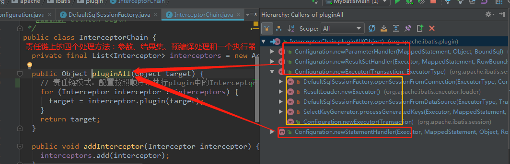


## 缓存

减少数据库的交互

mybatis提供了基本实现org.apache.ibatis.cache.impl.PerpetualCache，内部采用原始HashMap实现。

mybatis有一级缓存和二级缓存。但是**都存在问题，所以不用**，存在与数据不同步的问题，当数据发生修改后，无法感知同步获取最新的数据；二级缓存 的作用域是namespace，当有些查询不想用缓存，无法屏蔽

### 一级缓存   

一级缓存是SqlSession级别的缓存，不同SqlSession之间的缓存数据区域（HashMap）是互相不影响，MyBatis默认支持一级缓存，不需要任何的配置。

**作用域 SQLSession **    

**清除缓存的操作是SQLSession的commit/rollback/close方法**

默认情况下(一级缓存的有效范围可通过参数localCacheScope参数修改，取值为SESSION或者STATEMENT)，在一个SqlSession的查询期间，只要没有发生commit/rollback或者调用close()方法，那么mybatis就会先根据当前执行语句的CacheKey到一级缓存中查找，如果找到了就直接返回，不到数据库中执行。其实现在代码BaseExecutor.query()中

创建CacheKey  org.apache.ibatis.executor.BaseExecutor#createCacheKey

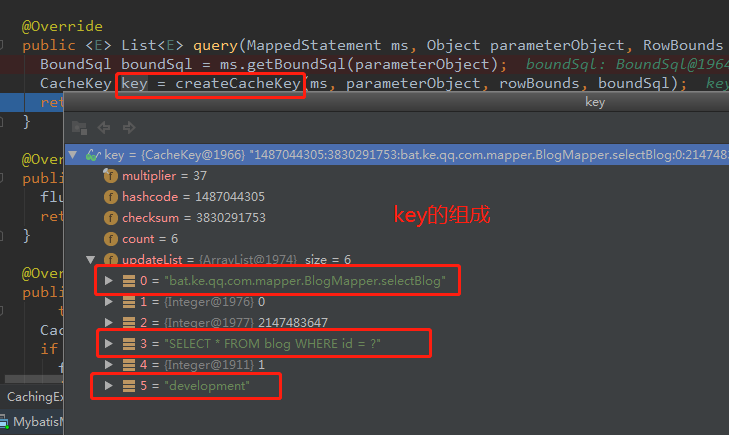

   

从一级缓存中取数据 在方法中org.apache.ibatis.executor.BaseExecutor#query(m, o, r, r, c, b)

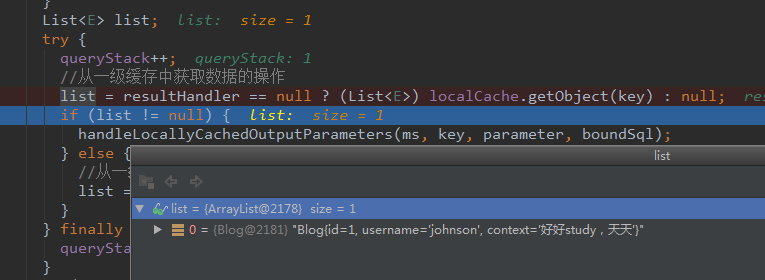


### 二级缓存

二级缓存是mapper级别的缓存，多个SqlSession去操作同一个mapper的sql语句，多个SqlSession可以共用二级缓存，二级缓存是跨SqlSession。二级缓存默认不启用，需要通过在Mapper中明确设置cache，它的实现在CachingExecutor的query()方法中


二级缓存只提供了接口，具体的存储可以使用redis  

二级缓存点**CachingExecutor**

org.apache.ibatis.executor.CachingExecutor#query(m, o, r, r, c, b)

```java
  @Override
  public <E> List<E> query(MappedStatement ms, Object parameterObject, RowBounds rowBounds, ResultHandler resultHandler, CacheKey key, BoundSql boundSql)
      throws SQLException {
    //获取缓存
    Cache cache = ms.getCache();
    //开启了二级缓存
    if (cache != null) {
      flushCacheIfRequired(ms);
      if (ms.isUseCache() && resultHandler == null) {
        ensureNoOutParams(ms, boundSql);
        @SuppressWarnings("unchecked")
          //从二级缓存总取数据
        List<E> list = (List<E>) tcm.getObject(cache, key);
        if (list == null) {
          list = delegate.query(ms, parameterObject, rowBounds, resultHandler, key, boundSql);
          tcm.putObject(cache, key, list); // issue #578 and #116
        }
        return list;
      }
    }
    return delegate.query(ms, parameterObject, rowBounds, resultHandler, key, boundSql);
  }
```


# 二、Mybatis-Spring整合


### SqlSession接口

*org.apache.ibatis.session.SqlSession*  

其实现类 org.apache.ibatis.session.defaults.DefaultSqlSession 是**非线程安全的**  


用了封装好的org.mybatis.spring.SqlSessionTemplate#SqlSessionTemplate

org.mybatis.spring.support.SqlSessionDaoSupport底层实际就是SqlSessionTemplate


与spring整合后，变成线程安全的了


mybatis全局配置怎么注册


mappers怎么注入spring


整合后的mybatis没有使用其缓存


## Mybatis-Plus


[MyBatis-Plus](https://github.com/baomidou/mybatis-plus)（简称 MP）是一个 [MyBatis](http://www.mybatis.org/mybatis-3/) 的增强工具，在 MyBatis 的基础上只做增强不做改变，为简化开发、提高效率而生。

强化了spring—mybatis 但是没有做侵入性的改造

导入jar 这个jar包括了mybatis和spring的整合包和mybatis的jar包，多余的不用引入

[官网](https://baomidou.com/)  快速入门 ：Mybatis06


### SqlSessionFactory

每个基于 MyBatis 的应用都是以一个 SqlSessionFactory 的实例为核心的。SqlSessionFactory 的实例可以通过 SqlSessionFactoryBuilder 获得。

SqlSessionFactoryBuilder 则可以从 XML 配置文件或一个预先配置的 Configuration 实例来构建出 SqlSessionFactory 实例。


### SqlSession


**命名空间（Namespaces）**


### 作用域（Scope）和生命周期


#### SqlSessionFactoryBuilder

这个类可以被实例化、使用和丢弃，一旦创建了 SqlSessionFactory，就不再需要它了。 因此 SqlSessionFactoryBuilder 实例的最佳作用域是方法作用域（也就是局部方法变量）。 你可以重用 SqlSessionFactoryBuilder 来创建多个 SqlSessionFactory 实例，但最好还是不要一直保留着它，以保证所有的 XML 解析资源可以被释放给更重要的事情


#### SqlSessionFactory

SqlSessionFactory 一旦被创建就应该在应用的运行期间一直存在，没有任何理由丢弃它或重新创建另一个实例。 使用 SqlSessionFactory 的最佳实践是在应用运行期间不要重复创建多次，多次重建 SqlSessionFactory 被视为一种代码“坏习惯”。因此 SqlSessionFactory 的最佳作用域是应用作用域。 有很多方法可以做到，最简单的就是使用单例模式或者静态单例模式。

#### SqlSession

每个线程都应该有它自己的 SqlSession 实例。SqlSession 的实例不是线程安全的，因此是不能被共享的，所以它的最佳的作用域是请求或方法作用域。 绝对不能将 SqlSession 实例的引用放在一个类的静态域，甚至一个类的实例变量也不行。 也绝不能将 SqlSession 实例的引用放在任何类型的托管作用域中，比如 Servlet 框架中的 HttpSession。 如果你现在正在使用一种 Web 框架，考虑将 SqlSession 放在一个和 HTTP 请求相似的作用域中。 换句话说，每次收到 HTTP 请求，就可以打开一个 SqlSession，返回一个响应后，就关闭它。 这个关闭操作很重要，为了确保每次都能执行关闭操作，你应该把这个关闭操作放到 finally 块中。


配置

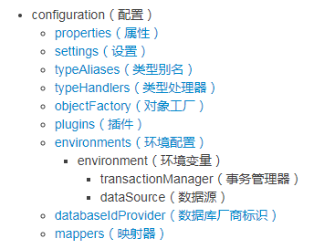


### 属性（properties）


### 设置（settings）


# 三、Mybatis源码面向对象手写实现、Mybatis设计模式、逆向工程详解

# 四、Mybatis-Spring与MyBatis-Plus核心流程与源码分析