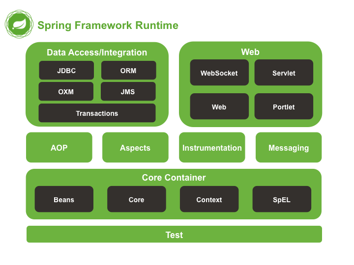
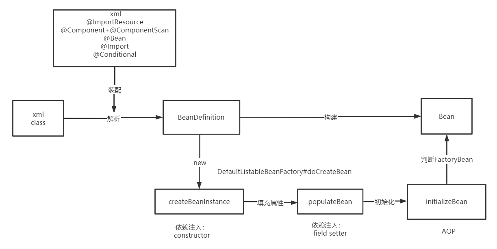

# Spring IoC源码分析

主讲老师： fox老师


## 为什么看源码

- 提升技术功底     java基础
- 深度掌握技术框架
- 快速定位线上问题
- 面试必问     
- 技术追求   

### 原则

- 定焦原则： 抓主线（抓住一个核心流程去分析，不要漫无目的的去看源代码）
- 宏观原则： 站在上帝视角，先脉络后枝叶 （切忌试图搞清楚每一行代码）

### 方法

1. 先会使用，了解框架的设计思想和功能架构
2. 抓主线，多尝试静态看代码
3. 在源码中写注释&画流程图
4. 整合总结

### 技巧

1. 断点（观察调用栈，利用条件断点，表达式）
2. 反调 （Find Usages）
3. 根据接口方法找到具体实现          AoP     AopProxyFactory
4. 猜测类名方法名（比如doGetBean,doCreateBean）
5. 看控制台日志

### 心态

- 克服对源码的恐惧心理       

- 静下心读源码


## Spring 如何学，学什么

- 装配方式+依赖注入     

- 设计理念

- BeanDefintion       scope  beanClass  lazy-init        method  constructor

- BeanDefintionMap    注册      BeanDefintionRegistry 

- 注解如何解析 ，如何注册    BeanFactoryPostProcessor

- beanFactory.getBean("user")       singletonObjects    单例对象池

- bean的构建过程       new---填充属性  --- init

- bean的循环依赖     

- beanPostProcessor   

- Aop       init的后置方法里调用后置处理器

- 声明式事务          MethodInterceptor

- Web      DispatherServlet#doDispath

- Spring 扩展点   -----   IoC的扩展点  ：

  ​	 BeanFactoryPostProcessor 

  ​	 beanPostProcessor   

  ​	 @Import

  ​     ApplicationListener

  ​     SmartLifeCycle

  ​     Aware


## Spring整体架构



官网地址： https://spring.io/projects/spring-framework

## IoC容器的设计理念


**IoC**(Inversion of Control) 也称为**依赖注入**(dependency injection, DI)。它是一个==对象定义依赖关系的过程==，也就是说，对象只通过构造函数参数、工厂方法的参数或对象实例构造或从工厂方法返回后在对象实例上设置的属性来定义它们所使用的其他对象。然后==容器在创建bean时注入这些依赖项==。这个过程基本上是bean的逆过程，因此称为**控制反转**(IoC)

在Spring中，构成应用程序主干并由Spring IoC容器管理的对象称为**bean**。bean是由Spring IoC容器实例化、组装和管理的对象。

IoC容器设计理念：通过容器统一对象的构建方式，并且自动维护对象的依赖关系。


https://www.processon.com/view/link/5cd10507e4b085d010929d02

## IoC的应用



### 1. bean的装配方式

#### xml

```xml
<?xml version="1.0" encoding="UTF-8"?>
<beans xmlns="http://www.springframework.org/schema/beans"
       xmlns:xsi="http://www.w3.org/2001/XMLSchema-instance"
       xsi:schemaLocation="http://www.springframework.org/schema/beans
        https://www.springframework.org/schema/beans/spring-beans.xsd">

    <bean id="user"  class="bat.ke.qq.com.bean.User"/>

</beans>
```

容器加载xml

```java
ApplicationContext context = new ClassPathXmlApplicationContext("spring.xml");
```

#### @ImportResource

```java
@ImportResource("spring.xml")
public class AppConfig {

}
```

容器加载

```java
 ApplicationContext context = new AnnotationConfigApplicationContext(AppConfig.class);
```


#### 实现FactoryBean

```java
public class MyFactroyBean  implements FactoryBean {
   @Override
   public Object getObject() throws Exception {
      return new User();
   }

   @Override
   public Class<?> getObjectType() {
      return User.class;
   }
}
```

思考：==FactoryBean和BeanFactory的区别？==

```java
AbstractBeanFactory#getObjectForBeanInstance
!(beanInstance instanceof FactoryBean) || BeanFactoryUtils.isFactoryDereference(name)
AbstractBeanFactory#getObjectForBeanInstance
FactoryBeanRegistrySupport#doGetObjectFromFactoryBean
```

factoryBeanObjectCache ：  缓存getObject()获取的单例

```java
FactoryBeanRegistrySupport#getCachedObjectForFactoryBean
```

allBeanNamesByType：  缓存  getObjectType ：FactoryBean   


```java
DefaultListableBeanFactory#getBeanNamesForType(java.lang.Class<?>, boolean, boolean)

FactoryBeanRegistrySupport#getTypeForFactoryBean
```


应用场景：

如何将接口交给Spring管理？

实现：  

- mybatis-spring.jar   MapperFactoryBean

- feign      FeignClientFactorybean

  

#### @Component +@ComponentScan

@ComponentScan默认扫描: @Component, @Repository，@Service, @Controller

```java
@ComponentScan("bat.ke.qq.com")
public class AppConfig {
}
```

容器加载

```java
 ApplicationContext context = new AnnotationConfigApplicationContext(AppConfig.class);
```

@CompentScan  注解扩展用法：

- 排除用法 excludeFilters  

  ```java
  @ComponentScan(basePackages = "bat.ke.qq.com",excludeFilters = {
      @ComponentScan.Filter(type = FilterType.ANNOTATION,value = {Service.class}),
      @ComponentScan.Filter(type = FilterType.ASSIGNABLE_TYPE,value = {User.class})
  })
  ```

- 包含用法 includeFilters  

  ```java
  @ComponentScan(basePackages = "bat.ke.qq.com",includeFilters = {
      @ComponentScan.Filter(type = FilterType.CUSTOM,value = {CustomTypeFilter.class})
  },useDefaultFilters = false)
  ```

  ==FilterType.CUSTOM实现自定义过滤规则==

  ```java
  public class CustomTypeFilter implements TypeFilter {
      @Override
      public boolean match(MetadataReader metadataReader, MetadataReaderFactory metadataReaderFactory) throws IOException {
          
          ClassMetadata classMetadata = metadataReader.getClassMetadata();
          if (classMetadata.getClassName().contains("Service")) {
              return true;
          }
          return false;
      }
  }
  ```

  

#### @Bean+ @Configuration

```java
@Configuration
public class AppConfig {

    @Bean
    public User user(){
        return new User();
    }

    @Bean
    public UserService userService(){
        // 调用其他@Bean方法
        return new UserService(user());
    }
}
```

思考：==配置 @Configuration和不配置的区别==？

不配置@Configuration： 当内部method bean发生彼此依赖的时候会导致多例

@Configuration的作用：

1.表明当前类是一个配置类，是方法bean的源

2.将@Configuration配置的AppConfig的BeanDefinitioin属性赋值为full类型，保证AppConfig类型可以转变为cglib类型

3.将@Configuration配置的AppConfig由普通类型转变为cglib代理类型，最后会生成cglib代理对象，通过代理对象的方法拦截器，可以解决AppConfig内部方法bean之间发生依赖调用的时候从容器中去获取，避免了多例的出现。

应用场景：

零xml配置，推荐使用，spring boot自动配置中大量使用@Bean    xxxAutoConfiguration  

```makefile
@Bean和 @Component 装配的区别？ 

@Component    beanClass= bat.ke.qq.com.User   
@Bean         beanClass= null      factoryMethodName= "fox"    autowireMode=3
```


#### @Import

```java
@Import(value = MyImportBeanDefinitionRegistrar.class)
public class AppConfig {
}
```

- **Configuration**

导入一个或多个配置类

```java
@Configuration
public class ConfigA {

    @Bean
    public A a() {
        return new A();
    }
}

@Configuration
@Import(ConfigA.class)
public class ConfigB {

    @Bean
    public B b() {
        return new B();
    }
}
```

- **ImportSelector**

```java
public class MyImportSelector implements ImportSelector {
   @Override
   public String[] selectImports(AnnotationMetadata importingClassMetadata) {
      return new String[]{Fox.class.getName()}; 
   }
}
```

- **ImportBeanDefinitionRegistrar**

```java
public class MyImportBeanDefinitionRegistrar implements ImportBeanDefinitionRegistrar {
   @Override
   public void registerBeanDefinitions(AnnotationMetadata importingClassMetadata,BeanDefinitionRegistry registry) {
      //创建BeanDefinition
      RootBeanDefinition rootBeanDefinition = new RootBeanDefinition(Fox.class);
      // 注册到容器
      registry.registerBeanDefinition("fox",rootBeanDefinition);
   }
}
```

应用场景：

中间件底层大量使用，和Spring集成的核心扩展技术

- mybatis-spring.jar    @MapperScan     
- spring boot           @SpringBootApplication        XXXAutoConfiguration
- spring cloud     @EnableEurekaServer @EnableCircuitBreaker  @EnableFeignClients  @EnableZuulProxy

####  @Conditional

@Conditional是Spring4新提供的注解，它的作用是按照一定的条件进行判断，满足条件给容器注册bean。

```java
@Configuration
public class AppConfig {
  @Bean
  public Cat cat(){
     return new Cat();
  }
    
  @Bean
  @Conditional(value = MyConditional.class)
  public Fox fox(){
     return new Fox()
  }
}

public class MyConditional implements Condition {
   @Override
   public boolean matches(ConditionContext context, AnnotatedTypeMetadata metadata) {
      if(context.getBeanFactory().containsBean("cat"))
         return true;
      return false;
   }
}
```

应用场景：

Spring boot 自动配置实现核心技术之一： 条件装配 ，Spring Boot进行了扩展

- @ConditionalOnWebApplication：当前项目是 Web项目的条件下

- @ConditionalOnBean：当容器里有指定 Bean 的条件下

- @ConditionalOnMissingBean：当容器里没有指定 Bean 的情况下

- @ConditionalOnClass：当类路径下有指定类的条件下
- @ConditionalOnMissingClass：当类路径下没有指定类的条件下
- @ConditionalOnProperty：指定的属性是否有指定的值


### 2. bean的依赖注入

#### 查找方式：

- byType
- byName

#### 手动装配(手动注入)

```xml
<bean name="user"  class="bat.ke.qq.com.bean.User"  />

<bean id="userService" class="bat.ke.qq.com.service.UserService" >
    <!-- setter -->
    <property name="user" ref="user"/>
    <!-- constructor -->
    <constructor-arg ref="user"/>
</bean>

```

利用autowire属性改为自动装配

```xml
<bean id="userService" class="bat.ke.qq.com.service.UserService" autowire="constructor">
 </bean>
```


#### 自动装配(自动注入)注解：

##### @Autowired

- @Autowired是spring自带的注解，通过`AutowiredAnnotationBeanPostProcessor`类实现的依赖注入；

- ==@Autowired是根据类型进行自动装配的==，如果需要按名称进行装配，则需要配合@Qualifier；
- @Autowired有个属性为required，可以配置为false，如果配置为false之后，当没有找到相应bean的时候，系统不会抛错；

- @Autowired可以作用在变量、setter方法、构造函数上。


##### @Resource

- @Resource是JSR250规范的实现，需要导入javax.annotation实现注入；

- @Resource是根据名称进行自动装配的，一般会指定一个name属性，==当找不到与名称匹配的bean时才按照类型进行装配==；

- @Resource可以作用在变量、setter方法上。


##### @Inject

- @Inject是JSR330 (Dependency Injection for Java)中的规范，需要导入javax.inject.Inject;实现注入。

- ==@Inject是根据类型进行自动装配的==，如果需要按名称进行装配，则需要配合@Named；

- @Inject可以作用在变量、setter方法、构造函数上。


```xml
<dependency>
    <groupId>javax.inject</groupId>
    <artifactId>javax.inject</artifactId>
    <version>1</version>
</dependency>
```

原理：

```java
InjectionMetadata#inject
 >InjectedElement#inject
```


#### Autowiring Modes (自动装配模型)

官方文档：https://docs.spring.io/spring-framework/docs/current/spring-framework-reference/core.html#beans-factory-autowire

- no
- byName
- byType
- constructor

```java
// AutowireCapableBeanFactory
int AUTOWIRE_NO = 0;
int AUTOWIRE_BY_NAME = 1;
int AUTOWIRE_BY_TYPE = 2;
int AUTOWIRE_CONSTRUCTOR = 3;
```


#### 依赖注入方式及原理：

官网文档： https://docs.spring.io/spring-framework/docs/current/spring-framework-reference/core.html#beans-constructor-injection

##### field

注入原理： 属性反射

```java
AbstractAutowireCapableBeanFactory#populateBean
AutowiredAnnotationBeanPostProcessor.AutowiredFieldElement#inject
>value = beanFactory.resolveDependency(desc, beanName, autowiredBeanNames, typeConverter)
>field.set(bean, value)
```

##### constructor

不配置@Autowired情况下

* 当只有一个构造器时，如果构造器入参都是bean,则会执行此构造器（参数会自动注入），如果出现非bean的入参，则会抛出NoSuchBeanDefinitionException      
*  当显示定义多个构造器时，会默认调用无参构造器，如果没有无参构造器，则会抛出 No default constructor found
* 当该bean的beanDefinition设置了AutowireMode为3后，则会选择构造器贪婪模式，选择合适的构造器列表(前提：构造器入参都是bean) 构造bean对象

```java
@Component
public class MyBeanFactoryProcessor implements BeanFactoryPostProcessor {
   @Override
   public void postProcessBeanFactory(ConfigurableListableBeanFactory beanFactory) throws BeansException {
      AbstractBeanDefinition beanDefinition = (AbstractBeanDefinition) beanFactory.getBeanDefinition("userService");
       //构造器贪婪模式
      beanDefinition.setAutowireMode(3);
   }
}
```

多构造器筛选时会先排序，构造器排序会先比较方法修饰符（Modifier），然后比较方法参数。同为public情况下，会选择参数多的构造器构造bean对象。

```java
AbstractAutowireCapableBeanFactory#createBeanInstance
ConstructorResolver#autowireConstructor
> AutowireUtils.sortConstructors(candidates)
>> ConstructorResolver#createArgumentArray    
> bw.setBeanInstance(instantiate(beanName, mbd, constructorToUse, argsToUse))
```

##### setter

不配置*@Autowired情况下*

通过设置AutowireMode为1或者2，会调用setter方法，通过setter方法注入bean

```java
// AutowireCapableBeanFactory
int AUTOWIRE_NO = 0;
int AUTOWIRE_BY_NAME = 1;
int AUTOWIRE_BY_TYPE = 2;
int AUTOWIRE_CONSTRUCTOR = 3;
```

注入原理：  方法反射

```java
AbstractAutowireCapableBeanFactory#populateBean
AutowiredAnnotationBeanPostProcessor.AutowiredMethodElement#inject
>arg = beanFactory.resolveDependency(currDesc, beanName, autowiredBeans, typeConverter)
>method.invoke(bean, arguments)
```


## IoC工作原理

图解：https://www.processon.com/view/link/5cd10507e4b085d010929d02

### Spring源码编译

环境： idea 2018.2     gradle： 4.10.2   spring framework: 5.2.0

```shell
#下载
git clone https://github.com/spring-projects/spring-framework.git
cd spring-framework/
#编译
gradlew spring-oxm:compileTestJava

```

编译文档+fox老师本人注释的源码：

http://git.yuanmaedu.com:3000/yuanma-vip/Spring/src/master/spring-framework

idea激活码： http://idea.medeming.com/jets/

编译成功的idea和gradle版本

| idea 2018.2 | gradle： 4.10.2 |
| ----------- | --------------- |
| idea2019.2  | gradle 4.6      |
| idea2018.2  | gradle 3.1      |
| idea2019.3  | gradle3.7       |
| idea2020.1  | gradle 5.6.4    |

#### 编译遇到的问题：


文档：Spring源码编译遇到的问题.note
链接：http://note.youdao.com/noteshare?id=d57232c539b57846a730328c4f803035&sub=2852BA1C17EE4DBEABE9F8AC8FC35EEA


### bean的注册原理

思考：==bean的属性是什么对象承载的？ bean是如何注册到容器中的？==

#### BeanDefinition

容器中的每一个 bean 都会有一个对应的 BeanDefinition 实例，该实例负责保存 bean 对象的所有必要信息，包括 bean 对象的 class 类型、是否是抽象类、构造方法和参数、其他属性等等


#### BeanDefinitionRegistry

 BeanDefinition的注册器，抽象了 bean 的注册逻辑，包括registerBeanDefinition、removeBeanDefinition、getBeanDefinition 等注册管理 BeanDefinition 的方法。

#### BeanFactory  

bean工厂，抽象了 bean 的管理逻辑，主要包含 getBean、containBean、getType、getAliases 等管理 bean 的方法。


#### DefaultListableBeanFactory

Spring IoC的核心类， 即实现了BeanFactory  ，也实现了BeanDefinitionRegistry

```java
# 注册BeanDefinition对象
public void registerBeanDefinition(String beanName, BeanDefinition beanDefinition)
			throws BeanDefinitionStoreException {}
# 注册bean对象
public void registerSingleton(String beanName, Object singletonObject) throws IllegalStateException {}
```

xml Configuration  demo

```java
//创建一个简单注册器
//BeanDefinitionRegistry register = new SimpleBeanDefinitionRegistry();
//创建一个实现了注册器的工厂  
BeanDefinitionRegistry registry = new DefaultListableBeanFactory();
//创建bean定义读取器
BeanDefinitionReader reader = new XmlBeanDefinitionReader(register);
// 创建资源读取器
//DefaultResourceLoader resourceLoader = new DefaultResourceLoader();
// 获取资源
//Resource xmlResource = resourceLoader.getResource("spring.xml");
// 装载Bean的定义
//reader.loadBeanDefinitions(xmlResource);
reader.loadBeanDefinitions("spring.xml");
// 打印构建的Bean 名称
System.out.println(Arrays.toString(register.getBeanDefinitionNames());

// 工厂调用getBean方法
System.out.println(registry.getBean("user"));
```

java Configuration  demo

```java
AnnotationConfigApplicationContext context =
      new AnnotationConfigApplicationContext(AppConfig.class);

// 通过容器获取到beanFactory  即是工厂，又是注册器
DefaultListableBeanFactory factory = context.getDefaultListableBeanFactory();

RootBeanDefinition beanDefinition = new RootBeanDefinition(Fox.class);
factory.registerBeanDefinition("fox",beanDefinition);

//beanDefinition.setAutowireMode(2);

// 填充属性
beanDefinition.getPropertyValues().add("name","fox");
```

#### 动态注册bean

==思考：如何动态的将一个普通对象交给Spring管理？==

##### BeanDefinitionRegistryPostProcessor

```java
public interface BeanDefinitionRegistryPostProcessor extends BeanFactoryPostProcessor {

	void postProcessBeanDefinitionRegistry(BeanDefinitionRegistry registry) throws BeansException;

}
```

##### ImportBeanDefinitionRegistrar

利用@Import注解实现

```java
public interface ImportBeanDefinitionRegistrar {

	public void registerBeanDefinitions(
			AnnotationMetadata importingClassMetadata, BeanDefinitionRegistry registry);

}
```

##### BeanFactoryPostProcessor

```java
public interface BeanFactoryPostProcessor {

   void postProcessBeanFactory(ConfigurableListableBeanFactory beanFactory) throws BeansException;

}
```


### IoC启动流程

https://www.processon.com/diagraming/5cf751c5e4b0da05395f587d

AbstractApplicationContext#refresh

#### 1.创建beanFactory

容器底层用DefaultListableBeanFactory，即实现了BeanDefinitionRegistry，又实现了BeanFactory

##### java配置:

```java
AnnotationConfigApplicationContext context =
      new AnnotationConfigApplicationContext(AppConfig.class);
```

this()方法---->调父类无参构造器

```java
public GenericApplicationContext() {
   this.beanFactory = new DefaultListableBeanFactory();
}
```

在容器启动之前就创建beanFactory

##### xml配置：

```java
ClassPathXmlApplicationContext context = new ClassPathXmlApplicationContext("Spring.xml");
```

调refresh()后，即容器启动过程中创建beanFactory

```java
ConfigurableListableBeanFactory beanFactory = obtainFreshBeanFactory();

> refreshBeanFactory(); // AbstractApplicationContext#refreshBeanFactory
```

先创建DefaultListableBeanFactory实例，然后 解析xml配置文件，注册bean到beanFactory，最后再将beanFactory赋值给容器

```java
DefaultListableBeanFactory beanFactory = createBeanFactory();
beanFactory.setSerializationId(getId());
// 定制beanFactory，设置参数
customizeBeanFactory(beanFactory);
// 注册spring的xml配置的bean到beanFactory，此时容器还未指定beanbeanFactory
loadBeanDefinitions(beanFactory);
// 给容器指定beanFactory
synchronized (this.beanFactoryMonitor) {
   this.beanFactory = beanFactory;
}
```

#### 2.注册bean

##### 核心原理: 

通过调用registerBeanDefinition方法将bean的beanName----beanDefinition注册到beanFactory

```java
DefaultListableBeanFactory#registerBeanDefinition  //  实现了 BeanDefinitionRegistry
> beanDefinitionMap.put(beanName, beanDefinition);  // 缓存beanDefinition
```

###### 代码示例：

```java
// 拿到工厂  实现了 BeanDefinitionRegistry
DefaultListableBeanFactory beanFactory = context.getDefaultListableBeanFactory();

//创建一个beanDefinition
RootBeanDefinition beanDefinition = new RootBeanDefinition(User.class);

// 注册
beanFactory.registerBeanDefinition("user",beanDefinition);
```


##### java配置:

容器启动过程中, 会调用ConfigurationClassPostProcessor#postProcessBeanDefinitionRegistry 解析注解，注册bean

```java
invokeBeanFactoryPostProcessors(beanFactory); // 解析注解，注册bean

> ConfigurationClassPostProcessor#postProcessBeanDefinitionRegistry
```

ConfigurationClassPostProcessor#postProcessBeanDefinitionRegistry 中有两个很重要的方法

```java
// 解析配置类  @ComponentScan (bean注册到容器) @Import @ImportResource @Bean
parser.parse(candidates);

// 注册bean到容器
// 注册实现了ImportSelector的bean
// 方法bean注册到容器
// @ImportResource("spring.xml") 配置的bean注册到容器
// 实现ImportBeanDefinitionRegistrar的bean 注册到容器
this.reader.loadBeanDefinitions(configClasses);
```

###### 解析注解

```java
parser.parse(candidates);
>ConfigurationClassParser#processConfigurationClass

>ConfigurationClassParser#doProcessConfigurationClass
```

ConfigurationClassParser#doProcessConfigurationClass 会处理@ComponentScan，@Import，@ImportResource，@Bean

@ComponentScan会将@Component修饰的bean注入到容器

```java
ClassPathBeanDefinitionScanner#doScan
>
// 找到@Component修饰的类的beanDefiniton集合
Set<BeanDefinition> candidates = findCandidateComponents(basePackage);
// 注册bean
registerBeanDefinition(definitionHolder, this.registry);
```

###### 注册bean

```java
this.reader.loadBeanDefinitions(configClasses)
    
>ConfigurationClassBeanDefinitionReader#loadBeanDefinitionsForConfigurationClass
```

```java
if (configClass.isImported()) {
   //  implements ImportSelector 的bean 注册
   registerBeanDefinitionForImportedConfigurationClass(configClass);
}
for (BeanMethod beanMethod : configClass.getBeanMethods()) {
   // 方法bean 注册到容器
   loadBeanDefinitionsForBeanMethod(beanMethod);
}

// @ImportResource("spring.xml") 配置的bean注册到容器
loadBeanDefinitionsFromImportedResources(configClass.getImportedResources());
//  实现 ImportBeanDefinitionRegistrar的 bean 注册到容器
loadBeanDefinitionsFromRegistrars(configClass.getImportBeanDefinitionRegistrars());
```

##### xml配置：

```java
ConfigurableListableBeanFactory beanFactory = obtainFreshBeanFactory();

> refreshBeanFactory(); // AbstractApplicationContext#refreshBeanFactory
```

将beanFactory赋值给容器之前 解析xml，并且注册bean

```java
DefaultListableBeanFactory beanFactory = createBeanFactory();
beanFactory.setSerializationId(getId());
// 定制beanFactory，设置参数
customizeBeanFactory(beanFactory);
// 注册spring的xml配置的bean到beanFactory，此时容器还未指定beanbeanFactory
loadBeanDefinitions(beanFactory);
// 给容器指定beanFactory
synchronized (this.beanFactoryMonitor) {
   this.beanFactory = beanFactory;
}
```

##### 解析xml

loadBeanDefinitions(beanFactory) 最终会调DefaultBeanDefinitionDocumentReader#doRegisterBeanDefinitions

```java
// 注册spring的xml配置的bean到beanFactory，此时容器还未指定beanbeanFactory
loadBeanDefinitions(beanFactory);

>DefaultBeanDefinitionDocumentReader#doRegisterBeanDefinitions

preProcessXml(root);
parseBeanDefinitions(root, this.delegate);// 解析xml
postProcessXml(root);

>DefaultBeanDefinitionDocumentReader#parseDefaultElement

else if (delegate.nodeNameEquals(ele, BEAN_ELEMENT)) {
	// 解析bean
	processBeanDefinition(ele, delegate);
}

>DefaultBeanDefinitionDocumentReader#processBeanDefinition
// 注册最后修饰后的实例beanDefinition
BeanDefinitionReaderUtils.registerBeanDefinition(bdHolder, getReaderContext().getRegistry());
```

##### 注册bean

BeanDefinitionReaderUtils#registerBeanDefinition 中会注册bean

```java
// 注册beanDefiniton
registry.registerBeanDefinition(beanName, definitionHolder.getBeanDefinition());
```

#### 3.创建bean实例

##### 准备

容器启动过程中会实例化非懒加载单例bean,通过AbstractBeanFactory创建bean的实例

```java
AbstractApplicationContext#refresh

// Instantiate all remaining (non-lazy-init) singletons.
// 实例化所有剩余的(非懒加载)单例。
> finishBeanFactoryInitialization(beanFactory);
> AbstractApplicationContext#getBean(String)
```

调用context.getBean(name)获取bean实例，实际会去调用AbstractBeanFactory的getBean()方法。

```java
AbstractApplicationContext#getBean(String)
>AbstractBeanFactory#getBean(String)
>AbstractBeanFactory#doGetBean
```

调用AbstractBeanFactory#doGetBean， 先从singletonObjects中去获取bean

```java
//转换对应的beanName
// 1.带&前缀的去掉前缀
// 2.从aliasMap中找name对应id，bean没有配id就用name
final String beanName = transformedBeanName(name);

//先从缓存singletonObjects中找,没有则去创建
//处理循环依赖的问题,比如A->B，B->A
Object sharedInstance = getSingleton(beanName);


//判断单例
if (mbd.isSingleton()) {
	sharedInstance = getSingleton(beanName, () -> {
		return createBean(beanName, mbd, args);
    });   
	bean = getObjectForBeanInstance(sharedInstance, name, beanName, mbd);
}                                  

```

调用AbstractAutowireCapableBeanFactory#doCreateBean 返回bean

```java
AbstractAutowireCapableBeanFactory#createBean(String, RootBeanDefinition, Object[])
// 返回bean实例
>Object beanInstance = doCreateBean(beanName, mbdToUse, args);
```

##### 实例化bean

调用AbstractAutowireCapableBeanFactory#doCreateBean

```java
/**
* 第2次调用后置处理器
* 创建bean实例，并将实例放在包装类BeanWrapper中返回
* 1.通过工厂方法创建bean实例
* 2.通过构造方法自动注入创建bean实例
* 3.通过无参构造器创建bean实例
*/
instanceWrapper = createBeanInstance(beanName, mbd, args);
final Object bean = instanceWrapper.getWrappedInstance();
```


##### 填充bean

```java
// 填充bean 设置属性  InstantiationAwareBeanPostProcessors
// 第5次，第6次调用后置处理器   注入依赖
populateBean(beanName, mbd, instanceWrapper);
```

##### 初始化bean

```java
// 初始化bean
exposedObject = initializeBean(beanName, exposedObject, mbd);
```

##### 返回bean

```java
// 返回类型判断 FactoryBean BeanFactroy
bean = getObjectForBeanInstance(sharedInstance, name, beanName, mbd);
>
//  涉及FactoryBean的判断，直接返回普通bean的条件  类型是否是FactoryBean || name首字符是否是&
if (!(beanInstance instanceof FactoryBean) ||BeanFactoryUtils.isFactoryDereference(name){
	return beanInstance;
}
```


### BeanFactoryPostProcessor

BeanFactoryPostProcessor是实现spring容器功能扩展的重要接口，例如修改bean属性值，实现bean动态代理等。

- BeanFactoryPostProcessor

- BeanDefinitionRegistryPostProcessor

- ConfigurationClassPostProcessor

https://www.processon.com/view/link/5d5146aee4b0ac2b6175f502


### @Configuration原理剖析

#### @Configuration使用

官方文档描述：

用@Configuration注释类表明其主要目的是作为bean定义的源

@Configuration类允许通过调用同一类中的其他@Bean方法来定义bean之间的依赖关系。

##### 代码示例

```java
@Configuration
public class AppConfig {

    @Bean  
    public MyService myService() {
        return new MyService();
    }
    
    @Bean
    public UserService userService(){
		return new UserService(myService()); // 调用其他@Bean方法
	}
}
```

```java
public class MyService {
	public void query(){
		System.out.println("====query=");
	}
}

public class UserService {

   public UserService(MyService myService) {
      System.out.println("=====UserService Constructor======"+myService);
   }
}
```

```java
@Test
public void test(){
   AnnotationConfigApplicationContext context =
         new AnnotationConfigApplicationContext(AppConfig.class);
   System.out.println(context.getBean("myService"));
}
```

##### 配置和不配置@Configuration 的区别

配置了@Configuration ,打印结果显示  UserService 依赖的对象myService和从容器中获取的对象myService

是同一个对象。表明：UserService 依赖的对象myService是从容器中获取的，是一个bean

```
=====UserService Constructor======bat.ke.qq.com.service.MyService@9225652
bat.ke.qq.com.service.MyService@9225652  
```

没有配置@Configuration，打印结果显示 UserService 依赖的对象myService和从容器中获取的对象myService

不是同一个对象。表明：UserService依赖的对象myService 不是从容器中获取的，只是一个普通的对象

```
=====UserService Constructor======bat.ke.qq.com.service.MyService@501edcf1
bat.ke.qq.com.service.MyService@7d3a22a9
```

思考：为什么@Configuration配置和不配置会有这么大的区别？

##### 原因分析

@Configuration修饰的AppConfig是一个cglib的代理对象

```java
//bat.ke.qq.com.config.AppConfig$$EnhancerBySpringCGLIB$$c983ca26@50a638b5
System.out.println(context.getBean("appConfig")); 
```

可以看出appConfig是一个代理对象，此时调用myService()方法，会去执行BeanMethodInterceptor#intercept,

最终会从容器中获取bean

```java
new UserService(myService())
>ConfigurationClassEnhancer.BeanMethodInterceptor#intercept
>ConfigurationClassEnhancer.BeanMethodInterceptor#resolveBeanReference

Object beanInstance = (useArgs ? beanFactory.getBean(beanName, beanMethodArgs) :
						beanFactory.getBean(beanName)); //从容器中获取bean
```

所以@Configuration 保证了配置类的内部方法之间依赖调用时都从容器中获取bean。


#### @Configuration源码分析

##### AppConfig变为AppConfig$EnhancerBySpringCGLIB

AppConfig 在容器启动前注册到容器

```java
AnnotationConfigApplicationContext context =
      new AnnotationConfigApplicationContext(AppConfig.class);
> 
//  注册AppConfig, ApplicationContext传入的配置类
register(annotatedClasses);
refresh();// 启动容器
```

此时，AppConfig的beanDefinition的属性beanClassName还是普通类型bat.ke.qq.com.config.AppConfig

当容器启动过程中，调用invokeBeanFactoryPostProcessors(beanFactory)方法后，beanClassName已经变为

了AppConfig$$EnhancerBySpringCGLIB 类型

```java
AbstractApplicationContext#refresh
>invokeBeanFactoryPostProcessors(beanFactory); // AppConfig---AppConfig$$EnhancerBySpringCGLIB
```

##### 类型改变原因跟踪

```java
invokeBeanFactoryPostProcessors(beanFactory); 
>PostProcessorRegistrationDelegate#invokeBeanFactoryPostProcessors(ConfigurableListableBeanFactory, java.util.List<BeanFactoryPostProcessor>)
>    
//此方法会拿到ConfigurationClassPostProcessor
beanFactory.getBean(ppName, BeanDefinitionRegistryPostProcessor.class)    
    
// 会调用 ConfigurationClassPostProcessor#postProcessBeanDefinitionRegistry 解析注解，注册bean
invokeBeanDefinitionRegistryPostProcessors(currentRegistryProcessors, registry);

//会调用 ConfigurationClassPostProcessor#postProcessBeanFactory  
invokeBeanFactoryPostProcessors(registryProcessors, beanFactory);

```


调用 ConfigurationClassPostProcessor#postProcessBeanDefinitionRegistry  会将 AppConfig 的配置类属性标注为full

```java
ConfigurationClassPostProcessor#processConfigBeanDefinitions
>ConfigurationClassUtils#checkConfigurationClassCandidate

// 判断是否有配置@Configuration
if (isFullConfigurationCandidate(metadata)) {
	// 设置org.springframework.context.annotation.ConfigurationClassPostProcessor.configurationClass为full
beanDef.setAttribute(CONFIGURATION_CLASS_ATTRIBUTE, CONFIGURATION_CLASS_FULL);
}
// 判断是否配置 @Component,@ComponentScan,@Import,@ImportResource 和方法配置了@Bean
else if (isLiteConfigurationCandidate(metadata)) {
	// 设置org.springframework.context.annotation.ConfigurationClassPostProcessor.configurationClass为lite
    beanDef.setAttribute(CONFIGURATION_CLASS_ATTRIBUTE, CONFIGURATION_CLASS_LITE);
}
```


调用ConfigurationClassPostProcessor#postProcessBeanFactory  会先判断AppConfig是否是full,如果是将AppConfig的属性

beanClassName替换为cglib类型

```java
ConfigurationClassPostProcessor#postProcessBeanFactory
>
// 增强@Configuration修饰的配置类    AppConfig--->AppConfig$$EnhancerBySpringCGLIB
enhanceConfigurationClasses(beanFactory);
>ConfigurationClassPostProcessor#enhanceConfigurationClasses
// 判断配置类是否是full
if (ConfigurationClassUtils.isFullConfigurationClass(beanDef)) 
    
// 转换为cglib类型
Class<?> enhancedClass = enhancer.enhance(configClass, this.beanClassLoader);
> ConfigurationClassEnhancer#enhance
//  使用一个CGLIB增强器创建配置类configClass的子类enhancedClass
Class<?> enhancedClass = createClass(newEnhancer(configClass, classLoader));

```

#### @Configuration总结

@Configuration的作用：

1.表明当前类是一个配置类，是方法bean的源

2.将@Configuration配置的AppConfig的BeanDefinitioin属性赋值为full类型，==保证AppConfig类型可以转变为cglib类型==

3.将@Configuration配置的AppConfig由普通类型转变为cglib代理类型，最后会生成cglib代理对象，通过代理对象的方法拦截器，可以解决AppConfig内部方法bean之间发生依赖调用的时候从容器中去获取==，避免了多例的出现。==


### Bean的生命周期

#### Bean的构建流程

- createBeanInstance
- populateBean
- InitializeBean

#### 初始化以及销毁

Spring 允许 Bean 在**初始化完成后**以及**销毁前**执行特定的操作。

- 通过实现 InitializingBean / DisposableBean 接口；

- 通过<bean> 的 init-method / destroy-method属性；

  ```java
  @Bean(initMethod="init", destroyMethod="destory")
  等同于xml中配置 init-method   destroy-method
  ```

- 通过@PostConstruct或@PreDestroy注解。

Bean在实例化的过程中：**Constructor > @PostConstruct >InitializingBean > init-method**

Bean在销毁的过程中：**@PreDestroy > DisposableBean > destroy-method**


#### 循环依赖

- 三级缓存


#### BeanPostProcessor

Spring后置处理器贯穿整个bean的生命周期： 创建   初始化  销毁

生产bean实例过程中涉及9次调用

销毁bean实例过程中调用bean的销毁后置处理器

InstantiationAwareBeanPostProcessor
SmartInstantiationAwareBeanPostProcessor
MergedBeanDefinitionPostProcessor
BeanPostProcessor   
DestructionAwareBeanPostProcessor

自动注入@Autowired：

AutowiredAnnotationBeanPostProcessor


## Spring扩展实战

### 手写IoC

### 手写API网关

### 手写mybatis-spring中间件