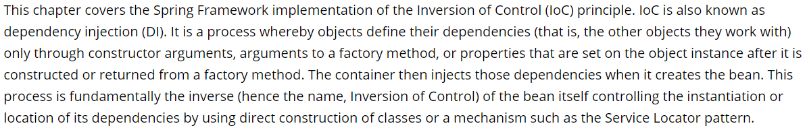
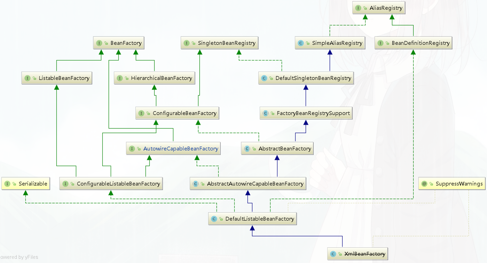

# Spring IoC源码分析

主讲老师： fox老师


## Spring整体架构


官网地址： https://spring.io/projects/spring-framework

## IoC容器的设计理念



**IoC**(Inversion of Control) 也称为**依赖注入**(dependency injection, DI)。它是一个==对象定义依赖关系的过程==，也就是说，对象只通过构造函数参数、工厂方法的参数或对象实例构造或从工厂方法返回后在对象实例上设置的属性来定义它们所使用的其他对象。然后==容器在创建bean时注入这些依赖项==。这个过程基本上是bean的逆过程，因此称为**控制反转**(IoC)

在Spring中，构成应用程序主干并由Spring IoC容器管理的对象称为**bean**。bean是由Spring IoC容器实例化、组装和管理的对象。

IoC容器设计理念：通过容器统一对象的构建方式，并且自动维护对象的依赖关系。


https://www.processon.com/view/link/5cd10507e4b085d010929d02

## IoC的应用

### 1. bean的装配方式

#### xml

```xml
<?xml version="1.0" encoding="UTF-8"?>
<beans xmlns="http://www.springframework.org/schema/beans"
       xmlns:xsi="http://www.w3.org/2001/XMLSchema-instance"
       xsi:schemaLocation="http://www.springframework.org/schema/beans
        https://www.springframework.org/schema/beans/spring-beans.xsd">

    <bean id="user"  class="bat.ke.qq.com.bean.User"/>

</beans>
```

容器加载xml

```java
ApplicationContext context = new ClassPathXmlApplicationContext("spring.xml");
```

#### @ImportResource

```java
@ImportResource("spring.xml")
public class AppConfig {

}
```

容器加载

```java
 ApplicationContext context = new AnnotationConfigApplicationContext(AppConfig.class);
```


#### 实现FactoryBean

```java
public class MyFactroyBean  implements FactoryBean {
   @Override
   public Object getObject() throws Exception {
      return new User();
   }

   @Override
   public Class<?> getObjectType() {
      return User.class;
   }
}
```

思考：==FactoryBean和BeanFactory的区别？==

```java
AbstractBeanFactory#getObjectForBeanInstance
!(beanInstance instanceof FactoryBean) || BeanFactoryUtils.isFactoryDereference(name)
```

factoryBeanObjectCache ：  缓存getObject()获取的单例

#### @Component +@ComponentScan

@ComponentScan默认扫描: @Component, @Repository，@Service, @Controller

```java
@ComponentScan("bat.ke.qq.com")
public class AppConfig {
}
```

容器加载

```java
 ApplicationContext context = new AnnotationConfigApplicationContext(AppConfig.class);
```

@CompentScan  注解扩展用法：

- 排除用法 excludeFilters  

  ```java
  @ComponentScan(basePackages = "bat.ke.qq.com",excludeFilters = {
      @ComponentScan.Filter(type = FilterType.ANNOTATION,value = {Service.class}),
      @ComponentScan.Filter(type = FilterType.ASSIGNABLE_TYPE,value = {User.class})
  })
  ```

- 包含用法 includeFilters  

  ```java
  @ComponentScan(basePackages = "bat.ke.qq.com",includeFilters = {
      @ComponentScan.Filter(type = FilterType.CUSTOM,value = {CustomTypeFilter.class})
  },useDefaultFilters = false)
  ```

  ==FilterType.CUSTOM实现自定义过滤规则==

  ```java
  public class CustomTypeFilter implements TypeFilter {
      @Override
      public boolean match(MetadataReader metadataReader, MetadataReaderFactory metadataReaderFactory) throws IOException {
          
          ClassMetadata classMetadata = metadataReader.getClassMetadata();
          if (classMetadata.getClassName().contains("Service")) {
              return true;
          }
          return false;
      }
  }
  ```

  

#### @Bean+ @Configuration

```java
@Configuration
public class AppConfig {

    @Bean
    public User user(){
        return new User();
    }

    @Bean
    public UserService userService(){
        // 调用其他@Bean方法
        return new UserService(user());
    }
}
```

思考：==配置 @Configuration和不配置的区别==？

不配置@Configuration： 当内部method bean发生彼此依赖的时候会导致多例

@Configuration的作用：

1.表明当前类是一个配置类，是方法bean的源

2.将@Configuration配置的AppConfig的BeanDefinitioin属性赋值为full类型，保证AppConfig类型可以转变为cglib类型

3.将@Configuration配置的AppConfig由普通类型转变为cglib代理类型，最后会生成cglib代理对象，通过代理对象的方法拦截器，可以解决AppConfig内部方法bean之间发生依赖调用的时候从容器中去获取，避免了多例的出现。

#### @Import

```java
@Import(value = MyImportBeanDefinitionRegistrar.class)
public class AppConfig {
}
```

- **Configuration**

导入一个或多个配置类

```java
@Configuration
public class ConfigA {

    @Bean
    public A a() {
        return new A();
    }
}

@Configuration
@Import(ConfigA.class)
public class ConfigB {

    @Bean
    public B b() {
        return new B();
    }
}
```

- **ImportSelector**

```java
public class MyImportSelector implements ImportSelector {
   @Override
   public String[] selectImports(AnnotationMetadata importingClassMetadata) {
      return new String[]{Fox.class.getName()}; 
   }
}
```

- **ImportBeanDefinitionRegistrar**

```java
public class MyImportBeanDefinitionRegistrar implements ImportBeanDefinitionRegistrar {
   @Override
   public void registerBeanDefinitions(AnnotationMetadata importingClassMetadata,BeanDefinitionRegistry registry) {
      //创建BeanDefinition
      RootBeanDefinition rootBeanDefinition = new RootBeanDefinition(Fox.class);
      // 注册到容器
      registry.registerBeanDefinition("fox",rootBeanDefinition);
   }
}
```

####  @Conditional

@Conditional是Spring4新提供的注解，它的作用是按照一定的条件进行判断，满足条件给容器注册bean。

```java
@Configuration
public class AppConfig {
  @Bean
  public Cat cat(){
     return new Cat();
  }
    
  @Bean
  @Conditional(value = MyConditional.class)
  public Fox fox(){
     return new Fox()
  }
}

public class MyConditional implements Condition {
   @Override
   public boolean matches(ConditionContext context, AnnotatedTypeMetadata metadata) {
      if(context.getBeanFactory().containsBean("cat"))
         return true;
      return false;
   }
}
```


### 2. bean的依赖注入

#### 查找方式：

- byType
- byName

#### 自动装配注解：

##### @Autowired

- @Autowired是spring自带的注解，通过`AutowiredAnnotationBeanPostProcessor`类实现的依赖注入；

- ==@Autowired是根据类型进行自动装配的==，如果需要按名称进行装配，则需要配合@Qualifier；
- @Autowired有个属性为required，可以配置为false，如果配置为false之后，当没有找到相应bean的时候，系统不会抛错；

- @Autowired可以作用在变量、setter方法、构造函数上。


##### @Resource

- @Resource是JSR250规范的实现，需要导入javax.annotation实现注入；

- @Resource是根据名称进行自动装配的，一般会指定一个name属性，==当找不到与名称匹配的bean时才按照类型进行装配==；

- @Resource可以作用在变量、setter方法上。


##### @Inject

- @Inject是JSR330 (Dependency Injection for Java)中的规范，需要导入javax.inject.Inject;实现注入。

- ==@Inject是根据类型进行自动装配的==，如果需要按名称进行装配，则需要配合@Named；

- @Inject可以作用在变量、setter方法、构造函数上。


```xml
<dependency>
    <groupId>javax.inject</groupId>
    <artifactId>javax.inject</artifactId>
    <version>1</version>
</dependency>
```

#### 注入方式及原理：

##### field

注入原理： 属性反射

```java
AbstractAutowireCapableBeanFactory#populateBean
AutowiredAnnotationBeanPostProcessor.AutowiredFieldElement#inject
>value = beanFactory.resolveDependency(desc, beanName, autowiredBeanNames, typeConverter)
>field.set(bean, value)
```

##### constructor

不配置@Autowired情况下

* 当只有一个构造器时，如果构造器入参都是bean,则会执行此构造器（参数会自动注入），如果出现非bean的入参，则会抛出NoSuchBeanDefinitionException      
*  当显示定义多个构造器时，会默认调用无参构造器，如果没有无参构造器，则会抛出 No default constructor found
* 当该bean的beanDefinition设置了AutowireMode为3后，则会选择构造器贪婪模式，选择合适的构造器列表(前提：构造器入参都是bean) 构造bean对象

```java
@Component
public class MyBeanFactoryProcessor implements BeanFactoryPostProcessor {
   @Override
   public void postProcessBeanFactory(ConfigurableListableBeanFactory beanFactory) throws BeansException {
      AbstractBeanDefinition beanDefinition = (AbstractBeanDefinition) beanFactory.getBeanDefinition("userService");
       //构造器贪婪模式
      beanDefinition.setAutowireMode(3);
   }
}
```

多构造器筛选时会先排序，构造器排序会先比较方法修饰符（Modifier），然后比较方法参数。同为public情况下，会选择参数多的构造器构造bean对象。

```java
AbstractAutowireCapableBeanFactory#createBeanInstance
ConstructorResolver#autowireConstructor
> AutowireUtils.sortConstructors(candidates)
>> ConstructorResolver#createArgumentArray    
> bw.setBeanInstance(instantiate(beanName, mbd, constructorToUse, argsToUse))
```

##### setter

不配置*@Autowired情况下*

通过设置AutowireMode为1或者2，会调用setter方法，通过setter方法注入bean

```java
// AutowireCapableBeanFactory
int AUTOWIRE_NO = 0;
int AUTOWIRE_BY_NAME = 1;
int AUTOWIRE_BY_TYPE = 2;
int AUTOWIRE_CONSTRUCTOR = 3;
```

注入原理：  方法反射

```java
AbstractAutowireCapableBeanFactory#populateBean
AutowiredAnnotationBeanPostProcessor.AutowiredMethodElement#inject
>arg = beanFactory.resolveDependency(currDesc, beanName, autowiredBeans, typeConverter)
>method.invoke(bean, arguments)
```


## IoC工作原理

https://www.processon.com/view/link/5cd10507e4b085d010929d02

### Spring源码编译

环境： idea 2018.2     gradle： 4.10.2   spring framework: 5.2.0

```shell
#下载
git clone https://github.com/spring-projects/spring-framework.git
cd spring-framework/
#编译
gradlew spring-oxm:compileTestJava

```

编译文档+fox老师本人注释的源码：

http://git.yuanmaedu.com:3000/yuanma-vip/Spring/src/master/spring-framework


### bean的注册原理

思考：==bean的属性是什么对象承载的？ bean是如何注册到容器中的？==

#### BeanDefinition

容器中的每一个 bean 都会有一个对应的 BeanDefinition 实例，该实例负责保存 bean 对象的所有必要信息，包括 bean 对象的 class 类型、是否是抽象类、构造方法和参数、其他属性等等


#### BeanDefinitionRegistry

 BeanDefinition的注册器，抽象了 bean 的注册逻辑，包括registerBeanDefinition、removeBeanDefinition、getBeanDefinition 等注册管理 BeanDefinition 的方法。

#### BeanFactory  

bean工厂，抽象了 bean 的管理逻辑，主要包含 getBean、containBean、getType、getAliases 等管理 bean 的方法。



#### DefaultListableBeanFactory

Spring IoC的核心类， 即实现了BeanFactory  ，也实现了BeanDefinitionRegistry

```java
# 注册BeanDefinition对象
public void registerBeanDefinition(String beanName, BeanDefinition beanDefinition)
			throws BeanDefinitionStoreException {}
# 注册bean对象
public void registerSingleton(String beanName, Object singletonObject) throws IllegalStateException {}
```

xml Configuration  demo

```java
//创建一个简单注册器
//BeanDefinitionRegistry register = new SimpleBeanDefinitionRegistry();
//创建一个实现了注册器的工厂  
BeanDefinitionRegistry registry = new DefaultListableBeanFactory();
//创建bean定义读取器
BeanDefinitionReader reader = new XmlBeanDefinitionReader(register);
// 创建资源读取器
//DefaultResourceLoader resourceLoader = new DefaultResourceLoader();
// 获取资源
//Resource xmlResource = resourceLoader.getResource("spring.xml");
// 装载Bean的定义
//reader.loadBeanDefinitions(xmlResource);
reader.loadBeanDefinitions("spring.xml");
// 打印构建的Bean 名称
System.out.println(Arrays.toString(register.getBeanDefinitionNames());

// 工厂调用getBean方法
System.out.println(registry.getBean("user"));
```

java Configuration  demo

```java
AnnotationConfigApplicationContext context =
      new AnnotationConfigApplicationContext(AppConfig.class);

// 通过容器获取到beanFactory  即是工厂，又是注册器
DefaultListableBeanFactory factory = context.getDefaultListableBeanFactory();

RootBeanDefinition beanDefinition = new RootBeanDefinition(Fox.class);
factory.registerBeanDefinition("fox",beanDefinition);

//beanDefinition.setAutowireMode(2);

// 填充属性
beanDefinition.getPropertyValues().add("name","fox");
```

#### 动态注册bean

==思考：如何动态的将一个普通对象交给Spring管理？==

##### BeanDefinitionRegistryPostProcessor

```java
public interface BeanDefinitionRegistryPostProcessor extends BeanFactoryPostProcessor {

	void postProcessBeanDefinitionRegistry(BeanDefinitionRegistry registry) throws BeansException;

}
```

##### ImportBeanDefinitionRegistrar

利用@Import注解实现

```java
public interface ImportBeanDefinitionRegistrar {

	public void registerBeanDefinitions(
			AnnotationMetadata importingClassMetadata, BeanDefinitionRegistry registry);

}
```

##### BeanFactoryPostProcessor

```java
public interface BeanFactoryPostProcessor {

   void postProcessBeanFactory(ConfigurableListableBeanFactory beanFactory) throws BeansException;

}
```


### IoC启动流程

AbstractApplicationContext#refresh


### BeanFactoryPostProcessor

BeanFactoryPostProcessor

BeanDefinitionRegistryPostProcessor

ConfigurationClassPostProcessor


### Bean的生命周期

#### Bean的构建流程


#### 循环依赖


#### BeanPostProcessor

Spring后置处理器贯穿整个bean的生命周期： 创建   初始化  销毁

生产bean实例过程中涉及9次调用

销毁bean实例过程中调用bean的销毁后置处理器

InstantiationAwareBeanPostProcessor
SmartInstantiationAwareBeanPostProcessor
MergedBeanDefinitionPostProcessor
BeanPostProcessor   
DestructionAwareBeanPostProcessor


自动注入@Autowired：

AutowiredAnnotationBeanPostProcessor


## Spring扩展实战

### 手写IoC

### 手写API网关

### 手写mybatis-spring中间件