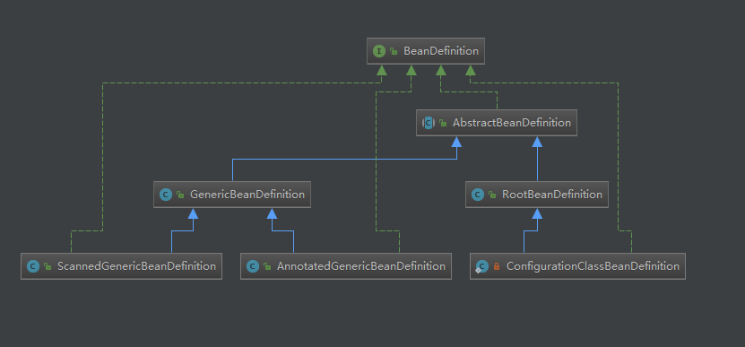
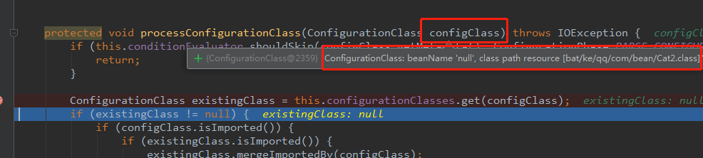
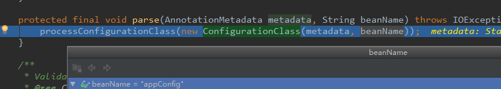
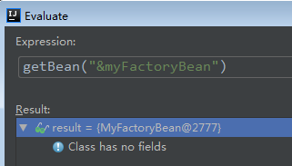
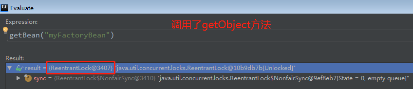

父子类怎么注册？  依赖关系里分析？


# BeanDefinitionRegistryPostProcessor

ConfigurationClassPostProcessor extends  BeanDefinitionRegistryPostProcessor

理解为什么自定义的BeanDefinitionRegistryPostProcessor接口的实现类能够执行，在哪执行？

自定义的实现类能执行是因为，注册到容器后，被执行的

在哪执行呢？如何执行的呢？

org.springframework.context.support.PostProcessorRegistrationDelegate#invokeBeanFactoryPostProcessors(org.springframework.beans.factory.config.ConfigurableListableBeanFactory, java.util.List<org.springframework.beans.factory.config.BeanFactoryPostProcessor>)

```java
public static void invokeBeanFactoryPostProcessors(
    ConfigurableListableBeanFactory beanFactory, List<BeanFactoryPostProcessor> beanFactoryPostProcessors) {
    
	if (beanFactory instanceof BeanDefinitionRegistry) {
        
//&&&&&&&&&&&&&&&&&&&&&&&&&&&&&&&&&&&&&&&&&&&&&&&&&&&&&
  //第一次操作BeanDefinitionRegistryPostProcessor，只会去操作系统自带的实现类
  //         ConfigurationClassPostProcessor
  //原因是：其它的自定义的实现类还没有在容器中，beanFactory.getBeanNamesForType 获取不到
//&&&&&&&&&&&&&&&&&&&&&&&&&&&&&&&&&&&&&&&&&&&&&&&&&&&&&
        
        // 去容器中查询是否有实现了PriorityOrdered接口的BeanDefinitionRegistryPostProcessor
			String[] postProcessorNames =
			beanFactory.getBeanNamesForType(
                BeanDefinitionRegistryPostProcessor.class, true, false);
        
			for (String ppName : postProcessorNames) {
				if (beanFactory.isTypeMatch(ppName, PriorityOrdered.class)) {
					// 只能获取 ConfigurationClassPostProcessor 
					currentRegistryProcessors.add(beanFactory.getBean(ppName, 			                             BeanDefinitionRegistryPostProcessor.class));
					processedBeans.add(ppName);
				}
			}
			sortPostProcessors(currentRegistryProcessors, beanFactory);
			registryProcessors.addAll(currentRegistryProcessors);
			// 只会调用ConfigurationClassPostProcessor#postProcessBeanDefinitionRegistry
			invokeBeanDefinitionRegistryPostProcessors
                (currentRegistryProcessors, registry);
			currentRegistryProcessors.clear();
        
//&&&&&&&&&&&&&&&&&&&&&&&&&&&&&&&&&&&&&&&&&&&&&&&&&&&&&
//无论怎么实现BeanDefinitionRegistryPostProcessor
//都无法在上面进行注册（invokeBeanDefinitionRegistryPostProcessors）操作
//因为：系统一开始只加载了5个自带的类和1个配置类，没有加载自定的实现类
//当上面的操作完成后，会注册自定的实现类，后续就会重新在bean容器中获取beanName，然后执行自定义的实现类
        
        //这就是 为什么  这里搞几遍处理的原因，如果你实现了最强优先级的PriorityOrdered接口，在下面的Ordered筛选过程中同样是比Ordered的高
        
//&&&&&&&&&&&&&&&&&&&&&&&&&&&&&&&&&&&&&&&&&&&&&&&&&&&&&        

        
			// 去容器中查询是否有实现了Ordered接口的BeanDefinitionRegistryPostProcessor
			postProcessorNames = beanFactory.getBeanNamesForType(
                BeanDefinitionRegistryPostProcessor.class, true, false);
			for (String ppName : postProcessorNames) {
				// 排除被处理过的，并且实现了Ordered接口的
				if (!processedBeans.contains(ppName) 
                    && beanFactory.isTypeMatch(ppName, Ordered.class)) {
					currentRegistryProcessors.add(beanFactory.getBean(
                        ppName, BeanDefinitionRegistryPostProcessor.class));
					processedBeans.add(ppName);
				}
			}
			sortPostProcessors(currentRegistryProcessors, beanFactory);
			registryProcessors.addAll(currentRegistryProcessors);
			invokeBeanDefinitionRegistryPostProcessors(
                currentRegistryProcessors, registry);
			currentRegistryProcessors.clear();  
        
    }
```


```java
@Component//一定交要给spring管理，才能在第二次大循环的时候find到这个bean
public class MyBeanDefinitionRegistryPostProcessor implements BeanDefinitionRegistryPostProcessor,PriorityOrdered {
   @Override
   public void postProcessBeanDefinitionRegistry(BeanDefinitionRegistry registry) throws BeansException {
		//这registry是最牛的DefaultListableBeanFactory类型
      registry.registerBeanDefinition("userService",
            new RootBeanDefinition(UserService.class));
   }

   @Override
   public void postProcessBeanFactory(ConfigurableListableBeanFactory beanFactory) throws BeansException {


   }

   @Override
   public int getOrder() {
       //系统的这里设置成了intMax
      return 0;
   }
}
```


# BeanFactoryPostProcessor--扩展点1

这个更牛逼，首先注解方式系统自带的

ConfigurationClassPostProcessor extends  BeanDefinitionRegistryPostProcessor 

但是，接口

BeanDefinitionRegistryPostProcessor extends BeanFactoryPostProcessor 

所以，系统自带的ConfigurationClassPostProcessor就实现了BeanDefinitionRegistryPostProcessor & BeanFactoryPostProcessor 两个接口


详解这个自带的实现

org.springframework.context.annotation.ConfigurationClassPostProcessor#postProcessBeanFactory

```java
// 增强@Configuration修饰的配置类    AppConfig--->AppConfig$$EnhancerBySpringCGLIB
enhanceConfigurationClasses(beanFactory);
// 添加了后置处理器 ConfigurationClassPostProcessor.ImportAwareBeanPostProcessor
beanFactory.addBeanPostProcessor(new ImportAwareBeanPostProcessor(beanFactory));
```

org.springframework.context.annotation.ConfigurationClassPostProcessor#enhanceConfigurationClasses

开始了CGlib代理

CGLib (Code Generation Library) 是一个强大的,高性能,高质量的Code生成类库。它可以在运行期扩展Java类与实现Java接口。Hibernate用它来实现PO字节码的动态生成。CGLib 比 Java 的 java.lang.reflect.Proxy 类更强的在于它不仅可以接管接口类的方法，还可以接管普通类的方法。

CGLib 的底层是Java字节码操作框架 —— [ASM](http://www.oschina.net/p/asm)。

查看 cglib 的 [JavaDoc](http://cglib.sourceforge.net/apidocs/index.html) 文档。


## 源码分析

org.springframework.context.annotation.ConfigurationClassPostProcessor#enhanceConfigurationClasses

如果在配置类上使用了@Configuration注解，则ConfigurationClass上就有个属性是full类型

```java
ConfigurationClassEnhancer enhancer = new ConfigurationClassEnhancer();
for (Map.Entry<String, AbstractBeanDefinition> entry : configBeanDefs.entrySet()) {
   AbstractBeanDefinition beanDef = entry.getValue();
   // If a @Configuration class gets proxied, always proxy the target class
   // 如果代理了@Configuration类，则始终代理目标类
   beanDef.setAttribute(AutoProxyUtils.PRESERVE_TARGET_CLASS_ATTRIBUTE, Boolean.TRUE);
   try {
      // Set enhanced subclass of the user-specified bean class
      // 设置指定bean类的增强子类型
      Class<?> configClass = beanDef.resolveBeanClass(this.beanClassLoader);
      if (configClass != null) {
         // 转换为cglib类型
         Class<?> enhancedClass = enhancer.enhance(configClass, this.beanClassLoader);
         if (configClass != enhancedClass) {
            if (logger.isTraceEnabled()) {
               logger.trace(String.format("Replacing bean definition '%s' 
                     existing class '%s' with " + "enhanced class '%s'", entry.getKey(), 
                     configClass.getName(), enhancedClass.getName()));
            }
            //这里改造了BeanDefinition的属性，将原来的class替换为增强后的enhancedClass
            beanDef.setBeanClass(enhancedClass);
         }
      }
   }
   catch (Throwable ex) {
      throw new IllegalStateException("Cannot load configuration class: " + 
                                      beanDef.getBeanClassName(), ex);
   }
}
```

创建配置类的代理类

org.springframework.context.annotation.ConfigurationClassEnhancer#enhance

```java
//先构建enhancer --> newEnhancer(configClass, classLoader)
//然后再创建代理类 --> createClass
Class<?> enhancedClass = createClass(newEnhancer(configClass, classLoader));
```

### 构建enhancer

org.springframework.context.annotation.ConfigurationClassEnhancer#newEnhancer

```java
/**
 * Creates a new CGLIB {@link Enhancer} instance.
 * 创建一个新的 CGLIB Enhancer 增强器实例,configSuperClass是要增强的配置类
 */
private Enhancer newEnhancer(Class<?> configSuperClass, @Nullable ClassLoader classLoader) {
   Enhancer enhancer = new Enhancer();
   // 设置被增强类的父类是配置类
   enhancer.setSuperclass(configSuperClass);
   // // 为增强类增加新的接口EnhancedConfiguration，主要目的是增加接口BeanFactoryAware
   enhancer.setInterfaces(new Class<?>[] {EnhancedConfiguration.class});
   enhancer.setUseFactory(false);
   enhancer.setNamingPolicy(SpringNamingPolicy.INSTANCE);
   enhancer.setStrategy(new BeanFactoryAwareGeneratorStrategy(classLoader));
   // 增强器可以理解为是对被增强类的对象进行了增强，比如在方法调用前后做拦截等等，
   // 下面的回调过滤器设置就是这个意思，CALLBACK_FILTER就相当于为被增强类增加的功能
   enhancer.setCallbackFilter(CALLBACK_FILTER);
   enhancer.setCallbackTypes(CALLBACK_FILTER.getCallbackTypes());
   return enhancer;
}
```

#### 添加拦截器-CALLBACK_FILTER

enhancer.setCallbackFilter(CALLBACK_FILTER);

```java
private static final ConditionalCallbackFilter CALLBACK_FILTER = 
    new ConditionalCallbackFilter(CALLBACKS);
```

拦截器在这里 CALLBACKS

```java
private static final Callback[] CALLBACKS = new Callback[] {
      new BeanMethodInterceptor(),
      new BeanFactoryAwareMethodInterceptor(),
      NoOp.INSTANCE
};
```

方法拦截器中只有一个intercept方法，这个方法有四个参数，obj表示代理对象，method表示目标类中的方法，args表示方法参数，proxy表示代理方法的MethodProxy对象

org.springframework.context.annotation.ConfigurationClassEnhancer.BeanMethodInterceptor#intercept

org.springframework.context.annotation.ConfigurationClassEnhancer.BeanFactoryAwareMethodInterceptor#intercept

未完待续？。。。

## @Configuration原理剖析

### @Configuration使用

官方文档描述：

用@Configuration注释类表明其主要目的是作为bean定义的源

@Configuration类允许通过调用同一类中的其他@Bean方法来定义bean之间的依赖关系。

#### 代码示例

```java
@Configuration
public class AppConfig {

    @Bean  
    public MyService myService() {
        return new MyService();
    }
    
    @Bean
    public UserService userService(){
		return new UserService(myService()); // 调用其他@Bean方法
	}
}
```

```java
public class MyService {
	public void query(){
		System.out.println("====query=");
	}
}

public class UserService {

   public UserService(MyService myService) {
      System.out.println("=====UserService Constructor======"+myService);
   }
}
```

```java
@Test
public void test(){
   AnnotationConfigApplicationContext context =
         new AnnotationConfigApplicationContext(AppConfig.class);
   System.out.println(context.getBean("myService"));
}
```

##### 配置和不配置@Configuration 的区别

配置了@Configuration ,打印结果显示  UserService 依赖的对象myService和从容器中获取的对象myService

是同一个对象。表明：UserService 依赖的对象myService是从容器中获取的，是一个bean

```
=====UserService Constructor======bat.ke.qq.com.service.MyService@9225652
bat.ke.qq.com.service.MyService@9225652  
```

没有配置@Configuration，打印结果显示 UserService 依赖的对象myService和从容器中获取的对象myService

不是同一个对象。表明：UserService依赖的对象myService 不是从容器中获取的，只是一个普通的对象

```
=====UserService Constructor======bat.ke.qq.com.service.MyService@501edcf1
bat.ke.qq.com.service.MyService@7d3a22a9
```

思考：为什么@Configuration配置和不配置会有这么大的区别？

##### 原因分析

@Configuration修饰的AppConfig是一个cglib的代理对象

```java
//bat.ke.qq.com.config.AppConfig$$EnhancerBySpringCGLIB$$c983ca26@50a638b5
System.out.println(context.getBean("appConfig")); 
```

可以看出appConfig是一个代理对象，此时调用myService()方法，会去执行BeanMethodInterceptor#intercept,

最终会从容器中获取bean

```java
new UserService(myService())
>ConfigurationClassEnhancer.BeanMethodInterceptor#intercept
>ConfigurationClassEnhancer.BeanMethodInterceptor#resolveBeanReference

Object beanInstance = (useArgs ? beanFactory.getBean(beanName, beanMethodArgs) :
						beanFactory.getBean(beanName)); //从容器中获取bean
```

所以@Configuration 保证了配置类的内部方法之间依赖调用时都从容器中获取bean。


### 创建代理类

org.springframework.context.annotation.ConfigurationClassEnhancer#createClass


AutowiredAnnotationBeanPostProcessor

CommonAnnotationBeanPostProcessor


# BeanDefinition的实现类

1、xml方式：org.springframework.beans.factory.support.GenericBeanDefinition

2、annotation-系统自带的bean：org.springframework.beans.factory.support.RootBeanDefinition

3、annotation-配置类Appconfig，@Import-ImportSelector方式org.springframework.beans.factory.annotation.AnnotatedGenericBeanDefinition

4、@ComponentScan+@Component：org.springframework.context.annotation.ScannedGenericBeanDefinition

5、@Bean  静态内部类org.springframework.context.annotation.ConfigurationClassBeanDefinitionReader.ConfigurationClassBeanDefinition



org.springframework.beans.factory.support.AbstractBeanDefinition是顶级类，可以利用多态的属性来进行管理，转换


# 注解方式的解析和注册总入口

org.springframework.context.annotation.ConfigurationClassPostProcessor#processConfigBeanDefinitions

其实也是在BeanDefinitionRegistryPostProcessor方法调用之后

# 这是注册Bean的常用方法

org.springframework.beans.factory.support.BeanDefinitionReaderUtils#registerBeanDefinition

```java
public static void registerBeanDefinition(
      BeanDefinitionHolder definitionHolder, BeanDefinitionRegistry registry)
      throws BeanDefinitionStoreException {

   // Register bean definition under primary name.
   // 根据beanName注册 (包括 id  name)
   String beanName = definitionHolder.getBeanName();
   // 注册beanDefiniton
   registry.registerBeanDefinition(beanName, definitionHolder.getBeanDefinition());

   // Register aliases for bean name, if any.
   String[] aliases = definitionHolder.getAliases();
   if (aliases != null) {
      for (String alias : aliases) {
         registry.registerAlias(beanName, alias);
      }
   }
}
```

这里底层还是调用的是BeanDefinitionRegistry#registerBeanDefinition

而这个registry一般是DefaultListableBeanFactory，所有走实现方法org.springframework.beans.factory.support.**DefaultListableBeanFactory#registerBeanDefinition**

而在**DefaultListableBeanFactory#registerBeanDefinition**中就直接put到容器中去


# xml方式解析文件的方法

AbstractBeanDefinitionReader#loadBeanDefinitions(org.springframework.core.io.Resource...)--去读取器中读取Bean   开始准备将资源读到内存中，并封装成BeanDefinition 然后注册到容器中去


# 解析注解的重要类

org.springframework.context.annotation.**ConfigurationClassPostProcessor #postProcessBeanDefinitionRegistry**   这个是总入口，就是BeanDefinitionRegistryPostProcessor的实现方法

org.springframework.context.annotation.ConfigurationClassParser  解析的


# @Import中重要的接口及其方法

org.springframework.context.annotation.ImportBeanDefinitionRegistrar#registerBeanDefinitions org.springframework.context.annotation.ImportSelector#selectImports

## ImportSelector

顾名思义是直接导入一个bean的className，方法的调用点是：org.springframework.context.annotation.ConfigurationClassParser#processImports   

这两个接口的两个方法是ImportSelector#selectImports先执行，在反射拿到实现类后就调用了

ImportSelector实现类是在解析`parser.parse(candidates);`的时候就调用了其selectImports方法，因为它没有注册功能，selectImports只是导入需要注册的bean

### 这里就会有个问题，注册的这个类是不是还有别的注解

```java
public class MyImportSelector implements ImportSelector {
   @Override
   public String[] selectImports(AnnotationMetadata importingClassMetadata) {
      return new String[]{"bat.ke.qq.com.bean.Cat2"};
   }
}
```

调用完方法后，又将导入的bean放入解析器中去解析 org.springframework.context.annotation.ConfigurationClassParser#processConfigurationClass--解析入口



第一次传进来的是配置类APPConfig    beanName是



```java
protected final void parse(AnnotationMetadata metadata, String beanName) throws IOException {
   processConfigurationClass(new ConfigurationClass(metadata, beanName));
}
```

org.springframework.context.annotation.ConfigurationClass  -- 这个就是解析的包装类


ImportBeanDefinitionRegistrar是个无返回值的，但是入参有registry  专门做注册功能的

```java
@Override
public void registerBeanDefinitions(AnnotationMetadata importingClassMetadata, BeanDefinitionRegistry registry) {

   BeanDefinition beanDefinition = new RootBeanDefinition(Cat.class);
   //beanDefinition.getPropertyValues().add("name","")
   //beanDefinition.getConstructorArgumentValues().addGenericArgumentValue("");
   //beanDefinition.setBeanClassName("bat.ke.qq.com.bean.Fox");

   registry.registerBeanDefinition("cat",beanDefinition);

}
```

# 注册一个配置类

## 用ImportSelector

这样可以通过自定义的MyImportSelector来，达到注册有个带有注解的配置类

可以成功的例子：

```java
public class MyImportSelector implements ImportSelector {
   @Override
   public String[] selectImports(AnnotationMetadata importingClassMetadata) {
      return new String[]{"bat.ke.qq.com.config.AppConfig2"};
   }
}

public class AppConfig2 {	
	@Bean
	public Cat2 johnson(){
        //这里的Cat2一样会被注册，因为走了内部的解析注解的模式
		return new Cat2();
	}

}
```

上面成功的原因就是@Import注解对ImportSelector的实现类的处理，有个循环很关键org.springframework.context.annotation.ConfigurationClassParser#processImports

## 用注册功能的BeanDefinitionRegistryPostProcessor或者ImportBeanDefinitionRegistrar都是注册的bean，并不会走注解的注册

我们利用BeanDefinitionRegistryPostProcessor注册的就是已经注册了的，走的是自定义的postProcessBeanFactory方法，而不是有解析注解功能的org.springframework.context.annotation.ConfigurationClassPostProcessor#processConfigBeanDefinitions


# bean的注册不是实例化，只是注册

所以在使用@Bean的时候，只是注册了，并不会调用方法，只有实例化的时候才会调用该方法


# FactoryBean和BeanFactory

```
getBean("&myFactoryBean")

```



```
getBean("myFactoryBean") 
```




获取的关键入口

org.springframework.beans.factory.support.AbstractBeanFactory#getObjectForBeanInstance


