[官网地址](https://spring.io/projects/spring-framework)


# 产生IOC的原因

传统的对象创建和依赖管理存在问题

①  有可能重复多次的被创建，造成资源浪费

②依赖关系复杂，不利于扩展和管理

依赖关系复杂的原因是，对象内部的依赖大部分都是通过===**new**===的方式进行引用的


早期的解决方案：

使用单例+工厂创建对象，对象放入缓存，不会造成资源浪费；

使用外部传参的 方式注入依赖关系；--  setter方法传参，构造器Constructor传参， 属性反射


**IOC的理念：通过容器统一对象的构建方式，并且自动维护对象的依赖关系。**


**IoC**(Inversion of Control) 也称为**依赖注入**(dependency injection, DI)。它是一个==对象定义依赖关系的过程==，也就是说，对象只通过构造函数参数、工厂方法的参数或对象实例构造或从工厂方法返回后在对象实例上设置的属性来定义它们所使用的其他对象。然后==容器在创建bean时注入这些依赖项==。这个过程基本上是bean的逆过程，因此称为**控制反转**(IoC)

在Spring中，构成应用程序主干并由Spring IoC容器管理的对象称为**bean**。bean是由Spring IoC容器实例化、组装和管理的对象。


luban大纲

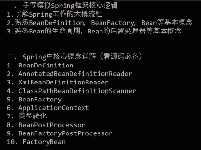


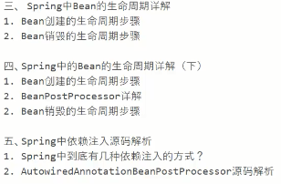


# bean的注册

[IOC整个流程图](https://www.processon.com/view/link/5cd10507e4b085d010929d02)  就是【[IoC整体图](springIOC.assets/IoC整体图.jpg)】

bean的属性是什么对象承载的(BeanDefinition)？

 bean是如何注册到容器中的(BeanDefinitionRegistry)？

IOC容器到底是什么数据结构？

(DefaultListableBeanFactory.ConcurrentHashMap<String, BeanDefinition>(256))


## BeanDefinition

封装了Bean的属性     BeanDefinition是接口，其实现类是org.springframework.beans.factory.support.**RootBeanDefinition**

容器中的每一个 bean 都会有一个对应的 BeanDefinition 实例，该实例负责保存 bean 对象的所有必要信息，包括 bean 对象的 class 类型、是否是抽象类、构造方法和参数、其他属性等等


## BeanDefinitionRegistry

注册BeanDefinition

BeanDefinition的注册器，抽象了 bean 的**注册**逻辑，包括registerBeanDefinition、removeBeanDefinition、getBeanDefinition 等注册管理 BeanDefinition 的方法。


## BeanFactory  

bean工厂，抽象了 bean 的**管理**逻辑，主要包含 getBean、containBean、getType、getAliases 等管理 bean 的方法。

**AbstractApplicationContext 这个里面的属性BeanFactory   的  实现类就是   DefaultListableBeanFactory**

注解的


## DefaultListableBeanFactory

**IOC存放对象的容器**：org.springframework.beans.factory.support.DefaultListableBeanFactory#beanDefinitionMap

```java
// beanName----beanDefinition
private final Map<String, BeanDefinition> beanDefinitionMap 
    = new ConcurrentHashMap<>(256);
```


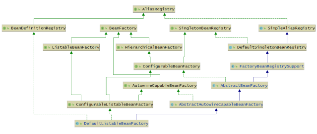

这个牛图的每个接口的功能

1. AliasRegistry：支持别名功能，一个名字可以对应多个别名
2. BeanDefinitionRegistry：可以注册、保存、移除、获取某个BeanDefinition
3. BeanFactory：Bean工厂，可以根据某个bean的名字、或类型、或别名获取某个Bean对象
4. SingletonBeanRegistry：可以直接注册、获取某个**单例**Bean
5. SimpleAliasRegistry：它是一个类，实现了AliasRegistry接口中所定义的功能，支持别名功能
6. ListableBeanFactory：在BeanFactory的基础上，增加了其他功能，可以获取所有BeanDefinition的beanNames，可以根据某个类型获取对应的beanNames，可以根据某个类型获取{类型：对应的Bean}的映射关系
7. HierarchicalBeanFactory：在BeanFactory的基础上，添加了获取父BeanFactory的功能
8. DefaultSingletonBeanRegistry：它是一个类，实现了SingletonBeanRegistry接口，拥有了直接注册、获取某个**单例**Bean的功能
9. ConfigurableBeanFactory：在HierarchicalBeanFactory和SingletonBeanRegistry的基础上，添加了设置父BeanFactory、类加载器（表示可以指定某个类加载器进行类的加载）、设置Spring EL表达式解析器（表示该BeanFactory可以解析EL表达式）、设置类型转化服务（表示该BeanFactory可以进行类型转化）、可以添加BeanPostProcessor（表示该BeanFactory支持Bean的后置处理器），可以合并BeanDefinition，可以销毁某个Bean等等功能
10. FactoryBeanRegistrySupport：支持了FactoryBean的功能
11. AutowireCapableBeanFactory：是直接继承了BeanFactory，在BeanFactory的基础上，支持在创建Bean的过程中能对Bean进行自动装配
12. AbstractBeanFactory：实现了ConfigurableBeanFactory接口，继承了FactoryBeanRegistrySupport，这个BeanFactory的功能已经很全面了，但是不能自动装配和获取beanNames
13. ConfigurableListableBeanFactory：继承了ListableBeanFactory、AutowireCapableBeanFactory、ConfigurableBeanFactory
14. AbstractAutowireCapableBeanFactory：继承了AbstractBeanFactory，实现了AutowireCapableBeanFactory，拥有了自动装配的功能
15. DefaultListableBeanFactory：继承了AbstractAutowireCapableBeanFactory，实现了ConfigurableListableBeanFactory接口和BeanDefinitionRegistry接口，所以DefaultListableBeanFactory的功能很强大


## 创建容器beanDefinitionMap

在主流程中，直接new出了容器

注解方式： 

org.springframework.context.annotation.AnnotationConfigApplicationContext#AnnotationConfigApplicationContext   初始化   **走了父类GenericApplicationContext的无参构造器**

org.springframework.context.support.GenericApplicationContext#GenericApplicationContext()


xml方式创建容器：

org.springframework.context.support.AbstractApplicationContext#refresh
org.springframework.context.support.AbstractApplicationContext#obtainFreshBeanFactory

```
//xml方式在这里创建，注解方式早就创建好了，这里只是获取
ConfigurableListableBeanFactory beanFactory = obtainFreshBeanFactory();
```

org.springframework.context.support.AbstractRefreshableApplicationContext#refreshBeanFactory
org.springframework.context.support.AbstractRefreshableApplicationContext#createBeanFactory


## 如何将Bean注册到容器

### 装配Bean的方式？

#### 一、xml

#### 二、实现接口BeanDefinitionRegistryPostProcessor

`org.springframework.beans.factory.support.BeanDefinitionRegistryPostProcessor`

##### 注解方式

@ImportResource
@Componet+@CompoentScan
@Import
@Configuration + @Bean
@Conditional

new AnnotationConfigApplicationContext(AppConfig.class);

**本质**：系统注册了一个BeanDefinitionRegistryPostProcessor接口的实现类ConfigurationClassPostProcessor所以本质还是由于BeanDefinitionRegistryPostProcessor接口注册的

##### 自定义实现类

```java
@Component
public class MyBeanDefinitionRegistryPostProcessor implements BeanDefinitionRegistryPostProcessor {
   @Override
   public void postProcessBeanDefinitionRegistry(BeanDefinitionRegistry registry) throws BeansException {

      registry.registerBeanDefinition("userService",
            new RootBeanDefinition(UserService.class));
   }

   @Override
   public void postProcessBeanFactory(ConfigurableListableBeanFactory beanFactory) throws BeansException {


   }
}
```

#### 三、实现接口BeanFactoryPostProcessor

##### 系统自带

的注解方式的ConfigurationClassPostProcessor implements BeanDefinitionRegistryPostProcessor

但是BeanDefinitionRegistryPostProcessor 又extends  BeanFactoryPostProcessor

所以系统自带的也实现了BeanFactoryPostProcessor#postProcessBeanFactory方法

```java
// 增强@Configuration修饰的配置类    AppConfig--->AppConfig$$EnhancerBySpringCGLIB
enhanceConfigurationClasses(beanFactory);
// 添加了后置处理器 ConfigurationClassPostProcessor.ImportAwareBeanPostProcessor
beanFactory.addBeanPostProcessor(new ImportAwareBeanPostProcessor(beanFactory));
```

系统自带的 这个实现，并没有注册任何东西，主要是把@Configuration修饰的配置类进行了CGlib代理

然后添加了一个后置处理器

##### 自定义-可以进行注册

因为BeanFactoryPostProcessor#postProcessBeanFactory入参有个BeanFactory

而主流程中会将DefaultListableBeanFactory传入，所以有注册功能，还有BeanFactory的功能，很牛逼的一个处理器

```java
@Component  //这里同样要交给spring管理，才能进行处理
public class MyBeanFactoryPostProcessor implements BeanFactoryPostProcessor {
   @Override
   public void postProcessBeanFactory(ConfigurableListableBeanFactory beanFactory) throws BeansException {

      //((DefaultListableBeanFactory) beanFactory).registerSingleton("cat",new Cat());


      BeanDefinition cat = beanFactory.getBeanDefinition("cat");
      cat.setBeanClassName("bat.ke.qq.com.bean.Fox");
      // 承载bean的属性的    class.newInstance()
      AbstractBeanDefinition beanDefinition = (AbstractBeanDefinition) beanFactory.getBeanDefinition("user");
      // user -->cat  Cat.newInstance()   bat.ke.qq.com.bean.Cat@3c407114
      //beanDefinition.setBeanClassName("bat.ke.qq.com.bean.Cat");

      // 构造器贪婪模式
      // Autowiring mode  自动装配模式    xml     setter  constructor
      // @Autowired  field.set    setter  constructor
      //beanDefinition.setAutowireMode(3);

      // 属性填充
      beanDefinition.getPropertyValues().add("name","cat");

      beanDefinition.getPropertyValues().add("age",30);
//    beanDefinition.getPropertyValues().add("cat", cat);


      beanFactory.addBeanPostProcessor(new MyInstantiationAwareBeanPostProcessor());


      beanFactory.registerSingleton("userService",new UserService());
   }
}
```


#### 四、使用context的直接手动注册

context.registerBeanDefinition

```java
@Test
public void testManualRegistryBeanDefinition() {
    //这里一定要分开执行
   AnnotationConfigApplicationContext context = new AnnotationConfigApplicationContext();
   context.register(AppConfig.class);
   context.registerBeanDefinition("manualRegistryBeanDefinition",
         new RootBeanDefinition(A.class));
   context.refresh();

   System.out.println(context.getBean("manualRegistryBeanDefinition"));
}
```

#### 五、注解方式

@Component

@Bean

@Import


### registerBeanDefinition

这是注册Bean的常用方法

org.springframework.beans.factory.support.BeanDefinitionReaderUtils#registerBeanDefinition

**注册的关键方法**

```java
public static void registerBeanDefinition(
      BeanDefinitionHolder definitionHolder, BeanDefinitionRegistry registry)
      throws BeanDefinitionStoreException {

   // Register bean definition under primary name.
   // 根据beanName注册 (包括 id  name)
   String beanName = definitionHolder.getBeanName();
   // 注册beanDefiniton  用了BeanDefinitionRegistry的注册功能
   registry.registerBeanDefinition(beanName, definitionHolder.getBeanDefinition());

   // Register aliases for bean name, if any.
   String[] aliases = definitionHolder.getAliases();
   if (aliases != null) {
      for (String alias : aliases) {
         registry.registerAlias(beanName, alias);
      }
   }
}
```

org.springframework.beans.factory.support.DefaultListableBeanFactory#registerBeanDefinition

在这里直接put到容器中

```java
this.beanDefinitionMap.put(beanName, beanDefinition);
```

### xml

加载xml配置文件

```xml
<?xml version="1.0" encoding="UTF-8"?>
<beans xmlns="http://www.springframework.org/schema/beans"
       xmlns:xsi="http://www.w3.org/2001/XMLSchema-instance"
       xsi:schemaLocation="http://www.springframework.org/schema/beans
        https://www.springframework.org/schema/beans/spring-beans.xsd">

   <bean name="ant" class="bat.ke.qq.com.bean.Ant"/>
   <bean class="bat.ke.qq.com.bean.MyBeanFactoryPostProcessor" 	
         name="myBeanFactoryPostProcessor"/>

</beans>
```

```java
ApplicationContext context = new ClassPathXmlApplicationContext("spring.xml");
```

org.springframework.context.support.   都是这个包下的

ClassPathXmlApplicationContext#ClassPathXmlApplicationContext(s)

AbstractApplicationContext#refresh

**AbstractApplicationContext#obtainFreshBeanFactory   从主干上来说，这里之后就已经注册完成了**

**AbstractRefreshableApplicationContext#refreshBeanFactory** -- xml方式：创建了容器，并加载配置文件中的bean

```java
@Override
protected final void refreshBeanFactory() throws BeansException {
   // 如果存在beanFactory，销毁单例bean ，关闭beanFactory
   if (hasBeanFactory()) {
      destroyBeans();
      closeBeanFactory();
   }
   try {
      DefaultListableBeanFactory beanFactory = createBeanFactory();
      beanFactory.setSerializationId(getId());
      // 定制beanFactory，设置参数
      customizeBeanFactory(beanFactory);
      // 注册spring的xml配置的bean到beanFactory，此时容器还未指定beanFactory
      loadBeanDefinitions(beanFactory);
      // 给容器指定beanFactory
      synchronized (this.beanFactoryMonitor) {
         this.beanFactory = beanFactory;
      }
   }
   catch (IOException ex) {
      throw new ApplicationContextException("I/O error parsing bean definition source for " + getDisplayName(), ex);
   }
}
```

AbstractXmlApplicationContext#loadBeanDefinitions(DefaultListableBeanFactory)   -- 回到了AbstractXmlApplicationContext

AbstractXmlApplicationContext#loadBeanDefinitions(XmlBeanDefinitionReader)

#### 解析配置文件

**AbstractBeanDefinitionReader#loadBeanDefinitions(org.springframework.core.io.Resource...)--去读取器中读取Bean   开始准备将资源读到内存中，并封装成BeanDefinition 然后注册到容器中去**


org.springframework.beans.factory.xml.

DefaultBeanDefinitionDocumentReader#doRegisterBeanDefinitions


org.springframework.beans.factory.xml.DefaultBeanDefinitionDocumentReader#parseBeanDefinitions


org.springframework.beans.factory.xml.DefaultBeanDefinitionDocumentReader#parseDefaultElement

**解析的关键点org.springframework.beans.factory.xml.DefaultBeanDefinitionDocumentReader#processBeanDefinition**

#### BeanDefinition的实现类

org.springframework.beans.factory.support.GenericBeanDefinition

##### 过程：

org.springframework.beans.factory.xml.DefaultBeanDefinitionDocumentReader#processBeanDefinition

org.springframework.beans.factory.xml.BeanDefinitionParserDelegate#parseBeanDefinitionElement(org.w3c.dom.Element)

org.springframework.beans.factory.xml.BeanDefinitionParserDelegate#parseBeanDefinitionElement(org.w3c.dom.Element, org.springframework.beans.factory.config.BeanDefinition)

org.springframework.beans.factory.xml.BeanDefinitionParserDelegate#parseBeanDefinitionElement(org.w3c.dom.Element, java.lang.String, org.springframework.beans.factory.config.BeanDefinition)

org.springframework.beans.factory.xml.BeanDefinitionParserDelegate#createBeanDefinition

org.springframework.beans.factory.support.BeanDefinitionReaderUtils#createBeanDefinition

```
GenericBeanDefinition bd = new GenericBeanDefinition();
```


#### 注册bean

**org.springframework.beans.factory.support.BeanDefinitionReaderUtils#registerBeanDefinition**


总结就是，解析bean循环注册bean-----

循环在：org.springframework.beans.factory.xml.DefaultBeanDefinitionDocumentReader#parseBeanDefinitions

注册在：org.springframework.beans.factory.support.BeanDefinitionReaderUtils#registerBeanDefinition


### Annotation

关键方法入口org.springframework.context.support

.**AbstractApplicationContext#invokeBeanFactoryPostProcessors**

该方法主要处理两类接口：BeanFactoryPostProcessor接口和BeanDefinitionRegistryPostProcessor接口


在这里注册了系统自带的5个bean

org.springframework.context.annotation.AnnotationConfigApplicationContext#AnnotationConfigApplicationContext()

```java
class ConfigurationClassPostProcessor implements BeanDefinitionRegistryPostProcessor,
		PriorityOrdered, ResourceLoaderAware, BeanClassLoaderAware, EnvironmentAware
class AutowiredAnnotationBeanPostProcessor extends 		 	
    InstantiationAwareBeanPostProcessorAdapter
		implements MergedBeanDefinitionPostProcessor, PriorityOrdered, BeanFactoryAware
class CommonAnnotationBeanPostProcessor extends InitDestroyAnnotationBeanPostProcessor
		implements InstantiationAwareBeanPostProcessor, BeanFactoryAware, Serializable
class EventListenerMethodProcessor
		implements SmartInitializingSingleton, ApplicationContextAware, 	
			BeanFactoryPostProcessor
class DefaultEventListenerFactory implements EventListenerFactory, Ordered
```

#### 注册系统 自带的bean的过程

org.springframework.context.annotation.  都在这个包下

AnnotatedBeanDefinitionReader#AnnotatedBeanDefinitionReader(.BeanDefinitionRegistry, Environment)

AnnotationConfigUtils#registerAnnotationConfigProcessors(BeanDefinitionRegistry，null)

```java
public static final String CONFIGURATION_ANNOTATION_PROCESSOR_BEAN_NAME =		"org.springframework.context.annotation.internalConfigurationAnnotationProcessor";
//注意这里的beanname是不存在的，造了个假的来代替ConfigurationClassPostProcessor
if (!registry.containsBeanDefinition(CONFIGURATION_ANNOTATION_PROCESSOR_BEAN_NAME)) {
   RootBeanDefinition def = new RootBeanDefinition(ConfigurationClassPostProcessor.class);
   def.setSource(source);
   // 注册 ConfigurationClassPostProcessor
   beanDefs.add(registerPostProcessor(registry, def, CONFIGURATION_ANNOTATION_PROCESSOR_BEAN_NAME));
}
```

同理注册了其它四个bean

##### BeanDefinition的实现类

org.springframework.beans.factory.support.RootBeanDefinition

```java
RootBeanDefinition def = new RootBeanDefinition(ConfigurationClassPostProcessor.class);
```

#### 注册配置类 AppConfig

org.springframework.context.annotation.AnnotationConfigApplicationContext#register

##### BeanDefinition的实现类

org.springframework.beans.factory.annotation.AnnotatedGenericBeanDefinition

```java
AnnotatedGenericBeanDefinition abd = new AnnotatedGenericBeanDefinition(annotatedClass);
```


**到主流程的obtainFreshBeanFactory方法后，bean容器中就已经有6个BeanDefinition了**


主流程的关键入口

org.springframework.context.support.

#### ①invokeBeanFactoryPostProcessors

org.springframework.context.support.AbstractApplicationContext#invokeBeanFactoryPostProcessors

```java
protected void invokeBeanFactoryPostProcessors(ConfigurableListableBeanFactory beanFactory) {
   // getBeanFactoryPostProcessors(): 拿到当前应用上下文beanFactoryPostProcessors---这里拿到的是手动通过context.registerBeanPostProcessors()进来的
   // 目前是拿不到任何 @Component配置的和系统自带（ConfigurationClassPostProcessor）的BeanFactoryPostProcessor
   // 因为这里还没有扫描到任何bean，且 ConfigurationClassPostProcessor 这个还只是个BeanDefinitionName，没有注册进来

   PostProcessorRegistrationDelegate.invokeBeanFactoryPostProcessors(beanFactory, getBeanFactoryPostProcessors());
// 。。。。。。。。
   }
}
```

#### ②invokeBeanFactoryPostProcessors

org.springframework.context.support.PostProcessorRegistrationDelegate #invokeBeanFactoryPostProcessors

```java
/**
* 先明确  BeanDefinitionRegistryPostProcessor extends BeanFactoryPostProcessor
* 实现了BeanDefinitionRegistryPostProcessor 就会实现  BeanFactoryPostProcessor
* 按照功能   BeanDefinitionRegistryPostProcessor 负责注册BeanDefinition
* 			BeanFactoryPostProcessor负责修改注册后的BeanDefinition属性
*
* 	这里就按照这个功能区分为两大类，先执行注册 BeanDefinition 功能的，再执行修改 BeanDefinition 功能的
*   然后每个大类里面有按照顺序执行：手动context.registry的  >   PriorityOrdered  >  	Ordered  >   剩下的其它
*
*   最后再考虑到注册功能的，注册的BeanDefinition有可能也是个  BeanDefinitionRegistryPostProcessor  ,最后再来一个循环递归统一处理
*
* */

```


```txt

一、BeanDefinitionRegistryPostProcessor 大类中的

1、 手动context.registry 的 小类
2、 PriorityOrdered 小类
3、 Ordered 小类
4、 其它类的  和  上面新增的
5、6、7、8、手动context.registry的 > PriorityOrdered > Ordered > 剩下的其它和前面新增的 小类

二、BeanFactoryPostProcessor 大类中的

9、 手动context.registry的  并且 只实现了 BeanFactoryPostProcessor接口 的 小类
10、PriorityOrdered 的  并且 只实现了 BeanFactoryPostProcessor接口 的 小类
11、Ordered 的 并且 只实现了 BeanFactoryPostProcessor接口 的 小类
12、普通的,其它情况 的 并且 只实现了 BeanFactoryPostProcessor接口 的 小类	 	 
```


#### 解析注解和注册bean的关键---方法入口

- [x] 都源于注解方式的容器自动注册了BeanDefinitionRegistryPostProcessor接口的实现类ConfigurationClassPostProcessor
- [x] 如果自定义了一个BeanDefinitionRegistryPostProcessor的实现类，同样可以触发注册

由于有BeanDefinitionRegistryPostProcessor接口的实现类，所以在方法 `org.springframework.context.support.PostProcessorRegistrationDelegate#invokeBeanFactoryPostProcessors`中会有注册入口`org.springframework.context.support.PostProcessorRegistrationDelegate#invokeBeanDefinitionRegistryPostProcessors`

```java
private static void invokeBeanDefinitionRegistryPostProcessors(
      Collection<? extends BeanDefinitionRegistryPostProcessor> postProcessors, BeanDefinitionRegistry registry) {

   // ConfigurationClassPostProcessor  循环处理每个BeanDefinitionRegistryPostProcessor的实现类---这个是注解注册的 最外层循环--每个大BeanDefinitionRegistryPostProcessor实现类
   for (BeanDefinitionRegistryPostProcessor postProcessor : postProcessors) {
       //如果自定义--也是调了实现类的这个方法，这里面有注册器--这个注册器是DefaultListableBeanFactory类型的，随便用
      postProcessor.postProcessBeanDefinitionRegistry(registry);
   }
}
```

org.springframework.context.annotation.ConfigurationClassPostProcessor #postProcessBeanDefinitionRegistry

org.springframework.context.annotation.ConfigurationClassPostProcessor #processConfigBeanDefinitions

```java
//解析入口  -- 这里有个特例@Component bean注册到容器  在这里注册完成了
// 解析配置类  @ComponentScan (@Component bean注册到容器) @Import @ImportResource @Bean
parser.parse(candidates);

//注册入口
// 注册bean到容器
// 注册实现了ImportSelector的bean
// 方法bean注册到容器  @Bean
// @ImportResource("spring.xml") 配置的bean注册到容器
// 实现ImportBeanDefinitionRegistrar的bean 注册到容器
this.reader.loadBeanDefinitions(configClasses);
```


#### 解析

org.springframework.context.annotation.ConfigurationClassParser#doProcessConfigurationClass

##### 一、解析@ComponentScan +注册被@Component修饰的bean

```java
// Process any @ComponentScan annotations
//  处理@ComponentScan   将@Component修饰的bean注册到容器
Set<AnnotationAttributes> componentScans = AnnotationConfigUtils.attributesForRepeatable(
      sourceClass.getMetadata(), ComponentScans.class, ComponentScan.class);
if (!componentScans.isEmpty() &&
      !this.conditionEvaluator.shouldSkip(sourceClass.getMetadata(), ConfigurationPhase.REGISTER_BEAN)) {
   for (AnnotationAttributes componentScan : componentScans) {
      // The config class is annotated with @ComponentScan -> perform the scan immediately
      // @ComponentScan扫描bean,返回@Component修饰的BeanDefinitionHolder 集合，并且
      // 会将bean注册到容器
      Set<BeanDefinitionHolder> scannedBeanDefinitions =
            this.componentScanParser.parse(componentScan, sourceClass.getMetadata().getClassName());
      // Check the set of scanned definitions for any further config classes and parse recursively if needed
      for (BeanDefinitionHolder holder : scannedBeanDefinitions) {
         BeanDefinition bdCand = holder.getBeanDefinition().getOriginatingBeanDefinition();
         if (bdCand == null) {
            bdCand = holder.getBeanDefinition();
         }
         if (ConfigurationClassUtils.checkConfigurationClassCandidate(bdCand, this.metadataReaderFactory)) {
            parse(bdCand.getBeanClassName(), holder.getBeanName());
         }
      }
   }
}
```

org.springframework.context.annotation.ConfigurationClassParser#parse(org.springframework.core.type.AnnotationMetadata, java.lang.String)

org.springframework.context.annotation.ClassPathBeanDefinitionScanner#doScan

两个入口：

找@Component修饰的类：findCandidateComponents->scanCandidateComponents    

注册@Component修饰的Bean：registerBeanDefinition

findCandidateComponents后，是个`Set<BeanDefinition>`集合

遍历集合注册`BeanregisterBeanDefinition`候选的bean

###### 找@Component修饰的类

org.springframework.context.annotation.ClassPathScanningCandidateComponentProvider#scanCandidateComponents

```java
//把传进来的包路径封装一下  classpath*:bat/ke/qq/com/**/*.class   找包路径下的所有class
String packageSearchPath = ResourcePatternResolver.CLASSPATH_ALL_URL_PREFIX +
      resolveBasePackage(basePackage) + '/' + this.resourcePattern;
//获取包路径下所有的class文件
Resource[] resources = getResourcePatternResolver().getResources(packageSearchPath);
//....遍历找
if (isCandidateComponent(metadataReader)) { //判断是否包含@Component
    //大概的意思就是获取类上注解的元数据然后判断是否是@component 并且排除配置类AppConfig
    
}
//备注：用于过滤的类org.springframework.context.annotation.ClassPathBeanDefinitionScanner
//父类是org.springframework.context.annotation.ClassPathScanningCandidateComponentProvider
```

###### BeanDefinition的实现类

装载bean是用ScannedGenericBeanDefinition修饰的--是BeanDefinition的实现类

```
放在容器Set<BeanDefinition> candidates = new LinkedHashSet<>();中
```


###### 注册@Component修饰的Bean

org.springframework.context.annotation.ClassPathBeanDefinitionScanner#registerBeanDefinition

```java
//注册bean的常规用法  
BeanDefinitionReaderUtils.registerBeanDefinition(definitionHolder, registry);
```

org.springframework.beans.factory.support.BeanDefinitionReaderUtils#registerBeanDefinition


父类怎么注册？


##### 二、解析@Import

```java
@Target(ElementType.TYPE)
@Retention(RetentionPolicy.RUNTIME)
@Documented
public @interface Import {

   /**定义了两种内容：ImportSelector  ImportBeanDefinitionRegistrar  两种接口
   
   
    *方法：ImportBeanDefinitionRegistrar#registerBeanDefinitions
    *方法：ImportSelector#selectImports
    * {@link Configuration}, {@link ImportSelector}, {@link ImportBeanDefinitionRegistrar}
    * or regular component classes to import.
    */
   Class<?>[] value();

}
```


```java
@Import({MyImportBeanDefinitionRegistrar.class, MyImportSelector.class})
```


```java
// Process any @Import annotations
// 处理@Import   implements ImportSelector  并不会将bean注册到容器
processImports(configClass, sourceClass, getImports(sourceClass), true);
```

主流程中有两个入口

找@Import

org.springframework.context.annotation.ConfigurationClassParser#getImports

和处理Import的内容

org.springframework.context.annotation.ConfigurationClassParser#processImports

###### 找@Import

org.springframework.context.annotation.ConfigurationClassParser#collectImports

```java
private void collectImports(SourceClass sourceClass, Set<SourceClass> imports, Set<SourceClass> visited)
      throws IOException {

   if (visited.add(sourceClass)) {
      for (SourceClass annotation : sourceClass.getAnnotations()) {
         String annName = annotation.getMetadata().getClassName();
         if (!annName.startsWith("java") && !annName.equals(Import.class.getName())) {
            collectImports(annotation, imports, visited);
         }
      }
      imports.addAll(sourceClass.getAnnotationAttributes(Import.class.getName(), "value"));
   }
}
```

###### 解析@Import--处理内容

org.springframework.context.annotation.ConfigurationClassParser#processImports

处理都只是反射拿到实现类，放入容器org.springframework.context.annotation.ConfigurationClass#importBeanDefinitionRegistrars

```java
private final Map<ImportBeanDefinitionRegistrar, AnnotationMetadata> importBeanDefinitionRegistrars =
      new LinkedHashMap<>();
```

###### 处理ImportBeanDefinitionRegistrar

```java
// Candidate class is an ImportBeanDefinitionRegistrar ->
// delegate to it to register additional bean definitions
Class<?> candidateClass = candidate.loadClass();
////反射拿到实现类 bat.ke.qq.com.bean.MyImportBeanDefinitionRegistrar
ImportBeanDefinitionRegistrar registrar =
      BeanUtils.instantiateClass(candidateClass, ImportBeanDefinitionRegistrar.class);
ParserStrategyUtils.invokeAwareMethods(
      registrar, this.environment, this.resourceLoader, this.registry);
//存起来
configClass.addImportBeanDefinitionRegistrar(registrar, currentSourceClass.getMetadata());
```


###### 处理ImportSelector

```java
Class<?> candidateClass = candidate.loadClass();
ImportSelector selector = BeanUtils.instantiateClass(candidateClass, ImportSelector.class);
ParserStrategyUtils.invokeAwareMethods(
      selector, this.environment, this.resourceLoader, this.registry);
if (selector instanceof DeferredImportSelector) {
   this.deferredImportSelectorHandler.handle(
         configClass, (DeferredImportSelector) selector);
}
else {
   // implements ImportSelector
    //拿到导入的 bean的类名  调用了实现类的selectImports方法
   String[] importClassNames = selector.selectImports(currentSourceClass.getMetadata());
   Collection<SourceClass> importSourceClasses = asSourceClasses(importClassNames);
   //再进入for循环---防止导入的bean上也有其它的注解
   processImports(configClass, currentSourceClass, importSourceClasses, false);
}
```

这里导入的bean如果没有任何注解修饰，则进入else方法

```java
// Candidate class not an ImportSelector or ImportBeanDefinitionRegistrar ->
// process it as an @Configuration class
this.importStack.registerImport(
      currentSourceClass.getMetadata(), candidate.getMetadata().getClassName());
//导入的bean放入解析器中去解析 --为的是导入的bean上可能有别的注解，所以需要重新走一遍（扫描一遍）
//这个for循环中只有ImportBeanDefinitionRegistrar能进行 注册
//导入的bean如果实现ImportBeanDefinitionRegistrar接口直接进行了注册了--但是这里还没有调接口的方法，没有执行注册方法
processConfigurationClass(candidate.asConfigClass(configClass));
```

这里走到了注解解析的入口了，传入的是本次导入的className[]


##### 三、解析@ImportResource("/spring.xml") 

```java
// Process any @ImportResource annotations
// 处理@ImportResource   bean不会注册到容器
AnnotationAttributes importResource =
      AnnotationConfigUtils.attributesFor(sourceClass.getMetadata(), ImportResource.class);
if (importResource != null) {
   String[] resources = importResource.getStringArray("locations");
   Class<? extends BeanDefinitionReader> readerClass = importResource.getClass("reader");
   for (String resource : resources) {
      String resolvedResource = this.environment.resolveRequiredPlaceholders(resource);
      //将spring,xml  String 保存起来还没有解析其内容，只是解析了注解
       configClass.addImportedResource(resolvedResource, readerClass);
   }
}
```


##### 四、解析@Bean

```java
// Process individual @Bean methods
// 处理 bean method    bean不会注册到容器
Set<MethodMetadata> beanMethods = retrieveBeanMethodMetadata(sourceClass);
for (MethodMetadata methodMetadata : beanMethods) {
   configClass.addBeanMethod(new BeanMethod(methodMetadata, configClass));
}
```

查找配置文件中所有的@Bean

org.springframework.context.annotation.ConfigurationClassParser#retrieveBeanMethodMetadata

找完后直接将找到的方法放入configClass的属性beanMethod中


#### 待注册的bean：`Set<ConfigurationClass>`

```java
Set<ConfigurationClass> configClasses = new LinkedHashSet<>(parser.getConfigurationClasses());
```


```java
private final Map<ConfigurationClass, ConfigurationClass> configurationClasses = new LinkedHashMap<>();
```

##### bean注册和解析的中间对象

org.springframework.context.annotation.ConfigurationClass

**一个ConfigurationClass代表一个配置类，而每个配置类上的不同的注解就是这个配置类的属性**

不同的注解方式放在不同的属性中


#### 注册

org.springframework.context.annotation.ConfigurationClassBeanDefinitionReader  #loadBeanDefinitions  --- 循环注册ConfigurationClass

org.springframework.context.annotation.ConfigurationClassBeanDefinitionReader #loadBeanDefinitionsForConfigurationClass

##### 一、注册@ComponentScan (@Component bean注册到容器)  已经在解析的时候做完了


##### 二、注册@Import

###### ImportSelector

从解析过来的，已经执行了自定义的ImportSelector实现类的方法selectImports

configClass有两个，一个是导入的，一个是配置类


开始org.springframework.context.annotation.ConfigurationClassBeanDefinitionReader #loadBeanDefinitionsForConfigurationClass

```java
if (configClass.isImported()) {
   //  implements ImportSelector 的bean 注册
   registerBeanDefinitionForImportedConfigurationClass(configClass);
}
```

org.springframework.context.annotation.ConfigurationClassBeanDefinitionReader #registerBeanDefinitionForImportedConfigurationClass

```java
//构建了BeanDefinition  这个是其一种实现类
AnnotatedGenericBeanDefinition configBeanDef = new 
    AnnotatedGenericBeanDefinition(metadata);
// 注册bean
this.registry.registerBeanDefinition(definitionHolder.getBeanName(), definitionHolder.getBeanDefinition());
```

###### BeanDefinition的实现类

org.springframework.beans.factory.annotation.AnnotatedGenericBeanDefinition


###### ImportBeanDefinitionRegistrar

```java
//  实现 ImportBeanDefinitionRegistrar的 bean 注册到容器
loadBeanDefinitionsFromRegistrars(configClass.getImportBeanDefinitionRegistrars());
```

org.springframework.context.annotation.ConfigurationClassBeanDefinitionReader

#loadBeanDefinitionsFromRegistrars--在这里调用了registerBeanDefinitions方法

```java
private void loadBeanDefinitionsFromRegistrars(Map<ImportBeanDefinitionRegistrar, AnnotationMetadata> registrars) {
   registrars.forEach((registrar, metadata) ->
         registrar.registerBeanDefinitions(metadata, this.registry));
}
```


##### 三、注册@ImportResource

开始org.springframework.context.annotation.ConfigurationClassBeanDefinitionReader #loadBeanDefinitionsForConfigurationClass

```java
// .@ImportResource("springxml") 配置的bean注册到容器
loadBeanDefinitionsFromImportedResources(configClass.getImportedResources());
```

org.springframework.context.annotation.ConfigurationClassBeanDefinitionReader #loadBeanDefinitionsFromImportedResources

```java

readerClass = XmlBeanDefinitionReader.class;
//构建xml解读器
BeanDefinitionReader reader = readerInstanceCache.get(readerClass);
reader = readerClass.getConstructor(BeanDefinitionRegistry.class).newInstance(this.registry);

//开始使用xml的方式进行解析注册
reader.loadBeanDefinitions(resource);

```

org.springframework.beans.factory.support.AbstractBeanDefinitionReader #loadBeanDefinitions(java.lang.String)  --- 见xml解析


##### 四、注册@Bean

开始org.springframework.context.annotation.ConfigurationClassBeanDefinitionReader #loadBeanDefinitionsForConfigurationClass

```java
for (BeanMethod beanMethod : configClass.getBeanMethods()) {
   // 方法bean 注册到容器
   loadBeanDefinitionsForBeanMethod(beanMethod);
}
```

org.springframework.context.annotation.ConfigurationClassBeanDefinitionReader #loadBeanDefinitionsForBeanMethod

直接注册

```java
this.registry.registerBeanDefinition(beanName, beanDefToRegister);
```

###### BeanDefinition的实现类  -

org.springframework.context.annotation.ConfigurationClassBeanDefinitionReader.ConfigurationClassBeanDefinition


# Bean的创建

[IOC整个流程图](https://www.processon.com/view/link/5cd10507e4b085d010929d02)  就是【[IoC整体图](springIOC.assets/IoC整体图.jpg)】

关键的单例对象池，单例对象池存于重要的类DefaultSingletonBeanRegistry

org.springframework.beans.factory.support.DefaultSingletonBeanRegistry#getSingleton(java.lang.String)

类图？。。。


## 容器启动时自动创建非懒加载的单例bean

实例化所有剩余的**(非懒加载)单例**。

- [x] 为什么是剩余的？

有些系统需要的bean在这这之前就调getBean方法创建了实例

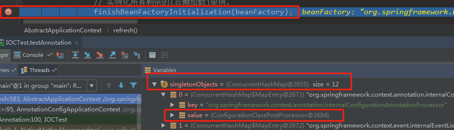

- [x] 为什么不是懒加载的？

既然是懒加载，就不是在容器启动的时候创建

- [x] 为什么是单例？

原型的bean创建了也没用，因为每次创建都是重新创建的一个对象，不会缓存起来

==org.springframework.context.support.AbstractApplicationContext#finishBeanFactoryInitialization==

## 创建单例bean之前的准备工作

==org.springframework.beans.factory.support.DefaultListableBeanFactory#preInstantiateSingletons==

### 遍历注册的BeanDefinition  循环1

```java
List<String> beanNames = new ArrayList<>(this.beanDefinitionNames);
for (String beanName : beanNames) {。。。}
```

## 一、合并BeanDefinition

如果某个BeanDefinition存在父BeanDefinition，那么则要进行合并

```java
//如果某个BeanDefinition存在父BeanDefinition，那么则要进行合并 
//将其他BeanDefinition统一转换为RootBeanDefinition  -- 表示顶级的db,没有父定义了
RootBeanDefinition bd = getMergedLocalBeanDefinition(beanName);
```

**筛选能被创建的BeanDefinition**

```java
!bd.isAbstract() && bd.isSingleton() && !bd.isLazyInit()
```

处理myFactoryBean 和 &myFactoryBean  的 beanName


## 二、getBean-doGetBean

### spring获取bean的入口

不管是容器启动过程中的获取，还是程序调用的，都是通过这个方法获取bean的

==org.springframework.beans.factory.support.AbstractBeanFactory#getBean(java.lang.String)==走到真实入口

为什么是这个类？

我们看看DefaultListableBeanFactory的类图


bean的注册 相关的总接口是BeanDefinitionRegistry而**管理bean生命周期的是BeanFactory接口**---其抽象实现类org.springframework.beans.factory.support.AbstractBeanFactory#getBean      就处理了getBean

```java
@Override
public Object getBean(String name) throws BeansException {
   return doGetBean(name, null, null, false);
}
```

==org.springframework.beans.factory.support. AbstractBeanFactory#doGetBean==

这里处理了三、四、五、六、七


## 三、先从单例池中取

org.springframework.beans.factory.support. AbstractBeanFactory#doGetBean

```java
// 先从缓存singletonObjects中找,没有则去创建
Object sharedInstance = getSingleton(beanName);
```

单例对象池存于重要的类DefaultSingletonBeanRegistry

org.springframework.beans.factory.support.DefaultSingletonBeanRegistry#getSingleton

```java
@Nullable
protected Object getSingleton(String beanName, boolean allowEarlyReference) {
   // 先从单例缓存中找，没有找到会先判断是否是正在创建的bean
   // isSingletonCurrentlyInCreation 判断对应的单例对象是否在创建中
   Object singletonObject = this.singletonObjects.get(beanName);
   if (singletonObject == null && isSingletonCurrentlyInCreation(beanName)) {
      synchronized (this.singletonObjects) {
         // earlySingletonObjects中保存所有提前曝光的单例，尝试从earlySingletonObjects中找
         singletonObject = this.earlySingletonObjects.get(beanName);
         if (singletonObject == null && allowEarlyReference) {
            // 如果允许早期依赖，可以尝试从singletonFactories中找到对应的单例工厂
            ObjectFactory<?> singletonFactory = this.singletonFactories.get(beanName);
            if (singletonFactory != null) {
               //创建bean，并缓存提前曝光的bean，就是还未进行属性注入的bean，用于解决循环依赖
               singletonObject = singletonFactory.getObject();
               this.earlySingletonObjects.put(beanName, singletonObject);
               this.singletonFactories.remove(beanName);
            }
         }
      }
   }
   return singletonObject;
}
```

**存在就直接返回单例对象 池中的对象**  ---  这个多处使用，因为每次getBean都需要判断是不是FactoryBean

进一步处理了FactoryBean--因为存在&和getObject的区别

```java
// 普通bean和factoryBean的判断
bean = getObjectForBeanInstance(sharedInstance, name, beanName, null);
//isPrototypeCurrentlyInCreation
// 。。。。。
```


## 四、标记bean开始创建

```java
if (!typeCheckOnly) {
   // 标记 bean要创建了
   markBeanAsCreated(beanName);
}
```

## 五、再次合并BeanDefinition 

因为有些是直接通过getBean获取bean的，也是需要调用合并的

统一使用RootBeanDefinition 接收  得到  mdb 

```java
//  返回 RootBeanDefinition
// 读取XML配置信息的是GernericBeanDefinition,后续都是针对RootBeanDefinition的处理,
// 因而转换.如果父类bean存在,则合并父类属性.
final RootBeanDefinition mbd = getMergedLocalBeanDefinition(beanName);
```

org.springframework.beans.factory.support.AbstractBeanFactory#getMergedLocalBeanDefinition

```java
if (bd instanceof RootBeanDefinition) {
   mbd = ((RootBeanDefinition) bd).cloneBeanDefinition();
}
else {
   mbd = new RootBeanDefinition(bd);
}
```

## 六、处理依赖DependsOn

对于类的依赖关系，可以使用@DependsOn处理，在条件注解中常用

不会处理处理extends依赖

```java
// 如果有配置DependsOn依赖，先去获取依赖，条件注解常用  @DependsOn
//原理是用了两个map存储依赖的beanName和被依赖的beanName，所有的依赖关系
// A依赖B  dependentBeanMap 存储B:A
// A依赖B  dependenciesForBeanMap 存储A:B
String[] dependsOn = mbd.getDependsOn();
```


## 七、根据scope分别处理

org.springframework.beans.factory.support.AbstractBeanFactory#doGetBean

### 单例的处理

先createBean  将创建完的bean放入单例池中

```java
//判断单例
if (mbd.isSingleton()) {
   sharedInstance = getSingleton(beanName, () -> {
      try {
         return createBean(beanName, mbd, args);
      }
      catch (BeansException ex) {
         // Explicitly remove instance from singleton cache: It might have been put there
         // eagerly by the creation process, to allow for circular reference resolution.
         // Also remove any beans that received a temporary reference to the bean.
         destroySingleton(beanName);
         throw ex;
      }
   });
   // 返回类型判断 FactoryBean BeanFactroy
   bean = getObjectForBeanInstance(sharedInstance, name, beanName, mbd);
}
```

这里用了`lambda`  表达式，当调用   singletonFactory.getObject()时会走进参数的代码块中

org.springframework.beans.factory.support.DefaultSingletonBeanRegistry#getSingleton

```java
// 先从缓存中找
Object singletonObject = this.singletonObjects.get(beanName);
// singletonFactory 生产bean  --- 这里就调外面的方法了
singletonObject = singletonFactory.getObject();
// 进行创建状态的移除  this.singletonsCurrentlyInCreation.remove(beanName)
afterSingletonCreation(beanName);
if (newSingleton) {
// 新生产的单例bean放入singletonObjects中
addSingleton(beanName, singletonObject);
```

由于里面调用了getObject()，代码就回到了org.springframework.beans.factory.support.AbstractBeanFactory#doGetBean

```java
try {
   return createBean(beanName, mbd, args);
}
catch (BeansException ex) {
   // Explicitly remove instance from singleton cache: It might have been put there
   // eagerly by the creation process, to allow for circular reference resolution.
   // Also remove any beans that received a temporary reference to the bean.
   destroySingleton(beanName);
   throw ex;
}
```

### 原型的处理

和单例差不多，只是不用放入单例池，调用createBean创建bean后直接返回

### 其它作用域-request|session

和单例类似，调用createBean创建bean后，放入对应的作用域中

## 八、createBean-加载MBD的class

==org.springframework.beans.factory.support.AbstractAutowireCapableBeanFactory#createBean==

处理了八、九

到这里前期工作做完了，拿到了合并后的MBD，有了BeanDefinition之后，后续就会基于BeanDefinition去创建Bean，而创建Bean就必须实例化对象，而实例化就必须先加载当前BeanDefinition所对应的class

```java
// 判断当前要创建的bean是否可以实例化，是否可以通过类加载器加载
Class<?> resolvedClass = resolveBeanClass(mbd, beanName);
```

org.springframework.beans.factory.support.AbstractBeanFactory#resolveBeanClass

org.springframework.beans.factory.support.AbstractBeanDefinition#hasBeanClass

```java
//起初注册bean的时候，BeanDefinition里面的beanClass对象还只是全限定类名-String
//当beanClass为Class的时候就说明是加载到JVM中了
return (this.beanClass instanceof Class);
```

org.springframework.beans.factory.support.AbstractBeanFactory#doResolveBeanClass

```java
//反射进行加载className对应的类
return ClassUtils.forName(className, dynamicLoader);
```


## 九、实例化前-后置处理器

这里有个**自定义实例化**的扩展，如果bean的实例化过程不交给spring处理，就实现org.springframework.beans.factory.config.InstantiationAwareBeanPostProcessor接口，这里就会直接返回实例化后的bean，不会走后续的spring实例化过程了，为了AOP会跳转到**初始化后的-后置处理器**逻辑里，然后结束

```java
try {
   // Give BeanPostProcessors a chance to return a proxy instead of the target bean instance.
   // 实例化前的后置处理器调用 InstantiationAwareBeanPostProcessor
   // 第1次调用后置处理器
   Object bean = resolveBeforeInstantiation(beanName, mbdToUse);
   if (bean != null) {
      // 直接返回自己实例化的结果，不再使用spring的实例化目标对象
      return bean;
   }
}
catch (Throwable ex) {
   throw new BeanCreationException(mbdToUse.getResourceDescription(), beanName,
         "BeanPostProcessor before instantiation of bean failed", ex);
}
```

org.springframework.beans.factory.support.AbstractAutowireCapableBeanFactory  #resolveBeforeInstantiation

```java
protected Object resolveBeforeInstantiation(String beanName, RootBeanDefinition mbd) {
   Object bean = null;
   if (!Boolean.FALSE.equals(mbd.beforeInstantiationResolved)) {
      // Make sure bean class is actually resolved at this point.
      //确保此时bean类已经被解析
      if (!mbd.isSynthetic() && hasInstantiationAwareBeanPostProcessors()) {
         Class<?> targetType = determineTargetType(beanName, mbd);
         if (targetType != null) {
            // 在目标对象实例化之前调用，可以返回任意类型的值，如果不为空，
            // 此时可以代替原本应该生成的目标对象实例（一般是代理对象）
            // InstantiationAwareBeanPostProcessor#postProcessBeforeInstantiation
            bean = applyBeanPostProcessorsBeforeInstantiation(targetType, beanName);
            if (bean != null) {
               // 如果bean不为空，调用 postProcessAfterInitialization 方法，否则走正常实例化流程
               //这里走初始化后的逻辑，为了AOP
               bean = applyBeanPostProcessorsAfterInitialization(bean, beanName);
            }
         }
      }
      mbd.beforeInstantiationResolved = (bean != null);
   }
   return bean;
}
```

## 十、doCreateBean

==org.springframework.beans.factory.support.AbstractAutowireCapableBeanFactory#doCreateBean==

处理了十、十一、十二、十三、十四、十五、十六、十七、十八、十九

## 十一、推断构造方法

org.springframework.beans.factory.support.AbstractAutowireCapableBeanFactory#createBeanInstance

推断构造---实例化都在这里  先推断构造方法再实例化  详细的见推断构造方法

## 十二、实例化

### 1、@Bean修饰的bean被创建

```java
//  @Bean修饰的bean被创建   method.invoke(obj,args)
if (mbd.getFactoryMethodName() != null) {
   return instantiateUsingFactoryMethod(beanName, mbd, args);
}
```

org.springframework.beans.factory.support. AbstractAutowireCapableBeanFactory#instantiateUsingFactoryMethod

```java
protected BeanWrapper instantiateUsingFactoryMethod(
      String beanName, RootBeanDefinition mbd, @Nullable Object[] explicitArgs) {

   return new ConstructorResolver(this).instantiateUsingFactoryMethod(beanName, mbd, explicitArgs);
}
```

构造器解析器

org.springframework.beans.factory.support.ConstructorResolver#instantiateUsingFactoryMethod

？？？


### 2、缓存构造器后的注入

```java
// Shortcut when re-creating the same bean...
// 一个类可能有多个构造器，所以Spring得根据参数个数、类型确定需要调用的构造器
// 在使用构造器创建实例后，Spring会将解析过后确定下来的构造器或工厂方法保存在缓存中，
// 避免再次创建相同bean时再次解析
boolean resolved = false;
boolean autowireNecessary = false;
if (args == null) {
   synchronized (mbd.constructorArgumentLock) {
      if (mbd.resolvedConstructorOrFactoryMethod != null) {
         resolved = true;
         autowireNecessary = mbd.constructorArgumentsResolved;
      }
   }
}
if (resolved) {
   if (autowireNecessary) {
      //构造器自动注入 @Autowired修饰了构造器
      return autowireConstructor(beanName, mbd, null, null);
   }
   else {
      // 默认无参构造器
      return instantiateBean(beanName, mbd);
   }
}
```


### 3、@Autowired 修饰的构造器

```java
// Candidate constructors for autowiring?
// 自动装配的候选构造器   SmartInstantiationAwareBeanPostProcessor#determineCandidateConstructors
// 第2次调用后置处理器    获取@Autowired 修饰的构造器
Constructor<?>[] ctors = determineConstructorsFromBeanPostProcessors(beanClass, beanName);
//  AutowireMode设置为3，采用构造器贪婪模式
// 判断是否有@Autowired 修饰的构造器
if (ctors != null || mbd.getResolvedAutowireMode() == AUTOWIRE_CONSTRUCTOR ||
      mbd.hasConstructorArgumentValues() || !ObjectUtils.isEmpty(args)) {
   return autowireConstructor(beanName, mbd, ctors, args);
}
```

### 4、默认构造器的首选构造器 

```java
// 默认构造的首选构造器
ctors = mbd.getPreferredConstructors();
if (ctors != null) {
   return autowireConstructor(beanName, mbd, ctors, null);
}
```

### 5、无参构造器

```java
// 无参构造器
return instantiateBean(beanName, mbd);
```


## 十三、BeanDefinition的后置处理

org.springframework.beans.factory.support.AbstractAutowireCapableBeanFactory #applyMergedBeanDefinitionPostProcessors

这个扩展点能拿到mdb 允许后置处理器修改合并的bean定义，但是没啥用

但是在很多注解的**查找并保存注入点**的时候就会用这个，**作用是用来检查BeanDefinition**如：

@PostConstruct

org.springframework.beans.factory.annotation.InitDestroyAnnotationBeanPostProcessor #postProcessMergedBeanDefinition

```java
@Override
public void postProcessMergedBeanDefinition(RootBeanDefinition beanDefinition, Class<?> beanType, String beanName) {
   LifecycleMetadata metadata = findLifecycleMetadata(beanType);
    //这里就可以检查BeanDefinition了并将这个init方法set到BeanDefinition中存储
   metadata.checkConfigMembers(beanDefinition);
}
```

@Autowired

org.springframework.beans.factory.annotation.AutowiredAnnotationBeanPostProcessor#postProcessMergedBeanDefinition


## 十四、实例化后

org.springframework.beans.factory.support.AbstractAutowireCapableBeanFactory#populateBean

实例化后---填充属性---填充属性后  都在这里

在实例化后 的处理，接口还是实例化前的那个，执行的方式是实例化后方法

org.springframework.beans.factory.config.InstantiationAwareBeanPostProcessor #postProcessAfterInstantiation

```java
//  在属性设置之前修改bean的状态  InstantiationAwareBeanPostProcessor#postProcessAfterInstantiation
// 第5次调用后置处理器
if (!mbd.isSynthetic() && hasInstantiationAwareBeanPostProcessors()) {
    for (BeanPostProcessor bp : getBeanPostProcessors()) {
        if (bp instanceof InstantiationAwareBeanPostProcessor) {
            InstantiationAwareBeanPostProcessor ibp = (InstantiationAwareBeanPostProcessor) bp;
            //在目标对象实例化之后调用，此时对象被实例化，但是对象的属性还未设置。如果该方法返回
            //fasle,则会忽略之后的属性设置。返回true，按正常流程设置属性值
            if (!ibp.postProcessAfterInstantiation(bw.getWrappedInstance(), beanName)) {
                continueWithPropertyPopulation = false;
                break;
            }
        }
    }
}
```


## 十五、填充属性

填充属性就是依赖注入的流程----见依赖注入

## 十六、填充属性后

这个接口还是实例化前的的那个接口

org.springframework.beans.factory.config.InstantiationAwareBeanPostProcessor#postProcessProperties

```java
// 第6次调用后置处理器
// 可以在该方法内对属性值进行修改（此时属性值还未设置，但可以修改原本会设置的进去的属性值）。
// 如果postProcessAfterInstantiation方法返回false，该方法不会调用
// 依赖注入逻辑
for (BeanPostProcessor bp : getBeanPostProcessors()) {
   if (bp instanceof InstantiationAwareBeanPostProcessor) {

      //@Autowired 属性注入逻辑 这个是扩展出来的，原本的属性填充是ByType和ByName
       InstantiationAwareBeanPostProcessor ibp = (InstantiationAwareBeanPostProcessor) bp;
      PropertyValues pvsToUse = ibp.postProcessProperties(pvs, bw.getWrappedInstance(), beanName);
      if (pvsToUse == null) {
         if (filteredPds == null) {
            filteredPds = filterPropertyDescriptorsForDependencyCheck(bw, mbd.allowCaching);
         }
         pvsToUse = ibp.postProcessPropertyValues(pvs, filteredPds, bw.getWrappedInstance(), beanName);
         if (pvsToUse == null) {
            return;
         }
      }
      pvs = pvsToUse;
   }
}
```

## 十七、执行Aware

org.springframework.beans.factory.support.AbstractAutowireCapableBeanFactory#initializeBean

Aware----初始化前---初始化---初始化后 都在这里

执行Aware是在当前Bean创建的时候就调用了这个方法，而后置处理器里的都是在创建当前Bean后，执行的，只是执行的物理位置是这样的，逻辑位置不是按顺序的。

这里的回调就是接口---类似于静态代理的方式

```java
if (System.getSecurityManager() != null) {
   AccessController.doPrivileged((PrivilegedAction<Object>) () -> {
      invokeAwareMethods(beanName, bean);
      return null;
   }, getAccessControlContext());
}
else {
   // 调用Aware方法,判断Aware类型可以分别设置 beanName，beanClassLoader、BeanFactory 属性值
   invokeAwareMethods(beanName, bean);
}
```

==Aware为什么比BeanPostProcessor早执行？==

这里会疑问为什么BeanPostProcessor实现类的创建过程中不是按照顺序来执行的，是因为，处理BeanPostProcessor是通过for循环所有的BeanPostProcessor实例，然后再分别调用不同的扩展点的，当本身就是BeanPostProcessor创建时，不会找到自己的实例，所以整个BeanPostProcessor实例化过程中的扩展点都不会执行，直到被创建出来后，下一个bean实例化时就会带上这个BeanPostProcessor的扩展点

## 十八、初始化前


```java
if (mbd == null || !mbd.isSynthetic()) {
   //  BeanPostProcessor.postProcessBeforeInitialization
   //第7次调用后置处理器
   //  如果配置了@PostConstruct  会调用
   // InitDestroyAnnotationBeanPostProcessor#postProcessBeforeInitialization
   //  Aware方法调用  ApplicationContextAware  EnvironmentAware    ApplicationEventPublisherAware
   //ApplicationContextAwareProcessor#postProcessBeforeInitialization
   wrappedBean = applyBeanPostProcessorsBeforeInitialization(wrappedBean, beanName);
}
```

org.springframework.beans.factory.config.BeanPostProcessor#postProcessBeforeInitialization

```java
Object result = existingBean;
for (BeanPostProcessor processor : getBeanPostProcessors()) {
   Object current = processor.postProcessBeforeInitialization(result, beanName);
   if (current == null) {
      return result;
   }
   result = current;
}
```

==@PostConstruct注解就是对这个扩展点的应用==

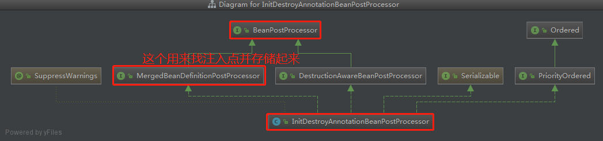

org.springframework.beans.factory.annotation.InitDestroyAnnotationBeanPostProcessor#postProcessBeforeInitialization

```java
@Override
public Object postProcessBeforeInitialization(Object bean, String beanName) throws BeansException {
   LifecycleMetadata metadata = findLifecycleMetadata(bean.getClass());
   try {
      //  @PostConstruct  回调--直接反射 出来的Method 调用了method.invoke方法
      metadata.invokeInitMethods(bean, beanName);
   }
   catch (InvocationTargetException ex) {
      throw new BeanCreationException(beanName, "Invocation of init method failed", ex.getTargetException());
   }
   catch (Throwable ex) {
      throw new BeanCreationException(beanName, "Failed to invoke init method", ex);
   }
   return bean;
}
```

## 十九、初始化

```java
// 执行bean生命周期回调的init方法    自定义bean的init（）
invokeInitMethods(beanName, wrappedBean, mbd);
```

## 二十、初始化后

```java
if (mbd == null || !mbd.isSynthetic()) {
   //  BeanPostProcessor.postProcessAfterInitialization
   //第8次调用后置处理器
   //   aop实现：AbstractAutoProxyCreator#postProcessAfterInitialization
   wrappedBean = applyBeanPostProcessorsAfterInitialization(wrappedBean, beanName);
}
```

org.springframework.beans.factory.config.BeanPostProcessor#postProcessAfterInitialization

```java
for (BeanPostProcessor processor : getBeanPostProcessors()) {
   Object current = processor.postProcessAfterInitialization(result, beanName);
   if (current == null) {
      return result;
   }
   result = current;
}
```

初始化后的扩展点是AOP的应用


# IOC的启动流程


## 容器启动的入口AbstractApplicationContext#refresh

不管是 XML方式   还是   Annotation方式 都会走到入口

```java

// 获得刷新的beanFactory
// 对于AnnotationConfigApplicationContext，作用：
// 1.调用org.springframework.context.support.GenericApplicationContext.refreshBeanFactory，
// 只是指定了SerializationId
// 2.直接返回beanFactory(不用创建，容器中已存在)
//  对于ClassPathXmlApplicationContext，作用：
// 1.调用AbstractRefreshableApplicationContext.refreshBeanFactory
// 2.如果存在beanFactory，先销毁单例bean，关闭beanFactory，再创建beanFactory
// 3.注册传入的spring的xml配置文件中配置的bean，注册到beanFactory
// 4.将beanFactory赋值给容器，返回beanFactory
ConfigurableListableBeanFactory beanFactory = obtainFreshBeanFactory();
// Prepare the bean factory for use in this context.
// 准备bean工厂： 指定beanFactory的类加载器， 添加后置处理器，注册缺省环境bean等
// beanFactory添加了2个后置处理器 ApplicationContextAwareProcessor, ApplicationListenerDetector (new )
prepareBeanFactory(beanFactory);

// 空方法
// 允许在上下文的子类中对beanFactory进行后处理
// 比如 AbstractRefreshableWebApplicationContext.postProcessBeanFactory
postProcessBeanFactory(beanFactory);
// Invoke factory processors registered as beans in the context.
// 1.通过beanFactory.getBean(ppName, BeanDefinitionRegistryPostProcessor.class)
//   拿到ConfigurationClassPostProcessor
// 2.通过ConfigurationClassPostProcessor.postProcessBeanDefinitionRegistry，注册所有注解配置的bean
// 注册的顺序： @ComponentScan>实现ImportSelector>方法bean>@ImportResource("spring.xml")
//  > 实现 ImportBeanDefinitionRegistrar  (相对的顺序，都在同一个配置类上配置)
// 3. 调用ConfigurationClassPostProcessor#postProcessBeanFactory
//  增强@Configuration修饰的配置类  AppConfig--->AppConfig$$EnhancerBySpringCGLIB
// (可以处理内部方法bean之间的调用，防止多例)
//  添加了后置处理器 ConfigurationClassPostProcessor.ImportAwareBeanPostProcessor (new)
invokeBeanFactoryPostProcessors(beanFactory);
// Register bean processors that intercept bean creation.
// 注册拦截bean创建的后置处理器：
// 1.添加Spring自身的：  BeanPostProcessorChecker （new）  以及注册了beanDefinition的两个
//  CommonAnnotationBeanPostProcessor AutowiredAnnotationBeanPostProcessor
//  重新添加ApplicationListenerDetector(new ) ，删除旧的，移到处理器链末尾
// 2.用户自定义的后置处理器
// 注册了beanDefinition的会通过 beanFactory.getBean(ppName, BeanPostProcessor.class) 获取后置处理器
registerBeanPostProcessors(beanFactory);

// 初始化事件多播器
initApplicationEventMulticaster();
// Initialize other special beans in specific context subclasses.
// 空方法   子类实现： springboot  内嵌容器  ioc启动带动tomcat启动
onRefresh();

// Instantiate all remaining (non-lazy-init) singletons.
// 实例化所有剩余的(非懒加载)单例。
finishBeanFactoryInitialization(beanFactory);

```

## 注册bean

注解方式在`invokeBeanFactoryPostProcessors`做完了

xml方式在`obtainFreshBeanFactory`做完了

## 创建bean实例

入口`finishBeanFactoryInitialization`


# bean的生命周期

[生命周期的源码流程图](https://www.processon.com/view/link/5eafa609f346fb177ba8091f)


生成了BeanDefinition

```
在bean的注册过程中已经生成了BeanDefinition，这是通过读取xml（文件流）或者注解（ASM字节码技术）的方式生成的。
```

## 1、合并BeanDefinition为MDB

## 2、加载beanClass到JVM

## 3实例化前-后置处理器

InstantiationAwareBeanPostProcessor#postProcessBeforeInstantiation

## 4、实例化

实例化就是有一段推断构造方法的逻辑在，@Autowired的应用

## 5、BeanDefinition-后置处理器

MergedBeanDefinitionPostProcessor#postProcessMergedBeanDefinition

## 6、实例化后-后置处理器

InstantiationAwareBeanPostProcessor#postProcessAfterInstantiation

## 7、填充属性

## 8、填充属性后-后置处理器

InstantiationAwareBeanPostProcessor#postProcessProperties

## 9、Aware回调执行

## 10、初始化前-后置处理器

AbstractAutowireCapableBeanFactory#applyBeanPostProcessorsBeforeInitialization

## 11、初始化

## 12、初始化后-后置处理器

## 13、Bean的销毁

AbstractAutowireCapableBeanFactory#applyBeanPostProcessorsAfterInitialization


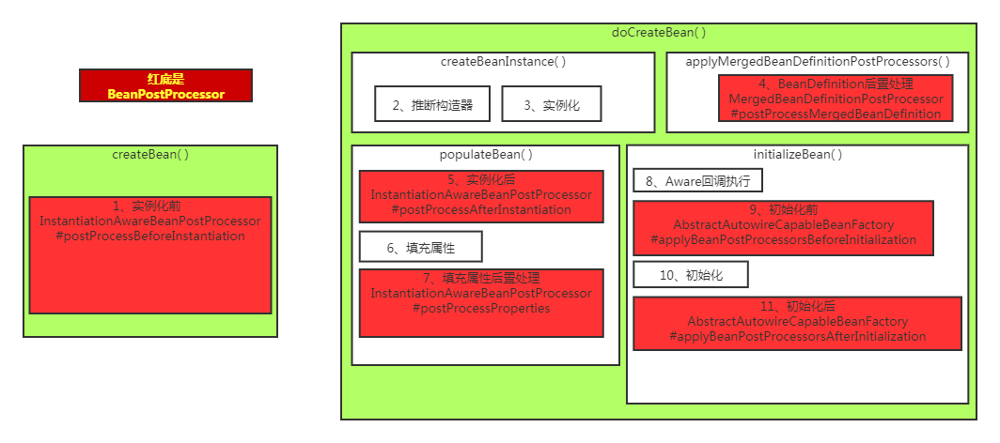


# 依赖注入

2020-10-18  原理是前面到40：20，源码是40：20开始


## 本节==不讲构造方法注入==

本节主要分析==属性的注入==和==非构造方法的注入==，对于构造方法的注入见推断构造方法

## 在生命周期中的population

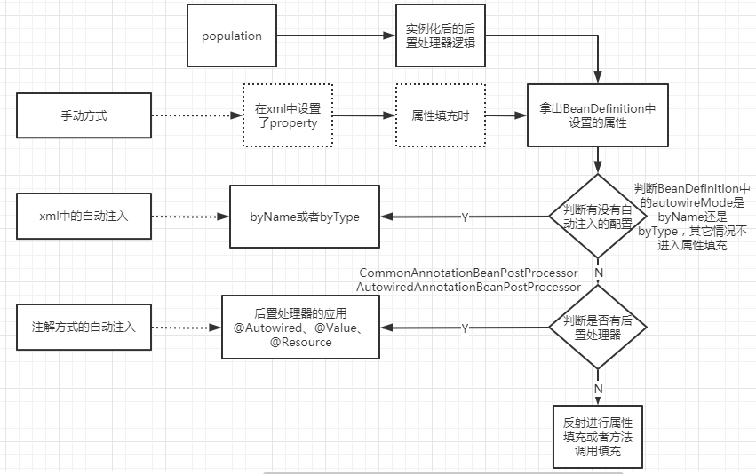


## 分类

在jdk中，我们描述一个类依赖另一个类，我们只需要在一个类里面加上一个属性字段，字段的类型是另一个被依赖的类就可以了。----这是jdk的规则

在spring中自定了一套规则来处理bean之间的依赖关系，就是使用set方法或者注解等。----这是spring中的规则

### 第一类手动

在xml中定义的bean的子标签property或者constructor-arg    ==set方法或者构造是必须的==

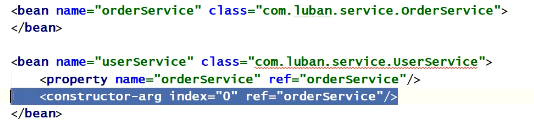

在XML中手写的，**底层依赖的是setter方法、构造方法**

### 第二类自动

#### 1、xml方式

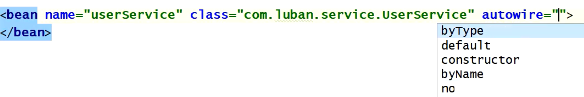

5中类型：byType、byName、default、constructor、no

下面有详解

这种配置同样是需要**依赖于bean中定义了set方法或构造方法的**

#### 2、注解方式

@Autowired、@Value

@Resource(这个是jdk的注解，先从另一个jvm的容器中获取，没有就byName，没有就走@Autowired的逻辑)


### 按照其他方式分类

按照其他维度也可以说成3类：byType、byName、constructor


## 分析xml中的自动注入 

2020-10-18  原理是前面到40：20，源码是40：20开始

### 基于setter方法、构造方法

==set方法或者构造是必须的==

不管是**属性注入**还是**方法注入**都是基于set方法 

**属性注入也需要有对应的set方法**，方法注入就只能通过set方法注入，所以本质就是set方法，只要注入成功就是通过调用了set方法后，`this.field=param`进行注入的

构造方法注入见推断构造方法章节

### 注入类型及其原理


#### byType和byName

这里的本质==不是说xml才有byType和byName==，是BeanDefinition的一个属性autowireMode ，在使用@Component的时候这个属性是`private int autowireMode = AUTOWIRE_NO;`所以不会执行byName和byType的逻辑，像@Bean上就可以指定byName和byType

byName原理

1、先找出所有的setter方法，拿到String beanName    ---->（【setAge-->age】）

2、根据beanName直接去getBean

3、通过反射将上面getBean的实例传入set方法的参数中，完成方法的调用，实现注入

byType原理

1. 先找出所有的setter方法名    ---->（【setAge-->age】）
2. 根据set方法名重新获取得到PropertyDescriptor,
3. 拿到set方法的参数列表，这里只允许1个参数
4. 根据类型进行byType，get到了唯一的一个就成功返回（集合例外）
5. 然后通过**反射调用setter方法**

#### 构造方法

如果是byType或byName，那么该bean**一定要有一个无参的构造方法**，因为如果只有有参构造方法，那么Spring将无法进行实例化，因为Spring如果要实例化肯定需要利用构造方法，而Spring没法给构造方法传值。

如果是constructor，那么就可以不写set方法了，当某个bean是通过构造方法来注入时，表示Spring在利用构造方法实例化一个对象时，可以利用构造方法的参数信息从Spring容器中去找bean，找到bean之后作为参数传给构造方法，从而实例化得到一个bean对象。

#### default

是使用beans标签里的类型

#### no

是不使用自动注入

### 源码分析

在填充属性后，填充属性后的后置处理器 之前，这个是spring自带的，而注解通过后置处理器扩展的，相当于一个插件实现的，spring默认安装了这个插件

这里的注入点是setter方法，在注册bean的时候就会将每个类setter方法存储起来

org.springframework.beans.factory.support.AbstractAutowireCapableBeanFactory#populateBean

autowireMode这个值在注解 方式中为no

```java
// 判断autowireMode是否是 by_name或者by_type
if (mbd.getResolvedAutowireMode() == AUTOWIRE_BY_NAME || mbd.getResolvedAutowireMode() == AUTOWIRE_BY_TYPE) {
   MutablePropertyValues newPvs = new MutablePropertyValues(pvs);
   // Add property values based on autowire by name if applicable.
   if (mbd.getResolvedAutowireMode() == AUTOWIRE_BY_NAME) {
      // byName
      autowireByName(beanName, mbd, bw, newPvs);
   }
   // Add property values based on autowire by type if applicable.
   if (mbd.getResolvedAutowireMode() == AUTOWIRE_BY_TYPE) {
      // byType
      autowireByType(beanName, mbd, bw, newPvs);
   }
    //这个就是最终找到的唯一 的 依赖bean
   pvs = newPvs;
}
```

#### 1、找到注入点,byName&byType

==byName是找到所有的set方法的方法名==（这里的方法名是去除了set字符的setAge--age）

==byType是先找到所有的set方法名，然后根据方法的入参的类型进行判断==(setAge(Age otherName) ---  age--Age类型) 这里要求参数只能一个，多了注入不了，@Autowired的允许多个参数，而且不需要是set方法，任何方法都行

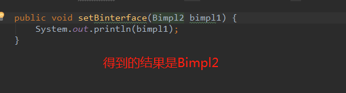

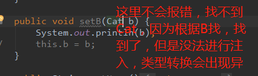

org.springframework.beans.factory.support.AbstractAutowireCapableBeanFactory #unsatisfiedNonSimpleProperties

org.springframework.beans.BeanWrapper#getPropertyDescriptors

java.beans.Introspector.getTargetPropertyInfo()  底层通过jdk的代码获取属性描述

一定是通过set方法获取注入点

```java
static final String ADD_PREFIX = "add";
static final String REMOVE_PREFIX = "remove";
static final String GET_PREFIX = "get";
static final String SET_PREFIX = "set";
static final String IS_PREFIX = "is";
```

#### 1.1找set方法

2020-10-18 55：00

org.springframework.beans.factory.support.AbstractAutowireCapableBeanFactory #unsatisfiedNonSimpleProperties

```java
//找到所有set方法的属性  这里有规则属性名和setter方法的方法名需要匹配
String[] propertyNames = unsatisfiedNonSimpleProperties(mbd, bw);
```

内部方法

```java
protected String[] unsatisfiedNonSimpleProperties(AbstractBeanDefinition mbd, BeanWrapper bw) {
   // bw是当前属性填充的bean的实例
   Set<String> result = new TreeSet<>();
    //beanDefinition 中set了的属性列表
   PropertyValues pvs = mbd.getPropertyValues();

   //通过bean的实例可以拿到属性的描述---因为是属性的注入   当一个类没有属性时，也会有这个描述
   //这个返回 的是jdk中的对象，描述中会有set方法，get方法，以及set的参数列表，get的返回值等  byType需要用的到set方法的参数类型
   //name是set的方法的名字去除了set
   PropertyDescriptor[] pds = bw.getPropertyDescriptors();
   for (PropertyDescriptor pd : pds) {
      //有set方法   
      if (pd.getWriteMethod() != null && !isExcludedFromDependencyCheck(pd) && !pvs.contains(pd.getName()) &&
            !BeanUtils.isSimpleProperty(pd.getPropertyType())) {
         result.add(pd.getName());
      }
   }
   return StringUtils.toStringArray(result);
}
```

#### 1.2 PropertyDescriptor

属性描述，这里的属性是set或get方法（是jdk的beans内部的一个定义），而不是属性字段，里面封装了set方法的参数列表信息

在创建Bean的过程中，在填充属性时，Spring会去解析当前类，把当前类的所有方法都解析出来，Spring会去解析每个方法得到对应的PropertyDescriptor对象，注意PropertyDescriptor**并不是Spring中的类，而是java.beans包下类**，也就是jdk自带的类，PropertyDescriptor中有几个属性：

```txt
1. name：这个name并不是方法的名字，而是拿方法名字进过处理后的名字
    a. 如果方法名字以“get”开头，比如“getXXX”,那么name=XXX
    b. 如果方法名字以“is”开头，比如“isXXX”,那么name=XXX
    c. 如果方法名字以“set”开头，比如“setXXX”,那么name=XXX
2. readMethodRef：表示get方法的Method对象的引用
3. readMethodName：表示get方法的名字
4. writeMethodRef：表示set方法的Method对象的引用
5. writeMethodName：表示set方法的名字
6. propertyTypeRef：如果有get方法那么对应的就是返回值的类型，如果是set方法那么对应的就是set方法中唯一参数的类型
```

#### 1.3 DependencyDescriptor

依赖描述，这里指的是需要处理为注入依赖的一种封装，不管是属性注入还是方法的注入都是这个定义

例如：在byType中PropertyDescriptor得到的是set方法的信息，而byType只根据参数的类型进行匹配，所以byType的时候只将参数类型set到DependencyDescriptor对象中

在@Autowired中，DependencyDescriptor对象中需要参数类型还需要参数名，所以在注入的时候统一都是根据这个对象来进行处理的。

#### 2.1、byName获取到唯一的依赖

org.springframework.beans.factory.support.AbstractAutowireCapableBeanFactory#autowireByName

先通过1的unsatisfiedNonSimpleProperties方法找到了所有set方法的属性

然后遍历找到的属性名（这里的属性名其实是set方法名），使用getBean方法 直接获取唯一的依赖，**实例化了的**

```java
protected void autowireByName(
      String beanName, AbstractBeanDefinition mbd, BeanWrapper bw, MutablePropertyValues pvs) {

   //找到所有set方法的属性  这里有规则属性名和setter方法的方法名需要匹配
   String[] propertyNames = unsatisfiedNonSimpleProperties(mbd, bw);
   for (String propertyName : propertyNames) {
       //这个找出来的名字对应有bean就继续，没有就提示
      if (containsBean(propertyName)) {
         // 根据属性名找唯一的依赖bean
         Object bean = getBean(propertyName);
         pvs.add(propertyName, bean);
         registerDependentBean(propertyName, beanName);
         if (logger.isTraceEnabled()) {
            logger.trace("Added autowiring by name from bean name '" + beanName +
                  "' via property '" + propertyName + "' to bean named '" + propertyName + "'");
         }
      }
      else {
         if (logger.isTraceEnabled()) {
            logger.trace("Not autowiring property '" + propertyName + "' of bean '" + beanName +
                  "' by name: no matching bean found");
         }
      }
   }
}
```

#### 2.2、byType获取唯一的依赖

org.springframework.beans.factory.support.AbstractAutowireCapableBeanFactory#autowireByType

先通过第一步中的的unsatisfiedNonSimpleProperties方法找到了该bean中的所有set方法遍历执行解析方法resolveDependency，这里的方法和Autowired注解 的筛选方法一致，只是最后无法进行byName，因为在创建属性描述DependencyDescriptor的时候`new AutowireByTypeDependencyDescriptor(methodParam, eager)`这个是DependencyDescriptor的子类，是没有DependencyName属性的。在最后byType选出多个 bean后getDependencyName无法进行ByName操作直接报错

```
@Override
//这里是禁止byName
public String getDependencyName() {
   return null;
}
```

```java
Caused by: org.springframework.beans.factory.NoUniqueBeanDefinitionException: No qualifying bean of type 'bat.ke.qq.com.bean.Binterface' available: expected single matching bean but found 2: bimpl1,bimpl2
	at org.springframework.beans.factory.config.DependencyDescriptor.resolveNotUnique(DependencyDescriptor.java:221)
	at org.springframework.beans.factory.support.DefaultListableBeanFactory.doResolveDependency(DefaultListableBeanFactory.java:1257)
	at org.springframework.beans.factory.support.DefaultListableBeanFactory.resolveDependency(DefaultListableBeanFactory.java:1183)
	at org.springframework.beans.factory.support.AbstractAutowireCapableBeanFactory.autowireByType(AbstractAutowireCapableBeanFactory.java:1599)
```

```java
protected void autowireByType(
      String beanName, AbstractBeanDefinition mbd, BeanWrapper bw, MutablePropertyValues pvs) {

   //类型转化器，当类型不匹配的时候就开始调用类型转化器
   TypeConverter converter = getCustomTypeConverter();
   if (converter == null) {
      converter = bw;
   }

   Set<String> autowiredBeanNames = new LinkedHashSet<>(4);

   // 同样是找到set方法对应的属性--方法名age
   String[] propertyNames = unsatisfiedNonSimpleProperties(mbd, bw);
   for (String propertyName : propertyNames) {
      try {
         //setter方法中的属性描述  参考unsatisfiedNonSimpleProperties里的
         PropertyDescriptor pd = bw.getPropertyDescriptor(propertyName);
         // Don't try autowiring by type for type Object: never makes sense,
         // even if it technically is a unsatisfied, non-simple property.
         // pd.getPropertyType()是获取的set方法参数的类型  这里的参数只允许一个，byType就是通过参数类型来的
         //参数类型为Object是没有意义的
         if (Object.class != pd.getPropertyType()) {
            //这里是获取参数信息  WriteMethod代表set方法
            MethodParameter methodParam = BeanUtils.getWriteMethodParameter(pd);
            // Do not allow eager init for type matching in case of a prioritized post-processor.
            boolean eager = !PriorityOrdered.class.isInstance(bw.getWrappedInstance());
            //根据类型找到bean  这就是byType  这里的desc没有setBeanName 后续无法进行byName操作
            DependencyDescriptor desc = new AutowireByTypeDependencyDescriptor(methodParam, eager);
            //这里走到了Autowired的逻辑里了，就是byType的逻辑，重点是desc描述中没有将参数的name放进去，
            // 导致byType出多个bean的时候无法byName，直接报错
            Object autowiredArgument = resolveDependency(desc, beanName, autowiredBeanNames, converter);
            if (autowiredArgument != null) {
               pvs.add(propertyName, autowiredArgument);
            }
            for (String autowiredBeanName : autowiredBeanNames) {
               registerDependentBean(autowiredBeanName, beanName);
               if (logger.isTraceEnabled()) {
                  logger.trace("Autowiring by type from bean name '" + beanName + "' via property '" +
                        propertyName + "' to bean named '" + autowiredBeanName + "'");
               }
            }
            autowiredBeanNames.clear();
         }
      }
      catch (BeansException ex) {
         throw new UnsatisfiedDependencyException(mbd.getResourceDescription(), beanName, propertyName, ex);
      }
   }
}
```

#### 2.2.1、byType核心逻辑

org.springframework.beans.factory.support.**DefaultListableBeanFactory#resolveDependency**

见  详解  resolveDependency

对于这个byType，因为传入的依赖描述是DependencyDescriptor的子类AutowireByTypeDependencyDescriptor，这个类重写了getDependencyName，返回的是null，所以在执行解析依赖方法resolveDependency时，byType出多个后，会getDependencyName去执行byName，而这里的getDependencyName是null，直接抛异常


#### 3、反射调用set方法，入参就是依赖bean

```java
if (pvs != null) {
   // propertyValues属性填充 ，包括AutowireMode方式注入的bean
   applyPropertyValues(beanName, mbd, bw, pvs);
}
```


## 分析注解中的自动注入

2020-10-18  源码是1:37：20开始

主要是@Autowired 也可以有@Value @Resource

### 产生的背景

@Autowired注解相当于XML中的autowire属性的**注解方式的替代**。这是在官网上有提到的。

```java
Essentially, the @Autowired annotation provides the same capabilities as described in Autowiring Collaborators but with more fine-grained control and wider applicability
//翻译一下：
//从本质上讲，@Autowired注解提供了与autowire相同的功能，但是拥有更细粒度的控制和更广泛的适用性。
```

==细粒度是重点==

1. XML中的autowire控制的是整个bean的所有属性和set方法和一个构造器，而@Autowired注解是直接写在某个属性、普通方法、多个构造方法上的。
2. 如果一个类有多个构造方法，那么如果用XML的autowire=constructor，你无法控制到底用哪个构造方法，而你可以用@Autowired注解来直接指定你想用哪个构造方法。
3. 用@Autowired注解，还可以控制，哪些属性想被自动注入，哪些属性不想，这也是细粒度的控制。

缺点：@Autowired无法区分byType和byName，@Autowired是先byType，如果找到多个则byName。

### 注入类型及其原理

2020-10-20 43：00

#### @Autowired方式

是  ==后置处理器的一种应用==，可以将@Autowired的方式的自动注入看成一种插件，加上注解了就能自动注入的功能

原理

[@Autowired的依赖注入-原理图](springIOC.assets/1603021389507-04927956-e2f1-4d99-874f-207fcdd4f92a.png)

==先byType然后再byName==   因为，byName有可能不是需要的类型，找到了没用

byType   是和xml中的autowire为byType调用的方法一致，调用的是 resolveDependency                                            byName 的原理和xml中的autowire为byName的一致，都是直接拿到唯一的beanName进行 getBean操作

@Autowired可以注入的点：任意属性、任何形式的构造方法上、任何普通方法上（方法参数可以多个，不一定是set方法，比byType更优）

1. 属性上：先根据属性类型去找Bean，如果找到多个再根据属性名确定一个
2. 构造方法上：先根据方法参数类型去找Bean，如果找到多个再根据参数名确定一个
3. set方法上：先根据方法参数类型去找Bean，如果找到多个再根据参数名确定一个

#### @Value

2020-10-20 44：00

@Value一般是用来将配置文件中的内容注入到属性上，但是通过EL表达式也可以实现任意类型bean的注入

原理

原理图就是@Autowired原理图中的开头到@Value截止，@Value是@Autowired流程中的一个步骤，当出现@Value时，只会走到@Value逻辑截止，不会去处理@Autowrited注解后续的流程了。

==先对`$`符号进解析，若不是这个符号就对`#`符号进行解析。==

对`$`符号进解析：@Value对于key-value的配置文件信息注入，直接利用占位符${xxx}，然后从Environment对象中获取xxx对于的value值返回，这个值是个String类型的，会根据被注入的属性类型或者方法参数类型进行判断是否需要进行类型转化（String类型的注入不需要转化），其它类型就需要自定义一个将String转为指定类型的转化器

对`#`符号进解析：这个符号可以是任意的SpringEL 表达式，例如可以是一个beanName，这里解析的时候就直接byName进行getBean注入了，同样会经过类型转化。

解析EL表达式的堆栈信息

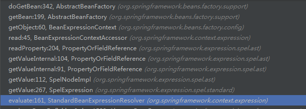

@Value可以放在属性上，普通方法上，不能应用在构造器上

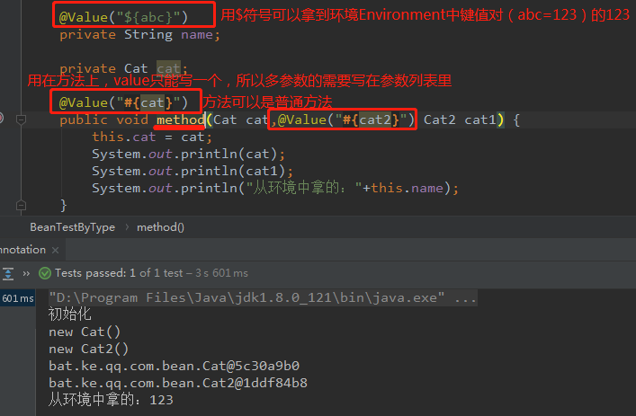

不能用在构造器上

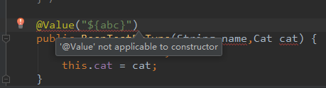

#### @Resource

原理

[@Resource的原理图](springIOC.assets/1603349673878-2fb09321-8e63-4a5e-a362-f3edb833631c.png)

1. 如果@Resource注解中指定了name属性，直接ByName
2. 如果@Resource注解没有指定name属性，那么会先判断当前注入点名字（属性名字或方法参数名字）是不是存在Bean，如果存在，则直接根据注入点名字取获取bean，如果不存在，则会走@Autowired注解的逻辑，会根据注入点类型去找Bean，但后续的byName是无效的，因为之前就byName了，所以byType返回多个也是错误的

@Resource用在属性和方法上

### 源码分析


#### 0、对BeanPostProcessor应用

##### 被实现的后置处理器

```java
//1、org.springframework.beans.factory.support.MergedBeanDefinitionPostProcessor
    --找注入点
//2、org.springframework.beans.factory.config.DestructionAwareBeanPostProcessor
    --bean的销毁相关  只有@Resource才有
//3、org.springframework.beans.factory.config.InstantiationAwareBeanPostProcessor
    --注入逻辑
```

==①、重写`MergedBeanDefinitionPostProcessor#postProcessMergedBeanDefinition`方法找注入点==              						②、销毁的方法没有重写，用的父类`InitDestroyAnnotationBeanPostProcessor`的														==③、重写`CommonAnnotationBeanPostProcessor#postProcessProperties`方法执行注入逻辑，在属性填充后执行==

##### 两个实现类

@Resource`  和   `@Autowired & @Value`

```java
//@Resource	-- org.springframework.context.annotation.CommonAnnotationBeanPostProcessor
//@Autowired和@Value--org.springframework.beans.factory.annotation.AutowiredAnnotationBeanPostProcessor
```
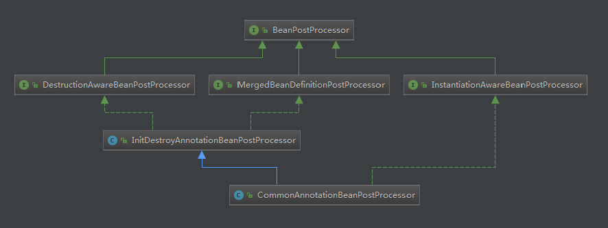

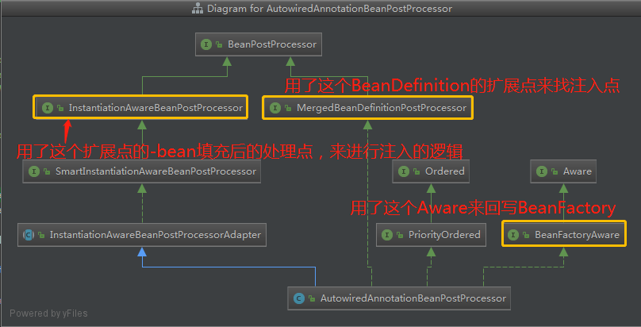

#### 1、@Autowired & @Value

功能都在后置处理器的实现类`org.springframework.beans.factory.annotation.AutowiredAnnotationBeanPostProcessor`

[@Autowired和@Value的源码流程图](springIOC.assets/@Autowired & @Value.png)

#### 1.1、注入容器

在创建后置处理器实现类的时候就调了setBeanFactory方法，将这个工厂注入了

```java
//回调BeanFactory的，是在初始化之前调用的
@Override
public void setBeanFactory(BeanFactory beanFactory) {
   if (!(beanFactory instanceof ConfigurableListableBeanFactory)) {
      throw new IllegalArgumentException(
            "AutowiredAnnotationBeanPostProcessor requires a ConfigurableListableBeanFactory: " + beanFactory);
   }
   this.beanFactory = (ConfigurableListableBeanFactory) beanFactory;
}
```

#### 1.2、找注入点

##### 在生命周期中的触发点

实现后置处理器`MergedBeanDefinitionPostProcessor#postProcessMergedBeanDefinition`的方法寻找注入点，在bean的生命周期中的BeanDefinition后置处理器调用的时候执行（在实例化---实例化后后置处理器之间）

```java
@Override
public void postProcessMergedBeanDefinition(RootBeanDefinition beanDefinition, Class<?> beanType, String beanName) {
    //找注入点
   InjectionMetadata metadata = findAutowiringMetadata(beanName, beanType, null);
   metadata.checkConfigMembers(beanDefinition);
}
```

##### findAutowiringMetadata

这个是找注入点的公共方法，先从缓存中找，找到就返回所有注入点，缓存有就去构建符合条件的注入点org.springframework.beans.factory.annotation.AutowiredAnnotationBeanPostProcessor #findAutowiringMetadata

```java
private InjectionMetadata findAutowiringMetadata(String beanName, Class<?> clazz, @Nullable PropertyValues pvs) {
   // Fall back to class name as cache key, for backwards compatibility with custom callers.
   String cacheKey = (StringUtils.hasLength(beanName) ? beanName : clazz.getName());
   // Quick check on the concurrent map first, with minimal locking.
   //将注入点缓存起来下次直接使用
   InjectionMetadata metadata = this.injectionMetadataCache.get(cacheKey);
   if (InjectionMetadata.needsRefresh(metadata, clazz)) {
      synchronized (this.injectionMetadataCache) {
         metadata = this.injectionMetadataCache.get(cacheKey);
         if (InjectionMetadata.needsRefresh(metadata, clazz)) {
            if (metadata != null) {
               metadata.clear(pvs);
            }
            // 扫描到@Autowired或@Value修饰的方法和属性，封装成InjectionMetadata对象。
            metadata = buildAutowiringMetadata(clazz);
            this.injectionMetadataCache.put(cacheKey, metadata);
         }
      }
   }
   return metadata;
}
```

#####  buildAutowiringMetadata

将满足条件的注入点构造出来org.springframework.beans.factory.annotation.AutowiredAnnotationBeanPostProcessor #buildAutowiringMetadata

```java
//删除了部分代码
private InjectionMetadata buildAutowiringMetadata(final Class<?> clazz) {
   do {
      // 通过反射从 targetClass 的 field 方法中去找 @Autowired或@Value
      ReflectionUtils.doWithLocalFields(targetClass, field -> {
         // 是否存在 @Autowired或@Value
         AnnotationAttributes ann = findAutowiredAnnotation(field);
         if (ann != null) {
            if (Modifier.isStatic(field.getModifiers())) {
               return;//静态的不处理
            }
            //required 为true表示这个依赖必须有不然就在后续依赖注入的时候就报错
            boolean required = determineRequiredStatus(ann);
            //存储field方式的注入点  new AutowiredFieldElement
            currElements.add(new AutowiredFieldElement(field, required));
         }
      });

      // 通过反射从 targetClass的method中去找 @Autowired或@Value
      ReflectionUtils.doWithLocalMethods(targetClass, method -> {
          // 是否存在 @Autowired或@Value
         AnnotationAttributes ann = findAutowiredAnnotation(bridgedMethod);
         if (ann != null && method.equals(ClassUtils.getMostSpecificMethod(method, clazz))) {
            if (Modifier.isStatic(method.getModifiers())) {
               return;//静态的不处理
            }
            if (method.getParameterCount() == 0) {
               //没有形参，打个日志
            }
             //required 为true表示这个依赖必须有不然就在后续依赖注入的时候就报错
            boolean required = determineRequiredStatus(ann);
             //生成方法属性的描述存储  
            PropertyDescriptor pd = BeanUtils.findPropertyForMethod(bridgedMethod, clazz);
            currElements.add(new AutowiredMethodElement(method, required, pd));
         }
      });

      elements.addAll(0, currElements);
      //还会递归的去找父类的注入点
      targetClass = targetClass.getSuperclass();
   }
   while (targetClass != null && targetClass != Object.class);

   return new InjectionMetadata(clazz, elements);
}
```

##### 如何判断是否有@Autowired或@Value

org.springframework.beans.factory.annotation.AutowiredAnnotationBeanPostProcessor#findAutowiredAnnotation

```java
//这是个Linked 按照插入顺序取出的，取出顺序 @Autowired @Value Inject
private final Set<Class<? extends Annotation>> autowiredAnnotationTypes = new LinkedHashSet<>(4);

//构造的时候就存储了  autowiredAnnotationTypes
public AutowiredAnnotationBeanPostProcessor() {
    this.autowiredAnnotationTypes.add(Autowired.class);
    this.autowiredAnnotationTypes.add(Value.class);
    try {
        this.autowiredAnnotationTypes.add((Class<? extends Annotation>)
             ClassUtils.forName("javax.inject.Inject",
                        		AutowiredAnnotationBeanPostProcessor.class.getClassLoader()));
    }
    catch (ClassNotFoundException ex) {
    }
}

@Nullable
private AnnotationAttributes findAutowiredAnnotation(AccessibleObject ao) {
   if (ao.getAnnotations().length > 0) { 
      //按照 autowiredAnnotationTypes 的顺序找 找到就返回这个注解信息---优先级@Autowired > @Value
      //所以@utowired中有required属性，优先处理这个就能兼顾里面属性的配置，而@Value只有一个value没有其他条件
      for (Class<? extends Annotation> type : this.autowiredAnnotationTypes) {
         AnnotationAttributes attributes = AnnotatedElementUtils
             .getMergedAnnotationAttributes(ao, type);
         if (attributes != null) {
            return attributes;
         }
      }
   }
   return null;
}
```

实际判断的是  @Autowired @Value @Inject   中的任意一个

返回的是注解信息，@Autowired注解有 required属性

##### 符合注入点的条件

- 有 @Autowired @Value @Inject   中的任意一个
- 不是静态的
- 方法参数的个数不能为空
- 注入点只在普通方法和属性上---这里找不到构造方法的


#### 1.3、注入的逻辑

##### 在生命周期中的触发点

实现后置处理器`MergedBeanDefinitionPostProcessor#postProcessProperties`的方法后，在属性填充后的后置处理器执行时进行注入处理

```java
@Override
public PropertyValues postProcessProperties(PropertyValues pvs, Object bean, String beanName) {
   //找注入点  找到所有的注入点包括父类的  这里直接从缓存中获取了所有的 注入点了
   InjectionMetadata metadata = findAutowiringMetadata(beanName, bean.getClass(), pvs);
   try {
      //开始处理注入
      metadata.inject(bean, beanName, pvs);
   }
   catch (BeanCreationException ex) {
      throw ex;
   }
   catch (Throwable ex) {
      throw new BeanCreationException(beanName, "Injection of autowired dependencies failed", ex);
   }
   return pvs;
}
```

##### 选择处理注入逻辑的类

###### InjectedElement

是个内部类    org.springframework.beans.factory.annotation.==InjectionMetadata.InjectedElement==

###### 实际处理注入逻辑的类

`@Autowired & @Value`方式使用如下：

```java
//@Autowired & @Value 方式的属性注入用的是AutowiredAnnotationBeanPostProcessor.AutowiredFieldElement#inject
//@Autowired & @Value 方式的方法注入用的是AutowiredAnnotationBeanPostProcessor.
AutowiredMethodElement#inject
```

`@Resource`方式使用如下：

```java
//org.springframework.beans.factory.annotation.InjectionMetadata.InjectedElement#inject
```


######  在哪里开始区分的？

`@Autowired & @Value`方式   在构建注入信息  的时候，按照field和method存储了不同的注入信息，都是AutowiredAnnotationBeanPostProcessor类的内部类---注入的时候就存放的是如下的不同对象，则在执行对象中的处理注入点的方法inject时，就分别走不同的实现方法了

```java
//两个@Autowired & @Value处理的内部类
private class AutowiredFieldElement extends InjectionMetadata.InjectedElement 
private class AutowiredMethodElement extends InjectionMetadata.InjectedElement

//这两个都继承了InjectionMetadata.InjectedElement类，都重写了处理注入点的方法inject
```

@Resource同样在自己的 构建注入信息的地方

###### 进入各自的处理方法

先从上面的方法进入`org.springframework.beans.factory.annotation.InjectionMetadata#inject`方法，在`inject`这个方法里面使用处理注入逻辑的类`InjectedElement` 这个对象是从注入点的缓存中获取的，而`@Autowired & @Value`方式和 `@Resource`方式的构建注入点的方式不同，所以生成的`InjectedElement` 也是不同的。---这里的方法`@Resource`也会进入只是实现方式不同

```java
public void inject(Object target, @Nullable String beanName, @Nullable PropertyValues pvs) throws Throwable {
   Collection<InjectedElement> checkedElements = this.checkedElements;
   Collection<InjectedElement> elementsToIterate =
         (checkedElements != null ? checkedElements : this.injectedElements);
   if (!elementsToIterate.isEmpty()) {
      for (InjectedElement element : elementsToIterate) {
         if (logger.isTraceEnabled()) {
            logger.trace("Processing injected element of bean '" + beanName + "': " + element);
         }
         //选择注入逻辑的类
         element.inject(target, beanName, pvs);
      }
   }
}
```


##### AutowiredFieldElement#inject

将缓存中的属性依赖信息封装为`DependencyDescriptor`对象，然后通过解析依赖的公共方法`resolveDependency`得到一个依赖对象，最后通过反射将对象注入当前bean的属性上

```java
//删除了部分代码
@Override
protected void inject(Object bean, @Nullable String beanName, @Nullable PropertyValues pvs) throws Throwable {
   Field field = (Field) this.member;
   Object value;
   if (this.cached) {
       //---怎么获取在resolveDependency中详解
      value = resolvedCachedArgument(beanName, this.cachedFieldValue);
   }
   else {
       //统一封装的依赖描述--这里是对属性方式的依赖的描述
      DependencyDescriptor desc = new DependencyDescriptor(field, this.required);
      desc.setContainingClass(bean.getClass());
      Set<String> autowiredBeanNames = new LinkedHashSet<>(1);
      Assert.state(beanFactory != null, "No BeanFactory available");
      TypeConverter typeConverter = beanFactory.getTypeConverter();
      try {
         // 返回属性值--这里是筛选依赖对象的公共方法
         value = beanFactory.resolveDependency(desc, beanName, autowiredBeanNames, typeConverter);
      }
      catch (BeansException ex) {
         throw new UnsatisfiedDependencyException(null, beanName, new InjectionPoint(field), ex);
      }
       //存入缓存
      synchronized (this) {
         
      }
   }
   if (value != null) {
      ReflectionUtils.makeAccessible(field);
      // 通过反射设置属性值
      field.set(bean, value);
   }
}
```

##### AutowiredMethodElement#inject

和属性的依赖注入类似，将缓存中的方法参数信息封装为`DependencyDescriptor`对象，然后通过解析依赖的公共方法`resolveDependency`得到一个依赖对象，最后通过调用该方法进行依赖注入

```java
//删除了部分代码
@Override
protected void inject(Object bean, @Nullable String beanName, 
                      @Nullable PropertyValues pvs) throws Throwable {
   //构造注入点的时候存储的方法信息   this.buildAutowiringMetadata
   Method method = (Method) this.member;
   Object[] arguments;
   if (this.cached) {
      //从缓存中获取---怎么获取在resolveDependency中详解
      arguments = resolveCachedArguments(beanName);
   }
   else {
      Class<?>[] paramTypes = method.getParameterTypes();
      arguments = new Object[paramTypes.length];
      DependencyDescriptor[] descriptors = new DependencyDescriptor[paramTypes.length];
      Set<String> autowiredBeans = new LinkedHashSet<>(paramTypes.length);
      Assert.state(beanFactory != null, "No BeanFactory available");
      //需要使用类型转化器 
      TypeConverter typeConverter = beanFactory.getTypeConverter();
      
      for (int i = 0; i < arguments.length; i++) {
         
         MethodParameter methodParam = new MethodParameter(method, i);
         //根据注入点的方法参数信息 构建方法的依赖描述
         DependencyDescriptor currDesc = new DependencyDescriptor(methodParam, this.required);
         currDesc.setContainingClass(bean.getClass());
         descriptors[i] = currDesc;
         //使用解析依赖的公共方法去获取唯一的依赖对象
         Object arg = beanFactory.resolveDependency(currDesc, beanName, 
                                                    autowiredBeans, typeConverter);
      }
      //放缓存
      synchronized (this) {}
   }
   if (arguments != null) {
      //使用方法的invoke进行依赖的注入，直接调用该方法
      method.invoke(bean, arguments);
   }
}
```


### 2、@Resource

这个使用的是org.springframework.context.annotation.CommonAnnotationBeanPostProcessor

查找注入点和@Autowired一样org.springframework.context.annotation.CommonAnnotationBeanPostProcessor#postProcessMergedBeanDefinition

从BeanFactory中找，这个BeanFactory不是spring容器的，是jvm的。

判断参数只能有一个，否则就抛异常

org.springframework.context.annotation.CommonAnnotationBeanPostProcessor#buildResourceMetadata


进行注入的地方也是和@Autowired一样的org.springframework.context.annotation.CommonAnnotationBeanPostProcessor#postProcessProperties

org.springframework.beans.factory.annotation.InjectionMetadata#inject

org.springframework.beans.factory.annotation.InjectionMetadata.InjectedElement#inject

org.springframework.context.annotation.CommonAnnotationBeanPostProcessor.ResourceElement #getResourceToInject

org.springframework.context.annotation.CommonAnnotationBeanPostProcessor#getResource

org.springframework.context.annotation.CommonAnnotationBeanPostProcessor#autowireResource

## 依赖注入重要组件

### DependencyDescriptor

不管是xml的自动注入还是注解的，都会使用。是对被依赖的对象的一种封装，是解析依赖的 公共方法`resolveDependency`的入参，解析依赖就是根据这个对象进行的 

①  xml中的byType如果构造

byName不用构造，因为直接getBean了

```java
DependencyDescriptor desc = new AutowireByTypeDependencyDescriptor(methodParam, eager);
//这里就是解决依赖的方法，传进来的可以是依赖描述 DependencyDescriptor
Object autowiredArgument = resolveDependency(desc, beanName, autowiredBeanNames, converter);
```

②   @Autowired中的method

```java
DependencyDescriptor[] descriptors = new DependencyDescriptor[paramTypes.length];
```

③   @Autowired中的field

```java
DependencyDescriptor desc = new DependencyDescriptor(field, this.required);
```


### InjectedElement

org.springframework.beans.factory.annotation.InjectionMetadata.InjectedElement   InjectionMetadata的内部类

==注入点的描述类==，他所产生的 一个对象就是 一个注入点，不管是方法的还是属性的。类的内置了对自己这个注入点的解析逻辑。

```java
//存储了属性或方法的所有信息---类型、名字、参数列表等
protected final Member member;
protected final boolean isField;
@Nullable
protected final PropertyDescriptor pd;
@Nullable
protected volatile Boolean skip;
//构造器
protected InjectedElement(Member member, @Nullable PropertyDescriptor pd) {
   //java中对属性和方法的抽象  Member
   this.member = member;
   this.isField = (member instanceof Field);//区分是方法还是属性
    //属性的描述---get  set 等
   this.pd = pd;
}
//内置的inject方法，用来解析依赖的入口
protected void inject(Object target, @Nullable String requestingBeanName, 
                      @Nullable PropertyValues pvs) throws Throwable {}
```

@Autowired & @Value  方式的依赖注入在后置处理器中定义了两个内部类来继承这个类，并重写了inject方法

org.springframework.beans.factory.annotation.AutowiredAnnotationBeanPostProcessor.AutowiredFieldElement org.springframework.beans.factory.annotation.AutowiredAnnotationBeanPostProcessor.AutowiredMethodElement        这两个子类也是同样的功能，用来描述`@Autowired & @Value`方式的依赖注入的注入点的描述，定义了缓存对象，方法定义了一个数组用来存放多个参数的依赖描述，属性的定义了一个对象来存储依赖描述。---这个依赖描述是什么见--详解resolveDependency---0.2 理解-对解析后的依赖进行缓存操作

InjectionMetadata作为它 的父类就是  注入点的容器，==存储了一个bean的所有注入点==                                                                                        

```java
@Nullable
//存储了注入点
private volatile Set<InjectedElement> checkedElements;
```


## 详解resolveDependency

2020-11-20 21:00  源码：43：39

org.springframework.beans.factory.support.DefaultListableBeanFactory#resolveDependency

目的就是：解析依赖

[原理图](springIOC.assets/resolveDependency-原理图.png)

### 原理

```java
1、先判断依赖描述的类型是否为Optional、ObjectFactory、javax.inject.Provider----有就返回了
2、都不是的话就判断依赖描述中是否有 `@Lazy`注解---有就使用代理对象返回
3、以上都不是，就进入doResolveDependency方法
4、是否加了@Value----有就返回了
5、以上都不满足，判断依赖描述的类型是否为集合---是的话就利用方法findAutowireCandidates返回所有type符合的
6、若byType没有找到，判断当前@Autowired的属性required是否为true---为true就抛异常，为false就返回null
7、若byType找到了一个----直接返回这个对象
8、若byType找到了多个且有被@Primary标注的对象----选择被标注的对象返回（多个@Primary被标注就抛异常）
9、若byType找到了多个且有被@Priority标注的对象----选择被标注的对象里面优先级最高的返回（多个最高被标注就抛异常）
10、以上都不满足且byType找到了多个，那就根据依赖描述中的beanName来确定唯一的一个
    若不能确定唯一的一个，判断当前@Autowired的属性required是否为true---为true就抛异常，为false就返回null
    能确定，就返回这个对象，不是实例化的对象就拿着bean的名字getBean
```


### 入参和返回值

```
入参
dependencyDescriptor    依赖描述
requestingBeanName      当前需要依赖注入的bean的名字    
autowiredBeanNames	    依赖对象的bean的名字
typeConverter	        类型转化器

返回 Object   		就是唯一的依赖对象
```


#### 0. DependencyDescriptor

依赖描述，这里指的是需要处理为注入依赖的一种封装，不管是属性注入还是方法的注入都是这个定义

例如：在byType中PropertyDescriptor得到的是set方法的信息，而byType只根据参数的类型进行匹配，所以byType的时候只将参数类型set到DependencyDescriptor对象中

在@Autowired中，DependencyDescriptor对象中需要参数类型还需要参数名，所以在注入的时候统一都是根据这个对象来进行处理的。

#### 0.1 ShortcutDependencyDescriptor

依赖描述的快照，这个类描述的是解析依赖后，对依赖对象的beanName和type的封装，存储了依赖描述和最终解析依赖产生的依赖对象的beanName和type的映射关系。

重写了父类`DependencyDescriptor`的`resolveShortcut`方法，是`AutowiredAnnotationBeanPostProcessor`的内部类org.springframework.beans.factory.annotation.AutowiredAnnotationBeanPostProcessor.ShortcutDependencyDescriptor

```java
private static class ShortcutDependencyDescriptor extends DependencyDescriptor {
   /**
    * ShortcutDependencyDescriptor 是快照   就是表示之前缓存过的依赖
    * 当byType找到某个bean后，会利用一个ShortcutDependencyDescriptor 来存储当前 依赖 对应的 bean的名字   shortcut来存储
    *
    * 下次找依赖就直接根据  依赖描述对象、解析依赖后产生的beanName、被依赖的对象类型    来直接getBean一个依赖对象
    *
    * 为什么不直接缓存依赖对象，考虑的是多例的情况，所以每次把依赖对象的名字和类型拿到直接走一遍getBean就可以了
    */ 
   private final String shortcut;

   private final Class<?> requiredType;

   public ShortcutDependencyDescriptor(DependencyDescriptor original, String shortcut, Class<?> requiredType) {
      super(original);
      this.shortcut = shortcut;
      this.requiredType = requiredType;
   }

   @Override
   public Object resolveShortcut(BeanFactory beanFactory) {
       //拿着依赖对象的beanName和type直接getBean出对象
      return beanFactory.getBean(this.shortcut, this.requiredType);
   }
}
```


### 1、 Optional

DependencyDescriptor的类型是Optional

```java
//1、先 判断属性的类型  Optional   ObjectFactory   其它的
if (Optional.class == descriptor.getDependencyType()) {
    return createOptionalDependency(descriptor, requestingBeanName);
}
```

org.springframework.beans.factory.support.DefaultListableBeanFactory#createOptionalDependency

==调后序的doResolveDependency方法 继续筛选出一个bean 然后封装到Optional中==

这里没有延迟加载

### 2、 ObjectFactory

DependencyDescriptor是ObjectFactory

```java
if (ObjectFactory.class == descriptor.getDependencyType() ||
         ObjectProvider.class == descriptor.getDependencyType()) {
    // 在org.springframework.beans.factory.support.DefaultListableBeanFactory.
    //DependencyObjectProvider.getObject()
    //这里调用了 createOptionalDependency方法---Optional也调用的
    return new DependencyObjectProvider(descriptor, requestingBeanName);
}
```

org.springframework.beans.factory.support.DefaultListableBeanFactory.DependencyObjectProvider

这里的getObject()  方法调用了Optional 的  createOptionalDependency方法完成后序

这里相当于延迟加载，因为先是返回的一个DependencyObjectProvider对象，只有当调用getObject的时候才会调用Optional 的  createOptionalDependency方法完成后序


### 3、 @lazy

依赖描述中有@Lazy，即注入点上有@Lazy注解

懒加载的==直接返回一个代理对象==

```java
//2、 判断 是否是懒加载 @Lazy  是：返回代理对象  当代理对象被调用，即属性被使用的时候才会去创建被注入的对象
Object result = getAutowireCandidateResolver().getLazyResolutionProxyIfNecessary(
      descriptor, requestingBeanName);
if (result == null) {
   //3、 开始后续的筛选
   result = doResolveDependency(descriptor, requestingBeanName, autowiredBeanNames, typeConverter);
}
return result;
```

### 4、doResolveDependency 6次筛选

org.springframework.beans.factory.support.DefaultListableBeanFactory#doResolveDependency

### 1、 从缓存中获取已经解析过的依赖

**多例的场景才有**

例： `AutowiredFieldElement#inject`里面对 缓存  的操作   分析

首先这个方法是在内部类`AutowiredAnnotationBeanPostProcessor.AutowiredFieldElement`中，这个类继承了注入点描述类`InjectedElement`。在InjectedElement的描述中说明了内部的关系。

理解了这个类的描述后，类的属性就是每个需要依赖注入的属性独有的了。 `this.cached`就是每个依赖描述独有的。如果这个属性之前被处理过，`this.cached = true`

原理：

1、一开始是没有缓存的，所以先执行解析依赖操作`resolveDependency`,处理完后产生了可以缓存的对象

```
返回的
`value`是解析出来的唯一的依赖对象，
`desc`是依赖描述，
`autowiredBeanNames`是这个依赖对象的beanName集合（考虑别名）,
`typeConverter`是类型转化器
```

2、考虑缓存的内容是什么？

因为有一种scope是prototype类型，所以这里缓存的依赖对象如果是个原型的，那每次从缓存拿的都是这第一次产出的对象，所以缓存的内容不能是这个依赖对象`value`。==缓存的是这个依赖对象的beanName和type==。即`autowiredBeanNames`和`field.getType()`

3、封装缓存内容ShortcutDependencyDescriptor

为了方便拿缓存，第二次进入`inject`方法一定也是这个bean构建的时候，只有多例的场景，这里封装了属性描述、依赖对象的beanName、依赖对象的类型。这里放入依赖描述是为了从缓存中获取依赖对象的时候要用

```java
//删除了部分代码
@Override
protected void inject(Object bean, @Nullable String beanName, @Nullable PropertyValues pvs) throws Throwable {
   Field field = (Field) this.member;
   Object value;
   if (this.cached) {
       //从缓存中获取
      value = resolvedCachedArgument(beanName, this.cachedFieldValue);
   }
   else {
      //统一封装的依赖描述--这里是对属性方式的依赖的描述
      DependencyDescriptor desc = new DependencyDescriptor(field, this.required);
      desc.setContainingClass(bean.getClass());
      Set<String> autowiredBeanNames = new LinkedHashSet<>(1);
      Assert.state(beanFactory != null, "No BeanFactory available");
      TypeConverter typeConverter = beanFactory.getTypeConverter();
      // 返回属性值--这里是筛选依赖对象的公共方法   desc是依赖描述  beanName是当前需要依赖注入的bean的名字
      // autowiredBeanNames 是返回的依赖对象的bean的名字（有别名） typeConverter 是类型转换器
      value = beanFactory.resolveDependency(desc, beanName, autowiredBeanNames, typeConverter);
      synchronized (this) {
         if (!this.cached) {
            if (value != null || this.required) {
               this.cachedFieldValue = desc;
               registerDependentBeans(beanName, autowiredBeanNames);
               // 如果没有别名 我就缓存这个依赖的beanName   desc 和 autowiredBeanName 、 type
               if (autowiredBeanNames.size() == 1) {
                  String autowiredBeanName = autowiredBeanNames.iterator().next();
                  if (beanFactory.containsBean(autowiredBeanName) &&
                        beanFactory.isTypeMatch(autowiredBeanName, field.getType())) {
                     //以快照的方式进行缓存  ShortcutDependencyDescriptor 是 DependencyDescriptor子类，
                     // 重写了 resolveShortcut 方法
                     this.cachedFieldValue = new ShortcutDependencyDescriptor(
                           desc, autowiredBeanName, field.getType());
                  }
               }
            }
            else {
               this.cachedFieldValue = null;
            }
             //处理过的依赖就可以从缓存中获取
            this.cached = true;
         }
      }
   }
}
```

4、从缓存中获取，由于第一次依赖注入的时候将`cached`设置为了true，所以可以直接进入缓存获取 resolvedCachedArgument

这里又去调用了解析依赖的方法，但是此时的依赖描述对象是`ShortcutDependencyDescriptor`,重写了`resolveShortcut`方法，能直接拿着依赖对象的beanName和type进行`getBean`

```java
@Nullable
private Object resolvedCachedArgument(@Nullable String beanName, @Nullable Object cachedArgument) {
   if (cachedArgument instanceof DependencyDescriptor) {
      DependencyDescriptor descriptor = (DependencyDescriptor) cachedArgument;
      Assert.state(this.beanFactory != null, "No BeanFactory available");
      //这里是缓存获取，走到解析依赖里面是因为，当前 DependencyDescriptor 是一个 快照ShortcutDependencyDescriptor
      //在resolveDependency的doResolveDependency里面有直接根据快照拿依赖对象的-----这个流程实现了缓存的功效
      return this.beanFactory.resolveDependency(descriptor, beanName, null, null);
   }
   else {
      return cachedArgument;
   }
}
```

org.springframework.beans.factory.support.DefaultListableBeanFactory#resolveDependency org.springframework.beans.factory.support.DefaultListableBeanFactory#doResolveDependency

org.springframework.beans.factory.annotation.AutowiredAnnotationBeanPostProcessor.ShortcutDependencyDescriptor

```java
//删除了部分代码
@Nullable
public Object doResolveDependency(DependencyDescriptor descriptor, @Nullable String beanName,
      @Nullable Set<String> autowiredBeanNames, @Nullable TypeConverter typeConverter) throws BeansException {
	//如果存在快照就直接使用快照拿去---前提 是 Descriptor是 ShortcutDependencyDescriptor 
    // 才会执行快照获取，否则返回的shortcut==null
    Object shortcut = descriptor.resolveShortcut(this);
    if (shortcut != null) {
        return shortcut;
    }
}
```

org.springframework.beans.factory.annotation.AutowiredAnnotationBeanPostProcessor.ShortcutDependencyDescriptor#resolveShortcut

```java
@Override
public Object resolveShortcut(BeanFactory beanFactory) {
   //拿着依赖对象的beanName和type直接getBean出对象
   return beanFactory.getBean(this.shortcut, this.requiredType);
}
```


### 7.1 @Value

是否存在@value  ==直接通过byName的方式返回依赖对象==

```java
// 4、 判断是否有@Value注解 有就返回注解内容并解析，就不会再往下走了
Object value = getAutowireCandidateResolver().getSuggestedValue(descriptor);
if (value != null) {
   // 注解的内容是字符串
   if (value instanceof String) {
      String strVal = resolveEmbeddedValue((String) value);
      //从合并的MBD中获取被依赖的BeanDefinition
      BeanDefinition bd = (beanName != null && containsBean(beanName) ?
            getMergedBeanDefinition(beanName) : null);
      //根据字符串 通过byName 找到唯一的一个bean对象返回
      // 最终会调 org.springframework.beans.factory.support.AbstractBeanFactory.doResolveBeanClass获取bean
      value = evaluateBeanDefinitionString(strVal, bd);
   }
   TypeConverter converter = (typeConverter != null ? typeConverter : getTypeConverter());
   try {
      // 有@Value就直接返回了，不会往下走了
      return converter.convertIfNecessary(value, type, descriptor.getTypeDescriptor());
   }
   catch (UnsupportedOperationException ex) {
      // A custom TypeConverter which does not support TypeDescriptor resolution...
      return (descriptor.getField() != null ?
            converter.convertIfNecessary(value, type, descriptor.getField()) :
            converter.convertIfNecessary(value, type, descriptor.getMethodParameter()));
   }
}
```

### 7.2  multipleBeans--数组-Map-集合

```java
// 5、判断 被解析的类型是否是 数组 、 Collection  、 Map  通过byType查到所有的bean返回
Object multipleBeans = resolveMultipleBeans(descriptor, beanName, autowiredBeanNames, typeConverter);
if (multipleBeans != null) {
   return multipleBeans;
}
```

resolveMultipleBeans这里直接调用下面的byType方法获取所有符合type类型的实例化的bean，注入到对应的容器中

### 7.3  findAutowireCandidates--byType

这个方法返回的是个map，map的key是找到的依赖对象的beanName，value是找到的依赖对象或者class对象（因为还没有创建出来）。map的key不同（beanName），但是value都是这个类型的对象或者class对象。

例如：{ cat1:Cat对象, cat2:Cat的class对象 }


根据类型从BeanFactory中找bean，是利用了BeanDefinition中的type属性来找的，所有符合条件的BeanDefinition或者bean对象都会被找出来，不需要实例化后才知道该bean的类型，我在BeanDefinition的时候就知道了这个bean的类型

这里有两个问题：找bean一定是找对象吗？根据类型找bean找到几个 ？

这里获取了所有符合类型的bean（这个bean可能没有实例化，只是个class），如果没有获取到就 抛异常了

```java
// 6、byType 查找自动装配的bean
//返回的是一个Map，表示会根据type去找bean，
// map的key是beanName value是bean的class对象（注意这里的class对象是BeanDefinition中的beanClass;/*这里为什么是object，因为可能是未创建的Class对象*/）
//这里不负责实例化bean，因为这里找出来的是byType，不一定是最终需要 的 bean 等到最后找到唯一 的一个后再实例化依赖的bean
Map<String, Object> matchingBeans = findAutowireCandidates(beanName, type, descriptor);
if (matchingBeans.isEmpty()) {
   if (isRequired(descriptor)) {
      raiseNoMatchingBeanFound(type, descriptor.getResolvableType(), descriptor);
   }
   return null;
}
```

==org.springframework.beans.factory.support.DefaultListableBeanFactory#findAutowireCandidates==

==这个关键方法==

1. 找出BeanFactory中类型为type的所有的Bean的名字，注意是名字，而不是Bean对象，因为我们可以根据BeanDefinition就能判断和当前type是不是匹配
2. 把resolvableDependencies中key为type的对象找出来并添加到result中
3. 遍历根据type找出的beanName，判断当前beanName对应的Bean是不是能够被自动注入
4. 先判断beanName对应的BeanDefinition中的autowireCandidate属性，如果为false，表示不能用来进行自动注入，如果为true则继续进行判断
5. 判断当前type是不是泛型，如果是泛型是会把容器中所有的beanName找出来的，如果是这种情况，那么在这一步中就要获取到泛型的真正类型，然后进行匹配，如果当前beanName和当前泛型对应的真实类型匹配，那么则继续判断
6. 如果当前DependencyDescriptor上存在@Qualifier注解，那么则要判断当前beanName上是否定义了Qualifier，并且是否和当前DependencyDescriptor上的Qualifier相等，相等则匹配
7. 经过上述验证之后，当前beanName才能成为一个可注入的，添加到result中

org.springframework.beans.factory.support.DefaultListableBeanFactory#findAutowireCandidates

这里的筛选逻辑在：

```java
for (String candidate : candidateNames) {
   if (!isSelfReference(beanName, candidate) && isAutowireCandidate(candidate, descriptor)) {
      // 获取到依赖对象 key(属性)--value（bean）方式添加到 map
      addCandidateEntry(result, candidate, descriptor, requiredType);
   }
}
```

org.springframework.beans.factory.support.DefaultListableBeanFactory#isAutowireCandidate

```java 
@Override
public boolean isAutowireCandidate(String beanName, DependencyDescriptor descriptor)
      throws NoSuchBeanDefinitionException {

   return isAutowireCandidate(beanName, descriptor, getAutowireCandidateResolver());
}
```

```java
AutowireCandidateResolver resolver = ContextAnnotationAutowireCandidateResolver
```

这里有个解析器

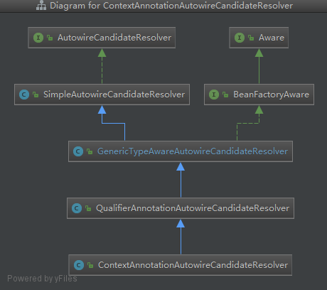

所以是会经过三层筛选的----Simple--Generic---Qualifier

SimpleAutowireCandidateResolver  ： 可以配置当前bean为非候选的bean    xml中也可以配置

```java
<bean autowire-candidate="false" class="bat.ke.qq.com.bean.MyBeanFactoryPostProcessor" name="myBeanFactoryPostProcessor"/>
```


GenericTypeAwareAutowireCandidateResolver：匹配参数类型是否一致    泛型的类型也是这里处理的


QualifierAnnotationAutowireCandidateResolver：判断是否Qualifier  是否匹配


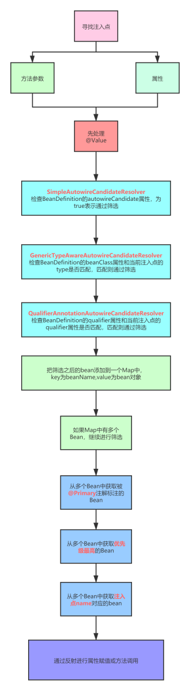

### 7.4 byType返回多个

通过byName的方式决定最终一个beanName，然后拿着这个beanName去matchingBeans（byType返回Map）中得到bean（也是有可能是Class的）

```java
if (matchingBeans.size() > 1) {
   // 确定自动装配的beanName
   //7、 byType结果大有1个  byName来决定最终的一个Bean
   autowiredBeanName = determineAutowireCandidate(matchingBeans, descriptor);
   if (autowiredBeanName == null) {
      //isRequired是默认为true的 就是必须要有依赖存在的  也可以配置
      if (isRequired(descriptor) || !indicatesMultipleBeans(type)) {
         return descriptor.resolveNotUnique(descriptor.getResolvableType(), matchingBeans);
      }
      else {
         // In case of an optional Collection/Map, silently ignore a non-unique case:
         // possibly it was meant to be an empty collection of multiple regular beans
         // (before 4.3 in particular when we didn't even look for collection beans).
         return null;
      }
   }
   instanceCandidate = matchingBeans.get(autowiredBeanName);
}
```

### 7.4.1 byName来决定最终的

org.springframework.beans.factory.support.DefaultListableBeanFactory#determineAutowireCandidate

### 7.4.1.1  @primary

```java 
// 优先获取@primary修饰的  有多个@primary 直接抛异常  返回的是BeanName
String primaryCandidate = determinePrimaryCandidate(candidates, requiredType);
if (primaryCandidate != null) {
   return primaryCandidate;
}
```

### 7.4.1.2  @priority

```java 
// 使用了@priority 修饰的  越小的值优先级越高  有相同的优先级就报错 返回的也是beanName
String priorityCandidate = determineHighestPriorityCandidate(candidates, requiredType);
if (priorityCandidate != null) {
   return priorityCandidate;
}
```

### 7.4.1.3  找到和属性名一致的BeanName

```java
// Fallback
      for (Map.Entry<String, Object> entry : candidates.entrySet()) {
         String candidateName = entry.getKey();
         Object beanInstance = entry.getValue();
         if ((beanInstance != null && this.resolvableDependencies.containsValue(beanInstance)) ||
//             判断属性名是否一致
               matchesBeanName(candidateName, descriptor.getDependencyName())) {
            return candidateName;
         }
      }
```

### 7.5 byType返回一个

直接就是这一个对象了

### 7.6  结果是class就实例化依赖Bean

### 7.7  判断isRequired

### Spring中的Qualifier应用


## 自己注入自己

按照正常逻辑来说，对于注入点：

```
@Autowired
private UserService userService;
```

会先根据UserService类型去找Bean，找到两个，然后根据属性名字“userService”找到一个beanName为userService的Bean，但是我们直接运行Spring，会发现注入的是“userService1”的那个Bean。


这是因为Spring中进行了控制，尽量“**自己不注入自己**”。

源码在org.springframework.beans.factory.support.DefaultListableBeanFactory#findAutowireCandidates

中

```java
!isSelfReference(beanName, candidate)
```


# 推断构造方法

2020-11-01


# Bean的销毁过程

2020-10-22 周四 20:00-22:00  1:29:00

销毁，手动applicationContext.close()

自动：jvm提供了一个钩子`((ClassPathXmlApplicationContext) context).registerShutdownHook();`

销毁方法：①实现org.springframework.beans.factory.DisposableBean 重写destroy方法②`@PreDestroy`

## 总结：

CommonAnnotationBeanPostProcessor   extends     InitDestroyAnnotationBeanPostProcessor

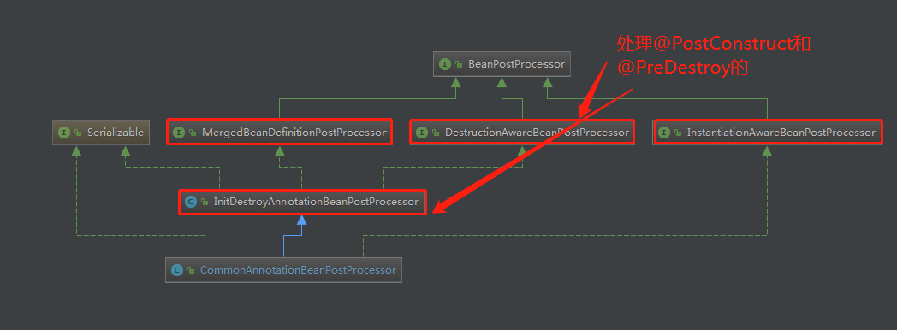

创建一个bean的时候（**doCreateBean**方法）在最后会利用后置处理器CommonAnnotationBeanPostProcessor的父类**InitDestroyAnnotationBeanPostProcessor**也是后置处理器，

### 1、postProcessMergedBeanDefinition

org.springframework.beans.factory.annotation.InitDestroyAnnotationBeanPostProcessor #postProcessMergedBeanDefinition

利用生命周期中的BeanDefinition后置处理器postProcessMergedBeanDefinition方法来扫描出---**找`@PreDestroy`和`@PostConstruct`的注入点

### 2、postProcessBeforeInitialization

org.springframework.beans.factory.annotation.InitDestroyAnnotationBeanPostProcessor #postProcessBeforeInitialization

利用生命周期中的初始化前调用 **执行`@PostConstruct` 方法**

### 3、postProcessBeforeDestruction

org.springframework.beans.factory.annotation.InitDestroyAnnotationBeanPostProcessor #postProcessBeforeDestruction

利用生命周期中的销毁注册后置处理器  来**判断是否是销毁的注入点PreDestroy**   这里将bean上有

①实现 DisposableBean接口 或 AutoCloseable接口 

②BeanDefinition中有destroyMethodName方法

③@PreDestroy注解

都存储到容器  org.springframework.beans.factory.support.DefaultSingletonBeanRegistry#disposableBeans中

### 4、在调用 容器的close方法  去销毁

org.springframework.context.support.AbstractApplicationContext#close中遍历`disposableBeans` 去执行destroy方法（适配器）


## @PreDestroy的注册

这里将**@PreDestroy** 或者 **实现了 DisposableBean 接口**的 单例的  bean都注册到了`org.springframework.beans.factory.support.DefaultSingletonBeanRegistry#disposableBeans`属性上

org.springframework.beans.factory.support.AbstractAutowireCapableBeanFactory#doCreateBean

```java
// Register bean as disposable.
try {
   // 将bean注册为可以销毁   DestructionAwareBeanPostProcessor bean的销毁后置处理器
   // 第九次调用后置处理器  这里先注册需要执行销毁方法的bean
   //这里将@PreDestroy 或者 实现了 DisposableBean 接口的 单例的  bean都注册到了org.springframework.beans.factory.support.DefaultSingletonBeanRegistry#disposableBeans属性上
   registerDisposableBeanIfNecessary(beanName, bean, mbd);
}
catch (BeanDefinitionValidationException ex) {
   throw new BeanCreationException(
         mbd.getResourceDescription(), beanName, "Invalid destruction signature", ex);
}
```

org.springframework.beans.factory.support.AbstractBeanFactory#registerDisposableBeanIfNecessary

这里筛选出需要执行销毁方法的bean，使用了后置处理器的方法org.springframework.beans.factory.annotation.InitDestroyAnnotationBeanPostProcessor #requiresDestruction

```java
@Override
public boolean requiresDestruction(Object bean) {
    //判断这个bean是否有@PreDestroy注解
   return findLifecycleMetadata(bean.getClass()).hasDestroyMethods();
}
```


## close()

org.springframework.context.support.AbstractApplicationContext#close

org.springframework.context.support.AbstractApplicationContext#doClose

### 1. 容器关闭


### 2. 发布ContextClosedEvent事件

```java
try {
   // Publish shutdown event.
   publishEvent(new ContextClosedEvent(this));
}
```

### 3. 调用LifecycleProcessor的onClose方法

### 4. 销毁单例Bean

这里将之前注册到 `disposableBeans`容器中的bean都遍历执行对应的destroy方法

```java
destroyBeans();
```

org.springframework.context.support.AbstractApplicationContext#destroyBeans

```java
protected void destroyBeans() {
   getBeanFactory().destroySingletons();
}
```

org.springframework.beans.factory.support.DefaultListableBeanFactory#destroySingletons

```java
@Override
public void destroySingletons() {
   super.destroySingletons();
   this.manualSingletonNames.clear();
   clearByTypeCache();
}
```

先走父类的

org.springframework.beans.factory.support.DefaultSingletonBeanRegistry#destroySingletons

org.springframework.beans.factory.support.DefaultSingletonBeanRegistry#destroySingleton

org.springframework.beans.factory.support.DefaultSingletonBeanRegistry#destroyBean

```java
try {
   //这里执行了实现disposableBeans容器中的 bean的destroy销毁方法
   bean.destroy();
}
```

org.springframework.beans.factory.support.DisposableBeanAdapter#destroy   适配器模式

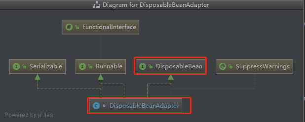

```java
@Override
public void destroy() {
   // 适配器模式
   // 销毁bean前调用后置处理器  DestructionAwareBeanPostProcessor.postProcessBeforeDestruction

   if (!CollectionUtils.isEmpty(this.beanPostProcessors)) {
      for (DestructionAwareBeanPostProcessor processor : this.beanPostProcessors) {
         // @PreDestroy
         processor.postProcessBeforeDestruction(this.bean, this.beanName);
      }
   }

   if (this.invokeDisposableBean) {
      if (logger.isTraceEnabled()) {
         logger.trace("Invoking destroy() on bean with name '" + this.beanName + "'");
      }
      try {
         if (System.getSecurityManager() != null) {
            AccessController.doPrivileged((PrivilegedExceptionAction<Object>) () -> {
               ((DisposableBean) this.bean).destroy();
               return null;
            }, this.acc);
         }
         else {
            // 实现 DisposableBean
            ((DisposableBean) this.bean).destroy();
         }
      }
      catch (Throwable ex) {
      }
   }

   if (this.destroyMethod != null) {
   }
   else if (this.destroyMethodName != null) {
    
   }
}
```


再走子类的

org.springframework.beans.factory.support.DefaultListableBeanFactory#destroySingletons


1. 找出所有DisposableBean(实现了DisposableBean接口的Bean)
2. 遍历每个DisposableBean
3. 找出依赖了当前DisposableBean的其他Bean，将这些Bean从单例池中移除掉
4. 调用DisposableBean的destroy()方法
5. 找到当前DisposableBean所包含的inner beans，将这些Bean从单例池中移除掉 (inner bean参考https://docs.spring.io/spring-framework/docs/current/spring-framework-reference/core.html#beans-inner-beans)

**
**

这里涉及到一个设计模式：**适配器模式**

org.springframework.beans.factory.support.AbstractBeanFactory#registerDisposableBeanIfNecessary

```java
if (mbd.isSingleton()) {
				// Register a DisposableBean implementation that performs all destruction
				// work for the given bean: DestructionAwareBeanPostProcessors,
				// DisposableBean interface, custom destroy method.
				// 把当前bean 注册到 disposableBeans 中
				//然后容器在调用close方法的时候会从 disposableBeans 中找出来所有的bean开始执行bean的destroy方法

				//适配器模式，将所有类型的销毁==
				// （实现 DisposableBean接口 或 AutoCloseable接口 或  BeanDefinition中有destroyMethodName方法 或   @PreDestroy注解）  ---  分--总
				// 都封装为一个适配器 DisposableBeanAdapter ，然后再调用close的时候，直接强转为 DisposableBean
				// 调用destroy实际上调用的是子类 DisposableBeanAdapter 的destroy方法 ，在这个destroy 方法中再来分类执行      --- 总---分


				registerDisposableBean(beanName,
						new DisposableBeanAdapter(bean, beanName, mbd, getBeanPostProcessors(), acc));
			}
```

在销毁时，Spring会找出实现了DisposableBean接口的Bean。

# 扩展点FactoryBean

## 创建FactoryBean 放入单例池

放入的是《myFactoryBean-FactoryBean》

在创建单例Bean之前的准备过程中，就自动的创建了FactoryBean

```java
if (isFactoryBean(beanName)) {
    //这里是容器启动加载的FactoryBean --- beanName规则是使用 别名 &myFactoryBean 存储在单例池中
   Object bean = getBean(FACTORY_BEAN_PREFIX + beanName);
   if (bean instanceof FactoryBean) {
      final FactoryBean<?> factory = (FactoryBean<?>) bean;
      boolean isEagerInit;
      if (System.getSecurityManager() != null && factory instanceof SmartFactoryBean) {
         isEagerInit = AccessController.doPrivileged((PrivilegedAction<Boolean>)
                     ((SmartFactoryBean<?>) factory)::isEagerInit,
               getAccessControlContext());
      }
      else {
         isEagerInit = (factory instanceof SmartFactoryBean &&
               ((SmartFactoryBean<?>) factory).isEagerInit());
      }
      if (isEagerInit) {
         getBean(beanName);
      }
   }
}
```

在启动过程中就创建了MyBeanDefinition ，调用了`getBean(FACTORY_BEAN_PREFIX + beanName)`方法，存储到了单例池中，beanName是&myBeanDefiniton


## 获取FactoryBean  和  getObject  的 处理

### 入口

在doGetBean中，从单例池中获取了FactoryBean后，（如果传进来的beanName是&myFactoryBean，会通过beanName转化器变成myFactoryBean，所以还是会从单例池中获取到第一步的FactoryBean对象）

进一步处理了FactoryBean--因为存在&和getObject的区别

org.springframework.beans.factory.support.AbstractBeanFactory#doGetBean

```java
//转换对应的beanName
// 1.带&前缀的去掉前缀
// 2.从aliasMap中找name对应id，bean没有配id就用name
final String beanName = transformedBeanName(name);
//这里一定会拿到myFactoryBean,因为beanName总是myFactoryBean
Object sharedInstance = getSingleton(beanName);
if (sharedInstance != null && args == null) {
    // 普通bean和factoryBean的判断   注意name是传进来的，beanName是单例池中的myFactoryBean 
    bean = getObjectForBeanInstance(sharedInstance, name, beanName, null);
}
```


org.springframework.beans.factory.support.AbstractBeanFactory#getObjectForBeanInstance

### &myFactoryBean的处理

如果传进来的name 是&myFactoryBean 就直接返回单例池中的FactoryBean

```java
//  涉及FactoryBean的判断，直接返回普通bean的条件    类型是否是FactoryBean || name首字符是否是&
if (!(beanInstance instanceof FactoryBean) || BeanFactoryUtils.isFactoryDereference(name)) {
    
   return beanInstance;
}
```


### myFactoryBean的处理

#### 从FactoryBean的缓存中获取

FactoryBean的缓存容器是org.springframework.beans.factory.support.FactoryBeanRegistrySupport#==factoryBeanObjectCache==

```java
private final Map<String, Object> factoryBeanObjectCache = new ConcurrentHashMap<>(16);
```

```java
if (mbd == null) {
   //从Bean工厂缓存中获取Bean的实例对象   避免多例
   object = getCachedObjectForFactoryBean(beanName);
}
```

#### 调用getObject方法获取

org.springframework.beans.factory.support.FactoryBeanRegistrySupport#getObjectFromFactoryBean

org.springframework.beans.factory.support.FactoryBeanRegistrySupport#doGetObjectFromFactoryBean

```java
object = factory.getObject();
```

#### 存入缓存

org.springframework.beans.factory.support.FactoryBeanRegistrySupport#getObjectFromFactoryBean

```java
if (containsSingleton(beanName)) {
   this.factoryBeanObjectCache.put(beanName, object);
}
```


# 扩展点-BeanPostProcessor

## 精髓

扩展点是每个bean实例化的时候都会调用的公共点，如果不加以控制就是切面操作，但是执行的是已经实例化好的BeanPostProcessor实现类对象。

这里会疑问为什么BeanPostProcessor实现类的创建过程中不是按照顺序来执行的，是因为，处理BeanPostProcessor是通过for循环所有的BeanPostProcessor实例，然后再分别调用不同的扩展点的，当本身就是BeanPostProcessor创建时，不会找到自己的实例，所以整个BeanPostProcessor实例化过程中的扩展点都不会执行，直到被创建出来后，下一个bean实例化时就会带上这个BeanPostProcessor的扩展点


第三次调用：AutowiredAnnotationBeanPostProcessor也是MergedBeanDefinitionPostProcessor

org.springframework.beans.factory.annotation.AutowiredAnnotationBeanPostProcessor

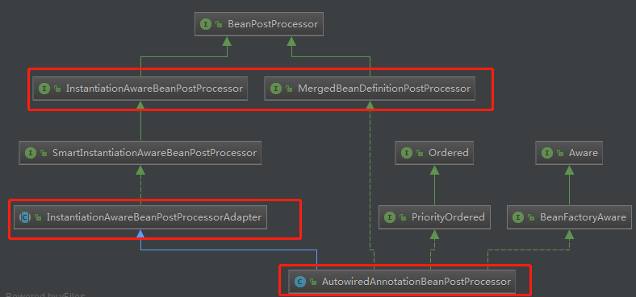


# 类型转化器

2020-10-11 


# AOP

2020-11-10 


