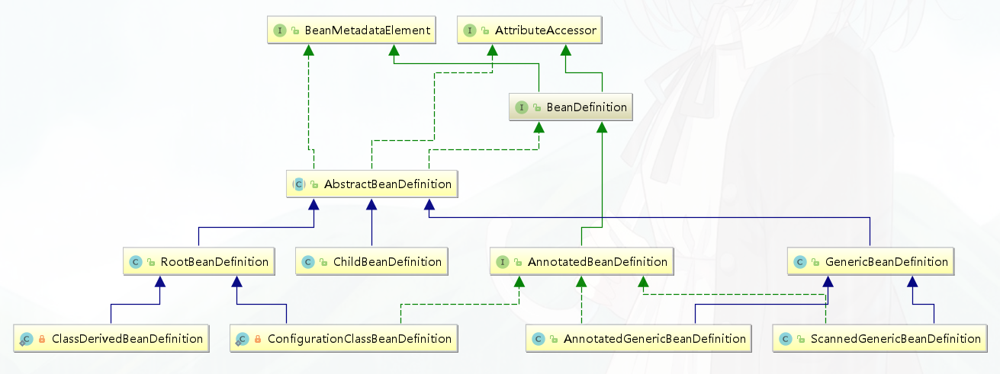
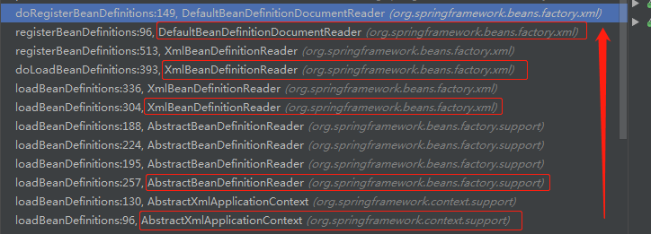

[官网地址](https://spring.io/projects/spring-framework)


# 产生IOC的原因

传统的对象创建和依赖管理存在问题

①  有可能重复多次的被创建，造成资源浪费

②依赖关系复杂，不利于扩展和管理

依赖关系复杂的原因是，对象内部的依赖大部分都是通过===**new**===的方式进行引用的


早期的解决方案：

使用单例+工厂创建对象，对象放入缓存，不会造成资源浪费；

使用外部传参的 方式注入依赖关系；--  setter方法传参，构造器Constructor传参， 属性反射


**IOC的理念：通过容器统一对象的构建方式，并且自动维护对象的依赖关系。**


**IoC**(Inversion of Control) 也称为**依赖注入**(dependency injection, DI)。它是一个==对象定义依赖关系的过程==，也就是说，对象只通过构造函数参数、工厂方法的参数或对象实例构造或从工厂方法返回后在对象实例上设置的属性来定义它们所使用的其他对象。然后==容器在创建bean时注入这些依赖项==。这个过程基本上是bean的逆过程，因此称为**控制反转**(IoC)

在Spring中，构成应用程序主干并由Spring IoC容器管理的对象称为**bean**。bean是由Spring IoC容器实例化、组装和管理的对象。


# bean的注册

[IOC整个流程图](https://www.processon.com/view/link/5cd10507e4b085d010929d02)  就是【[IoC整体图](springIOC.assets/IoC整体图.jpg)】

bean的属性是什么对象承载的(BeanDefinition)？

 bean是如何注册到容器中的(BeanDefinitionRegistry)？

IOC容器到底是什么数据结构？

(DefaultListableBeanFactory.ConcurrentHashMap<String, BeanDefinition>(256))


## BeanDefinition

封装了Bean的属性     BeanDefinition是接口，其实现类是org.springframework.beans.factory.support.**RootBeanDefinition**

容器中的每一个 bean 都会有一个对应的 BeanDefinition 实例，该实例负责保存 bean 对象的所有必要信息，包括 bean 对象的 class 类型、是否是抽象类、构造方法和参数、其他属性等等




## BeanDefinitionRegistry

注册BeanDefinition

BeanDefinition的注册器，抽象了 bean 的**注册**逻辑，包括registerBeanDefinition、removeBeanDefinition、getBeanDefinition 等注册管理 BeanDefinition 的方法。


## BeanFactory  

bean工厂，抽象了 bean 的**管理**逻辑，主要包含 getBean、containBean、getType、getAliases 等管理 bean 的方法。

**AbstractApplicationContext 这个里面的属性BeanFactory   的  实现类就是   DefaultListableBeanFactory**

注解的


## DefaultListableBeanFactory

**IOC存放对象的容器**：org.springframework.beans.factory.support.DefaultListableBeanFactory#beanDefinitionMap

```java
// beanName----beanDefinition
private final Map<String, BeanDefinition> beanDefinitionMap 
    = new ConcurrentHashMap<>(256);
```


这个牛图的每个接口的功能

## 创建容器beanDefinitionMap

在主流程中，直接new出了容器

注解方式： 

org.springframework.context.annotation.AnnotationConfigApplicationContext#AnnotationConfigApplicationContext   初始化   **走了父类GenericApplicationContext的无参构造器**

org.springframework.context.support.GenericApplicationContext#GenericApplicationContext()


xml方式创建容器：

org.springframework.context.support.AbstractApplicationContext#refresh
org.springframework.context.support.AbstractApplicationContext#obtainFreshBeanFactory

```
//xml方式在这里创建，注解方式早就创建好了，这里只是获取
ConfigurableListableBeanFactory beanFactory = obtainFreshBeanFactory();
```

org.springframework.context.support.AbstractRefreshableApplicationContext#refreshBeanFactory
org.springframework.context.support.AbstractRefreshableApplicationContext#createBeanFactory


## 如何将Bean注册到容器

### 装配Bean的方式？

#### 一、xml

#### 二、实现接口BeanDefinitionRegistryPostProcessor

`org.springframework.beans.factory.support.BeanDefinitionRegistryPostProcessor`

##### 注解方式

@ImportResource
@Componet+@CompoentScan
@Import
@Configuration + @Bean
@Conditional

new AnnotationConfigApplicationContext(AppConfig.class);

**本质**：系统注册了一个BeanDefinitionRegistryPostProcessor接口的实现类ConfigurationClassPostProcessor所以本质还是由于BeanDefinitionRegistryPostProcessor接口注册的

##### 自定义实现类

```java
@Component
public class MyBeanDefinitionRegistryPostProcessor implements BeanDefinitionRegistryPostProcessor {
   @Override
   public void postProcessBeanDefinitionRegistry(BeanDefinitionRegistry registry) throws BeansException {

      registry.registerBeanDefinition("userService",
            new RootBeanDefinition(UserService.class));
   }

   @Override
   public void postProcessBeanFactory(ConfigurableListableBeanFactory beanFactory) throws BeansException {


   }
}
```

#### 三、实现接口BeanFactoryPostProcessor

##### 系统自带

的注解方式的ConfigurationClassPostProcessor implements BeanDefinitionRegistryPostProcessor

但是BeanDefinitionRegistryPostProcessor 又extends  BeanFactoryPostProcessor

所以系统自带的也实现了BeanFactoryPostProcessor#postProcessBeanFactory方法

```java
// 增强@Configuration修饰的配置类    AppConfig--->AppConfig$$EnhancerBySpringCGLIB
enhanceConfigurationClasses(beanFactory);
// 添加了后置处理器 ConfigurationClassPostProcessor.ImportAwareBeanPostProcessor
beanFactory.addBeanPostProcessor(new ImportAwareBeanPostProcessor(beanFactory));
```

系统自带的 这个实现，并没有注册任何东西，主要是把@Configuration修饰的配置类进行了CGlib代理

然后添加了一个后置处理器

##### 自定义-可以进行注册

因为BeanFactoryPostProcessor#postProcessBeanFactory入参有个BeanFactory

而主流程中会将DefaultListableBeanFactory传入，所以有注册功能，还有BeanFactory的功能，很牛逼的一个处理器

```java
@Component  //这里同样要交给spring管理，才能进行处理
public class MyBeanFactoryPostProcessor implements BeanFactoryPostProcessor {
   @Override
   public void postProcessBeanFactory(ConfigurableListableBeanFactory beanFactory) throws BeansException {

      //((DefaultListableBeanFactory) beanFactory).registerSingleton("cat",new Cat());


      BeanDefinition cat = beanFactory.getBeanDefinition("cat");
      cat.setBeanClassName("bat.ke.qq.com.bean.Fox");
      // 承载bean的属性的    class.newInstance()
      AbstractBeanDefinition beanDefinition = (AbstractBeanDefinition) beanFactory.getBeanDefinition("user");
      // user -->cat  Cat.newInstance()   bat.ke.qq.com.bean.Cat@3c407114
      //beanDefinition.setBeanClassName("bat.ke.qq.com.bean.Cat");

      // 构造器贪婪模式
      // Autowiring mode  自动装配模式    xml     setter  constructor
      // @Autowired  field.set    setter  constructor
      //beanDefinition.setAutowireMode(3);

      // 属性填充
      beanDefinition.getPropertyValues().add("name","cat");

      beanDefinition.getPropertyValues().add("age",30);
//    beanDefinition.getPropertyValues().add("cat", cat);


      beanFactory.addBeanPostProcessor(new MyInstantiationAwareBeanPostProcessor());


      beanFactory.registerSingleton("userService",new UserService());
   }
}
```


后置处理器？


### registerBeanDefinition

这是注册Bean的常用方法

org.springframework.beans.factory.support.BeanDefinitionReaderUtils#registerBeanDefinition

**注册的关键方法**

```java
public static void registerBeanDefinition(
      BeanDefinitionHolder definitionHolder, BeanDefinitionRegistry registry)
      throws BeanDefinitionStoreException {

   // Register bean definition under primary name.
   // 根据beanName注册 (包括 id  name)
   String beanName = definitionHolder.getBeanName();
   // 注册beanDefiniton  用了BeanDefinitionRegistry的注册功能
   registry.registerBeanDefinition(beanName, definitionHolder.getBeanDefinition());

   // Register aliases for bean name, if any.
   String[] aliases = definitionHolder.getAliases();
   if (aliases != null) {
      for (String alias : aliases) {
         registry.registerAlias(beanName, alias);
      }
   }
}
```

org.springframework.beans.factory.support.DefaultListableBeanFactory#registerBeanDefinition

在这里直接put到容器中

```java
this.beanDefinitionMap.put(beanName, beanDefinition);
```

### xml

加载xml配置文件

```xml
<?xml version="1.0" encoding="UTF-8"?>
<beans xmlns="http://www.springframework.org/schema/beans"
       xmlns:xsi="http://www.w3.org/2001/XMLSchema-instance"
       xsi:schemaLocation="http://www.springframework.org/schema/beans
        https://www.springframework.org/schema/beans/spring-beans.xsd">

   <bean name="ant" class="bat.ke.qq.com.bean.Ant"/>
   <bean class="bat.ke.qq.com.bean.MyBeanFactoryPostProcessor" 	
         name="myBeanFactoryPostProcessor"/>

</beans>
```

```java
ApplicationContext context = new ClassPathXmlApplicationContext("spring.xml");
```

org.springframework.context.support.   都是这个包下的

ClassPathXmlApplicationContext#ClassPathXmlApplicationContext(s)

AbstractApplicationContext#refresh

**AbstractApplicationContext#obtainFreshBeanFactory   从主干上来说，这里之后就已经注册完成了**

**AbstractRefreshableApplicationContext#refreshBeanFactory** -- xml方式：创建了容器，并加载配置文件中的bean

```java
@Override
protected final void refreshBeanFactory() throws BeansException {
   // 如果存在beanFactory，销毁单例bean ，关闭beanFactory
   if (hasBeanFactory()) {
      destroyBeans();
      closeBeanFactory();
   }
   try {
      DefaultListableBeanFactory beanFactory = createBeanFactory();
      beanFactory.setSerializationId(getId());
      // 定制beanFactory，设置参数
      customizeBeanFactory(beanFactory);
      // 注册spring的xml配置的bean到beanFactory，此时容器还未指定beanFactory
      loadBeanDefinitions(beanFactory);
      // 给容器指定beanFactory
      synchronized (this.beanFactoryMonitor) {
         this.beanFactory = beanFactory;
      }
   }
   catch (IOException ex) {
      throw new ApplicationContextException("I/O error parsing bean definition source for " + getDisplayName(), ex);
   }
}
```

AbstractXmlApplicationContext#loadBeanDefinitions(DefaultListableBeanFactory)   -- 回到了AbstractXmlApplicationContext

AbstractXmlApplicationContext#loadBeanDefinitions(XmlBeanDefinitionReader)

#### 解析配置文件

**AbstractBeanDefinitionReader#loadBeanDefinitions(org.springframework.core.io.Resource...)--去读取器中读取Bean   开始准备将资源读到内存中，并封装成BeanDefinition 然后注册到容器中去**



org.springframework.beans.factory.xml.

DefaultBeanDefinitionDocumentReader#doRegisterBeanDefinitions


org.springframework.beans.factory.xml.DefaultBeanDefinitionDocumentReader#parseBeanDefinitions


org.springframework.beans.factory.xml.DefaultBeanDefinitionDocumentReader#parseDefaultElement

**解析的关键点org.springframework.beans.factory.xml.DefaultBeanDefinitionDocumentReader#processBeanDefinition**

#### BeanDefinition的实现类

org.springframework.beans.factory.support.GenericBeanDefinition

##### 过程：

org.springframework.beans.factory.xml.DefaultBeanDefinitionDocumentReader#processBeanDefinition

org.springframework.beans.factory.xml.BeanDefinitionParserDelegate#parseBeanDefinitionElement(org.w3c.dom.Element)

org.springframework.beans.factory.xml.BeanDefinitionParserDelegate#parseBeanDefinitionElement(org.w3c.dom.Element, org.springframework.beans.factory.config.BeanDefinition)

org.springframework.beans.factory.xml.BeanDefinitionParserDelegate#parseBeanDefinitionElement(org.w3c.dom.Element, java.lang.String, org.springframework.beans.factory.config.BeanDefinition)

org.springframework.beans.factory.xml.BeanDefinitionParserDelegate#createBeanDefinition

org.springframework.beans.factory.support.BeanDefinitionReaderUtils#createBeanDefinition

```
GenericBeanDefinition bd = new GenericBeanDefinition();
```


#### 注册bean

**org.springframework.beans.factory.support.BeanDefinitionReaderUtils#registerBeanDefinition**


总结就是，解析bean循环注册bean-----

循环在：org.springframework.beans.factory.xml.DefaultBeanDefinitionDocumentReader#parseBeanDefinitions

注册在：org.springframework.beans.factory.support.BeanDefinitionReaderUtils#registerBeanDefinition


### Annotation

关键方法入口org.springframework.context.support

.**AbstractApplicationContext#invokeBeanFactoryPostProcessors**

该方法主要处理两类接口：BeanFactoryPostProcessor接口和BeanDefinitionRegistryPostProcessor接口


在这里注册了系统自带的5个bean

org.springframework.context.annotation.AnnotationConfigApplicationContext#AnnotationConfigApplicationContext()

```java
class ConfigurationClassPostProcessor implements BeanDefinitionRegistryPostProcessor,
		PriorityOrdered, ResourceLoaderAware, BeanClassLoaderAware, EnvironmentAware
class AutowiredAnnotationBeanPostProcessor extends 		 	
    InstantiationAwareBeanPostProcessorAdapter
		implements MergedBeanDefinitionPostProcessor, PriorityOrdered, BeanFactoryAware
class CommonAnnotationBeanPostProcessor extends InitDestroyAnnotationBeanPostProcessor
		implements InstantiationAwareBeanPostProcessor, BeanFactoryAware, Serializable
class EventListenerMethodProcessor
		implements SmartInitializingSingleton, ApplicationContextAware, 	
			BeanFactoryPostProcessor
class DefaultEventListenerFactory implements EventListenerFactory, Ordered
```

#### 注册系统 自带的bean的过程

org.springframework.context.annotation.  都在这个包下

AnnotatedBeanDefinitionReader#AnnotatedBeanDefinitionReader(.BeanDefinitionRegistry, Environment)

AnnotationConfigUtils#registerAnnotationConfigProcessors(BeanDefinitionRegistry，null)

```java
public static final String CONFIGURATION_ANNOTATION_PROCESSOR_BEAN_NAME =		"org.springframework.context.annotation.internalConfigurationAnnotationProcessor";
//注意这里的beanname是不存在的，造了个假的来代替ConfigurationClassPostProcessor
if (!registry.containsBeanDefinition(CONFIGURATION_ANNOTATION_PROCESSOR_BEAN_NAME)) {
   RootBeanDefinition def = new RootBeanDefinition(ConfigurationClassPostProcessor.class);
   def.setSource(source);
   // 注册 ConfigurationClassPostProcessor
   beanDefs.add(registerPostProcessor(registry, def, CONFIGURATION_ANNOTATION_PROCESSOR_BEAN_NAME));
}
```

同理注册了其它四个bean

##### BeanDefinition的实现类

org.springframework.beans.factory.support.RootBeanDefinition

```java
RootBeanDefinition def = new RootBeanDefinition(ConfigurationClassPostProcessor.class);
```

#### 注册配置类 AppConfig

org.springframework.context.annotation.AnnotationConfigApplicationContext#register

##### BeanDefinition的实现类

org.springframework.beans.factory.annotation.AnnotatedGenericBeanDefinition

```java
AnnotatedGenericBeanDefinition abd = new AnnotatedGenericBeanDefinition(annotatedClass);
```


**到主流程的obtainFreshBeanFactory方法后，bean容器中就已经有6个BeanDefinition了**


主流程的关键入口

org.springframework.context.support.

**AbstractApplicationContext#invokeBeanFactoryPostProcessors**

PostProcessorRegistrationDelegate#invokeBeanFactoryPostProcessors(ConfigurableListableBeanFactory, java.util.List<org.springframework.beans.factory.config.BeanFactoryPostProcessor>)

```java
// 保存本次要执行的BeanDefinitionRegistryPostProcessor   有序的容器
List<BeanDefinitionRegistryPostProcessor> currentRegistryProcessors = new ArrayList<>();

//根据type获取容器中注册了的beanName  这里获取了 BeanDefinitionRegistryPostProcessor 类型的
//在之前系统自带的5类中有个类继承了这个接口   ConfigurationClassPostProcessor
String[] postProcessorNames =
      beanFactory.getBeanNamesForType(BeanDefinitionRegistryPostProcessor.class, true, false);

//下面按照优先级去加载   这里优先级使用的是  PriorityOrdered > Ordered > None
for (String ppName : postProcessorNames) {
				//判断是否实现了PriorityOrdered
    if (beanFactory.isTypeMatch(ppName, PriorityOrdered.class)) {
        // 获取 ConfigurationClassPostProcessor 实现了BeanDefinitionRegistryPostProcessor
        currentRegistryProcessors.add(beanFactory.getBean(ppName, BeanDefinitionRegistryPostProcessor.class));  //这里有个getBean操作
        processedBeans.add(ppName);
    }
}
//排序方法
sortPostProcessors(currentRegistryProcessors, beanFactory);

// 会调用ConfigurationClassPostProcessor#postProcessBeanDefinitionRegistry 解析注解，注册bean
invokeBeanDefinitionRegistryPostProcessors(currentRegistryProcessors, registry);

```

#### 解析注解和注册bean的关键---方法入口

- [x] 都源于注解方式的容器自动注册了BeanDefinitionRegistryPostProcessor接口的实现类ConfigurationClassPostProcessor
- [x] 如果自定义了一个BeanDefinitionRegistryPostProcessor的实现类，同样可以触发注册

由于有BeanDefinitionRegistryPostProcessor接口的实现类，所以在方法 `org.springframework.context.support.PostProcessorRegistrationDelegate#invokeBeanFactoryPostProcessors`中会有注册入口`org.springframework.context.support.PostProcessorRegistrationDelegate#invokeBeanDefinitionRegistryPostProcessors`

```java
private static void invokeBeanDefinitionRegistryPostProcessors(
      Collection<? extends BeanDefinitionRegistryPostProcessor> postProcessors, BeanDefinitionRegistry registry) {

   // ConfigurationClassPostProcessor  循环处理每个BeanDefinitionRegistryPostProcessor的实现类---这个是注解注册的 最外层循环--每个大BeanDefinitionRegistryPostProcessor实现类
   for (BeanDefinitionRegistryPostProcessor postProcessor : postProcessors) {
       //如果自定义--也是调了实现类的这个方法，这里面有注册器--这个注册器是DefaultListableBeanFactory类型的，随便用
      postProcessor.postProcessBeanDefinitionRegistry(registry);
   }
}
```

org.springframework.context.annotation.ConfigurationClassPostProcessor #postProcessBeanDefinitionRegistry

org.springframework.context.annotation.ConfigurationClassPostProcessor #processConfigBeanDefinitions

```java
//解析入口  -- 这里有个特例@Component bean注册到容器  在这里注册完成了
// 解析配置类  @ComponentScan (@Component bean注册到容器) @Import @ImportResource @Bean
parser.parse(candidates);

//注册入口
// 注册bean到容器
// 注册实现了ImportSelector的bean
// 方法bean注册到容器  @Bean
// @ImportResource("spring.xml") 配置的bean注册到容器
// 实现ImportBeanDefinitionRegistrar的bean 注册到容器
this.reader.loadBeanDefinitions(configClasses);
```


#### 解析

org.springframework.context.annotation.ConfigurationClassParser#doProcessConfigurationClass

##### 一、解析@ComponentScan +注册被@Component修饰的bean

```java
// Process any @ComponentScan annotations
//  处理@ComponentScan   将@Component修饰的bean注册到容器
Set<AnnotationAttributes> componentScans = AnnotationConfigUtils.attributesForRepeatable(
      sourceClass.getMetadata(), ComponentScans.class, ComponentScan.class);
if (!componentScans.isEmpty() &&
      !this.conditionEvaluator.shouldSkip(sourceClass.getMetadata(), ConfigurationPhase.REGISTER_BEAN)) {
   for (AnnotationAttributes componentScan : componentScans) {
      // The config class is annotated with @ComponentScan -> perform the scan immediately
      // @ComponentScan扫描bean,返回@Component修饰的BeanDefinitionHolder 集合，并且
      // 会将bean注册到容器
      Set<BeanDefinitionHolder> scannedBeanDefinitions =
            this.componentScanParser.parse(componentScan, sourceClass.getMetadata().getClassName());
      // Check the set of scanned definitions for any further config classes and parse recursively if needed
      for (BeanDefinitionHolder holder : scannedBeanDefinitions) {
         BeanDefinition bdCand = holder.getBeanDefinition().getOriginatingBeanDefinition();
         if (bdCand == null) {
            bdCand = holder.getBeanDefinition();
         }
         if (ConfigurationClassUtils.checkConfigurationClassCandidate(bdCand, this.metadataReaderFactory)) {
            parse(bdCand.getBeanClassName(), holder.getBeanName());
         }
      }
   }
}
```

org.springframework.context.annotation.ConfigurationClassParser#parse(org.springframework.core.type.AnnotationMetadata, java.lang.String)

org.springframework.context.annotation.ClassPathBeanDefinitionScanner#doScan

两个入口：

找@Component修饰的类：findCandidateComponents->scanCandidateComponents    

注册@Component修饰的Bean：registerBeanDefinition

findCandidateComponents后，是个`Set<BeanDefinition>`集合

遍历集合注册`BeanregisterBeanDefinition`候选的bean

###### 找@Component修饰的类

org.springframework.context.annotation.ClassPathScanningCandidateComponentProvider#scanCandidateComponents

```java
//把传进来的包路径封装一下  classpath*:bat/ke/qq/com/**/*.class   找包路径下的所有class
String packageSearchPath = ResourcePatternResolver.CLASSPATH_ALL_URL_PREFIX +
      resolveBasePackage(basePackage) + '/' + this.resourcePattern;
//获取包路径下所有的class文件
Resource[] resources = getResourcePatternResolver().getResources(packageSearchPath);
//....遍历找
if (isCandidateComponent(metadataReader)) { //判断是否包含@Component
    //大概的意思就是获取类上注解的元数据然后判断是否是@component 并且排除配置类AppConfig
    
}
//备注：用于过滤的类org.springframework.context.annotation.ClassPathBeanDefinitionScanner
//父类是org.springframework.context.annotation.ClassPathScanningCandidateComponentProvider
```

###### BeanDefinition的实现类

装载bean是用ScannedGenericBeanDefinition修饰的--是BeanDefinition的实现类

```
放在容器Set<BeanDefinition> candidates = new LinkedHashSet<>();中
```


###### 注册@Component修饰的Bean

org.springframework.context.annotation.ClassPathBeanDefinitionScanner#registerBeanDefinition

```java
//注册bean的常规用法  
BeanDefinitionReaderUtils.registerBeanDefinition(definitionHolder, registry);
```

org.springframework.beans.factory.support.BeanDefinitionReaderUtils#registerBeanDefinition


父类怎么注册？


##### 二、解析@Import

```java
@Target(ElementType.TYPE)
@Retention(RetentionPolicy.RUNTIME)
@Documented
public @interface Import {

   /**定义了两种内容：ImportSelector  ImportBeanDefinitionRegistrar  两种接口
   
   
    *方法：ImportBeanDefinitionRegistrar#registerBeanDefinitions
    *方法：ImportSelector#selectImports
    * {@link Configuration}, {@link ImportSelector}, {@link ImportBeanDefinitionRegistrar}
    * or regular component classes to import.
    */
   Class<?>[] value();

}
```


```java
@Import({MyImportBeanDefinitionRegistrar.class, MyImportSelector.class})
```


```java
// Process any @Import annotations
// 处理@Import   implements ImportSelector  并不会将bean注册到容器
processImports(configClass, sourceClass, getImports(sourceClass), true);
```

主流程中有两个入口

找@Import

org.springframework.context.annotation.ConfigurationClassParser#getImports

和处理Import的内容

org.springframework.context.annotation.ConfigurationClassParser#processImports

###### 找@Import

org.springframework.context.annotation.ConfigurationClassParser#collectImports

```java
private void collectImports(SourceClass sourceClass, Set<SourceClass> imports, Set<SourceClass> visited)
      throws IOException {

   if (visited.add(sourceClass)) {
      for (SourceClass annotation : sourceClass.getAnnotations()) {
         String annName = annotation.getMetadata().getClassName();
         if (!annName.startsWith("java") && !annName.equals(Import.class.getName())) {
            collectImports(annotation, imports, visited);
         }
      }
      imports.addAll(sourceClass.getAnnotationAttributes(Import.class.getName(), "value"));
   }
}
```

###### 解析@Import--处理内容

org.springframework.context.annotation.ConfigurationClassParser#processImports

处理都只是反射拿到实现类，放入容器org.springframework.context.annotation.ConfigurationClass#importBeanDefinitionRegistrars

```java
private final Map<ImportBeanDefinitionRegistrar, AnnotationMetadata> importBeanDefinitionRegistrars =
      new LinkedHashMap<>();
```

###### 处理ImportBeanDefinitionRegistrar

```java
// Candidate class is an ImportBeanDefinitionRegistrar ->
// delegate to it to register additional bean definitions
Class<?> candidateClass = candidate.loadClass();
////反射拿到实现类 bat.ke.qq.com.bean.MyImportBeanDefinitionRegistrar
ImportBeanDefinitionRegistrar registrar =
      BeanUtils.instantiateClass(candidateClass, ImportBeanDefinitionRegistrar.class);
ParserStrategyUtils.invokeAwareMethods(
      registrar, this.environment, this.resourceLoader, this.registry);
//存起来
configClass.addImportBeanDefinitionRegistrar(registrar, currentSourceClass.getMetadata());
```


###### 处理ImportSelector

```java
Class<?> candidateClass = candidate.loadClass();
ImportSelector selector = BeanUtils.instantiateClass(candidateClass, ImportSelector.class);
ParserStrategyUtils.invokeAwareMethods(
      selector, this.environment, this.resourceLoader, this.registry);
if (selector instanceof DeferredImportSelector) {
   this.deferredImportSelectorHandler.handle(
         configClass, (DeferredImportSelector) selector);
}
else {
   // implements ImportSelector
    //拿到导入的 bean的类名  调用了实现类的selectImports方法
   String[] importClassNames = selector.selectImports(currentSourceClass.getMetadata());
   Collection<SourceClass> importSourceClasses = asSourceClasses(importClassNames);
   //再进入for循环---防止导入的bean上也有其它的注解
   processImports(configClass, currentSourceClass, importSourceClasses, false);
}
```

这里导入的bean如果没有任何注解修饰，则进入else方法

```java
// Candidate class not an ImportSelector or ImportBeanDefinitionRegistrar ->
// process it as an @Configuration class
this.importStack.registerImport(
      currentSourceClass.getMetadata(), candidate.getMetadata().getClassName());
//导入的bean放入解析器中去解析 --为的是导入的bean上可能有别的注解，所以需要重新走一遍（扫描一遍）
//这个for循环中只有ImportBeanDefinitionRegistrar能进行 注册
//导入的bean如果实现ImportBeanDefinitionRegistrar接口直接进行了注册了--但是这里还没有调接口的方法，没有执行注册方法
processConfigurationClass(candidate.asConfigClass(configClass));
```

这里走到了注解解析的入口了，传入的是本次导入的className[]


##### 三、解析@ImportResource("/spring.xml") 

```java
// Process any @ImportResource annotations
// 处理@ImportResource   bean不会注册到容器
AnnotationAttributes importResource =
      AnnotationConfigUtils.attributesFor(sourceClass.getMetadata(), ImportResource.class);
if (importResource != null) {
   String[] resources = importResource.getStringArray("locations");
   Class<? extends BeanDefinitionReader> readerClass = importResource.getClass("reader");
   for (String resource : resources) {
      String resolvedResource = this.environment.resolveRequiredPlaceholders(resource);
      //将spring,xml  String 保存起来还没有解析其内容，只是解析了注解
       configClass.addImportedResource(resolvedResource, readerClass);
   }
}
```


##### 四、解析@Bean

```java
// Process individual @Bean methods
// 处理 bean method    bean不会注册到容器
Set<MethodMetadata> beanMethods = retrieveBeanMethodMetadata(sourceClass);
for (MethodMetadata methodMetadata : beanMethods) {
   configClass.addBeanMethod(new BeanMethod(methodMetadata, configClass));
}
```

查找配置文件中所有的@Bean

org.springframework.context.annotation.ConfigurationClassParser#retrieveBeanMethodMetadata

找完后直接将找到的方法放入configClass的属性beanMethod中


#### 待注册的bean：`Set<ConfigurationClass>`

```java
Set<ConfigurationClass> configClasses = new LinkedHashSet<>(parser.getConfigurationClasses());
```


```java
private final Map<ConfigurationClass, ConfigurationClass> configurationClasses = new LinkedHashMap<>();
```

##### bean注册和解析的中间对象

org.springframework.context.annotation.ConfigurationClass

**一个ConfigurationClass代表一个配置类，而每个配置类上的不同的注解就是这个配置类的属性**

不同的注解方式放在不同的属性中


#### 注册

org.springframework.context.annotation.ConfigurationClassBeanDefinitionReader  #loadBeanDefinitions  --- 循环注册ConfigurationClass

org.springframework.context.annotation.ConfigurationClassBeanDefinitionReader #loadBeanDefinitionsForConfigurationClass

##### 一、注册@ComponentScan (@Component bean注册到容器)  已经在解析的时候做完了


##### 二、注册@Import

###### ImportSelector

从解析过来的，已经执行了自定义的ImportSelector实现类的方法selectImports

configClass有两个，一个是导入的，一个是配置类


开始org.springframework.context.annotation.ConfigurationClassBeanDefinitionReader #loadBeanDefinitionsForConfigurationClass

```java
if (configClass.isImported()) {
   //  implements ImportSelector 的bean 注册
   registerBeanDefinitionForImportedConfigurationClass(configClass);
}
```

org.springframework.context.annotation.ConfigurationClassBeanDefinitionReader #registerBeanDefinitionForImportedConfigurationClass

```java
//构建了BeanDefinition  这个是其一种实现类
AnnotatedGenericBeanDefinition configBeanDef = new 
    AnnotatedGenericBeanDefinition(metadata);
// 注册bean
this.registry.registerBeanDefinition(definitionHolder.getBeanName(), definitionHolder.getBeanDefinition());
```

###### BeanDefinition的实现类

org.springframework.beans.factory.annotation.AnnotatedGenericBeanDefinition


###### ImportBeanDefinitionRegistrar

```java
//  实现 ImportBeanDefinitionRegistrar的 bean 注册到容器
loadBeanDefinitionsFromRegistrars(configClass.getImportBeanDefinitionRegistrars());
```

org.springframework.context.annotation.ConfigurationClassBeanDefinitionReader

#loadBeanDefinitionsFromRegistrars--在这里调用了registerBeanDefinitions方法

```java
private void loadBeanDefinitionsFromRegistrars(Map<ImportBeanDefinitionRegistrar, AnnotationMetadata> registrars) {
   registrars.forEach((registrar, metadata) ->
         registrar.registerBeanDefinitions(metadata, this.registry));
}
```


##### 三、注册@ImportResource

开始org.springframework.context.annotation.ConfigurationClassBeanDefinitionReader #loadBeanDefinitionsForConfigurationClass

```java
// .@ImportResource("springxml") 配置的bean注册到容器
loadBeanDefinitionsFromImportedResources(configClass.getImportedResources());
```

org.springframework.context.annotation.ConfigurationClassBeanDefinitionReader #loadBeanDefinitionsFromImportedResources

```java

readerClass = XmlBeanDefinitionReader.class;
//构建xml解读器
BeanDefinitionReader reader = readerInstanceCache.get(readerClass);
reader = readerClass.getConstructor(BeanDefinitionRegistry.class).newInstance(this.registry);

//开始使用xml的方式进行解析注册
reader.loadBeanDefinitions(resource);

```

org.springframework.beans.factory.support.AbstractBeanDefinitionReader #loadBeanDefinitions(java.lang.String)  --- 见xml解析


##### 四、注册@Bean

开始org.springframework.context.annotation.ConfigurationClassBeanDefinitionReader #loadBeanDefinitionsForConfigurationClass

```java
for (BeanMethod beanMethod : configClass.getBeanMethods()) {
   // 方法bean 注册到容器
   loadBeanDefinitionsForBeanMethod(beanMethod);
}
```

org.springframework.context.annotation.ConfigurationClassBeanDefinitionReader #loadBeanDefinitionsForBeanMethod

直接注册

```java
this.registry.registerBeanDefinition(beanName, beanDefToRegister);
```

###### BeanDefinition的实现类  -

org.springframework.context.annotation.ConfigurationClassBeanDefinitionReader.ConfigurationClassBeanDefinition


# Bean的创建

[IOC整个流程图](https://www.processon.com/view/link/5cd10507e4b085d010929d02)  就是【[IoC整体图](springIOC.assets/IoC整体图.jpg)】

关键的单例对象池，单例对象池存于重要的类DefaultSingletonBeanRegistry

org.springframework.beans.factory.support.DefaultSingletonBeanRegistry#getSingleton(java.lang.String)

类图？。。。


## 自动实例化入口

实例化所有剩余的(非懒加载)单例。

为什么是剩余的？

为什么不是懒加载的？

为什么是单例？

org.springframework.context.support.AbstractApplicationContext#finishBeanFactoryInitialization

org.springframework.beans.factory.config.ConfigurableListableBeanFactory#preInstantiateSingletons

for循环去创建bean { AbstractBeanFactory#getBean  }

org.springframework.beans.factory.support.AbstractBeanFactory#getBean(java.lang.String)---走到真实入口


## 真实的入口

为什么是这个类？

我们看看DefaultListableBeanFactory的类图


bean的注册 相关的总接口是BeanDefinitionRegistry而**管理bean生命周期的是BeanFactory接口**---其抽象实现类org.springframework.beans.factory.support.AbstractBeanFactory#getBean      就处理了getBean

### getBean--doGetBean

org.springframework.beans.factory.support.AbstractBeanFactory#getBean

```java
@Override
public Object getBean(String name) throws BeansException {
   return doGetBean(name, null, null, false);
}
```

org.springframework.beans.factory.support. AbstractBeanFactory#doGetBean

### 1、如果单例对象池中有，就直接从单例对象池中取

org.springframework.beans.factory.support. AbstractBeanFactory#doGetBean

```java
// 先从缓存singletonObjects中找,没有则去创建
Object sharedInstance = getSingleton(beanName);
```

单例对象池存于重要的类DefaultSingletonBeanRegistry

org.springframework.beans.factory.support.DefaultSingletonBeanRegistry#getSingleton

```java
@Nullable
protected Object getSingleton(String beanName, boolean allowEarlyReference) {
   // 先从单例缓存中找，没有找到会先判断是否是正在创建的bean
   // isSingletonCurrentlyInCreation 判断对应的单例对象是否在创建中
   Object singletonObject = this.singletonObjects.get(beanName);
   if (singletonObject == null && isSingletonCurrentlyInCreation(beanName)) {
      synchronized (this.singletonObjects) {
         // earlySingletonObjects中保存所有提前曝光的单例，尝试从earlySingletonObjects中找
         singletonObject = this.earlySingletonObjects.get(beanName);
         if (singletonObject == null && allowEarlyReference) {
            // 如果允许早期依赖，可以尝试从singletonFactories中找到对应的单例工厂
            ObjectFactory<?> singletonFactory = this.singletonFactories.get(beanName);
            if (singletonFactory != null) {
               //创建bean，并缓存提前曝光的bean，就是还未进行属性注入的bean，用于解决循环依赖
               singletonObject = singletonFactory.getObject();
               this.earlySingletonObjects.put(beanName, singletonObject);
               this.singletonFactories.remove(beanName);
            }
         }
      }
   }
   return singletonObject;
}
```

存在就直接返回单例对象 池中的对象

org.springframework.beans.factory.support. AbstractBeanFactory#doGetBean

```java
// 普通bean和factoryBean的判断
bean = getObjectForBeanInstance(sharedInstance, name, beanName, null);
//isPrototypeCurrentlyInCreation
// 。。。。。
```

未完待续？。。。

### 2、标记bean开始创建

```java
if (!typeCheckOnly) {
   // 标记 bean要创建了
   markBeanAsCreated(beanName);
}
```

### 3、从容器中获取待创建的BeanDefinition

统一使用RootBeanDefinition 接收

```java
//  返回 RootBeanDefinition
// 读取XML配置信息的是GernericBeanDefinition,后续都是针对RootBeanDefinition的处理,
// 因而转换.如果父类bean存在,则合并父类属性.
final RootBeanDefinition mbd = getMergedLocalBeanDefinition(beanName);
```

org.springframework.beans.factory.support.AbstractBeanFactory#getMergedLocalBeanDefinition

```java
if (bd instanceof RootBeanDefinition) {
   mbd = ((RootBeanDefinition) bd).cloneBeanDefinition();
}
else {
   mbd = new RootBeanDefinition(bd);
}
```

### 4、如果有配置DependsOn依赖，先去获取依赖


### 5、开始实例化过程

isSingleton

isPrototype

other

## isSingleton---创建

org.springframework.beans.factory.support.AbstractBeanFactory#doGetBean

```java
//判断单例
if (mbd.isSingleton()) {
   sharedInstance = getSingleton(beanName, () -> {
      try {
         return createBean(beanName, mbd, args);
      }
      catch (BeansException ex) {
         // Explicitly remove instance from singleton cache: It might have been put there
         // eagerly by the creation process, to allow for circular reference resolution.
         // Also remove any beans that received a temporary reference to the bean.
         destroySingleton(beanName);
         throw ex;
      }
   });
   // 返回类型判断 FactoryBean BeanFactroy
   bean = getObjectForBeanInstance(sharedInstance, name, beanName, mbd);
}
```

这里用了`lambda`  表达式，当调用   singletonFactory.getObject()时会走进参数的代码块中

org.springframework.beans.factory.support.DefaultSingletonBeanRegistry#getSingleton

```java
// 先从缓存中找
Object singletonObject = this.singletonObjects.get(beanName);
// singletonFactory 生产bean  --- 这里就调外面的方法了
singletonObject = singletonFactory.getObject();
// 进行创建状态的移除  this.singletonsCurrentlyInCreation.remove(beanName)
afterSingletonCreation(beanName);
if (newSingleton) {
// 新生产的单例bean放入singletonObjects中
addSingleton(beanName, singletonObject);
```

由于里面调用了getObject()，代码就回到了org.springframework.beans.factory.support.AbstractBeanFactory#doGetBean

```java
try {
   return createBean(beanName, mbd, args);
}
catch (BeansException ex) {
   // Explicitly remove instance from singleton cache: It might have been put there
   // eagerly by the creation process, to allow for circular reference resolution.
   // Also remove any beans that received a temporary reference to the bean.
   destroySingleton(beanName);
   throw ex;
}
```

### createBean--doCreateBean 

==AbstractAutowireCapableBeanFactory#createBean==

org.springframework.beans.factory.support. AbstractAutowireCapableBeanFactory#createBean

```java
// 判断当前要创建的bean是否可以实例化，是否可以通过类加载器加载
Class<?> resolvedClass = resolveBeanClass(mbd, beanName);

// 实例化前的后置处理器调用 InstantiationAwareBeanPostProcessor
// 第1次调用后置处理器
Object bean = resolveBeforeInstantiation(beanName, mbdToUse);

// 返回bean实例
Object beanInstance = doCreateBean(beanName, mbdToUse, args);
```

#### 第1次调用后置处理器  ？？？

InstantiationAwareBeanPostProcessor

org.springframework.beans.factory.support. AbstractAutowireCapableBeanFactory#createBean

。。。。。。。。。。。。。。.AbstractAutowireCapableBeanFactory#resolveBeforeInstantiation

```java
protected Object resolveBeforeInstantiation(String beanName, RootBeanDefinition mbd) {
   Object bean = null;
   if (!Boolean.FALSE.equals(mbd.beforeInstantiationResolved)) {
      // Make sure bean class is actually resolved at this point.
      //确保此时bean类已经被解析
      if (!mbd.isSynthetic() && hasInstantiationAwareBeanPostProcessors()) {
         Class<?> targetType = determineTargetType(beanName, mbd);
         if (targetType != null) {
            // 在目标对象实例化之前调用，可以返回任意类型的值，如果不为空，
            // 此时可以代替原本应该生成的目标对象实例（一般是代理对象）
            // InstantiationAwareBeanPostProcessor#postProcessBeforeInstantiation
            bean = applyBeanPostProcessorsBeforeInstantiation(targetType, beanName);
            if (bean != null) {
               // 如果bean不为空，调用 postProcessAfterInitialization 方法，否则走正常实例化流程
               bean = applyBeanPostProcessorsAfterInitialization(bean, beanName);
            }
         }
      }
      mbd.beforeInstantiationResolved = (bean != null);
   }
   return bean;
}
```


 ==AbstractAutowireCapableBeanFactory#doCreateBean== 

org.springframework.beans.factory.support. AbstractAutowireCapableBeanFactory#doCreateBean 

这里是个创建的模板，具体就是下面的了


## 创建bean

org.springframework.beans.factory.support.AbstractAutowireCapableBeanFactory#doCreateBean

org.springframework.beans.factory.support.AbstractAutowireCapableBeanFactory#createBeanInstance

### 1、@Bean修饰的bean被创建

```java
//  @Bean修饰的bean被创建   method.invoke(obj,args)
if (mbd.getFactoryMethodName() != null) {
   return instantiateUsingFactoryMethod(beanName, mbd, args);
}
```

org.springframework.beans.factory.support. AbstractAutowireCapableBeanFactory#instantiateUsingFactoryMethod

```java
protected BeanWrapper instantiateUsingFactoryMethod(
      String beanName, RootBeanDefinition mbd, @Nullable Object[] explicitArgs) {

   return new ConstructorResolver(this).instantiateUsingFactoryMethod(beanName, mbd, explicitArgs);
}
```

构造器解析器

org.springframework.beans.factory.support.ConstructorResolver#instantiateUsingFactoryMethod

？？？


### 2、缓存构造器后的注入

```java
// Shortcut when re-creating the same bean...
// 一个类可能有多个构造器，所以Spring得根据参数个数、类型确定需要调用的构造器
// 在使用构造器创建实例后，Spring会将解析过后确定下来的构造器或工厂方法保存在缓存中，
// 避免再次创建相同bean时再次解析
boolean resolved = false;
boolean autowireNecessary = false;
if (args == null) {
   synchronized (mbd.constructorArgumentLock) {
      if (mbd.resolvedConstructorOrFactoryMethod != null) {
         resolved = true;
         autowireNecessary = mbd.constructorArgumentsResolved;
      }
   }
}
if (resolved) {
   if (autowireNecessary) {
      //构造器自动注入 @Autowired修饰了构造器
      return autowireConstructor(beanName, mbd, null, null);
   }
   else {
      // 默认无参构造器
      return instantiateBean(beanName, mbd);
   }
}
```


### 3、@Autowired 修饰的构造器

```java
// Candidate constructors for autowiring?
// 自动装配的候选构造器   SmartInstantiationAwareBeanPostProcessor#determineCandidateConstructors
// 第2次调用后置处理器    获取@Autowired 修饰的构造器
Constructor<?>[] ctors = determineConstructorsFromBeanPostProcessors(beanClass, beanName);
//  AutowireMode设置为3，采用构造器贪婪模式
// 判断是否有@Autowired 修饰的构造器
if (ctors != null || mbd.getResolvedAutowireMode() == AUTOWIRE_CONSTRUCTOR ||
      mbd.hasConstructorArgumentValues() || !ObjectUtils.isEmpty(args)) {
   return autowireConstructor(beanName, mbd, ctors, args);
}
```

### 4、默认构造器的首选构造器 

```java
// 默认构造的首选构造器
ctors = mbd.getPreferredConstructors();
if (ctors != null) {
   return autowireConstructor(beanName, mbd, ctors, null);
}
```

### 5、无参构造器

```java
// 无参构造器
return instantiateBean(beanName, mbd);
```


## 填充属性

org.springframework.beans.factory.support.AbstractAutowireCapableBeanFactory#populateBean


## 初始化bean

org.springframework.beans.factory.support.AbstractAutowireCapableBeanFactory#initializeBean(java.lang.String, java.lang.Object, org.springframework.beans.factory.support.RootBeanDefinition)


# IOC的启动流程


## 容器启动的入口AbstractApplicationContext#refresh

不管是 XML方式   还是   Annotation方式 都会走到入口

```java

// 获得刷新的beanFactory
// 对于AnnotationConfigApplicationContext，作用：
// 1.调用org.springframework.context.support.GenericApplicationContext.refreshBeanFactory，
// 只是指定了SerializationId
// 2.直接返回beanFactory(不用创建，容器中已存在)
//  对于ClassPathXmlApplicationContext，作用：
// 1.调用AbstractRefreshableApplicationContext.refreshBeanFactory
// 2.如果存在beanFactory，先销毁单例bean，关闭beanFactory，再创建beanFactory
// 3.注册传入的spring的xml配置文件中配置的bean，注册到beanFactory
// 4.将beanFactory赋值给容器，返回beanFactory
ConfigurableListableBeanFactory beanFactory = obtainFreshBeanFactory();
// Prepare the bean factory for use in this context.
// 准备bean工厂： 指定beanFactory的类加载器， 添加后置处理器，注册缺省环境bean等
// beanFactory添加了2个后置处理器 ApplicationContextAwareProcessor, ApplicationListenerDetector (new )
prepareBeanFactory(beanFactory);

// 空方法
// 允许在上下文的子类中对beanFactory进行后处理
// 比如 AbstractRefreshableWebApplicationContext.postProcessBeanFactory
postProcessBeanFactory(beanFactory);
// Invoke factory processors registered as beans in the context.
// 1.通过beanFactory.getBean(ppName, BeanDefinitionRegistryPostProcessor.class)
//   拿到ConfigurationClassPostProcessor
// 2.通过ConfigurationClassPostProcessor.postProcessBeanDefinitionRegistry，注册所有注解配置的bean
// 注册的顺序： @ComponentScan>实现ImportSelector>方法bean>@ImportResource("spring.xml")
//  > 实现 ImportBeanDefinitionRegistrar  (相对的顺序，都在同一个配置类上配置)
// 3. 调用ConfigurationClassPostProcessor#postProcessBeanFactory
//  增强@Configuration修饰的配置类  AppConfig--->AppConfig$$EnhancerBySpringCGLIB
// (可以处理内部方法bean之间的调用，防止多例)
//  添加了后置处理器 ConfigurationClassPostProcessor.ImportAwareBeanPostProcessor (new)
invokeBeanFactoryPostProcessors(beanFactory);
// Register bean processors that intercept bean creation.
// 注册拦截bean创建的后置处理器：
// 1.添加Spring自身的：  BeanPostProcessorChecker （new）  以及注册了beanDefinition的两个
//  CommonAnnotationBeanPostProcessor AutowiredAnnotationBeanPostProcessor
//  重新添加ApplicationListenerDetector(new ) ，删除旧的，移到处理器链末尾
// 2.用户自定义的后置处理器
// 注册了beanDefinition的会通过 beanFactory.getBean(ppName, BeanPostProcessor.class) 获取后置处理器
registerBeanPostProcessors(beanFactory);

// 初始化事件多播器
initApplicationEventMulticaster();
// Initialize other special beans in specific context subclasses.
// 空方法   子类实现： springboot  内嵌容器  ioc启动带动tomcat启动
onRefresh();

// Instantiate all remaining (non-lazy-init) singletons.
// 实例化所有剩余的(非懒加载)单例。
finishBeanFactoryInitialization(beanFactory);

```

## 注册bean

注解方式在`invokeBeanFactoryPostProcessors`做完了

xml方式在`obtainFreshBeanFactory`做完了

## 创建bean实例

入口`finishBeanFactoryInitialization`


# bean的生命周期


# 扩展点FactoryBean


