# servlet简介

## 背景介绍

SpringMVC的核心就是一个Servlet---DispatcherServlet

网络上访问资源就是通过一个url进行访问的。通过url访问资源必须要经过3步：

- 接收请求
- 处理请求
- 响应请求

web服务器：==将某个主机上的资源映射为一个URL供外界访问==，完成     **接收和响应请求**   ，例如Tomcat，当有个网络请求过来，通过Tomcat---->NIO---->selector事件处理器----->调用Servlet#service---->返回响应

servlet容器：存放着servlet对象（由程序员编程提供），**处理请求**    处理请求就是调用Servlet#service，需要重写的内容，Servlet处理http请求的一个实现类就是 javax.servlet.http.HttpServlet，这里就重写了service，帮助程序员做了请求分类。

==Javaweb最核心的就是Servlet。基于Servlet编程==

web服务器，如Tomcat，将第一步和第二步都处理完了，因为，针对http协议的请求，编解码都是固定的，可以直接写好，但是具体业务逻辑怎么处理就需要开发人员编写了，所以就暴露出一个接口Servlet用来处理请求。

==为什么项目发布到Tomcat服务器上，我们能够通过网页url进行访问远程的资源？==

因为Tomcat服务器首先开启了socket监听，能够接收 网络请求。

接收到网络请求后，解析url，将其封装为ServletRequest对象，当做service方法的入参传入自己的项目中。

在selector事件处理器中，会调用Servlet接口的service方法，由于初始化建立连接之前就已经将Servlet的实现类加载到Tomcat中，则可以调用其实现的service方法，并将之前封装的ServletRequest对象传入，ServletResponse是个空对象。

Tomcat调用了service方法后，就进入到项目的请求处理的逻辑中，url的信息都在ServletRequest中。处理完业务逻辑，就会组装ServletResponse对象返回，并结束了service方法，Tomcat的selector事件处理器就会将responseServlet对象进行解析通过write事件响应客户端---浏览器。

## Servlet规范

就是接口定义的规范。web服务器和应用程序都需要遵循这个规范进行开发。

javax.servlet.Servlet

```java
public interface Servlet {
    //tomcat反射创建servlet之后，调用init方法传入ServletConfig
    void init(ServletConfig var1) throws ServletException;
    ServletConfig getServletConfig();
    //tomcat解析http请求，封装成对象传入   service这个就是提供待开发的业务逻辑，Tomcat会调这个方法
    void service(ServletRequest var1, ServletResponse var2) throws ServletException, IOException;
    String getServletInfo();
    void destroy();
}
```

涉及的重要对象

```
1、ServletConfig：封装了servlet的参数信息，从web.xml（`init-param`）中获取 --- 有Servlet的名字、    ServletContext、InitParameter等信息

2、ServletRequest：http请求到了tomcat后，tomcat通过字符串解析，把各个请求头（header），请求地址（URL），请求参数（queryString）都封装进Request。

3、ServletResponse：Response在tomcat传给servlet时还是空的对象，servlet逻辑处理后，最终通过response.write()方法，将结果写入response内部的缓冲区,tomcat会在servlet处理结束后拿到response，获取里面的信息，组装成http响应给客户端
```

Servlet生命周期

主要就是规范里面的：init service  destroy

1、创建Servlet是在web服务器中，如Tomcat在加载web.xml文件的时候就会根据配置信息创建Servlet，同时拿到url和Servlet的映射关系。jsp和静态资源的Servlet在Tomcat中定义的。

2、init-初始化，在初始化的时候必须先生成`ServletConfig`对象---这个对象就是Servlet的配置信息

3、service，当有请求过来的时候，必须执行该方法来处理请求。

4、destroy，销毁方法，不是Servlet的销毁，是Servlet容器关闭的时候会执行的 一个方法。destroy() 方法可以让您的 Servlet 关闭数据库连接、停止后台线程、把 Cookie 列表或点击计数器写入到磁盘，并执行其他类似的清理活动。

## 提供的Servlet实现

### GenericServlet

改良版的servlet，抽象类

将初始化中的ServletConfig局部变量，编程成员属性。提供了获取ServletContext的方法实现（就是直接从ServletConfig中获取ServletContext）。

```java
public abstract class GenericServlet implements Servlet, ServletConfig, Serializable {
    private static final long serialVersionUID = 1L;
    private transient ServletConfig config;

    public GenericServlet() {
    }

    //并不是销毁servlet的方法，而是销毁servlet前一定会调用的方法。默认空实现,可以借此关闭一些资源
    public void destroy() {
    }

    public String getInitParameter(String name) {
        return this.getServletConfig().getInitParameter(name);
    }

    public Enumeration<String> getInitParameterNames() {
        return this.getServletConfig().getInitParameterNames();
    }

    public ServletConfig getServletConfig() {
        return this.config;//初始化时已被赋值
    }

    public ServletContext getServletContext() {
        //通过ServletConfig获取ServletContext
        return this.getServletConfig().getServletContext();
    }

    public String getServletInfo() {
        return "";
    }

    public void init(ServletConfig config) throws ServletException {
        this.config = config;//提升ServletConfig作用域，由局部变量变成全局变量
        this.init();//提供给子类覆盖
    }

    public void init() throws ServletException {
    }

    public void log(String message) {
        this.getServletContext().log(this.getServletName() + ": " + message);
    }

    public void log(String message, Throwable t) {
        this.getServletContext().log(this.getServletName() + ": " + message, t);
    }

    //空实现
    public abstract void service(ServletRequest var1, ServletResponse var2) throws ServletException, IOException;

    public String getServletName() {
        return this.config.getServletName();
    }
}
```


### HttpServlet

GenericServlet的升级版

针对http请求所订制，在GenericServlet的基础上增加了service方法的实现，完成请求方法的判断，对外提供了不同请求类型的方法调用

抽象类，用来被子类继承，得到匹配http请求的处理，子类必须重写以下方法中的一个：doGet，doPost，doPut，doDelete 未重写会报错（400,405）

service方法不建议重写，因为这部分是公共部分，已经给你写好了，而且使用了保护模式，就是不提倡你重写，但是语法上还是可以重写的，如果你能写得好的话。

==模板模式==-设计模式的实现

模板模式的理解就是，一套接口有部分帮你实现了，你只需要实现剩下的就行。

```java
public void service(ServletRequest req, ServletResponse res) throws ServletException, IOException {
    HttpServletRequest request;
    HttpServletResponse response;
    try {
        request = (HttpServletRequest)req;//强转成http类型，功能更强大
        response = (HttpServletResponse)res;
    } catch (ClassCastException var6) {
        throw new ServletException(lStrings.getString("http.non_http"));
    }

    this.service(request, response);//每次都调
}

protected void service(HttpServletRequest req, HttpServletResponse resp) throws ServletException, IOException {
    String method = req.getMethod();//获取请求方式
    long lastModified;
    if (method.equals("GET")) {//判断逻辑，调用不同的处理方法
        lastModified = this.getLastModified(req);
        if (lastModified == -1L) {
            //本来业务逻辑应该直接写在这里，但是父类无法知道子类具体的业务逻辑，所以抽成方法让子类重写，父类的默认实现输出405，没有意义
            this.doGet(req, resp);
        } else {
            long ifModifiedSince;
            try {
                ifModifiedSince = req.getDateHeader("If-Modified-Since");
            } catch (IllegalArgumentException var9) {
                ifModifiedSince = -1L;
            }

            if (ifModifiedSince < lastModified / 1000L * 1000L) {
                this.maybeSetLastModified(resp, lastModified);
                this.doGet(req, resp);
            } else {
                resp.setStatus(304);
            }
        }
    } else if (method.equals("HEAD")) {
        lastModified = this.getLastModified(req);
        this.maybeSetLastModified(resp, lastModified);
        this.doHead(req, resp);
    } else if (method.equals("POST")) {
        this.doPost(req, resp);
    } else if (method.equals("PUT")) {
        this.doPut(req, resp);
    } else if (method.equals("DELETE")) {
        this.doDelete(req, resp);
    } else if (method.equals("OPTIONS")) {
        this.doOptions(req, resp);
    } else if (method.equals("TRACE")) {
        this.doTrace(req, resp);
    } else {
        String errMsg = lStrings.getString("http.method_not_implemented");
        Object[] errArgs = new Object[]{method};
        errMsg = MessageFormat.format(errMsg, errArgs);
        resp.sendError(501, errMsg);
    }

}
protected void doGet(HttpServletRequest req, HttpServletResponse resp)
        throws ServletException, IOException
    {
        String protocol = req.getProtocol();
        String msg = lStrings.getString("http.method_get_not_supported");
    //如果是http1.1的协议就抛405 否则就抛400
        if (protocol.endsWith("1.1")) {
            resp.sendError(HttpServletResponse.SC_METHOD_NOT_ALLOWED, msg);
        } else {
            resp.sendError(HttpServletResponse.SC_BAD_REQUEST, msg);
        }
    }
```


一般写Servlet就是继承HTTPServlet了，从源码可以看出，如果你的url请求方式是get方式，Tomcat在调用service方法的时候就会分派给你当前的doGet方法，如果当前没有重写doGet方法就会使用父类的，会抛异常

我们继承的HTTPServlet类拿到的ServletRequest是 HttpServletRequest，所以我们在开发中可以将ServletRequest直接强转为HttpServletRequest。因为在HttpServlet中就已经强转了。


# javaweb的资源

## 动态资源

### 1、处理器（Controller）

这个资源通过DispatcherServlet来处理

### 2、jsp/Servlet

这个资源通过JSPServlet来处理

## 静态资源

html,png等。这个资源通过DefaultServlet来处理


# web.xml中的Servlet

## DispatcherServlet

在SpringMVC项目的web.xml中中会配置一个Servlet-DispatcherServlet，看标签对应的就是Servlet规范中的属性。其中映射路径就是在这里配置的。

```xml
<!-- 配置SpringMVC的DispatcherServlet -->
<servlet>
    <!-- 这里就是Servlet规范里面的Servlet的名字 -->
	<servlet-name>Spring MVC Dispatcher Servlet</servlet-name>
    <!-- 这里就是Servlet的实现类-Tomcat会根据这个找到这个Servlet，并放入容器中 -->
	<servlet-class>org.springframework.web.servlet.DispatcherServlet</servlet-class>
    <!-- 这里就是Servlet规范里面的Servlet的初始化参数设置 -->
	<init-param>
		<param-name>contextConfigLocation</param-name>
		<param-value>classpath*:/spring_ipartner_mvc.xml</param-value>
	</init-param>
    <!-- 这里就是Servlet延迟加载设置，正数就是预加载 -->
	<load-on-startup>2</load-on-startup>
</servlet>
<!-- 这里就是Servlet和url的映射关系配置 -->
<servlet-mapping>
	<servlet-name>Spring MVC Dispatcher Servlet</servlet-name>
	<url-pattern>/</url-pattern>
</servlet-mapping>
```


## DefaultServlet

在Tomcat的conf下的web.xml文件 中，这个文件Tomcat也会去加载，解析出 里面的Servlet。DefaultServlet主要用来处理访问静态资源的请求。

```xml

<servlet>
    <servlet-name>default</servlet-name>
    <servlet-class>org.apache.catalina.servlets.DefaultServlet</servlet-class>
    <init-param>
        <param-name>debug</param-name>
        <param-value>0</param-value>
    </init-param>
    <init-param>
        <param-name>listings</param-name>
        <param-value>false</param-value>
    </init-param>
    <load-on-startup>1</load-on-startup>
</servlet>
<!-- 这里看出处理的url路径是 / -->
<servlet-mapping>
    <servlet-name>default</servlet-name>
    <url-pattern>/</url-pattern>
</servlet-mapping>
```


## JspServlet

在Tomcat的conf下的web.xml文件 中，这个文件Tomcat也会去加载，解析出 里面的Servlet。JspServlet主要用来处理访问jsp动态资源的请求。

```xml
<servlet>
    <servlet-name>jsp</servlet-name>
    <servlet-class>org.apache.jasper.servlet.JspServlet</servlet-class>
    <init-param>
        <param-name>mappedfile</param-name>
        <param-value>false</param-value>
    </init-param>
    <init-param>
        <param-name>fork</param-name>
        <param-value>false</param-value>
    </init-param>
    <init-param>
        <param-name>xpoweredBy</param-name>
        <param-value>false</param-value>
    </init-param>
    <load-on-startup>3</load-on-startup>
</servlet>
<!-- 这里看出处理的url路径是 以*.jsp结尾的文件 -->
<servlet-mapping>
    <servlet-name>jsp</servlet-name>
    <url-pattern>*.jsp</url-pattern>
</servlet-mapping>
```

# servlet映射器

每一个url要交给哪个servlet处理，由映射器决定

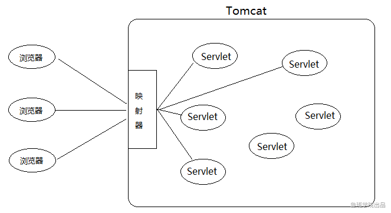

对应的就是web.xml中的`servlet-mapping`在Tomcat中定义为`org.apache.catalina.mapper.Mapper`类，在`org.apache.catalina.mapper.Mapper#internalMapWrapper`方法中处理各种映射配置

```java
private final void internalMapWrapper(ContextVersion contextVersion,
                                          CharChunk path,
                                          MappingData mappingData) throws IOException {

    int pathOffset = path.getOffset();
    int pathEnd = path.getEnd();
    boolean noServletPath = false;

    int length = contextVersion.path.length();
    if (length == (pathEnd - pathOffset)) {
        noServletPath = true;
    }
    int servletPath = pathOffset + length;
    path.setOffset(servletPath);

    // Rule 1 -- 精确匹配
    MappedWrapper[] exactWrappers = contextVersion.exactWrappers;
    internalMapExactWrapper(exactWrappers, path, mappingData);

    // Rule 2 -- 前缀匹配
    boolean checkJspWelcomeFiles = false;
    MappedWrapper[] wildcardWrappers = contextVersion.wildcardWrappers;
    if (mappingData.wrapper == null) {
        internalMapWildcardWrapper(wildcardWrappers, contextVersion.nesting,
                                   path, mappingData);
        if (mappingData.wrapper != null && mappingData.jspWildCard) {
            char[] buf = path.getBuffer();
            if (buf[pathEnd - 1] == '/') {
                mappingData.wrapper = null;
                checkJspWelcomeFiles = true;
            } else {
                // See Bugzilla 27704
                mappingData.wrapperPath.setChars(buf, path.getStart(),
                                                 path.getLength());
                mappingData.pathInfo.recycle();
            }
        }
    }

    if(mappingData.wrapper == null && noServletPath &&
       contextVersion.object.getMapperContextRootRedirectEnabled()) {
        // The path is empty, redirect to "/"
        path.append('/');
        pathEnd = path.getEnd();
        mappingData.redirectPath.setChars
            (path.getBuffer(), pathOffset, pathEnd - pathOffset);
        path.setEnd(pathEnd - 1);
        return;
    }

    // Rule 3 -- 扩展名匹配
    MappedWrapper[] extensionWrappers = contextVersion.extensionWrappers;
    if (mappingData.wrapper == null && !checkJspWelcomeFiles) {
        internalMapExtensionWrapper(extensionWrappers, path, mappingData,
                                    true);
    }

    ...
 //对于外部配置的mapper，用的是extensionWrappers接收的，上面都会处理完。如果在外部的配置中使用上面的匹配规则，n那么就不会走下面的逻辑了，而下面会有处理静态资源的defaultServlet映射关系，和JSPServlet映射关系，会导致都被外部的映射器强制映射到自己的Servlet中了。所以有时候外部的映射路径配置会导致访问静态资源或者jsp失败，报404错误
        
 //最后兜底的就是DefaultServlet，就是简单地用IO流读取静态资源并响应给浏览器。如果资源找不到，报404错误
```

在DispatcherServlet中使用`/或者/*`的方式进行映射。就会出现上面注释说的情况

DispatcherServlet配置`/`，会和DefaultServlet产生路径冲突，从而覆盖DefaultServlet。此时，所有对静态资源的请求，映射器都会分发给我们自己写的DispatcherServlet处理。遗憾的是，它只写了业务代码，并不能IO读取并返回静态资源。JspServlet的映射路径没有被覆盖，所以动态资源照常响应。

DispatcherServlet配置`/*`，虽然JspServlet和DefaultServlet拦截路径还是.jsp和/，没有被覆盖，但无奈的是在到达它们之前，请求已经被DispatcherServlet抢去，所以最终不仅无法处理JSP，也无法处理静态资源。

解决上面的问题就是不要覆盖别人的，自己写得精确点，加个`.do`的后缀


# Tomcat下的Servlet

2020-11-15 1:12:00

+二期的视频--关于Tomcat的专题

tomcat的lib下面有很多的jar包，核心功能就是`catalina.jar`---Servlet容器功能，其它就是其它的功能使用的。内嵌的Tomcat就是使用的`catalina.jar`的源码。

在内嵌版本的Tomcat中，启动Tomcat

```java
Tomcat tomcat = new Tomcat();
tomcat.setPort(8080);
// 告诉tomcat  web项目
tomcat.addWebapp("/","D:\\code\\java_learn\\spring-framework\\web");
tomcat.start();
tomcat.getServer().await();
```


==监听器模式 观察者模式==

理解就是，一个Servlet就是一个观察者，里面有个事件监听器就是被观察的。当有个url请求过来了，有些Servlet就会被调用service方法。url和Servlet的映射关系就是表示这个Servlet观察者订阅了这个事件监听器，只要这个事件触发了就通知这个观察者。

## Tomcat的构建

### 0、入口

org.apache.catalina.startup.Tomcat#addWebapp

```java
public Context addWebapp(String contextPath, String docBase) {
    return addWebapp(getHost(), contextPath, docBase);
}
```

### 3、创建Host

org.apache.catalina.startup.Tomcat#getHost

将2中的engine放入child属性上作为下一层

```java 
public Host getHost() {
    Engine engine = getEngine();
    if (engine.findChildren().length > 0) {
        return (Host) engine.findChildren()[0];
    }

    Host host = new StandardHost();
    host.setName(hostname);
    getEngine().addChild(host);
    return host;
}
```

### 2、创建Engine

org.apache.catalina.startup.Tomcat#getEngine

将engine放入1创建的service中，作为service的子容器

```java
public Engine getEngine() {
    Service service = getServer().findServices()[0];
    if (service.getContainer() != null) {
        return service.getContainer();
    }
    Engine engine = new StandardEngine();
    engine.setName( "Tomcat" );
    engine.setDefaultHost(hostname);
    engine.setRealm(createDefaultRealm());
    service.setContainer(engine);
    return engine;
}
```

### 1、创建Service

org.apache.catalina.startup.Tomcat#getServer

这个service就是放在顶级容器server中的

```java 
protected Server server;//最外层的server

public Server getServer() {

    if (server != null) {
        return server;
    }

    System.setProperty("catalina.useNaming", "false");

    server = new StandardServer();

    initBaseDir();

    server.setPort( -1 );

    Service service = new StandardService();
    service.setName("Tomcat");
    server.addService(service);
    return server;
}
```

### 4、创建Context-容器

将创建出来的Servlet容器Context先放入Host里面

org.apache.catalina.startup.Tomcat#addWebapp

```java
public Context addWebapp(Host host, String contextPath, String docBase,
        LifecycleListener config) {

    silence(host, contextPath);
	//这里创建出来的是 StandardContext 是Tomcat中Context的实现类，就是Servlet容器，就是上下文
    Context ctx = createContext(host, contextPath);
    ctx.setPath(contextPath);
    ctx.setDocBase(docBase);
    ctx.addLifecycleListener(getDefaultWebXmlListener());
    ctx.setConfigFile(getWebappConfigFile(docBase, contextPath));
     //将创建出来的LifecycleListener 添加到了Servlet容器中
    ctx.addLifecycleListener(config);

    if (config instanceof ContextConfig) {
        // prevent it from looking ( if it finds one - it'll have dup error )
        ((ContextConfig) config).setDefaultWebXml(noDefaultWebXmlPath());
    }

    if (host == null) {
        getHost().addChild(ctx);
    } else {
        host.addChild(ctx);
    }

    return ctx;
}
```


## Tomcat中的监听器模式

[java中的监听器模式](https://www.cnblogs.com/jenkov/p/listener_in_java.html)

[java中的观察者模式](https://www.cnblogs.com/luohanguo/p/7825656.html)

观察者（事件对象）：

被观察者（事件源）：Servlet

监听器

### LifecycleListener构建

在addWebapp方法中，加入了一个监听器

```java
public Context addWebapp(Host host, String contextPath, String docBase) {
    //LifecycleListener是抽象的监听器，这个监听器会被注册到被观察者Servlet容器中
    LifecycleListener listener = null;
    try {
        //这里找到真正的监听器，被观察者  
        //反射出来的 监听器实现类 org.apache.catalina.startup.ContextConfig
        Class<?> clazz = Class.forName(getHost().getConfigClass());
        listener = (LifecycleListener) clazz.getConstructor().newInstance();
    } catch (ReflectiveOperationException e) {
        // Wrap in IAE since we can't easily change the method signature to
        // to throw the specific checked exceptions
        throw new IllegalArgumentException(e);
    }

    return addWebapp(host,  contextPath, docBase, listener);
}
```

这里加入了一个`LifecycleListener`监听器，加载的是他的实现类


### Context容器注册监听

在创建完Context后，将传入的`LifecycleListener`监听器 注册进Servlet容器中---- `ctx.addLifecycleListener(config)`注册这个监听后，


Tomcat架构就是一个套娃式的，从Tomcat的server.xml文件中可以看出

Server  --->  Service  -->  Connector | Engine --->  context(servlet容器)

所以在构建Tomcat的时候，是一级一级创建出来的。

先创建Server---org.apache.catalina.startup.Tomcat#getServer

[原代码图](SpringMVC.assets/1605504691696-437576a3-b72d-4ecd-9c5a-20a69beb5481.png)

这里面有个加载顺序有问题：应该是：SPI的onStartup()--->ContextLoaderListener的listenerStart()--->Servlet的初始化方法

关键的方法 `org.apache.catalina.util.LifecycleBase#start`


监听器中读取web.xml

org.apache.catalina.LifecycleListener#lifecycleEvent					org.apache.catalina.startup.ContextConfig#lifecycleEvent				org.apache.catalina.startup.ContextConfig#configureStart				org.apache.catalina.startup.ContextConfig#webConfig

```java 
// Parse context level web.xml
InputSource contextWebXml = getContextWebXmlSource();
if (!webXmlParser.parseWebXml(contextWebXml, webXml, false)) {
    ok = false;
}
```


[Tomcat的设计模式](https://blog.csdn.net/jiaomingliang/article/details/47426683)

监听器怎么启动？

怎么创建Servlet，怎么启动Servlet？

Tomcat的SPI技术？

## Tomcat的启动

```java 
tomcat.start();

//org.apache.catalina.startup.Tomcat#start
public void start() throws LifecycleException {
    getServer();
    getConnector();
    server.start();
}
```

org.apache.catalina.util.LifecycleBase#start

org.apache.catalina.util.LifecycleBase#startInternal

```java 
// 执行监听器的事件 容器启动事件   ContextConfig此时执行   SPI的  ServletContainerInitializer 初始化
fireLifecycleEvent(Lifecycle.CONFIGURE_START_EVENT, null);

//执行 SPI 的  onStartup 方法
// Call ServletContainerInitializers
for (Map.Entry<ServletContainerInitializer, Set<Class<?>>> entry :
     initializers.entrySet()) {
    try {
        entry.getKey().onStartup(entry.getValue(),
                                 getServletContext());
    } catch (ServletException e) {
        log.error(sm.getString("standardContext.sciFail"), e);
        ok = false;
        break;
    }
}

// ServletContextListener 监听器执行  父容器创建 通过  applicationContext call 
if (ok) {
    if (!listenerStart()) {
        log.error(sm.getString("standardContext.listenerFail"));
        ok = false;
    }
}

//过滤器 
// Configure and call application filters
if (ok) {
    if (!filterStart()) {
        log.error(sm.getString("standardContext.filterFail"));
        ok = false;
    }
}

//Servlet初始化
// Load and initialize all "load on startup" servlets
if (ok) {
    if (!loadOnStartup(findChildren())){
        log.error(sm.getString("standardContext.servletFail"));
        ok = false;
    }
}
```


# Tomcat下的监听器

## LifecycleListener

org.apache.catalina.LifecycleListener

监听Tomcat生命周期的，在Tomcat的启动、初始化、销毁等状态。

```java
public interface LifecycleListener {
    
    /**
     * Acknowledge the occurrence of the specified event.
     *
     * @param event LifecycleEvent that has occurred
     */
    public void lifecycleEvent(LifecycleEvent event);
}
```

实现类`org.apache.catalina.startup.ContextConfig`

**作用于SPI机制中，来解耦的启动springIOC容器**

## ServletContextListener

这个监听器继承jdk中的事件监听器`java.util.EventListener`

作用是监听ServletContext的初始化和销毁

```java
public interface ServletContextListener extends EventListener {

    /**
     ** Notification that the web application initialization process is starting.
     * All ServletContextListeners are notified of context initialization before
     * any filter or servlet in the web application is initialized.
     * The default implementation is a NO-OP.
     * @param sce Information about the ServletContext that was initialized
     */
    public default void contextInitialized(ServletContextEvent sce) {
    }

    /**
     ** Notification that the servlet context is about to be shut down. All
     * servlets and filters have been destroy()ed before any
     * ServletContextListeners are notified of context destruction.
     * The default implementation is a NO-OP.
     * @param sce Information about the ServletContext that was destroyed
     */
    public default void contextDestroyed(ServletContextEvent sce) {
    }
}
```

作用就是**DispatcherServlet中的父容器的创建**，利用其实现类  `org.springframework.web.context.ContextLoaderListener`

# 手写SpringMVC架构


## 整体架构

使用spring+Servlet实现，Servlet需要使用Tomcat管理。

## 功能分析

1、使用内嵌的Tomcat作为Servlet容器

2、使用spring的IOC来管理处理器

## 核心点

处理器适配器，处理器映射器

SpringMVC主要就是解决url和处理的映射关系，为什么要一个适配器，就是因为在web框架的发展过程中有不同的处理器的实现，所以为了整合这些处理器，就出现了处理器适配器，主要是把不同的处理逻辑分配给不同的 处理器实现。

## 处理器

SpringMVC支持的处理器有：@Controller、Servlet、Controller、HttpRequestHandler

其中Servlet、Controller、HttpRequestHandler都是接口，里面只有一个方法，这个方法就是处理逻辑的，非常好定位处理逻辑，找到这个实现就可以执行这个方法了，即建立url和这个bean的映射关系就行了。但是很单一，每个url都需要写一个接口实现。所以出现了方法级别的处理方式。

## 映射器

映射器就是用来映射url和处理器的处理方法的。

在上面的处理器中，Servlet、Controller、HttpRequestHandler这三个以这个接口来定义映射器，就是本身。因为处理器内部就一个确定的方法执行处理逻辑，所以不需要额外的映射器了。

在注解方式的处理器中需要再引入一个==url和方法的映射器`@RequestMapping`==，这个注解放在方法或类上，主要就是匹配请求url和处理器的。

## 适配器

作用就是找到对应的处理器然后执行处理器的方法。

通过上面处理器的分析可以知道，SpringMVC中有不止一个处理器（上面只是举了4个例子）。

SpringMVC启动完成后，就会将所有的处理器维护在一个map中，`url <==>处理器（object）`。当请求url过来，可以直接通过url找到处理器（这个处理器是Object类型），然后这个时候就需要通过处理器适配器去找到具体的处理器类型，然后执行处理逻辑。--每个处理器的实现方式不同，导致需要一个适配器来管理执行。


## 注解方式的实现原理

初始化的时候完成url和方法的映射。使用springIOC的后置处理器来管理，主要管理Controller控制器，在初始化之后拿到beanName和bean，通过bean上的注解判断是否是处理器（controller层），find出处理器中所有的方法，方法上有requestMapping的就是处理请求的，解析注解里面的url，完成了请求url和处理器方法的映射。

当有请求进入，先通过url在处理器映射器中找到对应的处理器，这时如果是我们之前说的Controller类型的，就返回这个映射关系。然后通过处理器适配器找到这个Controller类型的处理器的执行逻辑。最后就执行了处理请求的逻辑。

注解方式的难点：方法里面的参数和url的参数如何对应。涉及到参数绑定。SpringMVC 中有个`@RequestParam`参数来维护，同样不加这个参数时通过参数名来进行匹配。但是如何拿到方法的参数？在jdk8之前，没有对方法参数的反射方法。所以使用ASM技术直接读取字节码里面的方法参数来完成url的param和方法参数的绑定。

## 接口方式的实现原理

处理和注解的类似，就是通过url找到初始化就和url映射好的处理器，然后通过适配器找到处理器的执行过程，然后执行对应的处理方法。


# Tomcat下的SPI机制

## 为什么会出现这个机制？

因为SpringMVC这种方式需要将应用部署到Tomcat中，如果想用内嵌的Tomcat，就必须耦合启动springIOC容器。为了解耦可以使用SPI机制来实现。

**[图   解-01](SpringMVC.assets/1606107216572-c05aff9d-c903-4e83-8df8-0eb3e5343328.png)**

**[图   解-02](SpringMVC.assets/Tomcat-SPI.jpg)**

2020-11-17 1:41    和   2020-11-24 35：00

## 原理

利用监听器 ContextConfig  加载 `/WEB-INF/lib/`下 每个jar 包内的 相对路径`META-INF/services/`下名为`javax.servlet.ServletContainerInitializer` 的文件，解析文件内容，得到所有 ServletContainerInitializer 的实现类。

ServletContainerInitializers接口实现类  任意jar  相对路径  META-INF/service +  接口全限定名)下：实现类(字符串)

在Servlet启动前，调用所有 ServletContainerInitializer 实现类的 `onStartup`方法。

### 0、ContextConfig监听器

利用Tomcat初始化的时候加载的那个监听器：`org.apache.catalina.startup.ContextConfig`,然后再启动Tomcat完成后，这个监听器的`org.apache.catalina.startup.ContextConfig#lifecycleEvent`方法就被调用了

ContextConfig  实现了 LifecycleListener 接口

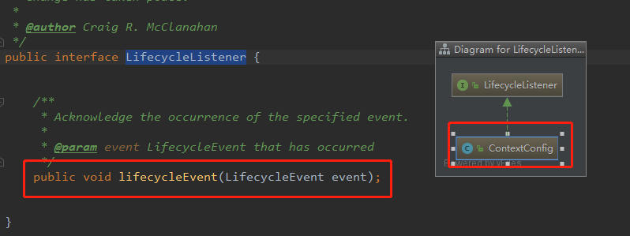

具体流程见  图解

类加载过程org.apache.catalina.startup.WebappServiceLoader

```java
private static final String LIB = "/WEB-INF/lib/";
private static final String SERVICES = "META-INF/services/";
//加载过程  入参 ServletContainerInitializer.class
public List<T> load(Class<T> serviceType) throws IOException {
    //加载相对路径   META-INF/services/ 下的 javax.servlet.ServletContainerInitializer 文件
    String configFile = SERVICES + serviceType.getName();

    LinkedHashSet<String> applicationServicesFound = new LinkedHashSet<>();
    LinkedHashSet<String> containerServicesFound = new LinkedHashSet<>();

    ClassLoader loader = servletContext.getClassLoader();

    // if the ServletContext has ORDERED_LIBS, then use that to specify the
    // set of JARs from WEB-INF/lib that should be used for loading services
    // 都加载哪些：WEB-INF/lib 下的所有jar包，每个jar下面都可以配置 configFile 文件 都加载 出来
    @SuppressWarnings("unchecked")
    List<String> orderedLibs =
        (List<String>) servletContext.getAttribute(ServletContext.ORDERED_LIBS);
    if (orderedLibs != null) {
        // handle ordered libs directly, ...
        for (String lib : orderedLibs) {
            URL jarUrl = servletContext.getResource(LIB + lib);
            if (jarUrl == null) {
                // should not happen, just ignore
                continue;
            }

            String base = jarUrl.toExternalForm();
            URL url;
            if (base.endsWith("/")) {
                url = new URL(base + configFile);
            } else {
                url = JarFactory.getJarEntryURL(jarUrl, configFile);
            }
            try {
                parseConfigFile(applicationServicesFound, url);
            } catch (FileNotFoundException e) {
                // no provider file found, this is OK
            }
        }

        // and the parent ClassLoader for all others
        loader = context.getParentClassLoader();
    }

    Enumeration<URL> resources;
    if (loader == null) {
        resources = ClassLoader.getSystemResources(configFile);
    } else {
        resources = loader.getResources(configFile);
    }
    while (resources.hasMoreElements()) {
        parseConfigFile(containerServicesFound, resources.nextElement());
    }

    // Filter the discovered container SCIs if required
    if (containerSciFilterPattern != null) {
        Iterator<String> iter = containerServicesFound.iterator();
        while (iter.hasNext()) {
            if (containerSciFilterPattern.matcher(iter.next()).find()) {
                iter.remove();
            }
        }
    }

    // Add the application services after the container services to ensure
    // that the container services are loaded first
    containerServicesFound.addAll(applicationServicesFound);

    // load the discovered services
    if (containerServicesFound.isEmpty()) {
        return Collections.emptyList();
    }
    return loadServices(serviceType, containerServicesFound);
}
```


### 1、webConfig 方法加载SPI文件

Context启动过程中，触发监听器方法`webConfig`（如何调到这个方法的见-图解02）。

### 1.1、加载文件并得到所有实现类

通过特定的类加载器去加载 `/WEB-INF/lib/`下 每个jar 包内的 相对路径`META-INF/services/`下名为`javax.servlet.ServletContainerInitializer` 的文件。得到所有 ServletContainerInitializer 的实现类。

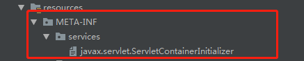

### 1.2、解析@HandlesTypes注解

若 `ServletContainerInitializer` 的实现类上面有注解 `@HandlesTypes`，就解析注解，并得到注解内的接口的实现类集合（Set集合）。得到的集合是为了后续 onStartup方法的入参。

```
@HandlesTypes(WebApplicationInitializer.class)
原理：利用字节码技术找出所有jar和程序里面的  WebApplicationInitializer  的实现类。
具体的：
注解的解析，使用了字节码技术   类似于代理里面的字节码技术javasist  ，java的字节码解析技术 asm   ，这里的字节码技术是 `bcel` 为了解析jar里面和class目录里的字节码文件，把这个字节码文件上的父类，实现的接口，注解等信息解析出来。
```


```
例如，
ServletContainerInitializer的  实现类S1@HandlesTypes(A.class,B.class)
ServletContainerInitializer的  实现类S2@HandlesTypes(A.class,C.class)
A的实现类Ai1,Ai2, B的实现类Bi1,Bi2，C的实现类Ci1,Ci2，ABC的实现类可以在不同的jar里面
实现类S1、实现类S2 也可能在不同的jar里面

得到映射关系
最终 Map<ServletContainerInitializer, Set<Class<?>>> 
initializerClassMap<实现类S1, Set(Ai1.class,Ai2.class,Bi1.class,Bi2.class)>
initializerClassMap<实现类S2, Set(Ai1.class,Ai2.class,Ci1.class,Ci2.class)>
```

### 2、调 onStartup  方法

回到StandardContext的启动方法内，执行所有`ServletContainerInitializer` 实现类的 `onStartup` 方法。

这个方法暴露了两个点：

①：将Servlet容器上下文传入 applicationContext中，可以在applicationContext中 操作ServletContext；  						        ②：这onStartup方法执行的时机是在Servlet初始化之前，在过滤器之前，此时还可操作Servlet。

```java
如果ServletContainerInitializer实现类上没有@HandlesTypes注解，则入参Set就是null

for (Map.Entry<ServletContainerInitializer, Set<Class<?>>> entry :
    initializers.entrySet()) {// initializers 就是  initializerClassMap
    try {
        entry.getKey().onStartup(entry.getValue(),
                getServletContext());
    } catch (ServletException e) {
        log.error(sm.getString("standardContext.sciFail"), e);
        ok = false;
        break;
    }
}
```

### 3、实现类的执行

如 webMVC中的`ServletContainerInitializer`实现类  用来实现零配置--替代web.xml的内容。利用了onStartup 暴露的两点，完成  DispatcherServlet的加载、父子容器的加载（也是一个监听器）、过滤器的加载。

## SpringServletContainerInitializer

### SPI文件

在WebMVC中的SPI文件 spring-web-5.1.8.RELEASE.jar!/META-INF/services/javax.servlet.ServletContainerInitializer

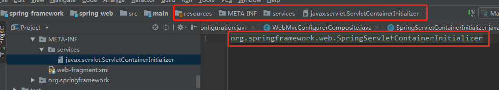

### 源码内容

利用SPI 配置的 `ServletContainerInitializer`的 实现类是     org.springframework.web.SpringServletContainerInitializer

```java 
@HandlesTypes(WebApplicationInitializer.class)
public class SpringServletContainerInitializer implements ServletContainerInitializer {
    //入参有  servletContext  
    //   Servlet 3.0+ containers
   @Override
   public void onStartup(@Nullable Set<Class<?>> webAppInitializerClasses, ServletContext servletContext)
         throws ServletException {

      List<WebApplicationInitializer> initializers = new LinkedList<>();

      if (webAppInitializerClasses != null) {
         for (Class<?> waiClass : webAppInitializerClasses) {
            // Be defensive: Some servlet containers provide us with invalid classes,
            // no matter what @HandlesTypes says...
            if (!waiClass.isInterface() && !Modifier.isAbstract(waiClass.getModifiers()) &&
                  WebApplicationInitializer.class.isAssignableFrom(waiClass)) {
               try {
                  initializers.add((WebApplicationInitializer)
                        ReflectionUtils.accessibleConstructor(waiClass).newInstance());
               }
               catch (Throwable ex) {
                  throw new ServletException("Failed to instantiate WebApplicationInitializer class", ex);
               }
            }
         }
      }

      if (initializers.isEmpty()) {
         servletContext.log("No Spring WebApplicationInitializer types detected on classpath");
         return;
      }

      servletContext.log(initializers.size() + 
                         " Spring WebApplicationInitializers detected on classpath");
      AnnotationAwareOrderComparator.sort(initializers);
      for (WebApplicationInitializer initializer : initializers) {
          //触发  WebApplicationInitializer  实现类的 onStartup方法
         initializer.onStartup(servletContext);
      }
   }

}
```

### 完成的功能

上面没有做什么，真正实现功能的是`WebApplicationInitializer`实现类 `org.springframework.web.servlet.support.AbstractDispatcherServletInitializer`

==完成了，DispatcherServlet的加载和过滤器的加载，替代了web.xml，实现了零配置的重要步骤==

```java 
@Override
public void onStartup(ServletContext servletContext) throws ServletException {
   super.onStartup(servletContext);
   // 注册 DispatcherServlet
   registerDispatcherServlet(servletContext);
}

protected void registerDispatcherServlet(ServletContext servletContext) {
    //创建 DispatcherServlet  
    FrameworkServlet dispatcherServlet = createDispatcherServlet(servletAppContext);
    // 放入ServletContext 中
    ServletRegistration.Dynamic registration 
        = servletContext.addServlet(servletName, dispatcherServlet);

    Filter[] filters = getServletFilters();
    if (!ObjectUtils.isEmpty(filters)) {
        for (Filter filter : filters) {
            // 注册过滤器
            registerServletFilter(servletContext, filter);
        }
    }
}

protected FrameworkServlet createDispatcherServlet(WebApplicationContext servletAppContext) {
    //DispatcherServlet  直接new出来的
	return new DispatcherServlet(servletAppContext);
}
```

## 扩展点

上面`SpringServletContainerInitializer`的应用没有执行什么，主要是那个Set参数，用来扩展的，也就是开发人员可以自己写一个  ` WebApplicationInitializer` 的实现类，就会在Servlet启动前触发 你实现 的  `onStartup`方法，这里的方法入参就只有ServletContext了。


springboot类似就是这么搞的。只是不是这个接口。但是Tomcat的方法入口还是`processServletContainerInitializers`

最后在org.apache.catalina.core.StandardContext#startInternal方法里面循环get出之前的实现类，执行`onStartup`方法。


[SPI机制的简单介绍](https://blog.csdn.net/gaohaicheng123/article/details/105824988)

上面的介绍只是介绍了java中和dubbo中的SPI。Tomcat的SPI和java中的一样。在springboot中也有自己的SPI，自定义类加载器中也是。

在Tomcat中也有个自定义类加载器，这个是为了隔离应用，每次都是new一个类加载器来加载webApp下的不同应用。servlet3.0的核心接口：ServletContainerInitializers接口  调用 onStartup

在2020-11-21 前15分钟解释了一个404的bug：在是使用内嵌的Tomcat的add一个自定义的Servlet的时候，发现请求是404的。原因是，直接add没有设置加载模式`<load-on-startup>1</load-on-startup>`整数是预加载。没有配置是懒加载。就会导致初始化的时候自定义的Servlet没有执行初始化方法，但是当第一个请求进来的时候应该就要初始化了，但是结果是并没有，还报了404。原因就是，自定义的Servlet的映射路径是`/`，这个就牵扯到资源问题了，加载顺序的问题。这个配置了`/`的Servlet由于是懒加载，就会被Tomcat中的defaultServlet先拦截掉，因为在处理映射路径的时候，DefaultServlet匹配成`/`了，导致懒加载的Servlet无法获取到`/`的请求了。改成`*.do`就可以访问了。

# 内嵌版本的Tomcat怎么导入

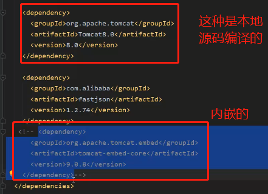

如上引入Tomcat没有jsp解析引擎Jasper，会有jsp解析异常，有需要就再依赖一下Jasper就行了


# SpringMVC

## web.xml

springmvc的web框架的配置文件

```xml 
<web-app>
    <listener>
        <listener-class>org.springframework.web.context.ContextLoaderListener</listener-class>
    </listener>

    <context-param>
        <param-name>contextConfigLocation</param-name>
        <param-value>/WEB-INF/applicationContext.xml</param-value>
    </context-param>

    <servlet>
        <servlet-name>app</servlet-name>
        <servlet-class>org.springframework.web.servlet.DispatcherServlet</servlet-class>
        <init-param>
            <param-name>contextConfigLocation</param-name>
            <param-value>classpath:springmvc.xml</param-value>
        </init-param>
        <load-on-startup>1</load-on-startup>
    </servlet>

    <servlet-mapping>
        <servlet-name>app</servlet-name>
        <url-pattern>/*</url-pattern>
    </servlet-mapping>
</web-app>
```

## DispatcherServlet.properties

在org/springframework/web/servlet/DispatcherServlet.properties文件中配置了mvc默认的相关组件

## ContextLoaderListener

这个监听器实现了`javax.servlet.ServletContextListener`，监听ServletContext的初始化和销毁。


### ContextLoader

具体完成监听逻辑，初始化web应用上下文，即root ApplicationContext，他的主要流程就是创建一个IOC容器，并将创建的IOC容器存到servletContext中

1.contextId：当前容器的id，主要给底层所使用的BeanFactory，在进行序列化时使用。

2.contextConfigLocation：配置文件的位置，默认为WEB-INF/applicationContext.xml，可以通过在web.xml使用context-param标签来指定其他位置，其他名字或者用逗号分隔指定多个。在配置文件中通过beans作为主标签来定义bean。这样底层的BeanFactory会解析beans标签以及里面的bean，从而来创建BeanDefinitions集合，即bean的元数据内存数据库。

3.contextClass：当前所使用的WebApplicationContext的类型，如果是在WEB-INF/applicationContext.xml中指定beans，则使用XmlWebApplicationContext，如果是通过注解，如@Configuration，@Component等，则是AnnotationConfigWebApplicationContext，通过扫描basePackages指定的包来创建bean。

4.contextInitializerClasses：ApplicationContextInitializer的实现类，即在调用ApplicationContext的refresh加载beanDefinition和创建bean之前，对WebApplicationContext进行一些初始化


### 启动入口

org.apache.catalina.core.StandardContext#startInternal

```java
for (Map.Entry<ServletContainerInitializer, Set<Class<?>>> entry :
    initializers.entrySet()) {
    try {
        //SPI
        entry.getKey().onStartup(entry.getValue(),
                getServletContext());
    } catch (ServletException e) {
        log.error(sm.getString("standardContext.sciFail"), e);
        ok = false;
        break;
    }
}
if (ok) {
    //ContextLoaderListener
    if (!listenerStart()) {
        log.error(sm.getString("standardContext.listenerFail"));
        ok = false;
    }
}
if (ok) {
    //Servlet的初始化
    if (!loadOnStartup(findChildren())){
        log.error(sm.getString("standardContext.servletFail"));
        ok = false;
    }
}
```

在ServletContext初始化的时候会调用 `org.springframework.web.context.ContextLoaderListener#contextInitialized`--重写接口的ServletContext初始化的监听方法。

```java
@Override
public void contextInitialized(ServletContextEvent event) {
   initWebApplicationContext(event.getServletContext());
}
```


### 创建父容器

这个监听的作用就是==创建父容器==。

`现在SpringMVC独大，基本就不需要父容器了。`

### 原理和源码

逻辑都在这个地方了   										org.springframework.web.context.ContextLoader#initWebApplicationContext

1、先判断当前是否有容器（SpringIOC），有就直接抛异常---非法创建了容器

2、选择创建的IOC容器

2.1、Servlet配置文件中的init-param中是否配置了指定的容器--通过参数contextClass，指定了就直接反射创建指定的容器

2.2、没有指定的就创建默认的容器 `org.springframework.web.context.WebApplicationContext`，这个容器是`AbstractApplicationContext`的子类---也就是一个SpringIOC容器

3、判断创建的容器是否是 `org.springframework.web.context.ConfigurableWebApplicationContext` 接口的实现类，不是就抛异常

4、反射创建容器--自然就使用 `ConfigurableWebApplicationContext` `来接收

5、创建好容器了，将当前的ServletContext引用放入容器中，并且调用`refresh`启动容器

6、创建的容器，set到ServletContext中去


### 父子容器理解

一般我们的web框架不会进行切换，但是以前的strust2想要切换为springMVC就有很多bean的切换，所以为了方便也是为了开发方便理解这个bean的用途，就将web框架使用的springIOC容器作为子容器，将基础框架中的springIOC容器作为父容器进行管理。父容器exclude排除Controller的bean，子容器include只包含Controller的bean。

子容器就是web框架拥有的，web框架内核就是Servlet。web框架起来后，当前就会创建一个SpringIOC容器，这个容器就是子容器，这个子容器里面存放了ServletContext

使用SpringMVC的话当前容器肯定就是子容器，在使用上并没有什么影响，因为我们在getBean的时候先在当前容器中找，没找的就会去父容器中getBean。子容器中存储了父容器的引用

注意父容器的bean无法引用子容器的bean，即service无法注入controller的依赖


2020-11-19 44  之前是讲原理，这个点开始讲源码

Servlet启动的时候执行监听器的`org.springframework.web.context.ContextLoaderListener#contextInitialized`实现方法。

```java
@Override
public void contextInitialized(ServletContextEvent event) {
   initWebApplicationContext(event.getServletContext());
}
```

org.springframework.web.context.ContextLoader#initWebApplicationContext

创建出来的默认容器是  XmlWebApplicationContext  也是AbstractApplicationContext的子类

在创建这个父容器的时候将入参的ServletContext引用放入到当前容器中了。--==建立Servlet和springIOC的连接==

将创建 好的容器又放回ServletContext中，给子容器，子容器在后面DispatcherServlet初始化的时候创建并初始化的。

```java
//将配置并且刷新过的容器存入servlet上下文中，并以WebApplicationContext的类名作为key值
servletContext.setAttribute(WebApplicationContext.ROOT_WEB_APPLICATION_CONTEXT_ATTRIBUTE, this.context);
```


## DispatcherServlet

DispatcherServlet就是一个servlet，生命周期（实例化(无参构造器)，初始化（init），调用service(doService)，销毁(distory)）

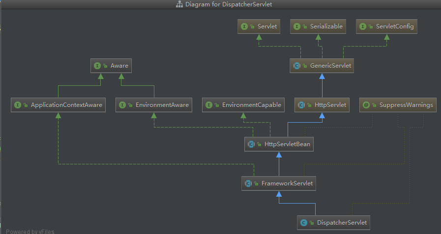

### 初始化

#### 功能

- 创建了子容器；

- 将DispatcherServlet的ServletContext放入容器，建立了IOC容器和ServletContext的映射；

- 并且SpringMVC的容器放入ServletContext中（交给Servlet容器管理）；

- 通过模板方法模式调用子类DispatcherServlet的onRefresh()方法初始化SpringMVC的9大组件。

  

  父容器可以不需要，因为不需要切换前端框架的配置文件了。如果不需要父容器那就不要在web.xml配置ContextLoaderListener监听和spring.xml映射就行了

#### 具体步骤

在springMVC中使用Servlet和普通的java应用使用Servlet一样。DispatcherServlet是配置在web.xml中的，==Servlet都是通过Servlet容器Tomcat读取web.xml文件启动的。==

1、Tomcat执行init方法：执行的是父类`javax.servlet.GenericServlet`的`public void init(ServletConfig config) throws ServletException;`方法。==GenericServlet#init==

2、`GenericServlet`类又抽象出一个`init()`提供给子类继续初始化。这个子类就是`HttpServletBean`，它也只是将当前DispatcherServlet包装成 BeanWrapper

3、`HttpServletBean`类也继续提供初始化`initServletBean`方法给子类实现。这个子类就是`FrameworkServlet`，在这个类中的`initWebApplicationContext`方法中初始化了子容器，原理和创建父容器是一样的（同样将当前DispatcherServlet的ServletContext放入IOC容器中，默认创建的容器也是XmlWebApplicationContext  ，如果有父容器，子容器就会存储父容器的引用）。==HttpServletBean#initServletBean==

4、`FrameworkServlet`类在这个方法`initWebApplicationContext`中提供了一个`onRefresh(wac)`调用，但是该类`FrameworkServlet`并没有实现这个方法，提供给子类来继续初始化。==FrameworkServlet#initWebApplicationContext==

5、`DispatcherServlet`这个类继承FrameworkServlet类，重写onRefresh方法，完成了DispatcherServlet的初始化--初始化了9大组件。==DispatcherServlet#onRefresh==


### 处理请求

请求处理的点就是利用Servlet容器-Tomcat触发Servlet的处理请求的方法-service。处理Http请求的专门有个子类HttpServlet，完成了Tomcat对Servlet的service的调用。通过了FrameworkServlet重写各种请求类型的处理，最后由==DispatcherServlet#doService==来完成请求处理。

从继承关系来看，继承了`HttpServlet`就处理了service，对外按照请求类型进行分别扩展了，详细的见Servlet简介。但是DispatcherServlet不仅于此，在`FrameworkServlet`中重写了各种请求类型的扩展方法（doGet,doPost,doPut,doDelete），又同时调了自己的方法`FrameworkServlet#processRequest`，这个方法内部调了`doService`这个方法本类没有实现，提供给子类DispatcherServlet实现，也是Dispatcher处理请求的总入口。在DispatcherServlet的`doService`方法中调用了`doDispatch`。


### doDispatch

#### 1、获取处理器

mappedHandler = getHandler(processedRequest);

#### 2、获取适配器

HandlerAdapter ha = getHandlerAdapter(mappedHandler.getHandler());

#### 3、拦截器-前置方法

mappedHandler.applyPreHandle(processedRequest, response)

#### 4、处理业务

通过适配器处理业务逻辑

mv = ha.handle(processedRequest, response, mappedHandler.getHandler());

#### 5、异步请求处理

asyncManager.isConcurrentHandlingStarted()

#### 6、拦截器--拦截中的方法

mappedHandler.applyPostHandle(processedRequest, response, mv);

这个方法不一定会执行，因为如果处理请求报错后，就不处理了

#### 7、拦截器-后置方法

mappedHandler.applyAfterConcurrentHandlingStarted(processedRequest, response);

这个是必定会执行

#### 8、异常处理

创建一个自己异常处理类MyHandlerExceptionResolver，只要实现HandlerExceptionResolver即可，实现的MyHandlerExceptionResolver注入到容器中

#### 源码

```java
protected void doService(HttpServletRequest request, HttpServletResponse response) throws Exception {
    logRequest(request);

    // Keep a snapshot of the request attributes in case of an include,
    // to be able to restore the original attributes after the include.
    Map<String, Object> attributesSnapshot = null;
    if (WebUtils.isIncludeRequest(request)) {
        attributesSnapshot = new HashMap<>();//保存request域中的数据,存一份快照
        Enumeration<?> attrNames = request.getAttributeNames();
        while (attrNames.hasMoreElements()) {
            String attrName = (String) attrNames.nextElement();
            if (this.cleanupAfterInclude || attrName.startsWith(DEFAULT_STRATEGIES_PREFIX)) {
                attributesSnapshot.put(attrName, request.getAttribute(attrName));
            }
        }
    }

    //设置web应用上下文
    request.setAttribute(WEB_APPLICATION_CONTEXT_ATTRIBUTE, getWebApplicationContext());
    //国际化本地
    request.setAttribute(LOCALE_RESOLVER_ATTRIBUTE, this.localeResolver);
    //样式
    request.setAttribute(THEME_RESOLVER_ATTRIBUTE, this.themeResolver);
    //设置样式资源
    request.setAttribute(THEME_SOURCE_ATTRIBUTE, getThemeSource());

    //请求刷新时保存属性
    if (this.flashMapManager != null) {
        FlashMap inputFlashMap = this.flashMapManager.retrieveAndUpdate(request, response);
        if (inputFlashMap != null) {
            request.setAttribute(INPUT_FLASH_MAP_ATTRIBUTE, Collections.unmodifiableMap(inputFlashMap));
        }
        //Flash attributes 在对请求的重定向生效之前被临时存储（通常是在session)中，并且在重定向之后被立即移除
        request.setAttribute(OUTPUT_FLASH_MAP_ATTRIBUTE, new FlashMap());
        //FlashMap 被用来管理 flash attributes 而 FlashMapManager 则被用来存储，获取和管理 FlashMap 实体
        request.setAttribute(FLASH_MAP_MANAGER_ATTRIBUTE, this.flashMapManager);
    }

    try {
        doDispatch(request, response);//核心方法
    }finally {
        if (!WebAsyncUtils.getAsyncManager(request).isConcurrentHandlingStarted()) {
            // Restore the original attribute snapshot, in case of an include.
            if (attributesSnapshot != null) {
                restoreAttributesAfterInclude(request, attributesSnapshot);//将快照覆盖回去
            }
        }
    }
}

protected void doDispatch(HttpServletRequest request, HttpServletResponse response) throws Exception {
    HttpServletRequest processedRequest = request;
    HandlerExecutionChain mappedHandler = null;
    boolean multipartRequestParsed = false;

    WebAsyncManager asyncManager = WebAsyncUtils.getAsyncManager(request);

    try {
        ModelAndView mv = null;
        Exception dispatchException = null;

        try {
            //将request转换成multipartRequest，并检查是否解析成功(判断是否有文件上传)
            processedRequest = checkMultipart(request);
            multipartRequestParsed = (processedRequest != request);

            //根据请求信息获取handler（包含了拦截器）
            mappedHandler = getHandler(processedRequest);
            if (mappedHandler == null) {
                noHandlerFound(processedRequest, response);
                return;
            }

            //根据handler获取adapter
            HandlerAdapter ha = getHandlerAdapter(mappedHandler.getHandler());

            // Process last-modified header, if supported by the handler.
            String method = request.getMethod();
            boolean isGet = "GET".equals(method);
            if (isGet || "HEAD".equals(method)) {
                long lastModified = ha.getLastModified(request, mappedHandler.getHandler());
                if (new ServletWebRequest(request, response).checkNotModified(lastModified) && isGet) {
                    return;
                }
            }
            //拦截器逻辑
            if (!mappedHandler.applyPreHandle(processedRequest, response)) {
                return;
            }

            //执行业务处理，返回视图模型
            mv = ha.handle(processedRequest, response, mappedHandler.getHandler());

            if (asyncManager.isConcurrentHandlingStarted()) {
                return;
            }
            //给视图模型设置viewName
            applyDefaultViewName(processedRequest, mv);
            //拦截器逻辑
            mappedHandler.applyPostHandle(processedRequest, response, mv);
        }catch (Exception ex) {
            dispatchException = ex;
        }catch (Throwable err) {
            // As of 4.3, we're processing Errors thrown from handler methods as well,
            // making them available for @ExceptionHandler methods and other scenarios.
            dispatchException = new NestedServletException("Handler dispatch failed", err);
        }
        //处理请求结果,使用了组件LocaleResolver, ViewResolver和ThemeResolver(view#render)
        processDispatchResult(processedRequest, response, mappedHandler, mv, dispatchException);
    }catch (Exception ex) {
        triggerAfterCompletion(processedRequest, response, mappedHandler, ex);
    }catch (Throwable err) {
        triggerAfterCompletion(processedRequest, response, mappedHandler,
                               new NestedServletException("Handler processing failed", err));
    }finally {
        if (asyncManager.isConcurrentHandlingStarted()) {
            // Instead of postHandle and afterCompletion
            if (mappedHandler != null) {
                mappedHandler.applyAfterConcurrentHandlingStarted(processedRequest, response);
            }
        }else {
            // Clean up any resources used by a multipart request.
            if (multipartRequestParsed) {
                cleanupMultipart(processedRequest);
            }
        }
    }
}

private void processDispatchResult(HttpServletRequest request, HttpServletResponse response,
        @Nullable HandlerExecutionChain mappedHandler, @Nullable ModelAndView mv,
        @Nullable Exception exception) throws Exception {

    boolean errorView = false;

    //异常处理
    if (exception != null) {
        //ModelAndViewDefiningException类型，会携带对应的ModelAndView
        if (exception instanceof ModelAndViewDefiningException) {
            logger.debug("ModelAndViewDefiningException encountered", exception);
            mv = ((ModelAndViewDefiningException) exception).getModelAndView();
        }else {
            //由对应的处理器handler进行异常处理，返回ModelAndView。其中使用了HandlerExceptionResolver。
            Object handler = (mappedHandler != null ? mappedHandler.getHandler() : null);
            mv = processHandlerException(request, response, handler, exception);
            errorView = (mv != null);
        }
    }
    ....
protected ModelAndView processHandlerException(HttpServletRequest request, HttpServletResponse response, @Nullable Object handler, Exception ex) throws Exception {

        // Success and error responses may use different content types
        request.removeAttribute(HandlerMapping.PRODUCIBLE_MEDIA_TYPES_ATTRIBUTE);

        // Check registered HandlerExceptionResolvers...
        ModelAndView exMv = null;
        if (this.handlerExceptionResolvers != null) {
            for (HandlerExceptionResolver resolver : this.handlerExceptionResolvers) {
                exMv = resolver.resolveException(request, response, handler, ex);
                if (exMv != null) {
                    break;
                }
            }
        }
        ......
            
```


## HandlerMapping

作用就是映射请求地址url 和 处理器（处理器可能是类，可能是方法）。为什么有多种，就是历史版本的更迭。

在启动的时候就完成了映射。

### 顶级接口HandlerMapping

顶级接口--提供getHandler方法。在DispatcherServlet处理请求的时候，调用getHandler方法获取处理器`HandlerExecutionChain getHandler(HttpServletRequest request) throws Exception;`

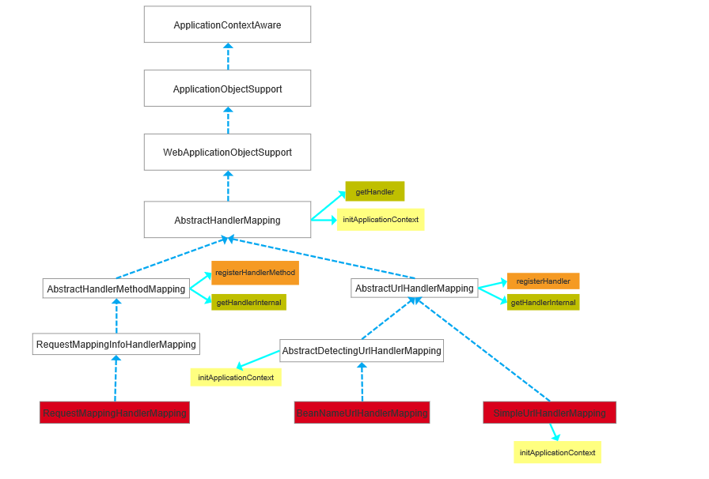

这个一般没人用，都用其实现类---下面的三种，`BeanNameUrlHandlerMapping  和 SimpleUrlHandlerMapping`是配置了url和handler的映射关系的，`SimpleUrlHandlerMapping` 手动在xml文件中配置url和Controller；`BeanNameUrlHandlerMapping  `手动配置bean的id属性为url 。

其中`RequestMappingHandlerMapping`是处理器注解的不能直接用，通过注解去使用

### SimpleUrlHandlerMapping类

用法手动配置

```xml
<beans ...>
 
	<bean class="org.springframework.web.servlet.handler.SimpleUrlHandlerMapping">
	   <property name="mappings">
		<props>
		   <prop key="/welcome.htm">welcomeController</prop>
		   <prop key="/*/welcome.htm">welcomeController</prop>
		   <prop key="/helloGuest.htm">helloGuestController</prop>
		 </props>
	   </property>
	</bean>
	
	<bean id="welcomeController" 
		class="com.mkyong.common.controller.WelcomeController" />
		
	<bean id="helloGuestController" 
		class="com.mkyong.common.controller.HelloGuestController" />
		
</beans>
```


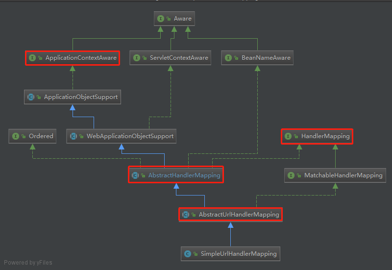

间接实现了org.springframework.web.servlet.HandlerMapping接口，直接实现该接口的是org.springframework.web.servlet.handler.AbstractHandlerMapping抽象类，映射Url与请求handler bean。支持映射bean实例和映射bean名称

```java
public class SimpleUrlHandlerMapping extends AbstractUrlHandlerMapping {
    // 存储url和bean映射
    private final Map<String, Object> urlMap = new LinkedHashMap<>();
    // 注入property的name为mappings映射
    public void setMappings(Properties mappings) {
        CollectionUtils.mergePropertiesIntoMap(mappings, this.urlMap);
    }
    // 注入property的name为urlMap映射
    public void setUrlMap(Map<String, ?> urlMap) {
        this.urlMap.putAll(urlMap);
    }
    public Map<String, ?> getUrlMap() {
        return this.urlMap;
    }
    // 实例化本类实例入口
    @Override
    public void initApplicationContext() throws BeansException {
        // 调用父类AbstractHandlerMapping的initApplicationContext方法，只要完成拦截器的注册
        super.initApplicationContext();
        // 处理url和bean name，具体注册调用父类完成
        registerHandlers(this.urlMap);
    }
    // 注册映射关系，及将property中的值解析到map对象中，key为url，value为bean id或name
    protected void registerHandlers(Map<String, Object> urlMap) throws BeansException {
        if (urlMap.isEmpty()) {
            logger.warn("Neither 'urlMap' nor 'mappings' set on SimpleUrlHandlerMapping");
        } else {
            urlMap.forEach((url, handler) -> {
                // 增加以"/"开头
                if (!url.startsWith("/")) {
                    url = "/" + url;
                }
                // 去除handler bean名称的空格
                if (handler instanceof String) {
                    handler = ((String) handler).trim();
                }
                // 调用父类AbstractUrlHandlerMapping完成映射
                registerHandler(url, handler);
            });
        }
    }

}
```

SimpleUrlHandlerMapping类主要接收用户设定的url与handler的映射关系，其实际的工作都是交由其父类来完成的

- AbstractHandlerMapping
  在创建初始化SimpleUrlHandlerMapping类时，调用其父类的initApplicationContext()方法，该方法完成拦截器的初始化

```java
@Override
protected void initApplicationContext() throws BeansException {
    // 空实现。子类可重写此方法以注册额外的拦截器
    extendInterceptors(this.interceptors);
    // 从上下文中查询拦截器并添加到拦截器列表中
    detectMappedInterceptors(this.adaptedInterceptors);
    // 初始化拦截器
    initInterceptors();
}

// 查找实现了MappedInterceptor接口的bean，并添加到映射拦截器列表
protected void detectMappedInterceptors(List<HandlerInterceptor> mappedInterceptors) {
    mappedInterceptors.addAll(BeanFactoryUtils.beansOfTypeIncludingAncestors(
                    obtainApplicationContext(), MappedInterceptor.class, true, false).values());
}

// 将自定义bean设置到适配拦截器中，bean需实现HandlerInterceptor或WebRequestInterceptor
protected void initInterceptors() {
    if (!this.interceptors.isEmpty()) {
        for (int i = 0; i < this.interceptors.size(); i++) {
            Object interceptor = this.interceptors.get(i);
            if (interceptor == null) {
                throw new IllegalArgumentException("Entry number " + i + " in interceptors array is null");
            }
            this.adaptedInterceptors.add(adaptInterceptor(interceptor));
        }
    }
}
```

- AbstractUrlHandlerMapping

在创建初始化SimpleUrlHandlerMapping类时，调用AbstractUrlHandlerMapping类的registerHandler(urlPath,handler)方法

```java
protected void registerHandler(String urlPath, Object handler) throws BeansException, IllegalStateException {
    Assert.notNull(urlPath, "URL path must not be null");
    Assert.notNull(handler, "Handler object must not be null");
    Object resolvedHandler = handler;

    // 不是懒加载，默认为false，即不是，通过配置SimpleUrlHandlerMapping属性lazyInitHandlers的值进行控制
    // 如果不是懒加载并且handler为单例，即从上下文中查询实例处理，此时resolvedHandler为handler实例对象；
    // 如果是懒加载或者handler不是单例，即resolvedHandler为handler逻辑名
    if (!this.lazyInitHandlers && handler instanceof String) {
        String handlerName = (String) handler;
        ApplicationContext applicationContext = obtainApplicationContext();
        // 如果handler是单例，通过bean的scope控制
        if (applicationContext.isSingleton(handlerName)) {
            resolvedHandler = applicationContext.getBean(handlerName);
        }
    }

    Object mappedHandler = this.handlerMap.get(urlPath);
    if (mappedHandler != null) {
        if (mappedHandler != resolvedHandler) {
            throw new IllegalStateException(
                    "Cannot map " + getHandlerDescription(handler) + " to URL path [" + urlPath +
                    "]: There is already " + getHandlerDescription(mappedHandler) + " mapped.");
        }
    }
    else {
        if (urlPath.equals("/")) {
            if (logger.isInfoEnabled()) {
                logger.info("Root mapping to " + getHandlerDescription(handler));
            }
            setRootHandler(resolvedHandler);
        }
        else if (urlPath.equals("/*")) {
            if (logger.isInfoEnabled()) {
                logger.info("Default mapping to " + getHandlerDescription(handler));
            }
            setDefaultHandler(resolvedHandler);
        }
        else {
            // 把url与handler（名称或实例）放入map，以供后续使用
            this.handlerMap.put(urlPath, resolvedHandler);
            if (logger.isInfoEnabled()) {
                logger.info("Mapped URL path [" + urlPath + "] onto " + getHandlerDescription(handler));
            }
        }
    }
}
```


### BeanNameUrlHandlerMapping类

处理场景，id必须以/开头

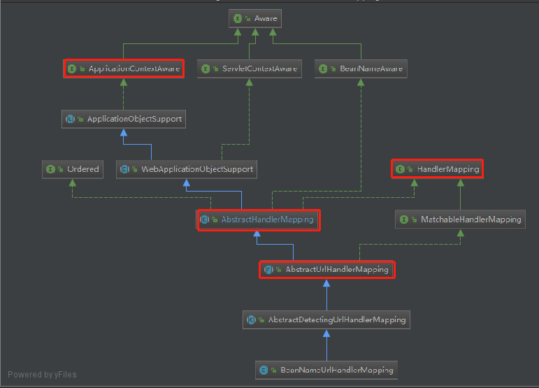

- 处理器bean的id/name为一个url请求路径，前面有"/"；
- 如果多个url映射同一个处理器bean，那么就需要定义多个bean，导致容器创建多个处理器实例，占用内存空间；
- 处理器bean定义与url请求耦合在一起。

```java
//向上继承自ApplicationObjectSupport实现ApplicationContextAware接口
public abstract class ApplicationObjectSupport implements ApplicationContextAware {
    protected final Log logger = LogFactory.getLog(this.getClass());
    @Nullable
    private ApplicationContext applicationContext;
    ...

    public final void setApplicationContext(@Nullable ApplicationContext context) throws BeansException {
        if (context == null && !this.isContextRequired()) {
            this.applicationContext = null;
            this.messageSourceAccessor = null;
        } else if (this.applicationContext == null) {
            if (!this.requiredContextClass().isInstance(context)) {
                throw new ApplicationContextException("Invalid application context: needs to be of type [" + this.requiredContextClass().getName() + "]");
            }

            this.applicationContext = context;
            this.messageSourceAccessor = new MessageSourceAccessor(context);
            this.initApplicationContext(context);//模板方法，调子类
        } else if (this.applicationContext != context) {
            throw new ApplicationContextException("Cannot reinitialize with different application context: current one is [" + this.applicationContext + "], passed-in one is [" + context + "]");
        }

    }
    ...
}

@Override
public void initApplicationContext() throws ApplicationContextException {
    super.initApplicationContext();//加载拦截器
    // 处理url和bean name，具体注册调用父类AbstractUrlHandlerMapping类完成
    detectHandlers();
}

//建立当前ApplicationContext中controller和url的对应关系
protected void detectHandlers() throws BeansException {
    // 获取应用上下文
    ApplicationContext applicationContext = obtainApplicationContext();
    //获取ApplicationContext中的所有bean的name(也是id，即@Controller的属性值)
    String[] beanNames = (this.detectHandlersInAncestorContexts ?
                          BeanFactoryUtils.beanNamesForTypeIncludingAncestors(applicationContext,                                      Object.class) : applicationContext.getBeanNamesForType(Object.class));

    //遍历所有beanName
    for (String beanName : beanNames) {
        // 通过模板方法模式调用BeanNameUrlHandlerMapping子类处理
        String[] urls = determineUrlsForHandler(beanName);//判断是否以/开始
        if (!ObjectUtils.isEmpty(urls)) {
            //调用父类AbstractUrlHandlerMapping将url与handler存入map
            registerHandler(urls, beanName);
        }
    }
}

protected void registerHandler(String urlPath, Object handler) throws BeansException, IllegalStateException {
    Assert.notNull(urlPath, "URL path must not be null");
    Assert.notNull(handler, "Handler object must not be null");
    Object resolvedHandler = handler;

    // Eagerly resolve handler if referencing singleton via name.
    if (!this.lazyInitHandlers && handler instanceof String) {
        String handlerName = (String) handler;
        ApplicationContext applicationContext = obtainApplicationContext();
        if (applicationContext.isSingleton(handlerName)) {
            resolvedHandler = applicationContext.getBean(handlerName);
        }
    }
    //已存在且指向不同的Handler抛异常
    Object mappedHandler = this.handlerMap.get(urlPath);
    if (mappedHandler != null) {
        if (mappedHandler != resolvedHandler) {
            throw new IllegalStateException(
                "Cannot map " + getHandlerDescription(handler) + " to URL path [" + urlPath +
                "]: There is already " + getHandlerDescription(mappedHandler) + " mapped.");
        }
    }
    else {
        if (urlPath.equals("/")) {
            if (logger.isTraceEnabled()) {
                logger.trace("Root mapping to " + getHandlerDescription(handler));
            }
            setRootHandler(resolvedHandler);//设置根处理器，即请求/的时候
        }
        else if (urlPath.equals("/*")) {
            if (logger.isTraceEnabled()) {
                logger.trace("Default mapping to " + getHandlerDescription(handler));
            }
            setDefaultHandler(resolvedHandler);//默认处理器
        }
        else {
            this.handlerMap.put(urlPath, resolvedHandler);//注册进map
            if (logger.isTraceEnabled()) {
                logger.trace("Mapped [" + urlPath + "] onto " + getHandlerDescription(handler));
            }
        }
    }
}
```


### RequestMappingHandlerMapping类

处理注解@RequestMapping及@Controller

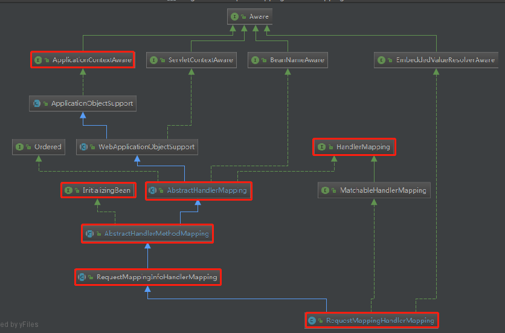

在`org.springframework.web.servlet.handler.AbstractHandlerMapping#getHandler`中有个钩子方法`org.springframework.web.servlet.handler.AbstractHandlerMapping#getHandlerInternal`


#### 判断bean是否是处理器

```java
//判断哪些类可以是处理器  @Controller | @RequestMapping
@Override
protected boolean isHandler(Class<?> beanType) {
    return (AnnotatedElementUtils.hasAnnotation(beanType, Controller.class) ||
            AnnotatedElementUtils.hasAnnotation(beanType, RequestMapping.class));
}
```

#### 获取每个方法上的@RequestMapping信息

```java 
//实现url的解析
@Override
@Nullable
protected RequestMappingInfo getMappingForMethod(Method method, Class<?> handlerType) {
    //解析注解信息requestMapping封装成 RequestMappingInfo 对象
    RequestMappingInfo info = createRequestMappingInfo(method);
    //表明方法上没有这个注解，就不需要解析了
    if (info != null) {
        //解析方法所在类上的requestMapping  映射的url可以分组配置  在类上匹配的
        RequestMappingInfo typeInfo = createRequestMappingInfo(handlerType);
        if (typeInfo != null) {
            //合并方法上的 RequestMappingInfo 信息
            info = typeInfo.combine(info);
        }
        //合并前缀
        String prefix = getPathPrefix(handlerType);
        if (prefix != null) {
            info = RequestMappingInfo.paths(prefix).build().combine(info);
        }
    }
    return info;
}
```

#### getHandlerInternal实现钩子

```java
@Override
protected HandlerMethod getHandlerInternal(HttpServletRequest request) throws Exception {
    //解析请求的url
    String lookupPath = getUrlPathHelper().getLookupPathForRequest(request);
    this.mappingRegistry.acquireReadLock();
    try {
        // 查找 处理器的方法 通过 请求的url
        HandlerMethod handlerMethod = lookupHandlerMethod(lookupPath, request);
        return (handlerMethod != null ? handlerMethod.createWithResolvedBean() : null);
    }
    finally {
        this.mappingRegistry.releaseReadLock();
    }
}

@Nullable
protected HandlerMethod lookupHandlerMethod(String lookupPath, HttpServletRequest request) throws Exception {
    //通过 lookupPath  查找 处理器的方法
    List<Match> matches = new ArrayList<>();
    // 通过 请求的 url  获取 映射器上的信息 RequestMappingInfo  这里只能找到一个
    List<T> directPathMatches = this.mappingRegistry.getMappingsByUrl(lookupPath);
    if (directPathMatches != null) {
        addMatchingMappings(directPathMatches, matches, request);
    }
    //上面找不到就需要筛选了， 将这个类的所有 RequestMappingInfo 都放进去
    if (matches.isEmpty()) {
        // No choice but to go through all mappings...
        addMatchingMappings(this.mappingRegistry.getMappings().keySet(), matches, request);
    }

    if (!matches.isEmpty()) {
        Comparator<Match> comparator = new MatchComparator(getMappingComparator(request));
        //子类实现了排序规则
        //走org.springframework.web.servlet.mvc.method.RequestMappingInfo.compareTo
        matches.sort(comparator);
        Match bestMatch = matches.get(0);
        //上面没有匹配上就是多个
        if (matches.size() > 1) {
            if (logger.isTraceEnabled()) {
                logger.trace(matches.size() + " matching mappings: " + matches);
            }
            if (CorsUtils.isPreFlightRequest(request)) {
                return PREFLIGHT_AMBIGUOUS_MATCH;
            }
            Match secondBestMatch = matches.get(1);
            if (comparator.compare(bestMatch, secondBestMatch) == 0) {
                Method m1 = bestMatch.handlerMethod.getMethod();
                Method m2 = secondBestMatch.handlerMethod.getMethod();
                String uri = request.getRequestURI();
                throw new IllegalStateException(
                    "Ambiguous handler methods mapped for '" + uri + "': {" + m1 + ", " + m2 + "}");
            }
        }
        //将找出来的 映射关系 存储到 request中  一个请求一个request一个映射关系  一一对应
        // key是org.springframework.web.servlet.HandlerMapping.bestMatchingHandler
        request.setAttribute(BEST_MATCHING_HANDLER_ATTRIBUTE, bestMatch.handlerMethod);

        //request   中还存储 <RequestMappingInfo,请求的url>
        handleMatch(bestMatch.mapping, lookupPath, request);

        //返回的是 HandlerMethod 对象  包括了Controller处理器 和 控制器里面的方法
        return bestMatch.handlerMethod;
    }
    else {
        //没有对应的处理器与之映射
        return handleNoMatch(this.mappingRegistry.getMappings().keySet(), lookupPath, request);
    }
}
```

向 request 的 Attribute 中存储了																											 <RequestMappingInfo,请求的url>   关系    和<"org.springframework.web.servlet.HandlerMapping.bestMatchingHandler",handlerMethod对象>  关系


下面就回到DispatcherServlet通过  getHandler() 方法获取  处理器映射器和拦截器链的 主流程上了。即调用钩子方法获取处理器映射器的地方。`AbstractHandlerMapping#getHandler`


### 这些HandlerMapping如何完成初始化的？

#### 入口

在DispatcherServlet初始化的时候，触发了初始化9大组件的方法：

javax.servlet.Servlet#init    														javax.servlet.GenericServlet#init(javax.servlet.ServletConfig)											javax.servlet.GenericServlet#init()															org.springframework.web.servlet.HttpServletBean#init											org.springframework.web.servlet.HttpServletBean#initServletBean								org.springframework.web.servlet.FrameworkServlet#initServletBean								org.springframework.web.servlet.FrameworkServlet#initWebApplicationContext			org.springframework.web.servlet.FrameworkServlet#onRefresh

org.springframework.web.servlet.DispatcherServlet#onRefresh

org.springframework.web.servlet.DispatcherServlet#initStrategies

#### 选择

org.springframework.web.servlet.DispatcherServlet#initHandlerMappings

1. 默认情况下`detectAllHandlerMappings=true`，Spring MVC会加载在当前系统中所有实现了`HandlerMapping`接口的bean，再进行按优先级排序。前提示你注册了这样的实现类。---==实现HandlerMapping接口，放入容器==
2. 可以修改web.xml中的DispatcherServlet的初始化参数，将`detectAllHandlerMappings`的值设置为false，可以加载指定的 处理器映射器，这时就需要向容器中注册`beanName=handlerMapping`的bean，并作为当前系统的唯一的 处理器映射器。---==向容器放入beanName为handlerMapping的bean==
3. 如果没有设置`detectAllHandlerMappings`值，也没有向容器中加载`HandlerMapping`接口的实现类的话，Spring MVC就会按照`DispatcherServlet.properties`所定义的内容来加载默认的 处理器映射器。这里默认配置了两种：`org.springframework.web.servlet.handler.BeanNameUrlHandlerMapping  org.springframework.web.servlet.mvc.method.annotation.RequestMappingHandlerMapping`--==加载配置文件的两种==

#### ApplicationContextAware加载拦截器对象

以上默认加载的处理器映射器都实现了`org.springframework.context.ApplicationContextAware`接口，在这些实现类的bean创建流程中，会回调`ApplicationContextAware#setApplicationContext`这个方法。

BeanNameUrlHandlerMapping  和 RequestMappingHandlerMapping都继承	AbstractHandlerMapping 类，这个类就是实现了容器回调方法。

org.springframework.context.support.ApplicationObjectSupport#setApplicationContext	org.springframework.context.support.ApplicationObjectSupport#initApplicationContext org.springframework.web.servlet.handler.AbstractHandlerMapping#initApplicationContext

#### InitializingBean存储url和处理器的映射关系

详细见AbstractHandlerMethodMapping


### 模板AbstractHandlerMapping

是个抽象类

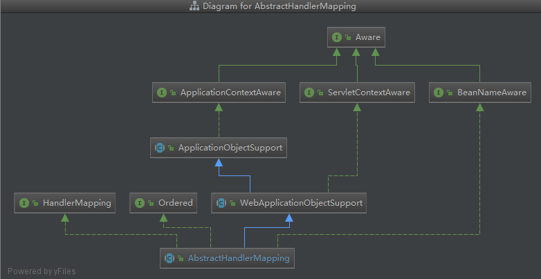

org.springframework.web.servlet.handler.AbstractHandlerMapping#initApplicationContext

```java
@Override
protected void initApplicationContext() throws BeansException {
   // 提供给子类去重写的， Spring并未去实现,提供扩展
   extendInterceptors(this.interceptors);
   // 加载拦截器
   detectMappedInterceptors(this.adaptedInterceptors);
   // 归并拦截器
   initInterceptors();
}
```

#### ==getHandler==

org.springframework.web.servlet.handler.AbstractHandlerMapping#getHandler

当请求处理的时候DispatcherServlet调用getHandler方法的时候就到这里了

```java
@Override
@Nullable
public final HandlerExecutionChain getHandler(HttpServletRequest request) throws Exception {
    /**
       * 返回请求处理的HandlerExecutionChain，从AbstractHandlerMapping中的adaptedInterceptors和mappedInterceptors属性中获取
       */
    //    钩子函数，需子类实现  获取具体的实现
    Object handler = getHandlerInternal(request);
    if (handler == null) {//没有就用默认的，默认的就是初始化处理了的
        handler = getDefaultHandler();
    }
    if (handler == null) {
        return null;
    }
    // Bean name or resolved handler?
    if (handler instanceof String) {//还没有解析的话就再调一遍加载
        String handlerName = (String) handler;
        handler = obtainApplicationContext().getBean(handlerName);
    }

    //    构建handler处理器的HandlerExecutionChain，包括拦截器
    HandlerExecutionChain executionChain = getHandlerExecutionChain(handler, request);

    // ....

    return executionChain;
}

protected HandlerExecutionChain getHandlerExecutionChain(Object handler, HttpServletRequest request){
    
    HandlerExecutionChain chain = (handler instanceof HandlerExecutionChain ? (HandlerExecutionChain)
                                   handler : new HandlerExecutionChain(handler));
    String lookupPath = this.urlPathHelper.getLookupPathForRequest(request);
    // 迭代添加拦截器
    for (HandlerInterceptor interceptor : this.adaptedInterceptors) {
        // 如果拦截器是MappedInterceptor，判断是否对该handler进行拦截，是的情况下添加
        if (interceptor instanceof MappedInterceptor) {
            MappedInterceptor mappedInterceptor = (MappedInterceptor) interceptor;
            if (mappedInterceptor.matches(lookupPath, this.pathMatcher)) {
                chain.addInterceptor(mappedInterceptor.getInterceptor());
            }
        }
        else {
            // HandlerInterceptor直接添加，即通过HandingMapping属性配置的拦截器
            chain.addInterceptor(interceptor);
        }
    }
    return chain;
}
```


### AbstractHandlerMethodMapping

#### 存储了 url 和 处理器 的映射关系

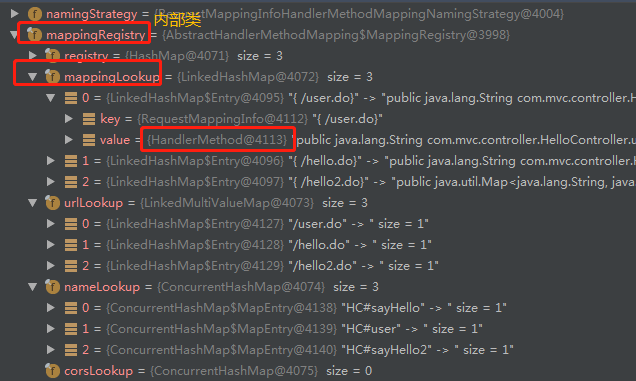

这个是`AbstractHandlerMapping`的一个子类，存储了url和处理的映射关系。

存储在内部类`org.springframework.web.servlet.handler.AbstractHandlerMethodMapping.MappingRegistry`中

```java
//这里面存储了 url 和 handler的映射关系
private final Map<T, HandlerMethod> mappingLookup = new LinkedHashMap<>();
```


#### 这个怎么存储的？

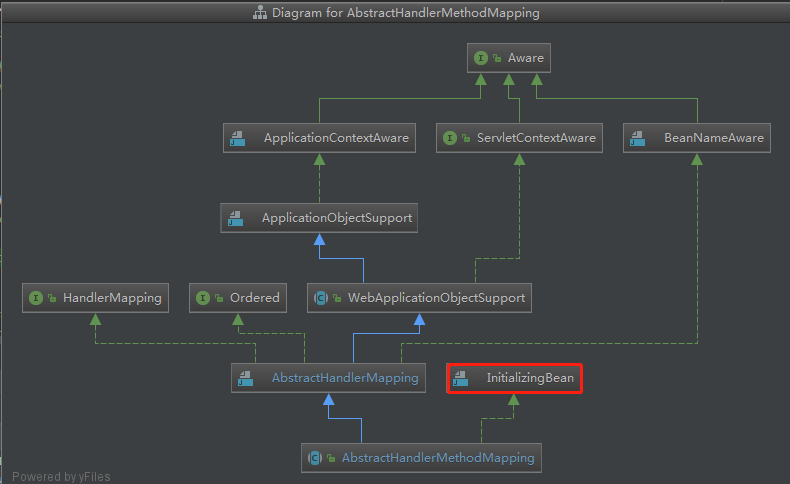

利用了springIOC的初始化扩展点----`org.springframework.beans.factory.InitializingBean`接口

在创建这个bean的时候，初始化方法中会调用`org.springframework.beans.factory.InitializingBean#afterPropertiesSet`

org.springframework.web.servlet.handler.AbstractHandlerMethodMapping#afterPropertiesSet org.springframework.web.servlet.handler.AbstractHandlerMethodMapping#initHandlerMethods

```java
protected void initHandlerMethods() {
    //获取上下文中所有bean的name，不包含父容器
   for (String beanName : getCandidateBeanNames()) {
      if (!beanName.startsWith(SCOPED_TARGET_NAME_PREFIX)) {
         processCandidateBean(beanName);
      }
   }
    //日志记录HandlerMethods的总数量
   handlerMethodsInitialized(getHandlerMethods());
}

protected void processCandidateBean(String beanName) {
    Class<?> beanType = null;
    try {
        //根据name找出bean的类型
        beanType = obtainApplicationContext().getType(beanName);
    } catch (Throwable ex) {
        if (logger.isTraceEnabled()) {
            logger.trace("Could not resolve type for bean '" + beanName + "'", ex);
        }
    }
    //处理Controller和RequestMapping
    //具体子类实现的这个处理器判断条件 : RequestMappingHandlerMapping#isHandler 见上面的子类处理
    //就判断了 @Controller @RequestMapping
    if (beanType != null && isHandler(beanType)) {
        //整个controller类的解析过程
        detectHandlerMethods(beanName);
    }
}


protected void detectHandlerMethods(Object handler) {
    //传入的是beanName   obtainApplicationContext().getType((String) handler)  根据beanName找到类型
    Class<?> handlerType = (handler instanceof String ? obtainApplicationContext().getType((String) 
                       handler) : handler.getClass());

    if (handlerType != null) {
        //获取真实的类对象  但是这个对象不可能是代理？
        Class<?> userType = ClassUtils.getUserClass(handlerType);

        //对真实的controller中所有的方法进行 解析和处理  
        //methods的 key为 方法对象，
        // value为 解析@RequestMapping注解后 封装的对象 RequestMappingInfo
        Map<Method, T> methods = MethodIntrospector.selectMethods(userType,
           (MethodIntrospector.MetadataLookup<T>) method -> {
              try {

              // 关键一、 获得@RequestMapping注解信息
              //调用子类 RequestMappingHandlerMapping#getMappingForMethod 方法进行处理，
              // 返回的是 RequestMappingInfo对象
               return getMappingForMethod(method, userType);
              }
              catch (Throwable ex) {
                  throw new IllegalStateException("Invalid mapping on handler class [" +
                             userType.getName() + "]: " + method, ex);
              }
        });
        if (logger.isTraceEnabled()) {
            logger.trace(formatMappings(userType, methods));
        }
        
        //关键二、将解析出来的url 和 处理器 和 处理器的方法  存储
        
        //methods就是注解信息和方法信息的封装对象  
        //method是处理器中的url对应的方法信息
        //mapping是注解信息 RequestMappingInfo 即url信息   
        methods.forEach((method, mapping) -> {
            //找出controller中可外部调用的方法  私有的不支持
            Method invocableMethod = AopUtils.selectInvocableMethod(method, userType);
            //这个handler是当前controller类的beanName
            registerHandlerMethod(handler, invocableMethod, mapping);
        });
    }
}

protected void registerHandlerMethod(Object handler, Method method, T mapping) {
    //调整参数顺序
    this.mappingRegistry.register(mapping, handler, method);
}

//注册 url 和 处理器 映射关系
//mapping 是url信息  RequestMappingInfo对象
//handler 是处理器Controller类的beanName
//method  是处理器内具体方法
public void register(T mapping, Object handler, Method method) {
    
    this.readWriteLock.writeLock().lock();
    try {
        //封装 处理器和处理器的方法
        HandlerMethod handlerMethod = createHandlerMethod(handler, method);

        //排重--发现一个url对应不同的处理器方法 抛异常
        assertUniqueMethodMapping(handlerMethod, mapping);
        //存储 url和处理器方法的映射关系
        this.mappingLookup.put(mapping, handlerMethod);

        List<String> directUrls = getDirectUrls(mapping);
        for (String url : directUrls) {
            //这里存储 url 和 映射器 的关系  mapping一般是EL表达式的方式 {/hello.do}
            this.urlLookup.add(url, mapping);
        }

        String name = null;
        if (getNamingStrategy() != null) {
            //url和RequestMappingInfo绑定   可以根据url找到RequestMappingInfo，再找到handlerMethod
            name = getNamingStrategy().getName(handlerMethod, mapping);
            addMappingName(name, handlerMethod);
        }

        CorsConfiguration corsConfig = initCorsConfiguration(handler, method, mapping);
        if (corsConfig != null) {
            this.corsLookup.put(handlerMethod, corsConfig);//方法名和Method绑定
        }
        	//将RequestMappingInfo  url  handlerMethod绑定到MappingRegistration对象  放入map
        this.registry.put(mapping, new MappingRegistration<>(mapping, handlerMethod, 
                                                             directUrls, name));
    }
    finally {
        this.readWriteLock.writeLock().unlock();
    }
}
```


## HandlerAdapters

适配器的作用就是通过不同的处理器来适配不同的处理方法。存在的意义就是因为有不同的处理器，为了能够统一处理 ，就需要判断处理器类型，来调不同的处理器方法。

#### 顶级接口HandlerAdapter

org.springframework.web.servlet.HandlerAdapter

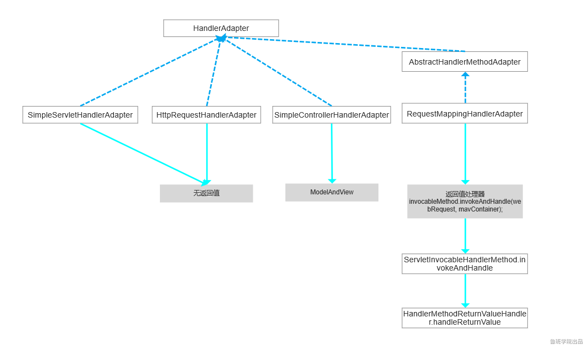

提供方法

```java
public interface HandlerAdapter {

   /**
    * Given a handler instance, return whether or not this {@code HandlerAdapter}
    * 判断这个适配器  是否适配当前  处理器
    */
   boolean supports(Object handler);

   /**
    * Use the given handler to handle this request.
    *调用 对应的处理器  处理请求
    */
   @Nullable
   ModelAndView handle(HttpServletRequest request, HttpServletResponse response, Object handler) throws Exception;

   /**
    * Same contract as for HttpServlet's {@code getLastModified} method.
    * 这个用来给请求加上时间戳，相同时间戳的请求直接返回缓存的数据，减少请求处理
    */
   long getLastModified(HttpServletRequest request, Object handler);

}
```

处理器：

SpringMVC支持的处理器有：@Controller、Servlet、Controller、HttpRequestHandler

其中Servlet、Controller、HttpRequestHandler都是接口，里面只有一个方法，这个方法就是处理逻辑的，非常好定位处理逻辑，找到这个实现就可以执行这个方法了，即建立url和这个bean的映射关系就行了。但是很单一，每个url都需要写一个接口实现。所以出现了方法级别的处理方式。

- ```java
  - SimpleServletHandlerAdapter 适配Servlet处理器
  - HttpRerquestHandlerAdapter 适配HttpRequestHandler处理器
  - RequestMappingHandlerAdapter 适配注解处理器-内核是适配HandlerMethod处理器（但是这个处理器一般是注解产生的）
  - SimpleControllerHandlerAdapter 适配Controller处理器
  
  Spring MVC默认使用的处理器适配器为：HttpRequestHandlerAdapter、SimpleServletHandlerAdapter、RequestMappingHandlerAdapter三种。
  ```

  

#### 1、SimpleServletHandlerAdapter 

适配Servlet处理器

```
SimpleSerlvetHandlerAdapter是Spring使用HandlerAdapter最简单的方式，此方式是为了在Spring中支持Servlet方式开发，即把Servlet适配为处理器handler。

是一个Servlet的适配器，其最终执行的方法是Servlet的service方法，非默认提供（DispatcherServlet.properties中没有）
需要自己导入bean
supports方法就是判断handler是否是Servlet
getLastModified直接返回-1
handle方法本质是执行Servlet.service方法。
```


```java
public class SimpleServletHandlerAdapter implements HandlerAdapter {

    //判断handler是否实现Servlet接口
    @Override
    public boolean supports(Object handler) {
        return (handler instanceof Servlet);
    }

    @Override
    @Nullable
    public ModelAndView handle(HttpServletRequest request, HttpServletResponse response, Object handler)
            throws Exception {
        ((Servlet) handler).service(request, response);
        return null;
    }

    @Override
    public long getLastModified(HttpServletRequest request, Object handler) {
        return -1;
    }

}
```

##### 


#### 2、HttpRerquestHandlerAdapter 

适配HttpRequestHandler处理器

```
supports方法就是判断handler是否是HttpRequestHandler
getLastModified直接返回-1
handle方法本质是执行HttpRequestHandler.handleRequest方法。
```


```java
public class HttpRequestHandlerAdapter implements HandlerAdapter {
    @Override
    public boolean supports(Object handler) {
        //判断是否是HttpRequestHandler子类
        return (handler instanceof HttpRequestHandler);
    }
    @Override
    public ModelAndView handle(HttpServletRequest request, HttpServletResponse response, Object handler)
            throws Exception {
        //执行HttpRequestHandler的handleRequest方法
        ((HttpRequestHandler) handler).handleRequest(request, response);
        return null;
    }
    @Override
    public long getLastModified(HttpServletRequest request, Object handler) {
        //返回modified值
        if (handler instanceof LastModified) {
            return ((LastModified) handler).getLastModified(request);
        }
        return -1L;
    }
}
```


#### 3、RequestMappingHandlerAdapter 

适配注解处理器，请求适配给`@RequestMapping`类型的Handler处理。

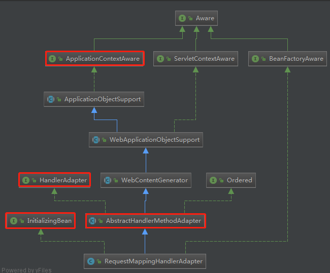

```
通过继承抽象类AbstractHandlerMethodAdapter实现了HandlerAdapter接口
请求适配给`@RequestMapping`类型的Handler处理。
采用反射机制调用url请求对应的Controller中的方法（这其中还包括参数处理），返回执行结果值，完成HandlerAdapter的使命
getLastModified直接返回-1
```


```java
@Override
protected long getLastModifiedInternal(HttpServletRequest request, HandlerMethod handlerMethod) {
    return -1;
}

//通过父类调用
@Override
protected ModelAndView handleInternal(HttpServletRequest request,
        HttpServletResponse response, HandlerMethod handlerMethod) throws Exception {
 
    ModelAndView mav;
    checkRequest(request);
 
    // 判断当前是否需要支持在同一个session中只能线性地处理请求
    if (this.synchronizeOnSession) {
        // 获取当前请求的session对象
        HttpSession session = request.getSession(false);
        if (session != null) {
            // 为当前session生成一个唯一的可以用于锁定的key
            Object mutex = WebUtils.getSessionMutex(session);
            synchronized (mutex) {
                // 对HandlerMethod进行参数等的适配处理，并调用目标handler
                mav = invokeHandlerMethod(request, response, handlerMethod);
            }
        } else {
            // 如果当前不存在session，则直接对HandlerMethod进行适配
            mav = invokeHandlerMethod(request, response, handlerMethod);
        }
    } else {
        // 如果当前不需要对session进行同步处理，则直接对HandlerMethod进行适配
        mav = invokeHandlerMethod(request, response, handlerMethod);
    }
 
    // 判断当前请求头中是否包含Cache-Control请求头，如果不包含，则对当前response进行处理，为其设置过期时间
    if (!response.containsHeader(HEADER_CACHE_CONTROL)) {
        // 如果当前SessionAttribute中存在配置的attributes，则为其设置过期时间。
        // 这里SessionAttribute主要是通过@SessionAttribute注解生成的
        if (getSessionAttributesHandler(handlerMethod).hasSessionAttributes()) {
            applyCacheSeconds(response, this.cacheSecondsForSessionAttributeHandlers);
        } else {
            // 如果当前不存在SessionAttributes，则判断当前是否存在Cache-Control设置，
            // 如果存在，则按照该设置进行response处理，如果不存在，则设置response中的
            // Cache的过期时间为-1，即立即失效
            prepareResponse(response);
        }
    }
    return mav;
}

//核心处理流程
@Nullable
protected ModelAndView invokeHandlerMethod(HttpServletRequest request,
        HttpServletResponse response, HandlerMethod handlerMethod) throws Exception {
 
    ServletWebRequest webRequest = new ServletWebRequest(request, response);
    try {
        // 获取容器中全局配置的InitBinder和当前HandlerMethod所对应的Controller中配置的InitBinder，用于进行参数的绑定
        WebDataBinderFactory binderFactory = getDataBinderFactory(handlerMethod);
        // 获取容器中全局配置的ModelAttribute和当前HandlerMethod所对应的Controller
        // 中配置的ModelAttribute，这些配置的方法将会在目标方法调用之前进行调用
        ModelFactory modelFactory = getModelFactory(handlerMethod, binderFactory);
 
        // 将handlerMethod封装为一个ServletInvocableHandlerMethod对象，该对象用于对当前request的整体调用流程进行了封装
        ServletInvocableHandlerMethod invocableMethod = createInvocableHandlerMethod(handlerMethod);
        if (this.argumentResolvers != null) {
            // 设置当前容器中配置的所有ArgumentResolver
            invocableMethod.setHandlerMethodArgumentResolvers(this.argumentResolvers);
        }
        if (this.returnValueHandlers != null) {
            // 设置当前容器中配置的所有ReturnValueHandler
            invocableMethod.setHandlerMethodReturnValueHandlers(this.returnValueHandlers);
        }
        // 将前面创建的WebDataBinderFactory设置到ServletInvocableHandlerMethod中
        invocableMethod.setDataBinderFactory(binderFactory);
        // 设置ParameterNameDiscoverer，该对象将按照一定的规则获取当前参数的名称
        invocableMethod.setParameterNameDiscoverer(this.parameterNameDiscoverer);
 
        ModelAndViewContainer mavContainer = new ModelAndViewContainer();
        mavContainer.addAllAttributes(RequestContextUtils.getInputFlashMap(request));
        // 这里initModel()方法主要作用是调用前面获取到的@ModelAttribute标注的方法，
        // 从而达到@ModelAttribute标注的方法能够在目标Handler调用之前调用的目的
        modelFactory.initModel(webRequest, mavContainer, invocableMethod);
        mavContainer.setIgnoreDefaultModelOnRedirect(this.ignoreDefaultModelOnRedirect);
 
        // 获取当前的AsyncWebRequest，这里AsyncWebRequest的主要作用是用于判断目标
        // handler的返回值是否为WebAsyncTask或DefferredResult，如果是这两种中的一种，
        // 则说明当前请求的处理应该是异步的。所谓的异步，指的是当前请求会将Controller中
        // 封装的业务逻辑放到一个线程池中进行调用，待该调用有返回结果之后再返回到response中。
        // 这种处理的优点在于用于请求分发的线程能够解放出来，从而处理更多的请求，只有待目标任务
        // 完成之后才会回来将该异步任务的结果返回。
        AsyncWebRequest asyncWebRequest = WebAsyncUtils
            .createAsyncWebRequest(request, response);
        asyncWebRequest.setTimeout(this.asyncRequestTimeout);
 
        // 封装异步任务的线程池，request和interceptors到WebAsyncManager中
        WebAsyncManager asyncManager = WebAsyncUtils.getAsyncManager(request);
        asyncManager.setTaskExecutor(this.taskExecutor);
        asyncManager.setAsyncWebRequest(asyncWebRequest);
        asyncManager.registerCallableInterceptors(this.callableInterceptors);
        asyncManager.registerDeferredResultInterceptors(this.deferredResultInterceptors);
 
        // 这里就是用于判断当前请求是否有异步任务结果的，如果存在，则对异步任务结果进行封装
        if (asyncManager.hasConcurrentResult()) {
            Object result = asyncManager.getConcurrentResult();
            mavContainer = (ModelAndViewContainer) 
                asyncManager.getConcurrentResultContext()[0];
            asyncManager.clearConcurrentResult();
            if (logger.isDebugEnabled()) {
                logger.debug("Found concurrent result value [" + result + "]");
            }
            // 封装异步任务的处理结果，虽然封装的是一个HandlerMethod，但只是Spring简单的封装
            // 的一个Callable对象，该对象中直接将调用结果返回了。这样封装的目的在于能够统一的
            // 进行右面的ServletInvocableHandlerMethod.invokeAndHandle()方法的调用
            invocableMethod = invocableMethod.wrapConcurrentResult(result);
        }
 
        // 对请求参数进行处理，调用目标HandlerMethod，并且将返回值封装为一个ModelAndView对象
        invocableMethod.invokeAndHandle(webRequest, mavContainer);
        if (asyncManager.isConcurrentHandlingStarted()) {
            return null;
        }
 
        // 对封装的ModelAndView进行处理，主要是判断当前请求是否进行了重定向，如果进行了重定向，
        // 还会判断是否需要将FlashAttributes封装到新的请求中
        return getModelAndView(mavContainer, modelFactory, webRequest);
    } finally {
        // 调用request destruction callbacks和对SessionAttributes进行处理
        webRequest.requestCompleted();
    }
}
```

- 获取当前容器中使用`@InitBinder`注解注册的属性转换器；
- 获取当前容器中使用`@ModelAttribute`标注但没有使用`@RequestMapping`标注的方法，并且在调用目标方法之前调用这些方法；
- 判断目标handler返回值是否使用了WebAsyncTask或DefferredResult封装，如果封装了，则按照异步任务的方式进行执行；
- 处理请求参数，调用目标方法和处理返回值。
- 

#### 4、SimpleControllerHandlerAdapter 

适配Controller处理器


```
是Controller实现类的适配器类，其本质是执行Controller中的handleRequest方法。
supports方法就是判断handler是否是Controller
getLastModified直接返回-1
handle方法本质是执行Controller.handleRequest方法。
```


```java
public class SimpleControllerHandlerAdapter implements HandlerAdapter {

    @Override
    public boolean supports(Object handler) {
        return (handler instanceof Controller);
    }

    @Override
    @Nullable
    public ModelAndView handle(HttpServletRequest request, HttpServletResponse response, Object handler)
            throws Exception {
        return ((Controller) handler).handleRequest(request, response);
    }

    @Override
    public long getLastModified(HttpServletRequest request, Object handler) {
        if (handler instanceof LastModified) {
            return ((LastModified) handler).getLastModified(request);
        }
        return -1L;
    }

}
```


#### 以上适配器如何初始化？

##### 分析

与HandlerMapping的初始化过程类似，在DispatcherServlet初始化过程中初始化9大组件，调用 `org.springframework.web.servlet.DispatcherServlet#initHandlerAdapters` 方法初始化，读取`DispatcherServlet.properties`中的HandlerAdapters，加载各种Adapter到IOC容器中。

##### InitializingBean

没有利用ApplicationAware，利用了InitializingBean。

org.springframework.web.servlet.mvc.method.annotation.RequestMappingHandlerAdapter#afterPropertiesSet

```java
@Override
public void afterPropertiesSet() {
   // Do this first, it may add ResponseBody advice beans
   // @ControllerAdvice 的初始化
   // 全局异常处理@ExceptionHandler(Exception.class)
   // 全局数据绑定@ModelAttribute(name = "md")
   // 全局数据预处理@GetMapping("/hello")
   // 针对所有的Controller层都会进入
   initControllerAdviceCache();

   if (this.argumentResolvers == null) {
      List<HandlerMethodArgumentResolver> resolvers = getDefaultArgumentResolvers();
      this.argumentResolvers = new HandlerMethodArgumentResolverComposite().addResolvers(resolvers);
   }
   if (this.initBinderArgumentResolvers == null) {
      List<HandlerMethodArgumentResolver> resolvers = getDefaultInitBinderArgumentResolvers();
      this.initBinderArgumentResolvers = new HandlerMethodArgumentResolverComposite().addResolvers(resolvers);
   }
   if (this.returnValueHandlers == null) {
      List<HandlerMethodReturnValueHandler> handlers = getDefaultReturnValueHandlers();
      this.returnValueHandlers = new HandlerMethodReturnValueHandlerComposite().addHandlers(handlers);
   }
}
```

没啥实质性作用，因为这个适配器主要就是分类的作用，查看实现类的  supports 方法  看看这四个适配器的适配处理器是什么，在DispatcherServlet调适配的时候就会通过这个方法来判断，通过了就调这个适配器的 handle方法执行请求处理。

#### DispatcherServlet主流程上的处理逻辑

DispatcherServlet的doDispatch方法会遍历handlerAdapters，找到handler对应的适配器

```java
protected HandlerAdapter getHandlerAdapter(Object handler) throws ServletException {
    if (this.handlerAdapters != null) {
        for (HandlerAdapter adapter : this.handlerAdapters) {
            if (adapter.supports(handler)) {//判断是否适配成功
                return adapter;
            }
        }
    }
    throw new ServletException("No adapter for handler [" + handler +
                               "]: The DispatcherServlet configuration needs to include a HandlerAdapter that supports this handler");
}
```

HandlerAdapter的接口中定义了三个方法：

（1）boolean supports(Object handler); 判断适配器是否适配Handler

（2）ModelAndView handle(HttpServletRequest request, HttpServletResponse response, Object handler)  使用适配的Handler处理用户请求---具体的看看具体的实现

（3）long getLastModified(HttpServletRequest request, Object handler); 返回资源的最后修改时间，如果handler实现类不支持可以返回-1


## 拦截器

2020-11-22

拦截器是SpringMVC框架中的，区别于过滤器

过滤器配置在 web.xml中， 是Servlet容器（例如Tomcat）去处理的，进Servlet的service方法之前就触发了。拦截的是Servlet，例如可以拦截整个DispatcherServlet，拦截粒度大。

拦截器是web框架层面的，属于springMVC，也就是属于一个Servlet内部的，拦截粒度控制在方法级别。

- preHandle ：业务处理前执行

- postHandle：业务处理后（异常则不执行）

- afterCompletion：视图处理后

拦截器是在处理器映射器初始化的时候装配到处理器链上的 `org.springframework.web.servlet.HandlerExecutionChain`

```java
//在处理链中的存储
//拦截器--xml中配置的自定义的拦截器  <mvc:interceptors>
@Nullable
private HandlerInterceptor[] interceptors;

//这个拦截器集合是所有的拦截器包括默认的，如果配置了自定义的，默认的就不执行了，想要都执行，就把自定义的里面再 配上默认的
@Nullable
private List<HandlerInterceptor> interceptorList;
```

如何存储的？

就是利用了ApplicationAware---见HandlerMapping的初始化。


# SpringMVC中的零xml配置

SpringMVC中必要的内容：

```
1、web容器，可以使用内嵌版本的。
2、DispatcherServlet 的加载，利用Tomcat的SPI机制将 DispatcherServlet 加载到Servlet容器中。
3、IOC容器的创建和启动，在DispatcherServlet的启动过程中会先创建IOC容器并且启动。
4、SpringMVC的各个组件-九大组件。利用 @EnableWebMvc 注解，有了IOC容器，这个注解就能生效了
```

SpringMVC中的配置文件：

```
web.xml----就是配置web框架的三大组件的 Servlet、Filter、Listener，用Tomcat中的SPI解决了
spring-mvc.xml---配置SpringMVC的九大组件的，用 @EnableWebMvc 注解  解决了
spring.xml---IOC容器，在DispatcherServlet启动的时候就创建了，解决了
```


## webMVC

javaConfig方式配置webMvc   2020-11-19  1:40:00

### 1、WebMvcConfigurer接口 

org.springframework.web.servlet.config.annotation.WebMvcConfigurer


### ~~2、WebMvcConfigurerAdapter类~~

org.springframework.web.servlet.config.annotation.WebMvcConfigurerAdapter

实现了WebMvcConfigurer接口，没什么用，里面**都是空实现**，提供子类继续实现个别方法的。

出现的原因是jdk1.8之前要实现接口的所有的方法 ， jdk1.8  出现了 default  就不想需要这个实现类了。

### 3、WebMvcConfigurationSupport类

org.springframework.web.servlet.config.annotation.WebMvcConfigurationSupport

**有默认的实现（非空），但是也不是全实现了**，默认的将需要的组件利用`@Bean`都配置到IOC容器了，但是默认没有打开--没有配置@Component注解。

想要使用的话就继承这个类，然后在子类上加上@Configuration  -   这样就可以加载父类默认的组件了，同时也可以是重写自定义的组件

```java
//上面没有开启装配bean的注解
public class WebMvcConfigurationSupport implements ApplicationContextAware, ServletContextAware {
    //只列了部分方法，内部有springMVC所有的组件  9大组件
    @Bean
    public RequestMappingHandlerMapping requestMappingHandlerMapping() {
       RequestMappingHandlerMapping mapping = createRequestMappingHandlerMapping();
       // ....
       return mapping;
    }
    @Bean
	public RequestMappingHandlerAdapter requestMappingHandlerAdapter() {
    	RequestMappingHandlerAdapter adapter = createRequestMappingHandlerAdapter();
        // ....
        return adapter;
    }
    
    //...
}
```


### 4、@EnableWebMvc

内部就是WebMvcConfigurationSupport  

```java
@Retention(RetentionPolicy.RUNTIME)
@Target(ElementType.TYPE)
@Documented
@Import(DelegatingWebMvcConfiguration.class)
public @interface EnableWebMvc {
}
```

#### DelegatingWebMvcConfiguration

org.springframework.web.servlet.config.annotation.DelegatingWebMvcConfiguration

这里加上了@Configuration注解   并继承了  WebMvcConfigurationSupport

```java
@Configuration
public class DelegatingWebMvcConfiguration extends WebMvcConfigurationSupport{

	private final WebMvcConfigurerComposite configurers = new WebMvcConfigurerComposite();

    //通过属性自动注入了 所有的  实现了 WebMvcConfigurer 接口  的 bean
	@Autowired(required = false)
	public void setConfigurers(List<WebMvcConfigurer> configurers) {
		if (!CollectionUtils.isEmpty(configurers)) {
            //将所有的 实现对象 set到 WebMvcConfigurerComposite 类属性中
			this.configurers.addWebMvcConfigurers(configurers);
		}
	}
    //这个子类只重写了部分的方法
    @Override
	protected void addResourceHandlers(ResourceHandlerRegistry registry) {
		this.configurers.addResourceHandlers(registry);
	}
    //...还有部分
}
```

这里为什么要扫描  WebMvcConfigurer 的实现类？因为  WebMvcConfigurerComposite  实现类实现了  WebMvcConfigurationSupport 类 没有实现的 方法。

#### WebMvcConfigurerComposite

这个类就是收集所有的 实现了 WebMvcConfigurer 接口 的bean，然后循环调用里面的实现方法

```java
class WebMvcConfigurerComposite implements WebMvcConfigurer {

   private final List<WebMvcConfigurer> delegates = new ArrayList<>();

   public void addWebMvcConfigurers(List<WebMvcConfigurer> configurers) {
      if (!CollectionUtils.isEmpty(configurers)) {
         this.delegates.addAll(configurers);
      }
   }
    
    @Override
	public void configurePathMatch(PathMatchConfigurer configurer) {
		for (WebMvcConfigurer delegate : this.delegates) {
			delegate.configurePathMatch(configurer);
		}
	}
    
    // ....   里面也是 接口 的各种
}
```


==总之，注解   @EnableWebMvc   内部拥有所有一全套 springMVC的组件==

下面是用法

```java
@Configuration
@ComponentScan(value = "com.mvc.controller")
@EnableWebMvc
public class AppConfig implements WebMvcConfigurer {

   @Override
   public void configureMessageConverters(List<HttpMessageConverter<?>> converters) {
      //converters.add(new MappingJackson2HttpMessageConverter());
      converters.add(new FastJsonHttpMessageConverter());
   }
   

   @Override
   public void configureViewResolvers(ViewResolverRegistry registry) {
      registry.jsp("/page/",".jsp");
   }
}
```

## 导致springboot的WebMvc自动装配失效

但是使用了 `WebMvcConfigurationSupport 或者 @EnableWebMvc `，就会导致springboot中的对于SpringMVC的自动装装配失效。全部使用自定义的了---这也是很正常的，我定义了就是想覆盖自动装配的WebMVC

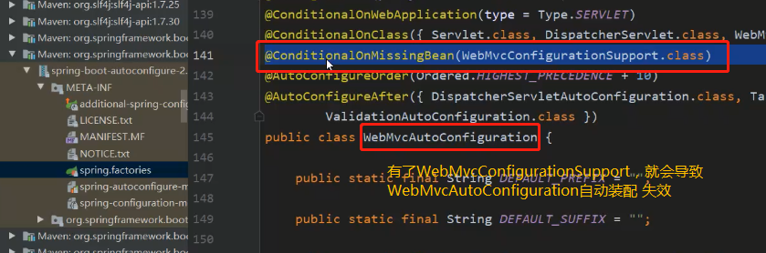


## 替代spring.xml 

利用@Configuration  @Bean替代      ==IOC容器，在DispatcherServlet启动的时候先启动的IOC容器==

## 替代spring-mvc.xml

利用 @EnableWebMvc 注解     ==九大组件==

```java
@Configuration
@ComponentScan(value = "com.mvc.controller")
@EnableWebMvc
public class AppConfig implements WebMvcConfigurer {


   @Override
   public void configureMessageConverters(List<HttpMessageConverter<?>> converters) {
       //替换消息转换器   FastJson  替换 默认的 Jackjson
      converters.add(new FastJsonHttpMessageConverter());
   }

   @Override
   public void configureViewResolvers(ViewResolverRegistry registry) {
      registry.jsp("/WEB-INF/page/",".jsp");
   }
}
```

## 内嵌Tomcat

引入tomcat jar

```xml 
<dependency>
    <groupId>org.apache.tomcat.embed</groupId>
    <artifactId>tomcat-embed-core</artifactId>
    <version>8.5.37</version>
</dependency>
<dependency>
    <groupId>org.apache.tomcat.embed</groupId>
    <artifactId>tomcat-embed-jasper</artifactId>
    <version>8.5.37</version>
</dependency>
```

## 启动web容器

```
public static void run() throws  Exception {
    Tomcat tomcat = new Tomcat();
    tomcat.setPort(8088);
    // 告诉tomcat  web项目
    tomcat.addWebapp("/","D:\\code\\java_learn\\spring-framework\\web");

    tomcat.start();

    tomcat.getServer().await();
    //Thread.currentThread().join();
}
```

在Tomcat启动完后，启动了SpringIOC容器

## 替代web.xml

==主要是DispatcherServlet加载到Servlet容器中==

web.xml 主要就是配置web框架的三大组件：监听器、Servlet、过滤器

监听器主要是父子容器使用，Servlet这里主要是DispatcherServlet，过滤器用的少。

Tomcat启动，通过SPI机制  找到 ServletContainerInitializer 实现类，调用  onstartUp方法。onstartup方法入参是servletContext，就可以通过Servlet上下文来添加web.xml中的各种配置信息。==详细的见Tomcat下的SPI机制。==

在springBoot中利用的是   @HandlesTypes(WebApplicationInitializer.class)  注解，并没有用Tomcat中的SPI机制，具体见spingboot


