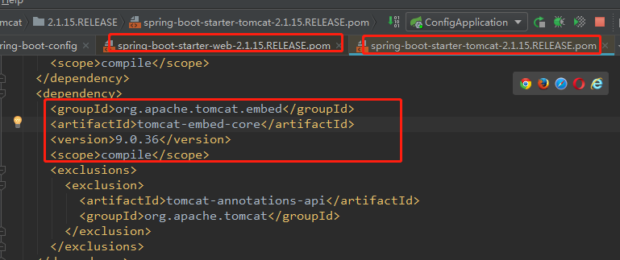

org.springframework.boot.autoconfigure.web.servlet.ServletWebServerFactoryConfiguration.EmbeddedTomcat2020-11-26  1：10：00

springboot启动

pom

```xml
<?xml version="1.0" encoding="UTF-8"?>
<project xmlns="http://maven.apache.org/POM/4.0.0" xmlns:xsi="http://www.w3.org/2001/XMLSchema-instance"
         xsi:schemaLocation="http://maven.apache.org/POM/4.0.0 https://maven.apache.org/xsd/maven-4.0.0.xsd">
    <modelVersion>4.0.0</modelVersion>
    <groupId>bat.ke.qq.com</groupId>
    <artifactId>vip-spring-boot-config</artifactId>
    <version>0.0.1-SNAPSHOT</version>
    <name>vip-spring-boot-config</name>
    <description>Demo project for Spring Boot</description>
    
	<parent>
        <!--配置下面依赖的版本-->
        <groupId>org.springframework.boot</groupId>
        <artifactId>spring-boot-starter-parent</artifactId>
        <version>2.1.15.RELEASE</version>
        <relativePath/> <!-- lookup parent from repository -->
    </parent>
    <properties>
        <java.version>1.8</java.version>
    </properties>

    <!--starter-->
    <dependencies>
        <dependency>
            <groupId>org.springframework.boot</groupId>
            <artifactId>spring-boot-starter-web</artifactId>
        </dependency>
        
		<!--自动装配-->
        <dependency>
            <groupId>org.springframework.boot</groupId>
            <artifactId>spring-boot-autoconfigure</artifactId>
        </dependency>
    </dependencies>
    <build>
        <plugins>
            <plugin>
                <groupId>org.springframework.boot</groupId>
                <artifactId>spring-boot-maven-plugin</artifactId>
            </plugin>
        </plugins>
    </build>
</project>
```

ConfigApplication启动类

```java
@SpringBootApplication
public class ConfigApplication {

    public static void main(String[] args) {
        SpringApplication.run(ConfigApplication.class, args);
    }

}
```


# Tomcat如何内嵌

[图解](SpringBoot.assets/1606313509882-cb9d0f26-3704-440d-84b0-918e24e43125.png)

## 需要内嵌包

在pom中的 `spring-boot-starter-web` 依赖中引用了Tomcat的内嵌包




## 需要创建需要start

启动流程

通过main方法启动，就是一个jar包启动。

```java
public static void main(String[] args) {
    SpringApplication.run(ConfigApplication.class, args);
}
```

org.springframework.boot.SpringApplication#run

```java 
public ConfigurableApplicationContext run(String... args) {
    // ...
    //创建IOC容器
    ConfigurableApplicationContext context = createApplicationContext();
    //启动IOC容器--里面利用了onrefresh()方法 启动Tomcat
    refreshContext(context);
}

public static final String DEFAULT_REACTIVE_WEB_CONTEXT_CLASS = "org.springframework."
			+ "boot.web.reactive.context.AnnotationConfigReactiveWebServerApplicationContext";
public static final String DEFAULT_SERVLET_WEB_CONTEXT_CLASS = "org.springframework.boot."
			+ "web.servlet.context.AnnotationConfigServletWebServerApplicationContext";
protected ConfigurableApplicationContext createApplicationContext() {
	Class<?> contextClass = this.applicationContextClass;
	if (contextClass == null) {
		try {
			switch (this.webApplicationType) {
                    //判断需要启动的类型，如果是Servlet的web框架 就启动 AnnotationConfigServletWebServerApplicationContext
			case SERVLET:
				contextClass = Class.forName(DEFAULT_SERVLET_WEB_CONTEXT_CLASS);
				break;
			case REACTIVE:
				contextClass = Class.forName(DEFAULT_REACTIVE_WEB_CONTEXT_CLASS);
				break;
			default:
				contextClass = Class.forName(DEFAULT_CONTEXT_CLASS);
			}
		}
		catch (ClassNotFoundException ex) {
		}
	}
	return (ConfigurableApplicationContext) BeanUtils.instantiateClass(contextClass);
}

private void refreshContext(ConfigurableApplicationContext context) {
    refresh(context);
    if (this.registerShutdownHook) {
        try {
            context.registerShutdownHook();
        }
        catch (AccessControlException ex) {
            // Not allowed in some environments.
        }
    }
}

protected void refresh(ApplicationContext applicationContext) {
    Assert.isInstanceOf(AbstractApplicationContext.class, applicationContext);
    //启动容器  --- IOC的启动   AbstractApplicationContext类实现的
    ((AbstractApplicationContext) applicationContext).refresh();
}

```

IOC启动过程中会调用 onrefresh() 方法，这个方法IOC容器-AbstractApplicationContext 主流程 启动的 过程中 会调，但是 没有实现，流给子类实现，这里创建的SpringMVC的IOC容器就实现了这个，在这里创建了Servlet容器，并启动了Tomcat。


## Tomcat创建入口

org.springframework.boot.web.servlet.context.ServletWebServerApplicationContext#onRefresh

```java
@Override
protected void onRefresh() {
   super.onRefresh();
   try {
       // 创建webserver
      createWebServer();
   }
   catch (Throwable ex) {
      throw new ApplicationContextException("Unable to start web server", ex);
   }
}

private void createWebServer() {
    WebServer webServer = this.webServer;
    ServletContext servletContext = getServletContext();
    //jar包main方法启动时，IOC先启动Tomcat后启动，此时webServer = null servletContext = null
    //war包方式启动，Tomcat先启动，此时 是有Servlet容器的
    if (webServer == null && servletContext == null) {
        ServletWebServerFactory factory = getWebServerFactory();
        // 通过容器工厂去创建web容器
        this.webServer = factory.getWebServer(getSelfInitializer());
    }
    else if (servletContext != null) {
        try {
            getSelfInitializer().onStartup(servletContext);
        }
        catch (ServletException ex) {
            throw new ApplicationContextException("Cannot initialize servlet context", ex);
        }
    }
    initPropertySources();
}
```

### ServletWebServerFactory

通过容器工厂去创建，默认是Tomcat。 TomcatServletWebServerFactory是实现类


### 创建逻辑

org.springframework.boot.web.embedded.tomcat.TomcatServletWebServerFactory#getWebServer

```java
@Override
public WebServer getWebServer(ServletContextInitializer... initializers) {
    //new一个Tomcat  
   Tomcat tomcat = new Tomcat();
   File baseDir = (this.baseDirectory != null) ? this.baseDirectory : createTempDir("tomcat");
   tomcat.setBaseDir(baseDir.getAbsolutePath());
   //连接使用默认的-有配置的就使用配置的
   Connector connector = new Connector(this.protocol);
   tomcat.getService().addConnector(connector);
   customizeConnector(connector);
   tomcat.setConnector(connector);
   tomcat.getHost().setAutoDeploy(false);
   configureEngine(tomcat.getEngine());
   for (Connector additionalConnector : this.additionalTomcatConnectors) {
      tomcat.getService().addConnector(additionalConnector);
   }
   prepareContext(tomcat.getHost(), initializers);
    //Tomcat的启动
   return getTomcatWebServer(tomcat);
}
private WebServer startWebServer() {
    WebServer webServer = this.webServer;
    if (webServer != null) {
        //启动
        webServer.start();
    }
    return webServer;
}
protected TomcatWebServer getTomcatWebServer(Tomcat tomcat) {
    //下面的启动分析这个
    return new TomcatWebServer(tomcat, getPort() >= 0);
}
```

### 实现类如何加载到IOC容器？


通过spring的SPI机制从自动装配的jar包里面获取`org.springframework.boot.autoconfigure.web.servlet.ServletWebServerFactoryAutoConfiguration`


org.springframework.boot.autoconfigure.web.servlet.ServletWebServerFactoryAutoConfiguration


org.springframework.boot.autoconfigure.web.servlet.ServletWebServerFactoryConfiguration.EmbeddedTomcat


## Tomcat启动入口

在创建Tomcat完成后，里面有个启动的方法

org.springframework.boot.web.embedded.tomcat.TomcatServletWebServerFactory#getWebServer  。。。    org.springframework.boot.web.embedded.tomcat.TomcatWebServer#TomcatWebServer

```java
public TomcatWebServer(Tomcat tomcat, boolean autoStart) {
    Assert.notNull(tomcat, "Tomcat Server must not be null");
    this.tomcat = tomcat;
    this.autoStart = autoStart;
    initialize();
}

//Tomcat启动和阻塞的方法
private void initialize() throws WebServerException {
    synchronized (this.monitor) {
        // ....

        // 启动Tomcat
        this.tomcat.start();

        // ...

        //阻塞主线程
        startDaemonAwaitThread();
    }
}

//阻塞线程
private void startDaemonAwaitThread() {
    Thread awaitThread = new Thread("container-" + (containerCounter.get())) {

        @Override
        public void run() {
            TomcatWebServer.this.tomcat.getServer().await();
        }

    };
    awaitThread.setContextClassLoader(getClass().getClassLoader());
    awaitThread.setDaemon(false);
    //阻塞主线程
    awaitThread.start();
}


```


DispatcherServlet加载

在创建Tomcat过程中，有个关键方法 

org.springframework.boot.web.servlet.context.ServletWebServerApplicationContext#createWebServer

```java
//创建Servlet容器的时候--Tomcat创建启动的方法入口
private void createWebServer() {
   WebServer webServer = this.webServer;
   ServletContext servletContext = getServletContext();
   if (webServer == null && servletContext == null) {
      ServletWebServerFactory factory = getWebServerFactory();
       // 这里是使用jar包启动的时候  加载DispatcherServlet
      this.webServer = factory.getWebServer(getSelfInitializer());
   }
   else if (servletContext != null) {
      try {
          //这里是war包启动的时候  加载DispatcherServlet
         getSelfInitializer().onStartup(servletContext);
      }
      catch (ServletException ex) {
         throw new ApplicationContextException("Cannot initialize servlet context", ex);
      }
   }
   initPropertySources();
}
```

org.springframework.boot.web.servlet.context.ServletWebServerApplicationContext#getSelfInitializer

```java
private org.springframework.boot.web.servlet.ServletContextInitializer getSelfInitializer() {
    //在执行 org.springframework.boot.web.servlet.ServletContextInitializer#onStartup的时候会调selfInitialize方法
   return this::selfInitialize;
}

private void selfInitialize(ServletContext servletContext) throws ServletException {
    prepareWebApplicationContext(servletContext);
    registerApplicationScope(servletContext);
    WebApplicationContextUtils.registerEnvironmentBeans(getBeanFactory(), servletContext);
    for (ServletContextInitializer beans : getServletContextInitializerBeans()) {
        //找到容器内所有的 ServletContextInitializer 实现类 ，然后执行 onStartup方法，就会触发
        beans.onStartup(servletContext);
    }
}

@FunctionalInterface
public interface ServletContextInitializer {

	/**
	 * Configure the given {@link ServletContext} with any servlets, filters, listeners
	 * context-params and attributes necessary for initialization.
	 * @param servletContext the {@code ServletContext} to initialize
	 * @throws ServletException if any call against the given {@code ServletContext}
	 * throws a {@code ServletException}
	 */
	void onStartup(ServletContext servletContext) throws ServletException;

}
```


